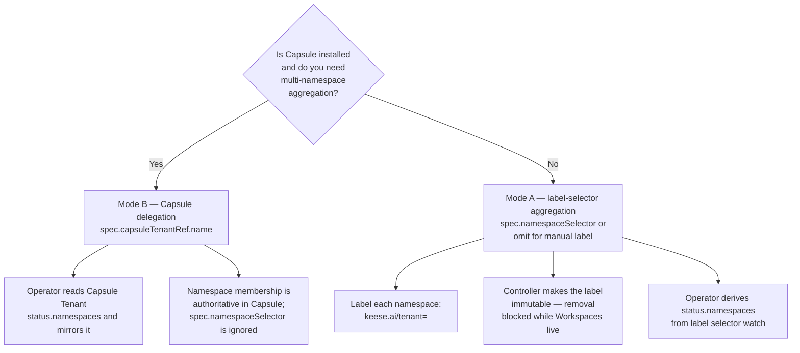
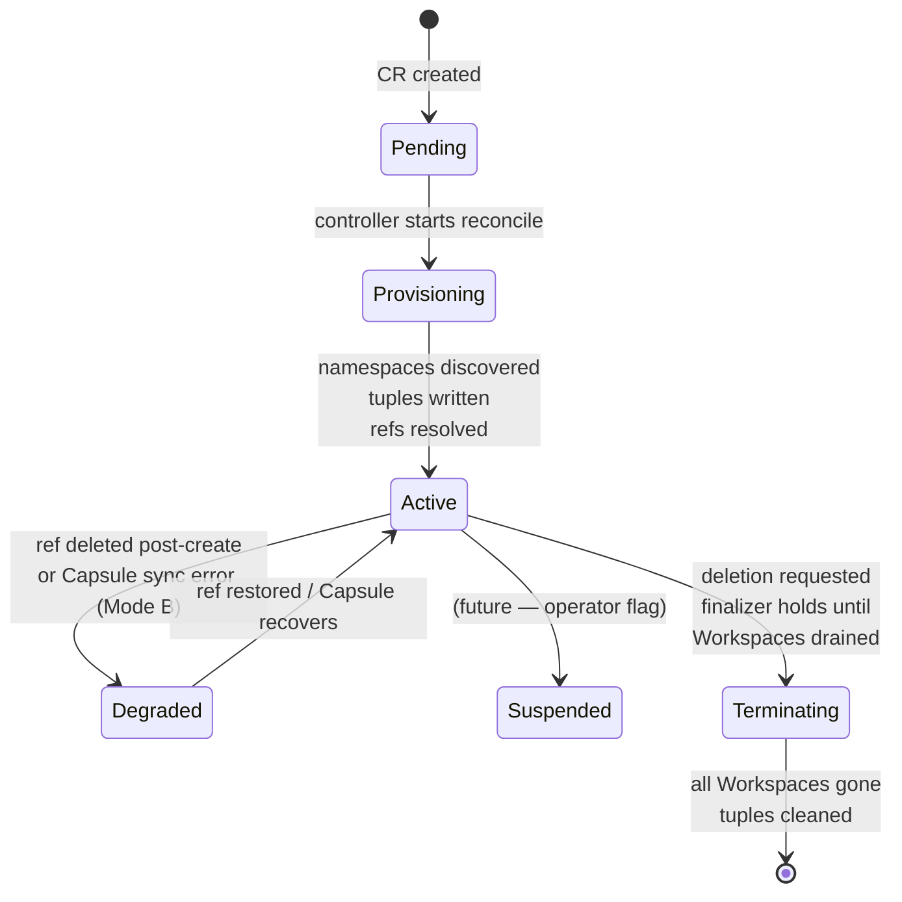

<!-- SPDX-License-Identifier: Apache-2.0 -->
<!-- Copyright (c) 2026 keese-ai -->

# Provision a tenant

Create a `keese.ai/v1alpha1/Tenant` CR, choose the right namespace-aggregation mode, attach guardrails and a token budget, then verify that namespaces are governed and that OpenFGA tuples are written.

!!! info "Audience"
    Tenant-admin or platform engineer setting up a new tenant on a keese cluster.
    **Prerequisites:** [Bootstrap a local cluster](bootstrap-local.md) · [Install via OLM](install-olm.md)

---

## What is a Tenant?

A `Tenant` is a cluster-scoped CR that is the canonical identity anchor for a group of
related workspaces. Its `metadata.name` is the primary key used in all OpenFGA ReBAC tuples
(`tenant:<name>#admin@user:<subject>`). It does **not** map one-to-one to a namespace — one
tenant may own many namespaces, and multiple workspaces may share a single namespace.

The Tenant CR holds keese-specific config (guardrail defaults, token-budget reference,
workspace quota ceilings, OIDC allow-list) and delegates namespace aggregation to one of two
modes described below.

---

## Mode A vs Mode B — choose before you create



| | Mode A | Mode B |
|---|---|---|
| Capsule required | No | Yes |
| Namespace membership governed by | `keese.ai/tenant=<name>` label + controller-side immutability | Capsule `Tenant.spec.namespaces` |
| Best for | Single-namespace or lightweight deployments | Multi-namespace enterprise tenants |
| `spec.capsuleTenantRef` | Must be absent | Required, immutable once set |
| `spec.namespaceSelector` | Optional; used if set | Present in YAML is allowed but silently ignored (warning event `NamespaceSelectorIgnoredInModeB`) |

!!! warning "Immutability in Mode B"
    `spec.capsuleTenantRef.name` is immutable while any namespace is live (XValidation enforced). Plan the Capsule Tenant name before you apply.

---

## Before you apply

1. **Decide mode** — see the flowchart above.
2. **Create supporting objects** if needed:
   - `policy.keese.ai/v1alpha1/TokenBudget` in `keese-system` (or any namespace accessible to the Tenant controller).
   - `authz.keese.ai/v1alpha1/GuardrailBinding` CRs you want applied to all workspaces by default.
   - For Mode B: an existing `capsule.clastix.io/v1beta2/Tenant` CR.
3. **Label namespaces** (Mode A only) before — or immediately after — applying the Tenant. The operator will discover them on the next reconcile.

---

## Mode A — minimal Tenant

The simplest possible Tenant. No Capsule, no pre-existing selector; label namespaces manually
after creation.

```yaml
# config/samples/tenancy/tenant-minimal.yaml
apiVersion: keese.ai/v1alpha1
kind: Tenant
metadata:
  name: alpha
spec:
  adminSubjects:
    - kind: User
      name: alice@example.com
```

Apply it:

```bash
kubectl apply -f config/samples/tenancy/tenant-minimal.yaml
```

Label a namespace so the Tenant discovers it:

```bash
kubectl label namespace my-agents keese.ai/tenant=alpha
```

Once labeled, the Tenant controller makes the label immutable — removal is blocked
while Workspaces live in that namespace (controller-side enforcement; there is no
`config/vap/namespace-tenant-label.yaml` file; the guard exists only in the controller).

Add an explicit selector if you want the controller to auto-discover future namespaces by
label (rather than relying on manual labeling):

```yaml
spec:
  namespaceSelector:
    matchLabels:
      keese.ai/tenant: alpha
```

---

## Mode B — full enterprise Tenant

The full sample from `config/samples/tenancy/tenant-full.yaml`, annotated.

First create the Capsule Tenant (outside keese — this is a platform-team step):

```bash
kubectl apply -f - <<'EOF'
apiVersion: capsule.clastix.io/v1beta2
kind: Tenant
metadata:
  name: acme-capsule
spec:
  owners:
    - name: admin@acme.example.com
      kind: User
  namespaceOptions:
    quota: 20
EOF
```

Then create the supporting TokenBudget in `keese-system`:

```yaml
apiVersion: policy.keese.ai/v1alpha1
kind: TokenBudget
metadata:
  name: acme-budget
  namespace: keese-system
spec:
  scope:
    tenant:
      name: acme-corp
  limits:
    - model: "*"
      totalTokens: 50000000   # 50M tokens per window
  windowDuration: 720h        # 30-day rolling window
  exhaustionMode: hard        # return 429 when exhausted
```

Create the GuardrailBindings referenced in `spec.defaultGuardrailBindings`:

```yaml
apiVersion: authz.keese.ai/v1alpha1
kind: GuardrailBinding
metadata:
  name: default-rate-limit
  namespace: keese-system
spec:
  scope:
    type: Tenant
    tenantRef:
      name: acme-corp
      namespace: keese-system
  tools:
    rateLimit:
      requests: 60
      window: 1m
      scope: sa
---
apiVersion: authz.keese.ai/v1alpha1
kind: GuardrailBinding
metadata:
  name: pii-redact
  namespace: keese-system
spec:
  scope:
    type: Tenant
    tenantRef:
      name: acme-corp
      namespace: keese-system
  kyverno:
    - policyRef: keese-pii-redact
```

Now apply the full Tenant:

```yaml
# config/samples/tenancy/tenant-full.yaml
apiVersion: keese.ai/v1alpha1
kind: Tenant
metadata:
  name: acme-corp
  labels:
    keese.ai/tier: enterprise
spec:
  capsuleTenantRef:
    name: acme-capsule           # delegates namespace membership to Capsule
  adminSubjects:
    - kind: User
      name: admin@acme.example.com
    - kind: Group
      name: platform-engineers@acme.example.com
  defaultGuardrailBindings:
    - default-rate-limit         # applied to every workspace in this tenant
    - pii-redact
  tokenBudgetRef:
    name: acme-budget
    namespace: keese-system
  credentialPoolRef:
    name: acme-credentials
    namespace: keese-system
  defaultWorkspaceQuota:
    requests.cpu: "4"
    requests.memory: 8Gi
  dedicatedGateway: true         # provision a per-tenant Envoy AI Gateway instance
  oidc:
    allowedProviders:
      - google
      - azure-entra
  jwksCacheFailOpenSeconds: 60   # shortened because dedicatedGateway=true
  auditArgumentsRedacted: true   # route sanitized arguments through Presidio
```

```bash
kubectl apply -f config/samples/tenancy/tenant-full.yaml
```

!!! warning "Planned — not yet enforced"
    `spec.dedicatedGateway` toggling while `status.namespaces[]` is non-empty is **not yet blocked by any admission control**. No XValidation rule exists in `api/keese/v1alpha1/tenant_types.go` and no VAP for this constraint exists in `config/vap/`. Plan this choice before adding namespaces to avoid an unsupported configuration state. Enforcement is a planned addition.

!!! tip "dedicatedGateway is resource-intensive"
    Setting `spec.dedicatedGateway: true` provisions a full, per-tenant Envoy AI Gateway instance (Deployment + Service + route configuration). Reserve this option for high-traffic tenants or tenants with strict compliance-isolation requirements. Most tenants should use the shared gateway (the default).

---

## Verify the Tenant is Active

```bash
kubectl get tenant acme-corp
```

Expected output once the operator has reconciled:

```
NAME        AGE   READY   PHASE    NAMESPACES
acme-corp   42s   True    Active   3
```

Check the full status:

```bash
kubectl get tenant acme-corp -o yaml | grep -A 20 'status:'
```

Key fields to verify:

| Field | Mode A expected | Mode B expected |
|---|---|---|
| `status.phase` | `Active` | `Active` |
| `status.namespaces` | list of labeled namespaces | list mirrored from Capsule |
| `status.capsuleTenantResolved` | absent | `true` |
| `status.conditions[Ready].status` | `True` | `True` |

If `status.phase` is `Pending` or `Provisioning`, look at events:

```bash
kubectl describe tenant acme-corp | tail -30
```

Common events and their meaning:

| Event reason | Meaning |
|---|---|
| `TenantProvisioned` | First successful reconcile complete |
| `CapsuleTenantNotFound` | Mode B: the named Capsule Tenant does not exist yet |
| `RefNotResolved` | `tokenBudgetRef` or `credentialPoolRef` target is missing |
| `NamespaceSelectorIgnoredInModeB` | Warning: `namespaceSelector` was set alongside `capsuleTenantRef` |
| `TenantLabelLocked` | Mode A: label removal was attempted while Workspaces are live |
| `JWKSCacheExhausted` | JWKS fail-open window elapsed; all egress fails closed (401) |

---

## Verify OpenFGA tuples are written

The Tenant controller writes `tenant:<name>#admin@user:<subject>` tuples for every entry in
`spec.adminSubjects`. Verify with the FGA CLI (or the keese observability stack):

```bash
# Requires fga CLI configured against your in-cluster OpenFGA instance
fga tuple read --store-id $FGA_STORE_ID \
  --object "tenant:acme-corp" \
  --relation "admin"
```

Expected output includes one object per `adminSubjects` entry:

```
{
  "tuples": [
    { "key": { "user": "user:admin@acme.example.com", "relation": "admin", "object": "tenant:acme-corp" } },
    { "key": { "user": "group:platform-engineers@acme.example.com", "relation": "admin", "object": "tenant:acme-corp" } }
  ]
}
```

!!! note "Tuple count in status"
    The Tenant status does not expose a tuple count directly. Use `kubectl describe tenant <name>` events (`TenantProvisioned`) and the OpenFGA status API to confirm tuples are live.

---

## Attach a TokenBudget after creation

If you did not set `spec.tokenBudgetRef` at creation, add it as a patch:

```bash
kubectl patch tenant acme-corp --type=merge -p '{
  "spec": {
    "tokenBudgetRef": {
      "name": "acme-budget",
      "namespace": "keese-system"
    }
  }
}'
```

The validating webhook checks that the named `TokenBudget` exists before admitting the patch.

---

## Tenant lifecycle phases



The finalizer `finalizers.tenant.keese.ai/workspaces` blocks deletion until
`status.namespaces[]` is empty. Drain workspaces before deleting a Tenant:

```bash
# List all workspaces in tenant namespaces before deleting
kubectl get workspaces -A -l keese.ai/tenant=acme-corp

# Delete the Tenant — this will block until Workspaces are gone
kubectl delete tenant acme-corp
```

---

## Admin subjects: users, groups, service accounts

`spec.adminSubjects` accepts `kind: User`, `kind: Group`, and `kind: ServiceAccount`:

```yaml
spec:
  adminSubjects:
    - kind: User
      name: alice@example.com
    - kind: Group
      name: ml-platform@example.com
    - kind: ServiceAccount
      name: ci-bot
```

Each entry produces one OpenFGA admin tuple and one `keese-tenant-admin` ClusterRoleBinding.
At least one entry is required — a CRD CEL `XValidation` rule rejects an empty list.

---

## Key admission constraints at a glance

| Rule | Enforcement | Behavior |
|---|---|---|
| `adminSubjects` must be non-empty | CRD XValidation (CEL) | Rejects create/update |
| `capsuleTenantRef.name` immutable | XValidation | Rejects update once set |
| `dedicatedGateway` not toggleable with live namespaces | Planned (not yet enforced) | No XValidation or VAP exists yet; avoid toggling manually |
| `jwksCacheFailOpenSeconds` in \[30, 600\] or 0 (omit for no limit) | XValidation (CEL) | Rejects out-of-range values; omitting the field is valid and disables the fail-open window |
| `namespaceSelector` overlap across Tenants | Validating webhook | Rejects with `SelectorOverlapDenied` |
| `tokenBudgetRef` / `credentialPoolRef` must resolve | Validating webhook | Rejects if target missing |
| `capsuleTenantRef` must resolve | Validating webhook | Rejects in Mode B if Capsule Tenant absent |

!!! warning "Planned — not yet implemented"
    The `--tenant-crd-mode=off` emergency rollback flag (see [docs/designs/24b-tenant-crd.md](https://github.com/keese-ai/keese/blob/main/docs/designs/24b-tenant-crd.md)) is specified but not yet implemented. If needed for emergency rollback, follow the manual procedure in that design doc.

---

## See also

- [Concepts: Tenancy & namespaces](../concepts/tenancy.md) — high-level model
- [Concepts: Authorization (ReBAC / OpenFGA)](../concepts/authorization-rebac.md) — how admin tuples are used
- [Guides: Set token budgets](token-budgets.md) — detailed TokenBudget configuration
- [Guides: Define guardrails](guardrails.md) — GuardrailBinding authoring
