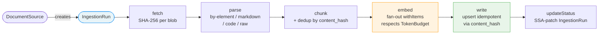
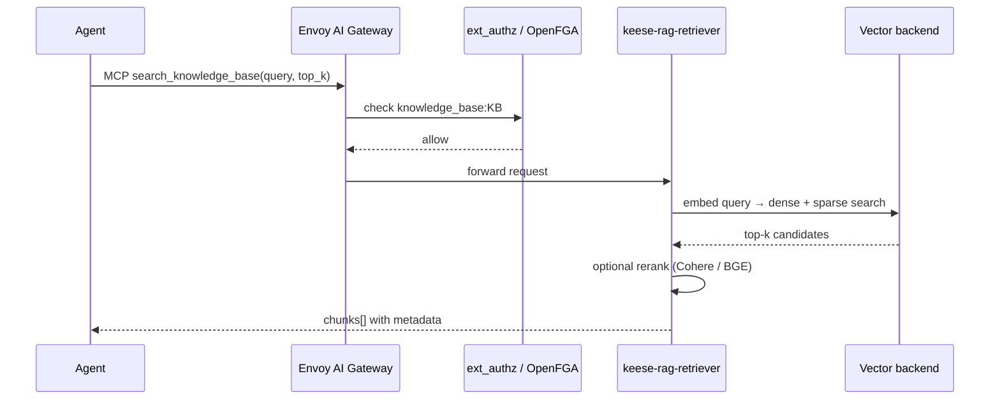

<!-- SPDX-License-Identifier: Apache-2.0 -->
<!-- Copyright (c) 2026 keese-ai -->

# Set up RAG ingestion

Retrieval-Augmented Generation (RAG) in keese lets agents query a structured
document index rather than relying on context-window memory alone.

!!! info "Audience"
    Agent developers and platform operators who want to add document retrieval
    to a keese workspace. **Prerequisites:** [concepts/memory.md](../concepts/memory.md) ·
    [concepts/rag.md](../concepts/rag.md) · a running tenant namespace (see
    [guides/provision-tenant.md](provision-tenant.md))

!!! warning "Planned — not yet implemented"
    The five RAG CRDs (`KnowledgeBase`, `DocumentSource`, `IngestionRun`,
    `EmbeddingModel`, `SharedKnowledgeBase`) and their controllers are **fully
    designed** (designs
    [28](https://github.com/keese-ai/keese/blob/main/docs/designs/28-rag-ingestion.md),
    [28c](https://github.com/keese-ai/keese/blob/main/docs/designs/28c-rag-pipeline.md);
    spec
    [keese.ai-v1alpha1-rag](https://github.com/keese-ai/keese/blob/main/docs/specs/keese.ai-v1alpha1-rag.md))
    but **no controller code exists yet**. This page describes the intended
    workflow so you can plan integrations and understand how ingestion will work
    once implemented.

---

## Overview

RAG ingestion in keese is distinct from `Memory` (per-session scratch-pad,
design 15). A `KnowledgeBase` is a shared, durable document index: multiple
workspaces can query it, and it is populated by one or more `DocumentSource`
objects that pull content on a schedule or in streaming mode.

The read path is an MCP tool (`search_knowledge_base`) exposed through the
existing Envoy AI Gateway `MCPRoute`. No new egress path is introduced; the
fail-closed NetworkPolicy rule from the zero-trust model is preserved.

### The five CRDs

| Kind | Scope | Short | Purpose |
|---|---|---|---|
| `KnowledgeBase` | Namespaced | `kb` | Index configuration, backend binding, retrieval policy |
| `DocumentSource` | Namespaced | `ds` | Source connector, schedule, and parser settings |
| `IngestionRun` | Namespaced | `ir` | One execution of the pipeline (Argo-backed, TTL 7 d) |
| `EmbeddingModel` | Namespaced | `em` | Provider + dimensions (dimensions are immutable) |
| `SharedKnowledgeBase` | Cluster | `skb` | Cross-tenant read grants |

---

## Ingestion pipeline

Each `IngestionRun` projects to an Argo Workflows DAG with six stages:



**Stage notes:**

- **fetch** — pulls raw content; computes a SHA-256 content hash per blob. Incremental runs
  skip blobs whose hash was already written.
- **parse** — extracts structure using the strategy set in
  `DocumentSource.spec.parser.type`: `by-element` (Unstructured.io, default),
  `markdown` (header-hierarchy-aware), `code` (tree-sitter, function-boundary), or
  `raw` (fixed-size sliding window).
- **chunk** — splits the parsed output and tags each chunk with metadata
  (`knowledge_base_id`, `source_uri`, `content_hash`, `chunk_index`, `token_count`,
  `language`, `ingested_at`). Chunks already present in the backend are skipped
  (`status.skippedDedup` counter).
- **embed** — calls the embedding API declared in `EmbeddingModel`, fan-out via Argo
  `withItems`. Checks `TokenBudget.embedding_tokens` before each batch; halts the run
  and emits `EmbeddingBudgetExhausted` if the budget is exhausted.
- **write** — upserts vectors to the configured backend (Qdrant, Elasticsearch, or
  pgvector) using `content_hash` as the idempotency key.
- **updateStatus** — SSA-patches `IngestionRun.status.*` with final counts.

---

!!! note "Reference only — CRDs not yet installed"
    These steps describe the intended API; the CRDs are not present in the current cluster.
    No `kubectl` commands in this guide will succeed until the RAG controllers ship.

## Step 1 — Declare an EmbeddingModel

An `EmbeddingModel` records the provider, model name, and vector dimensions for
a namespace. Dimensions are immutable after creation; changing them requires
creating a new `EmbeddingModel`, re-ingesting all documents, and cutting over
`KnowledgeBase` references.

```yaml
apiVersion: keese.ai/v1alpha1
kind: EmbeddingModel
metadata:
  name: text-embedding-3-small
  namespace: tenant-acme
spec:
  provider: openai
  model: text-embedding-3-small
  dimensions: 1536
  maxContextTokens: 8191
  languages:
    - en
  endpoint:
    hostedRef:
      backendSecurityPolicyRef:
        name: openai-bsp   # BackendSecurityPolicy wires the credential via gateway
```

!!! note "Credential handling"
    The `EmbeddingModel` never carries an API key directly. The `hostedRef` points
    to a `BackendSecurityPolicy` that the Envoy AI Gateway uses to inject the
    upstream credential at runtime (see
    [concepts/credential-broker.md](../concepts/credential-broker.md)).
    For local models, use `endpoint.localRef` pointing to an in-cluster Service.

!!! warning "pgvector dimension limit"
    A CRD CEL `XValidation` rule rejects any attempt to change `spec.dimensions`
    after creation (analogous to the `embedding-dim-immutable` VAP that protects
    `Memory.spec.embeddingDim`, but applied at the `EmbeddingModel` CRD level — not
    a separate standalone VAP). A second CRD `XValidation` rule rejects
    `dimensions > 2000` when the target `KnowledgeBase` uses a pgvector backend.

---

## Step 2 — Declare a KnowledgeBase

A `KnowledgeBase` ties an embedding model to a vector backend and lists which
workspaces can query it.

```yaml
apiVersion: keese.ai/v1alpha1
kind: KnowledgeBase
metadata:
  name: docs-kb
  namespace: tenant-acme
spec:
  tenantRef:
    name: acme                 # +keese:rebac-tuple=knowledge_base:docs-kb#owner@tenant:acme
  embeddingModelRef:
    name: text-embedding-3-small
  backend:
    qdrant:
      collectionRef:
        host: qdrant.infra.svc.cluster.local
        port: 6333
      replicationFactor: 2     # must be >=2 outside keese.ai/environment=dev (controller emits HAViolation + Degraded)
  chunking:
    strategy: by-element
    maxTokens: 512
    overlap: 64
  hybridSearch:
    enabled: true
    bm25Weight: 0.3
    vectorWeight: 0.7          # bm25Weight + vectorWeight must equal 1.0 (CEL)
  retrieval:
    topK: 10
    rerankerRef:
      name: cohere-reranker    # optional; falls back to RRF if unreachable
  workspaceRefs:
    - name: ws-acme-dev        # +keese:rebac-tuple=knowledge_base:docs-kb#reader@workspace:ws-acme-dev
  tokenBudgetRef:
    name: acme-embedding-budget  # required — controller sets Degraded (EmbeddingBudgetMissing) if absent
```

!!! danger "HA required in non-dev namespaces"
    The KnowledgeBase controller emits an `HAViolation` event and sets phase `Degraded`
    when `spec.backend.qdrant.replicationFactor < 2` (or equivalent for other backends)
    outside namespaces labelled `keese.ai/environment=dev`. This is controller-side
    enforcement — no admission VAP exists for KnowledgeBase HA requirements.
    Production deployments must set at least 2 replicas.

!!! warning "Backend type is immutable"
    The backend type (e.g. `qdrant` → `pgvector`) cannot be changed on an existing
    `KnowledgeBase` — enforced by a CEL `XValidation` rule on the CRD (not a separate
    `ValidatingAdmissionPolicy`). Migration requires creating a new `KnowledgeBase`,
    re-ingesting all documents, and cutting over `workspaceRefs`.

---

## Step 3 — Declare a DocumentSource

A `DocumentSource` connects a data source to a `KnowledgeBase` and controls
when ingestion runs.

```yaml
apiVersion: keese.ai/v1alpha1
kind: DocumentSource
metadata:
  name: product-docs-source
  namespace: tenant-acme
spec:
  knowledgeBaseRef:
    name: docs-kb
  source:
    git:                       # discriminated one-of; only one key allowed
      url: https://github.com/acme/docs
      branch: main
      credentialSecretRef:
        name: github-read-token   # projected as file per rule 05.7; never env var
  schedule:
    type: cron
    cron: "0 2 * * *"         # nightly at 02:00 UTC
  parser:
    type: markdown
```

### Source connector types

| Key | Mechanism | Credential |
|---|---|---|
| `oci` | Pull from OCI registry (reuses Recipe pull infrastructure) | Projected SA token |
| `git` | Clone and walk; SHA-based incremental | `credentialSecretRef` projected file |
| `s3` | S3-compatible `ListObjects` + `GetObject` | `credentialSecretRef` projected file |
| `http` | HTTP GET or sitemap walk | `credentialSecretRef` projected file |
| `configmap` | Read a `ConfigMap` in the same namespace | In-cluster watch (no cred needed) |
| `webhook` | Push to NATS JetStream; controller consumes | In-cluster subject |

!!! note "No API keys in pods"
    Credentials for `s3`, `http`, and `git` sources are mounted as projected files
    at `/var/run/keese/secrets/<name>` via `spec.source.<type>.credentialSecretRef`.
    They are never injected as environment variables (zero-trust rule 05.7).

### Streaming mode

Set `spec.mode: streaming` instead of the default `batch` to enable continuous
ingestion. In streaming mode the controller provisions a long-lived `Deployment`
(`keese-embedder-<ds-uid>`) and a NATS JetStream subject
`keese.tenant.<t>.rag.<ds-uid>.>`. A CDC connector (e.g. Debezium, managed
outside keese scope) pushes change events to that subject; the embedder writes
vectors to the backend in near-real time.

---

## Step 4 — Trigger an IngestionRun

Once a `DocumentSource` exists, the controller creates `IngestionRun` objects
automatically on the configured schedule. You can also trigger one manually:

```bash
kubectl apply -f - <<EOF
apiVersion: keese.ai/v1alpha1
kind: IngestionRun
metadata:
  name: docs-run-manual-01
  namespace: tenant-acme
spec:
  documentSourceRef:
    name: product-docs-source
  runType: full          # full | incremental | dryRun
  retryBudget: 5
EOF
```

Watch the run progress:

```bash
kubectl get ingestionrun -n tenant-acme -w
# NAME                   READY  PHASE      DOCUMENTS  TOKENS
# docs-run-manual-01     True   Succeeded  412        92340
```

An `IngestionRun` is ephemeral: it carries no finalizer and is garbage-collected
7 days after completion (`ttlSecondsAfterFinished: 604800`).

!!! tip "Dry runs"
    Use `runType: dryRun` to validate source connectivity and parser settings
    without writing any vectors to the backend. The run completes with
    `chunksWritten: 0` and reports what would have been written.

---

## Querying from an agent

Once a `KnowledgeBase` is `Ready` and a workspace is listed in
`spec.workspaceRefs`, the retrieval MCP tool becomes available to agents in that
workspace. The Envoy AI Gateway `MCPRoute` routes calls to the
`keese-rag-retriever` Deployment; `ext_authz` verifies the OpenFGA tuple
`knowledge_base:KB#reader@workspace:W` before executing.

The MCP tool signature is:

```
search_knowledge_base(query: string, top_k: int, filters: map) → chunks[]
```

The retrieval flow is:



If the optional reranker is unreachable the retriever falls back to
Reciprocal Rank Fusion (RRF) automatically and emits a `RerankerUnavailable`
event — no data loss, no error returned to the agent.

---

## Authorization and cross-tenant sharing

Access to a `KnowledgeBase` is controlled by OpenFGA tuples, not Kubernetes RBAC
alone.

| Relation | Written by | When |
|---|---|---|
| `knowledge_base:KB#owner@tenant:T` | `KnowledgeBase` controller | On create |
| `knowledge_base:KB#reader@workspace:W` | `KnowledgeBase` controller | When `workspaceRefs` is set |
| `shared_knowledge_base:SKB#reader@tenant:T` | `SharedKnowledgeBase` controller | When CTA is Approved |

To share a `KnowledgeBase` across tenant boundaries, create a cluster-scoped
`SharedKnowledgeBase` that references the source KB and lists reader tenants.
An Approved `CrossTenantAgreement` (design 25) is required for each
`readerTenants` entry; the `SharedKnowledgeBase` controller restricts mutations to
tenant admins via OpenFGA `tenant#admin` check (controller-side enforcement; no
admission VAP exists for this guard). See [guides/cross-tenant-agreements.md](cross-tenant-agreements.md)
for the full workflow.

---

## Failure modes and recovery

| Failure | What happens | Recovery |
|---|---|---|
| Source fetch fails | Backoff; `SourceFetchFailed` event | Fix credentials; auto-retry |
| Parser fails on a document | Document skipped; recorded in `status.failedDocuments`; `DocumentParseFailed` event | Review document format |
| Embedding budget exhausted | Run halted; `EmbeddingBudgetExhausted` event; phase `Failed` | Raise `TokenBudget` limit; re-trigger |
| Vector store dimension mismatch | Run fails-closed; `EmbeddingDimMismatch` event | Delete and recreate `KnowledgeBase` with matching model |
| Backend unreachable mid-run | Run pauses at checkpoint; event raised | Restore backend; auto-resume |
| `EmbeddingModel` deleted while KB active | Controller blocks deletion (`EmbeddingModelInUseDeleteRejected` event; finalizer holds) | Create a replacement model first |
| Reranker sidecar unreachable | Falls back to RRF-only; `RerankerUnavailable` event | Restore sidecar; no data loss |
| pgvector dimension > 2000 | CRD CEL `XValidation` rejects at admission | Use a smaller embedding model or half-precision |
| `CrossTenantAgreement` revoked | Orphan tuples purged on next reconcile; `SharedKnowledgeBaseGrantRevoked` event | Automatic |

---

## Observability

!!! warning "Planned — not yet emitted"
    The metrics and OTEL spans listed below are part of the RAG subsystem design
    but are not emitted in the current release. No RAG controllers exist yet.

The RAG subsystem emits the following metrics:

| Metric | Labels |
|---|---|
| `keese_rag_ingestion_duration_seconds` | `knowledge_base`, `backend`, `run_type` |
| `keese_rag_ingestion_errors_total` | `knowledge_base`, `error_type` |
| `keese_rag_embedding_tokens_total` | `knowledge_base`, `model`, `tenant` |
| `keese_rag_chunks_written_total` | `knowledge_base`, `backend` |
| `keese_rag_chunks_skipped_dedup_total` | `knowledge_base` |
| `keese_rag_retrieval_duration_seconds` | `knowledge_base`, `backend`, `mode` |
| `keese_rag_retrieval_topk_recall` | `knowledge_base` |

OTEL spans are emitted for each pipeline stage: `keese.rag.fetch`,
`keese.rag.parse`, `keese.rag.chunk`, `keese.rag.embed`, `keese.rag.write`,
`keese.rag.retrieve`.

See [guides/observability-setup.md](observability-setup.md) for how to wire
these into the OTEL collector and Elastic APM.

---

## Deletion and rollback

**KnowledgeBase** deletion is finalizer-gated and blocked while
`status.referencingWorkspaceCount > 0`. When deletion is allowed, the controller
executes in order: purge OpenFGA tuples → delete backend collection → release
finalizer. Vector data is not recoverable after deletion; there is no in-place
migration between backend types.

**EmbeddingModel** deletion is refused while any `KnowledgeBase` references it.
To migrate to a new model: create the new `EmbeddingModel`, create a new
`KnowledgeBase` using it, re-run ingestion, update `workspaceRefs` to point to
the new KB, then delete the old KB and model.

**IngestionRun** carries no finalizer. Failed runs leave no persistent artifact
beyond the status object, which is garbage-collected after 7 days.

---

## See also

- [concepts/rag.md](../concepts/rag.md) — RAG and knowledge base concepts
- [concepts/memory.md](../concepts/memory.md) — how Memory (session scratch-pad) differs from KnowledgeBase
- [guides/token-budgets.md](token-budgets.md) — set the `embedding_tokens` budget required by every KnowledgeBase
- [guides/cross-tenant-agreements.md](cross-tenant-agreements.md) — share a KnowledgeBase across tenants
