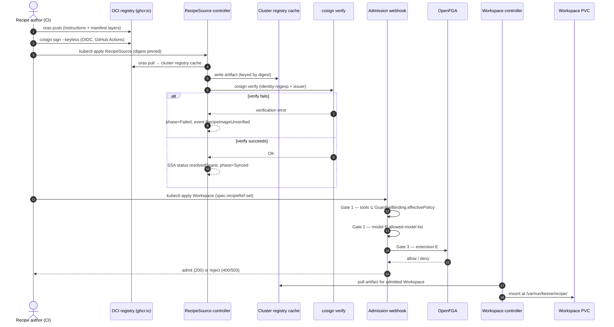
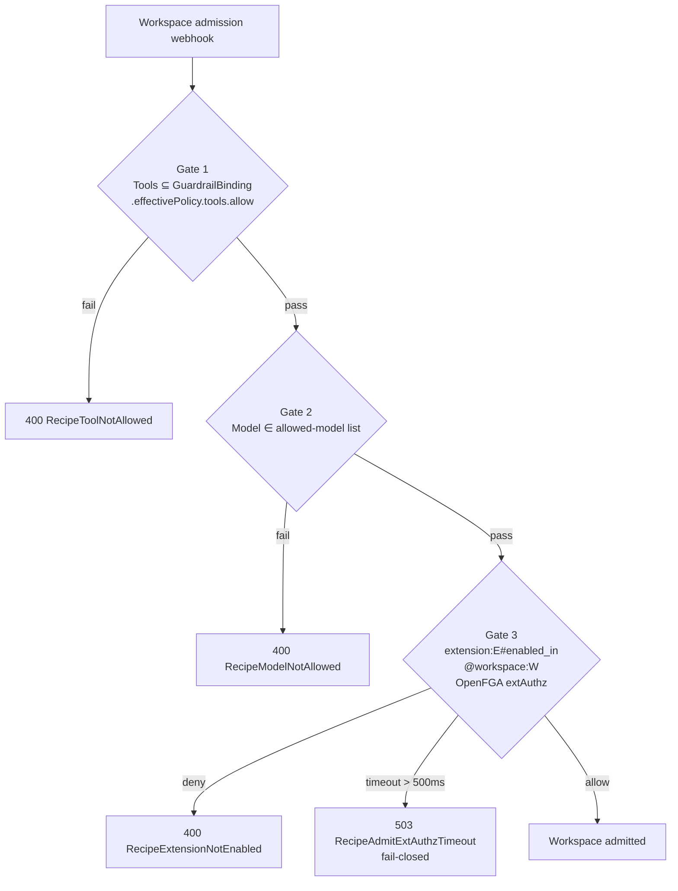

<!-- SPDX-License-Identifier: Apache-2.0 -->
<!-- Copyright (c) 2026 keese-ai -->

# Write & distribute a recipe

A `Recipe` is a versioned, policy-checked bundle of agent instructions, a model preference, a tool allowlist, typed parameters, and optional pre/post-flight hooks. This guide takes you from authoring a recipe YAML to watching it reach `Phase: Ready` in a keese cluster.

!!! info "Audience"
    Agent developers who want to package and publish an agent for use in keese workspaces. **Prerequisites:** [Install locally on kind](../getting-started/install-kind.md) · [Your first workspace & session](../getting-started/first-workspace.md)

---

## How recipes flow through the system

Two CRDs cooperate to deliver a recipe artifact into a workspace:

- **`RecipeSource`** (`keese.ai/v1alpha1`) — declares *where* the artifact lives (OCI registry, Git commit, or inline ConfigMap). The controller pulls, cosign-verifies, and caches it cluster-locally.
- **`Recipe`** (`keese.ai/v1alpha1`) — declares *what* the agent can do: model, tool allowlist, parameters, hooks, and a `sourceRef` pointing at a `RecipeSource`.

The workspace controller reads `Workspace.spec.recipeRef`, runs three admission gates, then mounts the cached artifact at `/var/run/keese/recipe/` on the workspace PVC. The agent runtime (goose) reads `instructions.md` and `recipe.yaml` from that path.



---

## Step 1 — Author the recipe YAML

A recipe artifact is a directory with at least two files:

| File | Purpose |
|---|---|
| `instructions.md` | Natural-language instructions for the agent (the system prompt). |
| `recipe.yaml` | Goose-compatible recipe descriptor (model, tools, extensions, prompt). |

The `dev/samples/recipes/weather-agent.yaml` in the repo is a minimal example — no tools, no extensions, a single focused task:

```yaml
version: "1.0.0"
title: "Weather agent"
description: |
  A focused agent that answers questions about weather in a given location.

instructions: |
  You are a friendly weather agent. Reply concisely in 1-2 sentences.
  Do not call tools or extensions.

extensions: []

prompt: |
  What is the weather typically like in San Francisco in May?

settings:
  goose_provider: anthropic
  goose_model: claude-opus-4-7
```

!!! warning "Extensions and the AI Gateway body limit"
    The in-cluster Envoy AI Gateway extProc rejects request bodies larger than ~10 KB on the Anthropic schema route. A default `goose run` with 7 extensions + 16 tools exceeds this. Keep `extensions: []` until the upstream limit is raised or the controller begins batching extension payloads. See the comment in [`dev/samples/recipes/weather-agent.yaml`](https://github.com/keese-ai/keese/blob/main/dev/samples/recipes/weather-agent.yaml).

---

## Step 2 — Publish to an OCI registry (CI only)

Recipe images are published exclusively from GitHub Actions (rule 05.15 — `docker push` is blocked in local sessions). A release workflow calls:

```bash
# Push recipe layers with ORAS
oras push ghcr.io/keese-ai/recipes/my-recipe:v1.2.3 \
  instructions.md:application/vnd.keese.recipe.instructions.v1 \
  recipe.yaml:application/vnd.keese.recipe.manifest.v1

# Sign keyless with cosign (OIDC — GitHub Actions token)
cosign sign ghcr.io/keese-ai/recipes/my-recipe:v1.2.3

# Record the digest for pinning
DIGEST=$(crane digest ghcr.io/keese-ai/recipes/my-recipe:v1.2.3)
```

The controller rejects artifacts whose layer media types do not match `application/vnd.keese.recipe.*`. Use the three types above exactly.

!!! note "Dev shortcut — ConfigMap source"
    In namespaces labeled `keese.ai/env=dev` you can skip OCI entirely and reference an inline ConfigMap. A CEL `XValidation` rule on the `RecipeSource` CRD blocks ConfigMap sources in all other namespaces (no separate `ValidatingAdmissionPolicy`). See [Step 3b](#step-3b-git-or-configmap-sources) below.

---

## Step 3 — Create a RecipeSource

A `RecipeSource` tells the controller where to pull the artifact. Exactly one of `oci`, `git`, or `configMap` must be set (CEL `XValidation` enforced at the API server level).

### Step 3a — OCI source (production)

In production namespaces always pin by digest. A CRD CEL `XValidation` rule rejects OCI sources without `spec.oci.digest` outside dev namespaces (rule 05.12; not a separate VAP).

```yaml
apiVersion: keese.ai/v1alpha1
kind: RecipeSource
metadata:
  name: my-recipe-source
  namespace: my-tenant
  labels:
    keese.ai/managed: "true"
spec:
  oci:
    registry: ghcr.io
    repository: keese-ai/recipes/my-recipe
    digest: sha256:<64-char-hex>      # required in non-dev namespaces
    secretRef:                         # optional — OCI pull credentials
      name: ghcr-pull-secret
```

OCI pull credentials are mounted as a projected file (rule 05.7) — never as environment variables.

### Step 3b — Git or ConfigMap sources

**Git** (non-dev clusters, when OCI is unavailable): `revision` must be a full 40-character lowercase hex SHA (enforced by a CEL XValidation on the CRD field `^[0-9a-f]{40}$`):

```yaml
spec:
  git:
    url: https://github.com/my-org/recipes.git
    revision: abcdef1234567890abcdef1234567890abcdef12
    secretRef:
      name: git-credentials
```

**ConfigMap** (dev namespaces only — rejected elsewhere by CRD XValidation CEL rule):

```yaml
spec:
  configMap:
    name: my-recipe-cm
    namespace: my-tenant
```

### Watch RecipeSource status

```bash
kubectl get recipesource my-recipe-source -n my-tenant -w
```

Expected output once synced:

```
NAME                 READY   TYPE   AGE
my-recipe-source     True    OCI    42s
```

The controller writes `status.resolvedDigest` after cosign verification succeeds and sets `Phase: Synced`. If cosign verification fails the phase flips to `Failed` and a `RecipeImageUnverified` event is recorded.

---

## Step 4 — Create a Recipe

```yaml
apiVersion: keese.ai/v1alpha1
kind: Recipe
metadata:
  name: my-recipe
  namespace: my-tenant
  labels:
    keese.ai/managed: "true"          # required — controller ignores unlabeled objects
spec:
  instructions: instructions.md       # OCI layer path within the artifact
  model:
    provider: anthropic
    modelID: claude-sonnet-4-6
  sourceRef:
    name: my-recipe-source
```

### Full example with tools, parameters, and hooks

```yaml
apiVersion: keese.ai/v1alpha1
kind: Recipe
metadata:
  name: code-reviewer
  namespace: my-tenant
  labels:
    keese.ai/managed: "true"
spec:
  instructions: instructions.md
  model:
    provider: anthropic
    modelID: claude-sonnet-4-6
  tools:
    - name: read_file
    - name: web_search
  extensions:
    - name: code-interpreter
      namespace: keese-system
  parameters:
    - name: REPO_URL
      type: string
      required: true
    - name: MAX_RETRIES
      type: int
      required: false
      default: "3"
  preFlight:
    cel: "request.spec.parameters.size() > 0"
  postFlight:
    shellRef: cleanup-workspace
  sourceRef:
    name: my-recipe-source
```

Parameter types are `string`, `int`, or `bool`. Parameters are injected as environment variables into the workspace at invocation time.

!!! note "Hooks"
    `preFlight.cel` is evaluated as a CEL expression before the recipe executes. `postFlight.shellRef` names a registered shell hook — inline shell is not permitted (CEL validation rule on `RecipeHook` enforces the mutual-exclusion). A `RecipeHook` must set exactly one of `cel` or `shellRef`.

### Watch Recipe phases

```bash
kubectl get recipe my-recipe -n my-tenant -w
```

```
NAME        READY   PHASE      MODEL                AGE   SOURCE
my-recipe   False   Pulling    claude-sonnet-4-6    5s    my-recipe-source
my-recipe   False   Verified   claude-sonnet-4-6    12s   my-recipe-source
my-recipe   True    Ready      claude-sonnet-4-6    14s   my-recipe-source
```

The lifecycle is: `Pending` → `Pulling` → `Verified` → `Ready`. If cosign verification fails the Recipe lands in `Failed`; fix the `RecipeSource` and re-apply.

---

## Step 5 — Reference the recipe from a Workspace

Add `spec.recipeRef` to a Workspace. The admission webhook fires and runs three fail-closed gates before the Workspace is created:



All three gates must pass. Partial admission is forbidden.

```yaml
apiVersion: keese.ai/v1alpha1
kind: Workspace
metadata:
  name: my-workspace
  namespace: my-tenant
spec:
  recipeRef:
    name: my-recipe
  # ... other workspace fields
```

After admission the workspace controller pulls the cached artifact from the cluster-internal registry and mounts it at `/var/run/keese/recipe/` on the workspace PVC. The agent runtime (goose) reads `instructions.md` and `recipe.yaml` from that path.

!!! warning "Workspace upgrade = delete + recreate"
    A CRD CEL `XValidation` rule rejects in-place mutation of `spec.recipeRef` (not a separate VAP). To upgrade a workspace to a new recipe version, delete and recreate the Workspace. In-flight Workspaces continue serving from their PVC-cached artifact until they are replaced.

---

## Versioning and digest pinning

| Environment | Recommended source | Notes |
|---|---|---|
| Production | OCI + `digest` pin | Digest is immutable once set; upgrade by bumping the digest on `RecipeSource`. |
| Staging | OCI + `tag` | Controller resolves tag → digest per reconcile; re-pulls on digest change. |
| Dev | ConfigMap or OCI + `tag` | ConfigMap source requires namespace label `keese.ai/env=dev`. |

`status.resolvedDigest` on the `Recipe` records the OCI digest of the artifact currently cached, populated after cosign verification succeeds.

---

## Troubleshooting

| Symptom | Event or condition | Fix |
|---|---|---|
| `Phase: Failed` on RecipeSource | `RecipeImageUnverified` | Artifact was not signed by the expected GitHub Actions workflow. Re-publish from CI. |
| `Phase: Failed` on RecipeSource | `RecipePullFailed` | OCI registry unreachable. Check `spec.oci.secretRef` and network connectivity. |
| Workspace rejected 400 | `RecipeToolNotAllowed` | A tool in `spec.tools` is not in `GuardrailBinding.status.effectivePolicy.tools.allow`. Update the `GuardrailBinding` or remove the tool. |
| Workspace rejected 400 | `RecipeModelNotAllowed` | The model is not in the workspace's allowed-model list. Update the `GuardrailBinding`. |
| Workspace rejected 400 | `RecipeExtensionNotEnabled` | The OpenFGA tuple `extension:E#enabled_in@workspace:W` is absent. Enable the extension for the workspace. |
| Workspace rejected 503 | `RecipeAdmitExtAuthzTimeout` | OpenFGA extAuthz took > 500ms. Retry; an alert fires if this persists. |
| `DevSourceInProdNamespace` | CRD XValidation reject | `configMap` source used outside a dev namespace (CRD CEL rule, not a VAP). Switch to OCI or Git. |
| Webhook 400 `StaleParentStatus` | TOCTOU guard | `GuardrailBinding` status was stale at admit. Retry within a few hundred milliseconds. |

Inspect conditions in detail:

```bash
kubectl describe recipe my-recipe -n my-tenant
kubectl describe recipesource my-recipe-source -n my-tenant
kubectl get events -n my-tenant --field-selector reason=RecipeImageUnverified
```

---

## Dry-run and smoke tests

```bash
# Dry-run samples against a running API server (requires a cluster context)
kubectl apply --dry-run=server -f config/samples/recipe_v1alpha1_recipesource.yaml
kubectl apply --dry-run=server -f config/samples/recipe_v1alpha1_recipe.yaml

# cosign verification smoke — covered by the full e2e-smoke harness
make e2e-smoke

# Admission unit tests
go test ./internal/controller/recipe/admission/...

# envtest reconciler suite (use -run TestRecipe to target recipe tests)
go test ./internal/controller/keese/... -run TestRecipe
```

---

## See also

- [Concepts: Recipes](../concepts/recipes.md) — design rationale and the full CRD field reference
- [Guides: Define guardrails](guardrails.md) — configure the tool allowlist that gates recipe admission
- [Guides: Configure an agent runtime](configure-runtime.md) — wire a recipe into a running agent
- [Reference: API — keese.ai group](../reference/api/keese.md) — `Recipe` and `RecipeSource` field-level docs
