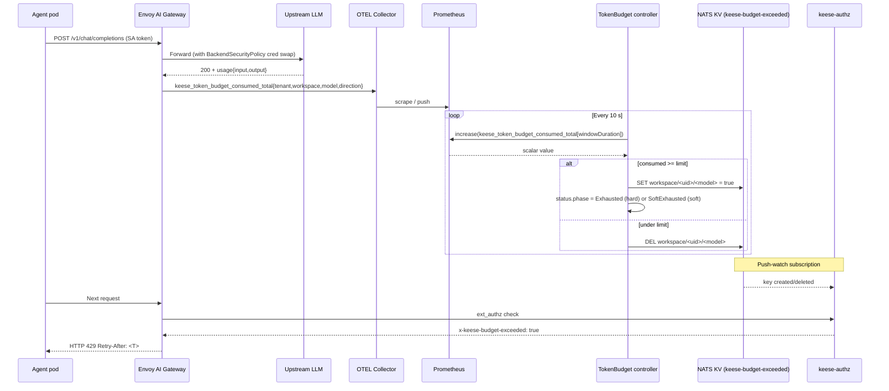
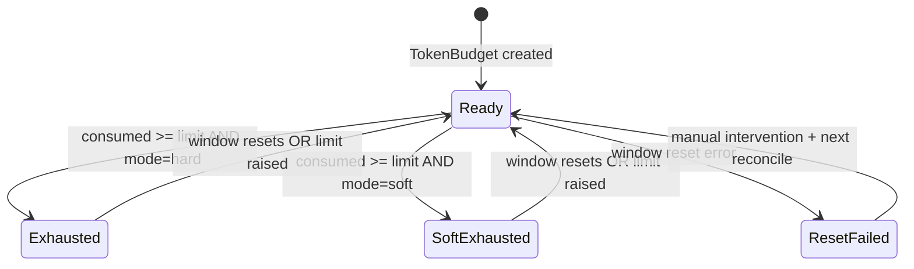

<!-- SPDX-License-Identifier: Apache-2.0 -->
<!-- Copyright (c) 2026 keese-ai -->

# Set token budgets

`TokenBudget` is keese's long-window token-accounting resource: it caps raw token
consumption per model (or across all models) over a configurable time window and, when
a budget is crossed, signals the gateway to return HTTP 429.

!!! info "Audience"
    Tenant administrators managing AI spend. **Prerequisites:**
    [Provision a tenant](provision-tenant.md) ·
    [Tenancy & namespaces](../concepts/tenancy.md) ·
    Prometheus reachable from the operator (deployed via
    [Bootstrap a local cluster](bootstrap-local.md) or
    [Install via OLM](install-olm.md))

---

## How token budgets work

Every upstream API call flows through the Envoy AI Gateway. The gateway's
token-cost filter emits `keese_token_budget_consumed_total` with labels
`{tenant, workspace, model, direction}` into the OTEL collector, which
forwards to Prometheus.

The `TokenBudget` controller (`internal/controller/policy/tokenbudget_controller.go`)
polls Prometheus every 10 seconds. For each `spec.limits[]` entry it runs a PromQL
`increase()` query over the window, compares consumed vs. limit, and—when a limit is
crossed—writes a boolean signal to the NATS JetStream KV bucket `keese-budget-exceeded`.
The `keese-authz` Deployment watches that bucket; when a key is set it adds
`x-keese-budget-exceeded: true` to the ext_authz response, and Envoy's
`local_reply_config` returns HTTP 429 with `Retry-After: <seconds-to-windowEnd>`.



!!! warning "Gateway-side enforcement is not wired end-to-end yet"
    The NATS KV signal write, the `keese-authz` push-watch, and the Envoy
    `local_reply_config` integration are **designed and the signal-write path is
    implemented in the controller**, but the full round-trip from NATS key to gateway
    429 response is not yet wired end-to-end. In the current alpha, exhaustion
    enforcement takes effect at **WorkspaceSession provisioning time**: the controller
    sets `status.phase = Exhausted` and the WorkspaceSession controller gates new
    session creation on that phase. Existing sessions are not interrupted.

---

## The `TokenBudget` resource

`TokenBudget` is namespace-scoped under `policy.keese.ai/v1alpha1` (short name: `tb`).

### Scope

A budget applies to exactly one of: a **tenant** (cluster-scoped resource, by name) or a
**workspace** (namespace-scoped resource, by name). The CEL validation rule on the spec
enforces that exactly one is set:

```
has(self.tenant) != has(self.workspace)
```

### Limits

`spec.limits` is a list of `TokenLimit` entries, each with:

| Field | Meaning |
|---|---|
| `model` | Upstream model ID matching `x-envoy-upstream-model-id`. Use `"*"` for an aggregate cap across all models. |
| `inputTokens` | Max prompt tokens in the window. |
| `outputTokens` | Max completion tokens in the window. |
| `totalTokens` | Max combined tokens in the window. |

At least one of the three token fields must be set per entry. The controller checks
each independently — exceeding *any* field triggers exhaustion for that model.

Using `model: "*"` prevents model-substitution evasion: an agent that switches to a
cheaper model still counts against the aggregate cap.

### Window

| Field | Default | Valid values |
|---|---|---|
| `windowDuration` | `"720h"` (30 days) | `^[0-9]+(h\|d\|m)$`; documented bounds: min `1h`, max `720h` (enforced by the controller, not CEL XValidation at admission) |
| `windowAnchor` | unset (window starts at first reconcile) | RFC3339 timestamp |

When `windowAnchor` is set the controller advances it by `windowDuration` increments
until it finds the most recent start before the current time. This lets you align
windows to a billing calendar (e.g. the 1st of each month UTC).

On window reset the controller archives `status.consumedCurrent` into
`status.consumedPrevious`, clears current, and deletes all NATS KV signals.

### ExhaustionMode

| Value | Behavior |
|---|---|
| `hard` (default) | Phase → `Exhausted`; NATS KV key set; gateway returns 429 (when wired). New WorkspaceSession creation is blocked. |
| `soft` | Phase → `SoftExhausted`; `BudgetExceeded` event emitted; `x-keese-budget-soft-warn: true` header; no blocking. |
| `disabled` | Accounting only; no events, no signals. Use for monitoring rollouts or rollback. |

---

## Creating a tenant-scoped budget

The example below caps a tenant to 10 million total tokens per 30-day window across all
models, with a per-model cap of 5 million for `claude-sonnet-4-6`.

```yaml
apiVersion: policy.keese.ai/v1alpha1
kind: TokenBudget
metadata:
  name: acme-monthly
  namespace: tenant-acme          # namespace where the tenant's policy objects live
spec:
  scope:
    tenant:
      name: acme                  # matches Tenant resource name
  windowDuration: "720h"          # 30 days (default)
  windowAnchor: "2026-01-01T00:00:00Z"   # anchor to billing month
  exhaustionMode: hard
  limits:
    - model: "*"                  # aggregate cap across all models
      totalTokens: 10000000
    - model: "claude-sonnet-4-6"
      inputTokens: 3000000
      outputTokens: 2000000
```

Apply it:

```bash
kubectl apply -f acme-monthly.yaml
```

Check the initial status:

```bash
kubectl get tb acme-monthly -n tenant-acme
# NAME            AGE   READY   PHASE   WINDOWEND              EXHAUSTION
# acme-monthly    5s    True    Ready   2026-02-01T00:00:00Z   hard
```

---

## Creating a workspace-scoped budget

Workspace budgets let you impose tighter per-workspace limits within a tenant budget.
The effective limit is the **minimum** across all active budgets (GuardrailBinding merge
lattice, see
[Authorization (ReBAC / OpenFGA)](../concepts/authorization-rebac.md)).

```yaml
apiVersion: policy.keese.ai/v1alpha1
kind: TokenBudget
metadata:
  name: dev-ws-budget
  namespace: tenant-acme
spec:
  scope:
    workspace:
      name: dev-workspace         # matches Workspace resource name
  windowDuration: "24h"
  exhaustionMode: soft            # warn only — dev workspaces are less sensitive
  limits:
    - model: "*"
      totalTokens: 500000
```

---

## Inspecting consumption

### Status fields

```bash
kubectl get tb acme-monthly -n tenant-acme -o yaml
```

Key status fields:

```yaml
status:
  phase: Ready                    # Ready | Exhausted | SoftExhausted | ResetFailed
  windowStart: "2026-01-01T00:00:00Z"
  windowEnd:   "2026-02-01T00:00:00Z"
  consumedCurrent:
    - model: "*"
      totalTokens: 1234567
    - model: "claude-sonnet-4-6"
      inputTokens: 420000
      outputTokens: 310000
      totalTokens: 730000
  conditions:
    - type: Ready
      status: "True"
    - type: BudgetExceeded
      status: "False"
    - type: MetricFetchHealthy
      status: "True"
```

### Prometheus queries

The controller queries `keese_token_budget_consumed_total`, emitted by the Envoy AI
Gateway token-cost filter, to determine current consumption. The additional metrics
below are the planned Prometheus surface for the controller itself but are **not yet
registered or emitted**.

!!! note "Planned metrics — not yet implemented"
    Only `keese_token_budget_consumed_total` is confirmed in the current build
    (emitted by the Envoy AI Gateway, consumed by the controller via PromQL). The
    four metrics below (`keese_token_budget_limit`, `keese_token_budget_remaining`,
    `keese_token_budget_exhaustion_events_total`, `keese_token_budget_reset_errors_total`)
    are designed targets; they are not yet registered by any controller and will not
    appear in a Prometheus scrape today.

| Metric | Type | Labels | Status |
|---|---|---|---|
| `keese_token_budget_consumed_total` | Counter | `tenant, workspace, model, direction` | Confirmed (gateway-emitted) |
| `keese_token_budget_limit` | Gauge | `tenant, model, window, direction` | Planned |
| `keese_token_budget_remaining` | Gauge | `tenant, model, window, direction` | Planned |
| `keese_token_budget_exhaustion_events_total` | Counter | `tenant, workspace, mode` | Planned |
| `keese_token_budget_reset_errors_total` | Counter | `tenant, window` | Planned |

Tokens consumed for tenant `acme` in the current 30-day window across all models:

```promql
sum(
  increase(
    keese_token_budget_consumed_total{tenant="acme"}[720h]
  )
) by (model, direction)
```

Remaining budget fraction for `claude-sonnet-4-6`:

```promql
keese_token_budget_remaining{tenant="acme", model="claude-sonnet-4-6"}
  /
keese_token_budget_limit{tenant="acme",    model="claude-sonnet-4-6"}
```

---

## What happens when a budget is exhausted



When phase transitions to `Exhausted`:

1. The controller emits a `BudgetExceeded` Kubernetes event on the `TokenBudget` object.
2. `status.conditions[BudgetExceeded].status` becomes `True`.
3. The NATS KV key `keese-budget-exceeded/workspace/<uid>/<model>` is set to `true` (if
   NATS is available).
4. New `WorkspaceSession` objects scoped to this budget are blocked at admission.

When phase is `SoftExhausted`, only the event and condition are updated — no blocking.

Check events:

```bash
kubectl describe tb acme-monthly -n tenant-acme | grep -A3 Events
# Events:
#   Warning  BudgetExceeded  2m  tokenbudget-controller
#            Budget exceeded for model * (mode=hard)
```

---

## Adjusting limits mid-window

You can raise a limit at any time; the controller sees the spec change and re-evaluates
on the next reconcile (≤ 10 s). If the new limit is above current consumption the phase
returns to `Ready` and the NATS KV key is cleared.

```bash
kubectl patch tb acme-monthly -n tenant-acme \
  --type=merge \
  -p '{"spec":{"limits":[{"model":"*","totalTokens":20000000}]}}'
```

!!! note "Lowering a limit below current consumption takes effect immediately"
    On the next reconcile (≤ 10 s) the budget will transition to `Exhausted` if
    the new limit is below what has already been consumed in the window.

---

## Emergency rollback

To temporarily disable enforcement across all budgets in a namespace without deleting
them:

```bash
kubectl get tb -n tenant-acme -o name \
  | xargs -I{} kubectl patch {} -n tenant-acme \
      --type=merge -p '{"spec":{"exhaustionMode":"disabled"}}'
```

Existing NATS KV signals drain at the next reconcile (controller clears them when
Prometheus reports under-limit or when mode is `disabled`). Window accounting continues
uninterrupted; re-enable enforcement by patching back to `hard` or `soft`.

!!! danger "ResetFailed phase"
    If the window reset fails (e.g. the status patch is rejected), the budget enters
    `ResetFailed` phase. Enforcement **continues on the stale signal** until the reset
    succeeds. To recover:

    1. Investigate the controller logs: `kubectl logs -n keese-system deploy/keese-operator -c manager | grep tokenbudget`.
    2. If NATS KV holds stale keys: manually delete them via `nats kv del keese-budget-exceeded <key>`.
    3. The controller retries automatically; watch `status.phase` return to `Ready`.

---

## Scale limits

| Limit | Value |
|---|---|
| Cluster-wide `TokenBudget` CRs (warn threshold) | 900 |
| Cluster-wide `TokenBudget` CRs (hard deny via controller) | 1 200 |
| Prometheus QPS per 100 tenants (10 limits each) | ~300 |
| Max Prometheus cardinality (1K tenants × 10 models × 3 directions) | ~60K series |

When the warn threshold is crossed the controller emits a `TooManyBudgets` event.
Archive inactive budgets to stay below the ceiling.

---

## See also

- [Token budgets & observability](../concepts/observability.md) — concept overview,
  metrics, and alert definitions
- [Egress & the AI Gateway](../concepts/egress-ai-gateway.md) — how gateway-side
  rate-limits layer with long-window budgets
- [Define guardrails](guardrails.md) — `GuardrailBinding.spec.tokenBudget` applies a
  min-lattice across active bindings
- [Observability setup (OTEL)](observability-setup.md) — wiring
  `keese_token_budget_consumed_total` through the OTEL collector into Prometheus
