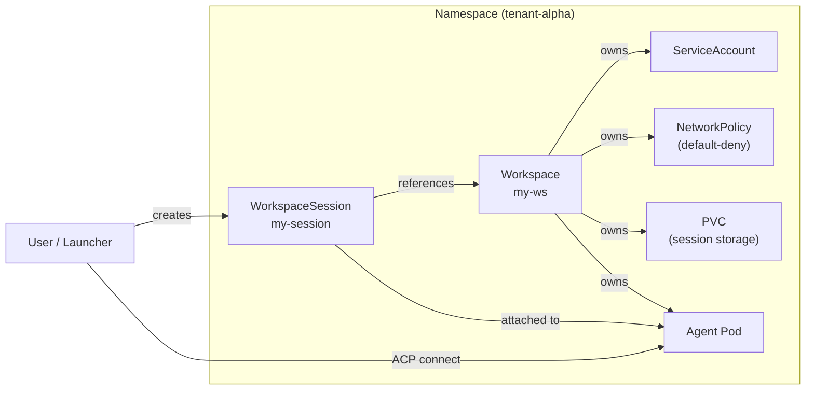
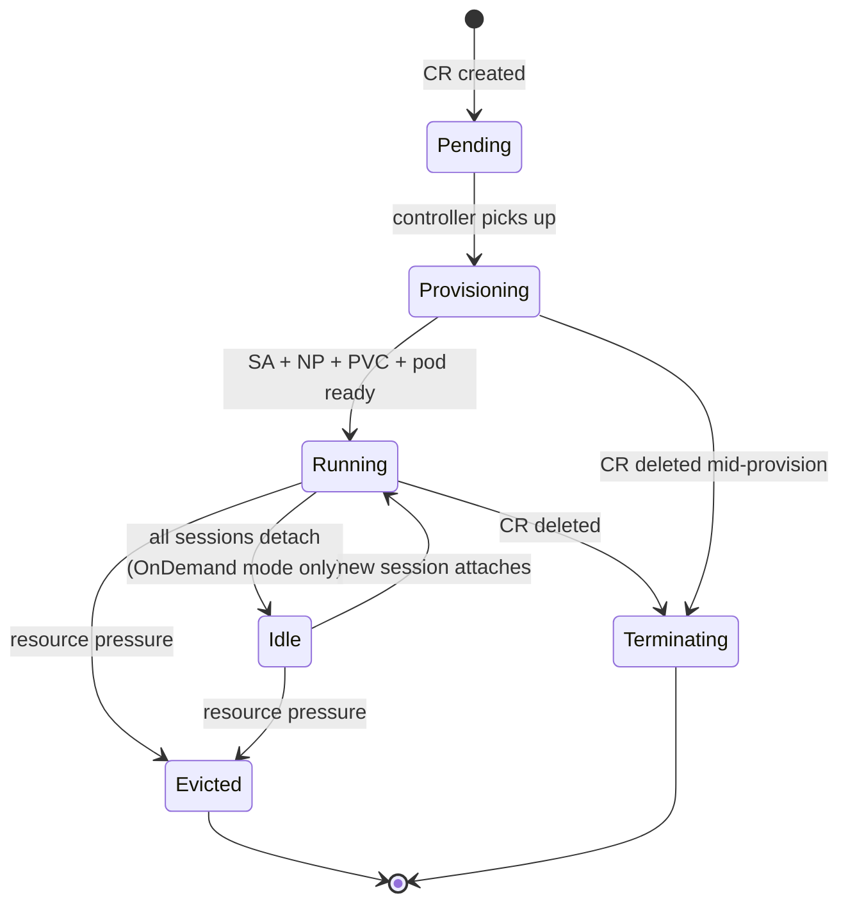
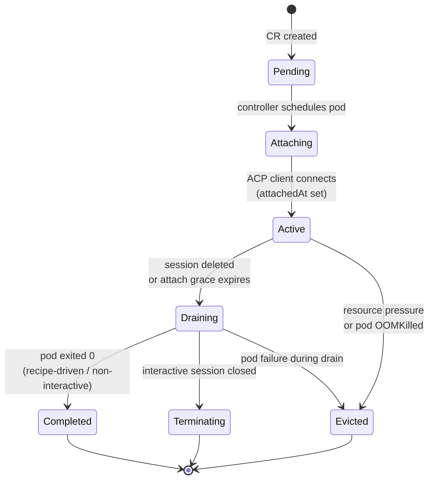
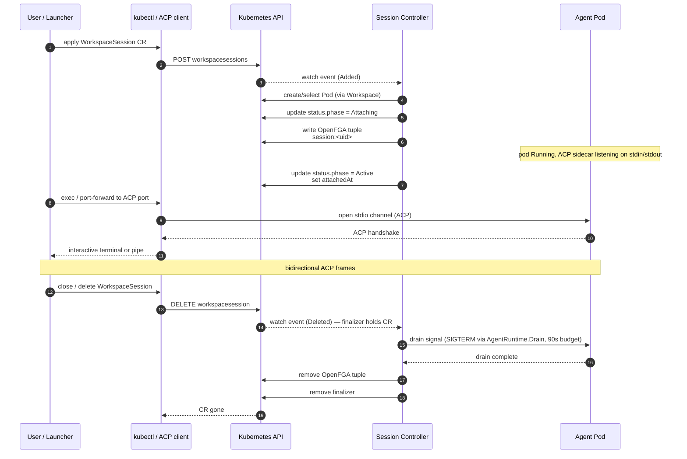

<!-- SPDX-License-Identifier: Apache-2.0 -->
<!-- Copyright (c) 2026 keese-ai -->

# Create a workspace & attach a session

This guide walks through creating a `Workspace`, choosing a session mode, creating a `WorkspaceSession`, and attaching to the running agent pod via ACP.

!!! info "Audience"
    Agent developers and platform engineers deploying workloads on keese. **Prerequisites:** a running keese installation (see [Bootstrap a local cluster](bootstrap-local.md)), a provisioned tenant namespace, and an `AgentRuntime` in that namespace. See [Workspaces & sessions](../concepts/workspaces.md) for conceptual background.

---

## How workspaces and sessions relate

A **Workspace** is the durable identity of an agent workload: it owns the ServiceAccount, NetworkPolicy, and session-storage PVC. A **WorkspaceSession** is an ephemeral attach record that maps one human (or automated caller) to the agent pod running inside the workspace.



The Workspace controller manages the pod lifecycle according to `spec.sessionMode`:

- **`OnDemand`** (default) — the pod starts when the first `WorkspaceSession` becomes `Active` and may be suspended when no sessions are attached for longer than `attachGrace`.
- **`Always`** — the pod runs continuously regardless of attached sessions.

---

## Step 1 — Create the Workspace

### Minimal workspace

The smallest valid `Workspace` needs only a `runtimeRef` and a `tenantRef`.

```yaml
apiVersion: keese.ai/v1alpha1
kind: Workspace
metadata:
  name: my-ws
  namespace: tenant-alpha
spec:
  runtimeRef:
    name: default-runtime        # AgentRuntime in the same namespace
  tenantRef:
    name: alpha                  # Tenant (cluster-scoped)
  sessionMode: OnDemand
```

```bash
kubectl apply -f workspace-minimal.yaml
kubectl wait --for=condition=Ready workspace/my-ws -n tenant-alpha --timeout=120s
```

Expected output:

```
workspace.keese.ai/my-ws condition met
```

### Interactive workspace (human-in-the-loop)

To allow `WorkspaceSession` attach, the workspace **must** set `spec.interactive: true`. This field is immutable after creation — plan it before applying.

```yaml
apiVersion: keese.ai/v1alpha1
kind: Workspace
metadata:
  name: my-ws
  namespace: tenant-alpha
spec:
  runtimeRef:
    name: goose-runtime
  tenantRef:
    name: alpha
  interactive: true              # Required for WorkspaceSession; immutable
  sessionMode: OnDemand
  attachPolicy: Reuse            # Reuse the running pod across sessions (default)
  attachGrace: 30s               # How long to wait before suspending an idle pod
  sessionStorage: "10Gi"         # PVC size for SQLite session state
  guardrailBindingRefs:
    - name: pii-guardrail
  egress:
    allowedTools:
      - web-search
      - code-exec
```

!!! warning "Planned — not yet implemented"
    The `egress.allowedTools` list and the associated OpenFGA tuple writes are specified in the type but the Workspace controller's tuple-sync loop is not yet wired. The field is accepted and stored; enforcement at the gateway is alpha-incomplete.

### What the controller provisions

Once `Ready=True`, inspect the resources the controller created:

```bash
# Status summary
kubectl get workspace my-ws -n tenant-alpha -o wide

# ServiceAccount
kubectl get sa -n tenant-alpha -l keese.ai/workspace=my-ws

# NetworkPolicy (default-deny, egress to AI Gateway only)
kubectl get networkpolicy -n tenant-alpha \
  -o jsonpath='{range .items[*]}{.metadata.name}{"\n"}{end}'

# PVC (bound once a session triggers pod start)
kubectl get pvc -n tenant-alpha -l keese.ai/workspace=my-ws
```

The `status` subresource reports the exact names:

```bash
kubectl get workspace my-ws -n tenant-alpha \
  -o jsonpath='{.status.serviceAccountName} {.status.networkPolicyName} {.status.podRef.name}'
```

---

## Step 2 — Watch workspace phases



Poll phase with:

```bash
kubectl get workspace my-ws -n tenant-alpha -w
```

Conditions to check when a workspace is stuck in `Provisioning`:

| Condition | Meaning |
|---|---|
| `Ready` | Workspace fully operational |
| `Progressing` | Controller is actively reconciling |
| `NetworkIsolated` | Default-deny NetworkPolicy is in place |
| `SessionStorageReady` | PVC is `Bound` |

```bash
kubectl describe workspace my-ws -n tenant-alpha | grep -A 20 "Conditions:"
```

---

## Step 3 — Choose a session mode

Session mode controls pod-sharing across concurrent `WorkspaceSession` objects. It is set on the **session**, not on the workspace, but must be consistent with the workspace's `attachPolicy`.

| Mode | Pod per … | When to use |
|---|---|---|
| `shared` | Workspace | Multiple users share one agent process; useful for team-collaborative or low-isolation scenarios |
| `per-user` | Subject (`attachSubject`) | One pod per distinct user; good default for dev workstations |
| `per-attach` | Each session object | Strict isolation; highest cost |

!!! note
    `attachPolicy: Reuse` on the Workspace (the default) allows the controller to reuse an already-running pod when a new session in `shared` or `per-user` mode arrives. `attachPolicy: New` forces a fresh pod for every session — combine with `per-attach` mode for full isolation.

---

## Step 4 — Create a WorkspaceSession

### Name convention

Session names follow the pattern `<workspace>-<subject-hash-16>-<session-name>`. The hash is the first 16 hex chars of the SHA-256 of `attachSubject`. The labels shown below enable efficient label selectors.

### Minimal session

```yaml
apiVersion: keese.ai/v1alpha1
kind: WorkspaceSession
metadata:
  name: my-ws-a1b2c3d4e5f6a7b8-default
  namespace: tenant-alpha
  labels:
    keese.ai/workspace: my-ws
    keese.ai/subject-hash: a1b2c3d4e5f6a7b8
    keese.ai/session-name: default
spec:
  workspaceRef: my-ws
  attachSubject: "user:alice@example.com"
  sessionName: default
  mode: per-user
```

```bash
kubectl apply -f session-minimal.yaml
kubectl wait --for=jsonpath='{.status.phase}'=Active \
  workspacesession/my-ws-a1b2c3d4e5f6a7b8-default \
  -n tenant-alpha --timeout=120s
```

### Full session (shared, custom grace, preserve on failure)

```yaml
apiVersion: keese.ai/v1alpha1
kind: WorkspaceSession
metadata:
  name: ws-collab-deadbeef01234567-primary
  namespace: tenant-alpha
  labels:
    keese.ai/workspace: ws-collab
    keese.ai/subject-hash: deadbeef01234567
    keese.ai/session-name: primary
spec:
  workspaceRef: ws-collab
  attachSubject: "user:bob@example.com"
  sessionName: primary
  mode: shared
  attachGraceSeconds: 300        # Override workspace default; mutable
  preserveOnPodFailure: true     # Keep CR alive on pod crash for post-mortem
```

!!! note
    `workspaceRef`, `attachSubject`, `sessionName`, and `mode` are **immutable** after creation — enforced by CEL `XValidation` markers on the type. Delete and recreate to change them.

---

## Step 5 — Watch session phases



Key status fields to watch:

```bash
kubectl get wsess -n tenant-alpha -w
```

```bash
# Count of currently connected ACP clients
kubectl get wsess my-ws-a1b2c3d4e5f6a7b8-default -n tenant-alpha \
  -o jsonpath='{.status.attachedClientCount}'

# Time of first attach
kubectl get wsess my-ws-a1b2c3d4e5f6a7b8-default -n tenant-alpha \
  -o jsonpath='{.status.attachedAt}'
```

---

## Step 6 — Attach via ACP

The **Agent Communication Protocol (ACP)** is the stdio-over-Kubernetes transport used to attach a terminal to a running agent. The attach flow sequences as follows:



### Interactive attach (exec)

```bash
# Identify the pod from session status
POD=$(kubectl get wsess my-ws-a1b2c3d4e5f6a7b8-default \
  -n tenant-alpha -o jsonpath='{.status.podRef.name}')

# Attach to the agent container
kubectl exec -it -n tenant-alpha "$POD" -c agent -- /bin/bash
```

### Non-interactive (pipe a prompt)

```bash
POD=$(kubectl get wsess my-ws-a1b2c3d4e5f6a7b8-default \
  -n tenant-alpha -o jsonpath='{.status.podRef.name}')

kubectl exec -n tenant-alpha "$POD" -c agent -- \
  /usr/local/bin/goose run --text "summarise the repo README" --no-session
```

!!! warning "Planned — not yet implemented"
    A standalone `keese attach` CLI command is on the roadmap but not yet shipped. Today all attach operations use `kubectl exec` or `kubectl port-forward`. See [CLI & binaries](../reference/cli.md) for current binary inventory.

---

## Step 7 — Verify session resume across pod restarts

The `keese-resume` init container restores `sessions.db` from the workspace PVC before the agent container starts. The `workspace-progression` kuttl suite asserts this end-to-end:

```bash
# Run the full progression suite against a local kind cluster
kubectl-kuttl test tests/e2e/workspace-progression --config tests/e2e/kuttl-config.yaml
```

The suite covers:

1. **`00-apply.yaml`** — applies `dev/demo/hello-keese.yaml` (Tenant + Workspace + WorkspaceSession).
2. **`00-assert.yaml`** — waits for Tenant `Active`, Workspace `Ready=True`, WorkspaceSession `Active` (240s timeout).
3. **`01-assert.yaml`** — runs a one-shot goose prompt through the AI Gateway and asserts `sessions.db` grew above its init size.
4. **`02-resume-test.yaml`** — deletes and recreates the session, then asserts `sessions.db` is restored on the fresh pod by the init container.

To run individual assertions manually:

```bash
# Workspace ready
kubectl wait --for=condition=Ready workspace/my-ws -n alpha --timeout=120s

# Session active
kubectl wait --for=jsonpath='{.status.phase}'=Active \
  workspacesession/my-session -n alpha --timeout=120s

# SQLite DB present (post-attach)
POD=$(kubectl get pod -n alpha -l keese.ai/session=my-session \
  -o jsonpath='{.items[0].metadata.name}')
kubectl exec -n alpha "$POD" -c agent -- sh -c \
  'test -s /var/run/keese/session/home/.local/share/goose/sessions/sessions.db && echo ok'
```

---

## Teardown

Deleting a `WorkspaceSession` triggers a graceful drain (SIGTERM to the agent, 90s budget). The finalizer `finalizers.workspacesession.keese.ai/cleanup` holds the CR until drain completes and the OpenFGA tuple is removed.

```bash
kubectl delete wsess my-ws-a1b2c3d4e5f6a7b8-default -n tenant-alpha
# Waits for finalizer removal; add --wait=false to return immediately
```

Deleting the `Workspace` cascades through its owned resources (pod, SA, NP, PVC) after all sessions have terminated.

```bash
kubectl delete workspace my-ws -n tenant-alpha
```

!!! danger "PVC data is deleted with the workspace"
    The session-storage PVC is owned by the Workspace. Deleting the Workspace deletes the PVC and all session history stored in it. Back up `sessions.db` before deleting if resumability matters.

---

## See also

- [Workspaces & sessions](../concepts/workspaces.md) — concept guide with architecture overview
- [Configure an agent runtime](configure-runtime.md) — set up the `AgentRuntime` referenced by `spec.runtimeRef`
- [Network isolation](../concepts/network-isolation.md) — what the default-deny NetworkPolicy enforces
- [Identity & zero-trust](../concepts/identity-zero-trust.md) — how the projected ServiceAccount token flows through the AI Gateway
