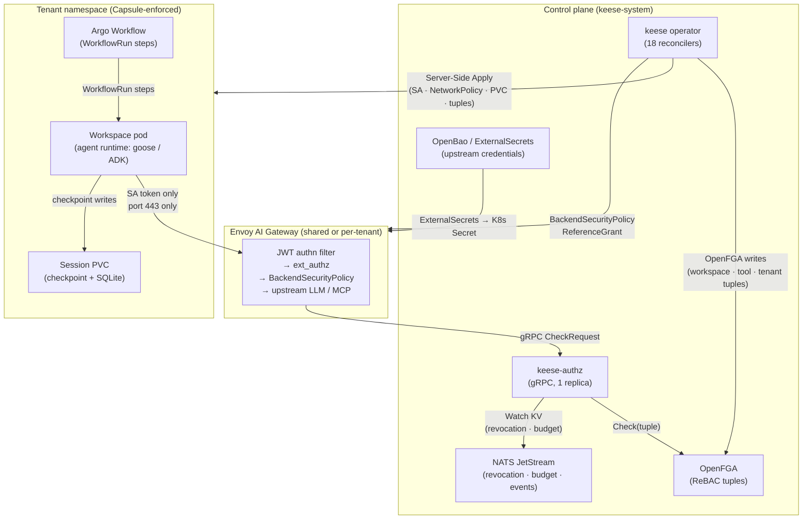
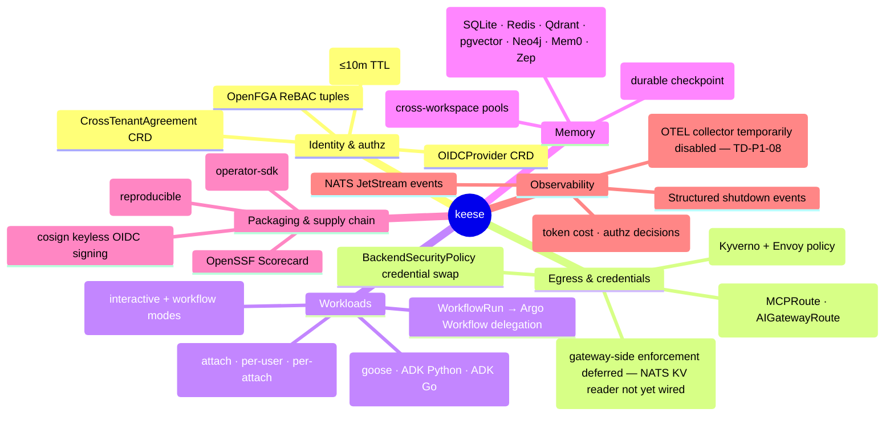

<!-- SPDX-License-Identifier: Apache-2.0 -->
<!-- Copyright (c) 2026 keese-ai -->

# keese — secure AI agents on Kubernetes

Run autonomous AI agents on a shared Kubernetes cluster without leaking upstream credentials, crossing tenant lines, or giving agents direct access to the Kubernetes API.

!!! info "Audience"
    Platform engineers, tenant administrators, agent developers, and contributors evaluating or operating keese. **Prerequisites:** familiarity with Kubernetes objects and basic kubectl usage.

---

## The problem

Autonomous AI agent frameworks are designed to be given tools and then left to run. That autonomy is also a risk surface: an agent pod that can reach the internet directly, read ambient cloud credentials, or write to other tenants' namespaces is a serious security liability on a shared cluster.

Three failure modes show up repeatedly:

- **Credential leakage.** Long-lived API keys baked into pod environment variables or mounted as plain secrets are readable by any process in the pod — including a compromised tool, a prompt-injected agent, or a supply-chain attack in a third-party library.
- **Uncontrolled egress.** An agent that can open arbitrary outbound connections can exfiltrate data, consume paid API quotas for other tenants, or reach internal endpoints it should never see.
- **Tenant bleed.** Without strict authorization boundaries, a bug or an adversarial prompt can cause one tenant's agent to read or act on another tenant's data.

## The solution

keese is a Kubernetes operator that wraps every agent in a zero-trust security envelope:

1. **Namespace = tenant boundary.** Capsule enforces hard namespace isolation. No workload crosses the boundary without an explicit, signed `CrossTenantAgreement`.
2. **Identity = projected ServiceAccount token.** Agent pods carry only a short-lived (≤ 10 minutes) SA token with audience `keese-egress-<tenant>`. No kubeconfig. No upstream API key. Nothing to steal that lasts.
3. **All egress through Envoy AI Gateway.** NetworkPolicy is default-deny except for the gateway service on port 443. The gateway terminates the agent's SA token, evaluates OpenFGA authorization, and injects the correct upstream credential (`BackendSecurityPolicy`) — the agent never sees that credential.
4. **Authorization = ReBAC via OpenFGA.** Every workspace, tool, and cross-tenant permission is a tuple in an OpenFGA model. The `keese-authz` ext_authz service (standalone Deployment in `keese-system`) checks tuples before any upstream call.
5. **Composition, not replacement.** keese does not re-implement workflow orchestration, secrets management, or messaging. It wraps Argo Workflows, OpenBao/ExternalSecrets, NATS JetStream, and Capsule behind typed CRDs that enforce the security invariants above.

## Hero architecture

Every arrow in this diagram is enforced: the `WS → GW` path is the *only* egress path NetworkPolicy allows from a workspace pod. Every other arrow is a control-plane operation the agent never participates in.

## Capability map

## What is built today

keese is in **alpha**. The design gate opened on 2026-04-22 after all 62 designs and 27 specs scored ≥ 90/100. Controllers are actively landing on `main`.

| Area | Status |
|---|---|
| 20 CRD kinds across 3 API groups (`keese.ai`, `authz.keese.ai`, `policy.keese.ai`) | Implemented |
| 18 reconcilers (workspace, session, memory, recipe, tenant, transport, workflow, guardrail, tokenbudget, and more) | Implemented |
| 5 binaries (`main.go` operator, `keese-authz`, `keese-cosign-webhook`, `keese-drain`, `keese-wf-launcher`) | Implemented |
| Envoy AI Gateway topology (design 05a) | Designed + partially wired |
| OpenFGA ReBAC model (design 04a) | Implemented (all 18 reconcilers write tuples) |
| Local kind + Tilt + Helmfile bootstrap | Implemented |
| End-to-end demo on cloud cluster | Planned (Demo track D1–D5) |
| `keese` CLI | Planned (Ecosystem track E9) |
| Web UI | Planned (Ecosystem track E10) |

!!! warning "Alpha software"
    Core CRD types and reconcilers are present but not yet validated against a full end-to-end cluster. Do not run keese in production.

## The four audiences

### Cluster operators

You install and upgrade keese via OLM, provision the shared infra (Envoy AI Gateway, OpenFGA, NATS, OpenBao), and set cluster-wide defaults. Start here:

- [Install via OLM](guides/install-olm.md)
- [Bootstrap a local cluster (kind + Tilt)](guides/bootstrap-local.md)
- [Cloud deploy (OpenTofu)](guides/cloud-deploy.md)

### Tenant administrators

You create namespaces (Capsule tenants), define token budgets and guardrails, configure egress credentials for your team's LLM targets, and invite users to workspaces. Start here:

- [Provision a tenant](guides/provision-tenant.md)
- [Configure egress credentials](guides/egress-credentials.md)
- [Set token budgets](guides/token-budgets.md)
- [Define guardrails](guides/guardrails.md)

### Agent developers

You write recipes, configure agent runtimes, attach to interactive workspaces, and build workflows. The Kubernetes details are largely invisible to you — you work with `Workspace`, `Recipe`, and `WorkflowRun` objects. Start here:

- [Your first workspace & session](getting-started/first-workspace.md)
- [Your first workflow](getting-started/first-workflow.md)
- [Write & distribute a recipe](guides/recipes.md)
- [Configure an agent runtime](guides/configure-runtime.md)

### Contributors

You extend keese — new memory backends, new agent runtime adapters, new CRDs, new reconcilers. Start here:

- [Repository map](development/repo-map.md)
- [Development environment (Nix)](development/dev-environment.md)
- [SDLC & the design gate](development/sdlc.md)
- [Contributing](development/contributing.md)

---

## Where to start

-   **Getting Started**

    ---

    Install locally on kind, create your first workspace, and run a workflow in under 30 minutes.

    [Get started](getting-started/index.md)

-   **Concepts**

    ---

    Understand the security model, how tenancy works, what a Workspace is, and how egress authorization flows.

    [Read concepts](concepts/index.md)

-   **Guides**

    ---

    Task-focused walkthroughs: configure a memory backend, define guardrails, set up OTEL observability, and more.

    [Browse guides](guides/index.md)

-   **Reference**

    ---

    Full API group references, Make targets, configuration knobs, metrics, and the glossary.

    [Open reference](reference/index.md)

## Security in five sentences

Agent pods carry only a projected SA token (TTL ≤ 10 minutes, audience `keese-egress-<tenant>`). No kubeconfig, no upstream API key, no long-lived credential touches the pod. All network egress is fail-closed through Envoy AI Gateway via default-deny NetworkPolicy. The gateway swaps the SA token for the correct upstream credential via `BackendSecurityPolicy`; the agent never sees that credential. Authorization for every tool call is evaluated against an OpenFGA ReBAC model before any upstream request leaves the cluster.

For the full rule set, see [Identity & zero-trust](concepts/identity-zero-trust.md) and [Authorization (ReBAC / OpenFGA)](concepts/authorization-rebac.md).

## See also

- [Architecture overview](concepts/architecture.md) — deeper component diagram and data-flow narrative
- [Concepts in 5 minutes](getting-started/concepts-in-5-minutes.md) — the fastest path to understanding the model
- [Roadmap (built vs remaining)](development/roadmap.md) — what is implemented, what is planned
- [Egress & the AI Gateway](concepts/egress-ai-gateway.md) — how the gateway topology works in detail
