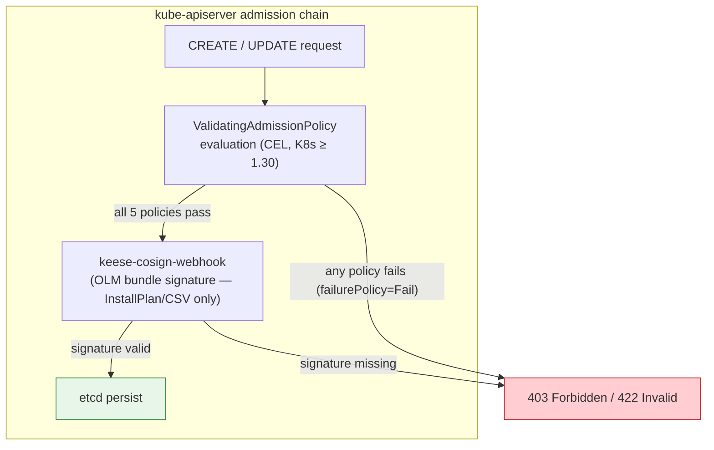
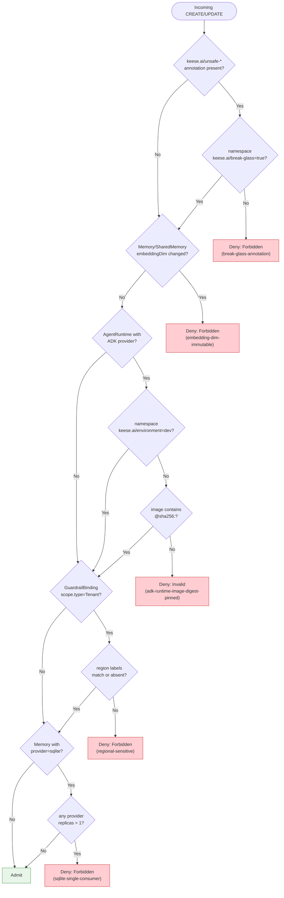

<!-- SPDX-License-Identifier: Apache-2.0 -->
<!-- Copyright (c) 2026 keese-ai -->

# Admission policies (VAPs)

Reference for every `ValidatingAdmissionPolicy` (VAP) that keese ships — purpose, matched resources, CEL logic summary, failure action, and break-glass path where applicable.

!!! info "Audience"
    Cluster operators who need to understand what is blocked at admission time, why, and how to work around it safely. **Prerequisites:** Kubernetes ≥ 1.30 (VAP is GA); a running keese installation; familiarity with [Concepts: Architecture](../concepts/architecture.md) and [Reference: Glossary](glossary.md).

---

## Overview

keese uses **ValidatingAdmissionPolicies** (CEL-based, Kubernetes 1.30 GA) for all static invariants — checks that require no external lookup beyond the object itself and its namespace. This preference is mandated by [`.claude/rules/04-kubernetes.md §12`](https://github.com/keese-ai/keese/blob/main/.claude/rules/04-kubernetes.md): VAP first, admission webhook only where CEL is insufficient.

Five policies ship in [`config/vap/`](https://github.com/keese-ai/keese/tree/main/config/vap/), all with `failurePolicy: Fail` (fail-closed). They are bundled via `config/vap/kustomization.yaml` and included from `config/default/kustomization.yaml`.



!!! note "cosign webhook is separate"
    OLM bundle-image signature enforcement (the `keese-cosign-webhook` binary) is an admission webhook, not a VAP, because cosign verification requires an outbound HTTPS call to the Rekor transparency log — which CEL cannot do. It intercepts only `InstallPlan` and `ClusterServiceVersion` resources, not arbitrary pod or agent-runtime images. That webhook is documented in [Reference: CLI & binaries](cli.md).

---

## Policy summary

| Policy name | Group(s) | Resources | Operation(s) | Failure reason | Break-glass? |
|---|---|---|---|---|---|
| `break-glass-annotation` | `keese.ai`, `authz.keese.ai` | `*` (all) | CREATE, UPDATE | `Forbidden` | Yes — see [below](#break-glass-annotation) |
| `embedding-dim-immutable` | `keese.ai` | `memories`, `sharedmemories` | UPDATE | `Forbidden` | No |
| `adk-runtime-image-digest-pinned` | `keese.ai` | `agentruntimes` | CREATE, UPDATE | `Invalid` | Yes — dev namespace label |
| `regional-sensitive` | `authz.keese.ai` | `guardrailbindings` | CREATE, UPDATE | `Forbidden` | No (permit-all if region label absent) |
| `sqlite-single-consumer` | `keese.ai` | `memories` | CREATE, UPDATE | `Forbidden` | No |

---

## `break-glass-annotation`

**Source:** [`config/vap/break-glass-annotation.yaml`](https://github.com/keese-ai/keese/blob/main/config/vap/break-glass-annotation.yaml)
**Security rule:** [`.claude/rules/05-security-zero-trust.md §13`](https://github.com/keese-ai/keese/blob/main/.claude/rules/05-security-zero-trust.md)

Rejects any annotation matching `keese.ai/unsafe-*` on resources in `keese.ai/v1alpha1` or `authz.keese.ai/v1alpha1` unless the enclosing namespace carries the label `keese.ai/break-glass=true`.

### CEL logic

```
!variables.hasUnsafeAnnotation || variables.breakGlassEnabled
```

Where:

- `hasUnsafeAnnotation` — `object.metadata.annotations.exists(k, k.startsWith("keese.ai/unsafe-"))`
- `breakGlassEnabled` — namespace label `keese.ai/break-glass == "true"` is present

### Break-glass path

1. Out-of-band: label the target namespace via GitOps or a privileged `kubectl`:
   ```bash
   kubectl label namespace <ns> keese.ai/break-glass=true
   ```
2. Apply the unsafe-annotated resource.
3. The Workspace controller emits a Kubernetes event with `reason: UnsafeAnnotationAllowed` (source: `internal/controller/keese/workspace_events.go`). This event is audited and must be logged in `MEMORY.md` per rule 05.13.
4. Remove the namespace label when break-glass is no longer required.

!!! warning "Break-glass is audited"
    Every namespace that carries `keese.ai/break-glass=true` will emit `UnsafeAnnotationAllowed` events on every admission that exercises the path. These events appear in `kubectl get events -n <ns>` and in the OTEL audit log.

---

## `embedding-dim-immutable`

**Source:** [`config/vap/embedding-dim-immutable.yaml`](https://github.com/keese-ai/keese/blob/main/config/vap/embedding-dim-immutable.yaml)
**Design ref:** [`docs/designs/15-memory-management.md`](https://github.com/keese-ai/keese/blob/main/docs/designs/15-memory-management.md)

Prevents changes to `spec.embeddingDim` on `Memory` and `SharedMemory` after creation. Changing the embedding dimension mid-lifecycle corrupts stored vectors and requires a full re-index.

### Matched resources

| Group | Resources | Operation |
|---|---|---|
| `keese.ai/v1alpha1` | `memories`, `sharedmemories` | UPDATE only |

### CEL logic

The expression allows three cases — neither old nor new has the field set, both have it set to the same value, or the old object never had it set (zero-value) while the new sets it (creation path, not a change):

```
!has(oldObject.spec.embeddingDim) && !has(object.spec.embeddingDim)
|| has(oldObject.spec.embeddingDim) && has(object.spec.embeddingDim)
   && oldObject.spec.embeddingDim == object.spec.embeddingDim
|| !has(oldObject.spec.embeddingDim) && has(object.spec.embeddingDim)
   && oldObject.spec.embeddingDim == 0
```

### Workaround

There is no break-glass path. To change the embedding dimension, create a new `Memory` resource, migrate data at the application layer, and delete the old one.

---

## `adk-runtime-image-digest-pinned`

**Source:** [`config/vap/adk-runtime-image-digest-pinned.yaml`](https://github.com/keese-ai/keese/blob/main/config/vap/adk-runtime-image-digest-pinned.yaml)
**Design ref:** [`docs/designs/07-agent-runtime-spi.md`](https://github.com/keese-ai/keese/blob/main/docs/designs/07-agent-runtime-spi.md)
**Plan ref:** `docs/plans/expansion/E0-runtime-spi-expansion.md §T6`
**Security rule:** [`.claude/rules/05-security-zero-trust.md §12`](https://github.com/keese-ai/keese/blob/main/.claude/rules/05-security-zero-trust.md)

Rejects `AgentRuntime` resources that specify an `adkPython` or `adkGo` provider with an image that is not digest-pinned (i.e. does not contain `@sha256:`), except in namespaces labelled `keese.ai/environment=dev`.

### Matched resources

| Group | Resources | Operation | Match condition |
|---|---|---|---|
| `keese.ai/v1alpha1` | `agentruntimes` | CREATE, UPDATE | `has(object.spec.implementation.adkPython) \|\| has(object.spec.implementation.adkGo)` |

The `matchConditions` field limits evaluation to ADK provider specs — objects using the `goose` provider are not evaluated by this policy.

### CEL logic

```
variables.isDevNamespace
|| (variables.adkPythonImageOk && variables.adkGoImageOk)
```

Where:

- `isDevNamespace` — namespace label `keese.ai/environment == "dev"`
- `adkPythonImageOk` — `!has(adkPython) || adkPython.image.contains('@sha256:')`
- `adkGoImageOk` — `!has(adkGo) || adkGo.image.contains('@sha256:')`

### Dev namespace exemption

```bash
kubectl label namespace <ns> keese.ai/environment=dev
```

This exemption is intended for local development overlays (`dev/`) only. Production namespaces must use digest-pinned images.

!!! note "ADK providers are currently stubs"
    The ADK Python and ADK Go provider packages exist at `internal/runtime/providers/adkpython/` and `internal/runtime/providers/adkgo/` but every SPI method returns `ErrUnsupported`. The controller's `detectProvider` does not handle them (resulting in `Degraded` phase). This VAP is in place ahead of full implementation so that when real ADK images are wired up, supply-chain hygiene is enforced from day one.

---

## `regional-sensitive`

**Source:** [`config/vap/regional-sensitive.yaml`](https://github.com/keese-ai/keese/blob/main/config/vap/regional-sensitive.yaml)
**Design ref:** [`docs/designs/05b-credential-injection-patterns.md`](https://github.com/keese-ai/keese/blob/main/docs/designs/05b-credential-injection-patterns.md) §"BSP region"

Rejects `GuardrailBinding` resources with `spec.scope.type=Tenant` when the binding's namespace label `keese.ai/region` does not match the cluster label `keese.ai/cluster-region`. Tenant-scoped guardrails apply to all workloads in a tenant's namespaces; applying a cross-region binding could bypass regional data-residency constraints.

### Matched resources

| Group | Resources | Operation |
|---|---|---|
| `authz.keese.ai/v1alpha1` | `guardrailbindings` | CREATE, UPDATE |

### CEL logic

```
!variables.isTenantScope
|| variables.nsRegion == "*"
|| variables.clusterRegion == "*"
|| variables.nsRegion == variables.clusterRegion
```

Where:

- `isTenantScope` — `object.spec.scope.type == "Tenant"`
- `nsRegion` — value of `keese.ai/region` on the binding's namespace, or `"*"` if absent
- `clusterRegion` — value of `keese.ai/cluster-region` on the binding's namespace, or `"*"` if absent

### Region label absence = permit-all

!!! note "Bootstrapping fallback"
    If neither `keese.ai/region` nor `keese.ai/cluster-region` are set on the namespace, the policy falls back to `"*"` for both variables, and the check passes. This avoids a hard dependency on region labels at cluster bootstrap. Set region labels before enforcing data-residency boundaries in production.

    VAP CEL cannot read an arbitrary namespace by name (e.g. `kube-system`). The `keese.ai/cluster-region` is read from the binding's *own* namespace label, which by convention equals the tenant namespace and carries both the tenant's region and the cluster's region label (projected by the Tenant controller).

### Workaround

There is no break-glass path for this policy. To apply a cross-region binding, either align the region labels or omit them (permit-all fallback). An ADR is required if regional enforcement is intentionally disabled.

---

## `sqlite-single-consumer`

**Source:** [`config/vap/sqlite-single-consumer.yaml`](https://github.com/keese-ai/keese/blob/main/config/vap/sqlite-single-consumer.yaml)
**Design ref:** [`docs/designs/15-memory-management.md`](https://github.com/keese-ai/keese/blob/main/docs/designs/15-memory-management.md) §sqlite
**Spec ref:** `docs/specs/keese.ai-v1alpha1-memory.md §sqlite-single-pod`
**Tech-debt:** TD-P1-09, TD-P2-08

Rejects `Memory` resources with `spec.provider.type=sqlite` that also set `replicas > 1` in any provider sub-field (`redis.replicas` or `qdrant.replicas`). SQLite with WAL mode on an RWO PVC cannot safely be shared across pods; a multi-replica configuration would silently corrupt the database.

### Matched resources

| Group | Resources | Operation |
|---|---|---|
| `keese.ai/v1alpha1` | `memories` | CREATE, UPDATE |

Note: `sharedmemories` are not matched because `SharedMemory` does not expose a SQLite provider — it requires a backend that supports concurrent access.

### CEL logic

```
!variables.isSqlite
|| (!variables.redisReplicasGtOne && !variables.qdrantReplicasGtOne)
```

Where:

- `isSqlite` — `object.spec.provider.type == "sqlite"`
- `redisReplicasGtOne` — `has(redis.replicas) && redis.replicas > 1`
- `qdrantReplicasGtOne` — `has(qdrant.replicas) && qdrant.replicas > 1`

The check is belt-and-suspenders: the `oneOf` XValidation on `Memory.spec.provider` already prevents setting both `sqlite` and `redis`/`qdrant` provider structs simultaneously. This VAP additionally catches the case where a provider struct is present but the provider type key is `sqlite`.

### Workaround

There is no break-glass path. Choose a backend that supports concurrent access (Redis, Qdrant, pgvector, Mem0, Zep, or Neo4j) if you need replicas. See [Reference: API — keese.ai](api/keese.md) for the full `Memory.spec.provider` discriminated one-of schema.

---

## Decision flowchart



---

## Binding and kustomization

Each policy is paired with a `ValidatingAdmissionPolicyBinding` (same file) that targets all namespaces (`matchResources: {}`). The bindings set `validationActions: [Deny]` — audit-only mode is not used.

All five are included from [`config/vap/kustomization.yaml`](https://github.com/keese-ai/keese/blob/main/config/vap/kustomization.yaml) and are applied by `make install` / `make deploy`.

Every policy carries the label `keese.ai/policy-tier: static`, which distinguishes CEL-only VAPs from the dynamic admission webhook (`keese-cosign-webhook`).

---

## Relationship to admission webhooks

| Mechanism | When used | keese examples |
|---|---|---|
| `ValidatingAdmissionPolicy` (CEL) | Static invariants — no external call needed | All 5 policies on this page |
| Admission webhook (MutatingWebhook / ValidatingWebhook) | Dynamic checks — external lookup, cross-resource, or cosign verification | `keese-cosign-webhook` (OLM bundle image signatures at `InstallPlan`/`ClusterServiceVersion` admission) |

Per rule `04.12`, webhooks are only added where CEL is provably insufficient. The `regional-sensitive` policy demonstrates the limit of VAP CEL (it cannot read an arbitrary namespace by name) — the cluster-region fallback design works around this within CEL.

---

## See also

- [Reference: Metrics, events & conditions](metrics-events.md) — `UnsafeAnnotationAllowed` event and other admission-path event reasons
- [Reference: CLI & binaries](cli.md) — `keese-cosign-webhook` (OLM bundle image-signature webhook)
- [Reference: API — keese.ai](api/keese.md) — `Memory`, `AgentRuntime` field schemas
- [Reference: API — authz.keese.ai](api/authz.md) — `GuardrailBinding.spec.scope` schema
- [`docs/designs/15-memory-management.md`](https://github.com/keese-ai/keese/blob/main/docs/designs/15-memory-management.md) — Memory provider discriminated one-of design
- [`docs/designs/07-agent-runtime-spi.md`](https://github.com/keese-ai/keese/blob/main/docs/designs/07-agent-runtime-spi.md) — AgentRuntime SPI and ADK provider stubs
- [`.claude/rules/05-security-zero-trust.md`](https://github.com/keese-ai/keese/blob/main/.claude/rules/05-security-zero-trust.md) — zero-trust invariants this enforcement serves
