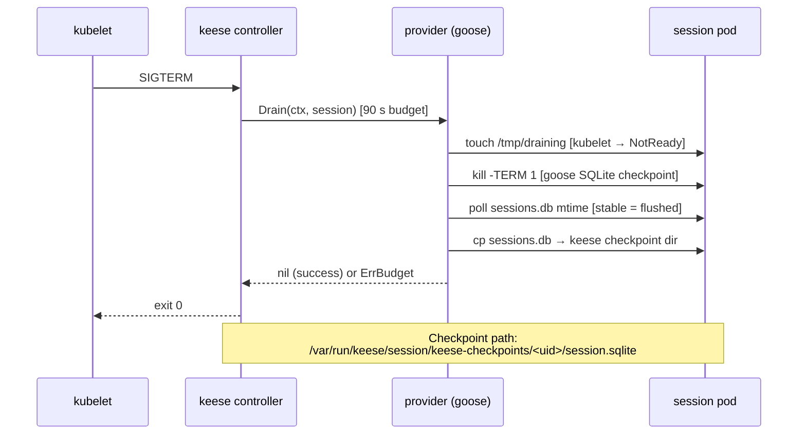

<!-- SPDX-License-Identifier: Apache-2.0 -->
<!-- Copyright (c) 2026 keese-ai -->

# Agent Runtime SPI

Complete Go interface reference for `internal/runtime/spi/v1alpha1` — every method signature, sentinel error, `CapabilityMatrix` field, and the `init()`-based provider registration pattern, with per-method status for each shipping provider.

!!! info "Audience"
    Agent-runtime developers implementing a new provider or debugging SPI contract violations. Prerequisite reading: [Concepts: Agent runtimes](../concepts/agent-runtimes.md) and [Guides: Configure runtime](../guides/configure-runtime.md).

---

## Package path

```
github.com/keese-ai/keese/internal/runtime/spi/v1alpha1
```

Source files:
[`spi.go`](https://github.com/keese-ai/keese/blob/main/internal/runtime/spi/v1alpha1/spi.go) ·
[`types.go`](https://github.com/keese-ai/keese/blob/main/internal/runtime/spi/v1alpha1/types.go) ·
[`registry.go`](https://github.com/keese-ai/keese/blob/main/internal/runtime/spi/v1alpha1/registry.go)

Governing spec: [`docs/specs/agent-runtime-spi.md`](https://github.com/keese-ai/keese/blob/main/docs/specs/agent-runtime-spi.md) (status: `current`, scored 97.5/100 — iteration 3).

---

## SemVer policy

| Change | Version impact |
|---|---|
| New required method | Major package bump (`spi/v2alpha1`) + migration plan scored ≥ 90 |
| New optional method or capability flag | Minor bump |
| Behavioural fix within a method | Patch |

`scripts/check-runtime-spi-apidiff.sh` runs on every PR (`lint.yaml`). A major bump requires `docs/plans/migration-runtime-spi-<version>.md`.

---

## `AgentRuntime` interface

```go
type AgentRuntime interface {
    // Identity — static, no I/O.
    Name()         string
    Capabilities() CapabilityMatrix

    // Bootstrap provisions PVC dirs + SQLite schema. Idempotent; ≤ 30 s.
    Bootstrap(ctx context.Context, workspace Workspace) error

    // Run executes a bounded recipe; blocks until Succeeded.
    // Idempotent by StepID (D24). ErrUnsupported when no pod identity provided.
    Run(ctx context.Context, recipe string, params map[string]string) (*RunResult, error)

    // Attach returns an ACP session handle on a serve-mode pod.
    // Recipe-mode sessions return ErrAttachUnsupported.
    Attach(ctx context.Context, session WorkspaceSession) (*AttachHandle, error)

    // Resume restores from Workspace.LastCheckpoint.
    // Must complete or return ErrAgentUnresponsive within 60 s (D25 GUPP).
    Resume(ctx context.Context, workspace Workspace) error

    // Drain handles SIGTERM. Budget = 90 s.
    // Steps: SQLite checkpoint → NATS publish → CleanupSubAgents → close ACP →
    // flush OTEL keese.process.shutdown → exit 0.
    // Returns ErrBudget if the deadline is exceeded.
    Drain(ctx context.Context, session WorkspaceSession) error

    // CleanupSubAgents drains sub-agents before parent delete (design 07 iter-2).
    // Guard: SupportsSubAgentCleanup.
    CleanupSubAgents(ctx context.Context, workspace Workspace) error

    // InjectPrompt injects a synthetic user turn (supervision ladder step 2, D23).
    // Guard: SupportsInjectPrompt.
    InjectPrompt(ctx context.Context, session WorkspaceSession, prompt string) error

    // InvokeSubAgent spawns a sub-agent (D08c).
    // Returns ErrSubAgentLimitExceeded when MaxSubAgents is reached.
    InvokeSubAgent(ctx context.Context, workspace Workspace, spec SubAgentSpec) (*SubAgentHandle, error)

    // Health returns liveness + ActiveSubAgentCount.
    Health(ctx context.Context, session WorkspaceSession) (*HealthReport, error)

    // StreamEvents returns a typed event channel.
    // Blocked > 5 s → StreamEventsBlocked event from the controller.
    StreamEvents(ctx context.Context) (<-chan RuntimeEvent, error)
}
```

The controller checks the relevant `CapabilityMatrix` flag before every optional call. If the flag is `false`, the controller skips the call and emits a `RuntimeCapabilityMismatch` event — `ErrUnsupported` from these paths is a backstop, not the primary guard.

---

## `CapabilityMatrix`

Declared statically at registration; never changes at runtime.

| Field | Type | Description |
|---|---|---|
| `ProviderName` | `string` | Registry key; matches the `AgentRuntime` CR's `spec.implementation.<provider>` field. |
| `SPIVersion` | `string` | SemVer string (e.g. `"1.0.0"`). Admission rejects version mismatches. |
| `SupportsACP` | `bool` | Provider can serve an ACP attach session (`Attach` + `Health` implemented). |
| `SupportsSubAgents` | `bool` | Provider can spawn sub-agents via `InvokeSubAgent`. |
| `MaxSubAgents` | `int` | Per-provider cap; `0` means unlimited. Honoured by `InvokeSubAgent`. |
| `SupportsResume` | `bool` | Provider implements `Resume` (D25 GUPP). |
| `SupportsSubAgentCleanup` | `bool` | Provider implements `CleanupSubAgents` (D07 iter-2). |
| `SupportsInjectPrompt` | `bool` | Provider implements `InjectPrompt` (D23 step-2). |
| `SupportsStreaming` | `bool` | Provider implements `StreamEvents`. |
| `SupportsMCP` | `bool` | Provider can host an MCP tool server. |
| `SupportsRecipes` | `bool` | Provider can run bounded recipes via `Run`. |
| `SupportsCredentialRotation` | `bool` | Provider can hot-reload credentials without restart. |

---

## Sentinel errors

All sentinel errors are package-level `var` values in `spi.go`. Callers use `errors.Is`.

| Variable | Description |
|---|---|
| `ErrUnsupported` | Provider does not implement this method. Controllers should check the capability flag first; this is a backstop. |
| `ErrAttachUnsupported` | `Attach` called on a recipe-mode session pod (no ACP endpoint). |
| `ErrAgentUnresponsive` | `Resume` did not complete within the 60 s D25 GUPP budget. |
| `ErrBudget` | `Drain` exceeded the 90 s drain budget. |
| `ErrSubAgentLimitExceeded` | `InvokeSubAgent` hit the provider's `MaxSubAgents` cap. |
| `ErrPermanent` | Non-retryable failure (typically from `Bootstrap` after retry exhaustion). |
| `ErrTransient` | Retryable failure. `CleanupSubAgents` returning this triggers batch pod-delete by label. |

---

## Key types

### Input types

```go
// Workspace is the SPI-side projection of a Workspace CR.
type Workspace struct {
    UID            string
    Name           string
    Namespace      string
    LastCheckpoint CheckpointRef
}

// CheckpointRef points to the most recent durable session snapshot.
type CheckpointRef struct {
    SQLiteRef string  // path on the workspace PVC
    NATSSeq   uint64  // last JetStream sequence before checkpoint
}

// WorkspaceSession is the SPI-side projection of a WorkspaceSession CR.
type WorkspaceSession struct {
    UID         string
    Name        string
    Namespace   string
    WorkspaceID string
    PodName     string
}

// SubAgentSpec describes a sub-agent to spawn under a parent.
type SubAgentSpec struct {
    ParentSessionUID string
    RecipeRef        string
    Params           map[string]string
}
```

### Output types

```go
// AttachHandle is returned by Attach for a serve-mode session pod.
// Endpoint format: "pod://<namespace>/<pod>/<container>"
type AttachHandle struct {
    Endpoint string
    SocketFD int   // optional; unused today
}

// RunResult is the bounded-recipe Run outcome.
type RunResult struct {
    StepID    string
    ExitCode  int
    Artifacts []string
}

// SubAgentHandle returns identifiers for a spawned sub-agent.
type SubAgentHandle struct {
    UID     string
    PodName string
}

// HealthReport is returned by Health.
// Phase values: "Idle", "Running", "Draining", "Down"
type HealthReport struct {
    ActiveSubAgentCount int
    Phase               string
}

// RuntimeEvent is the typed event flowing on the StreamEvents channel.
type RuntimeEvent struct {
    Type    string
    Payload map[string]string
}
```

---

## Provider registration

Providers register themselves via `spi.Register` called from `init()`. The operator binary blank-imports each provider package from `cmd/operator/main.go` to drive these calls. Duplicate names `panic` at startup (fail-fast).

```go
// spi.Register signature
func Register(name string, caps CapabilityMatrix, factory Factory) { ... }

// Factory type
type Factory func(config map[string]string) (AgentRuntime, error)
```

**Lookup** at runtime:

```go
caps, factory, ok := spi.Lookup(name)  // RLock-protected
names := spi.Names()                   // sorted; used for deterministic admission errors
```

Admission rejects `AgentRuntime` CRs whose `spec.implementation.<provider>` key is absent from the registry (`UnknownProvider` event + `Incompatible` phase).

---

## `Factory` contract

The `config map[string]string` is populated by the controller from `AgentRuntime.spec.implementation.<provider>` fields. Each provider documents its accepted keys. Today:

| Provider | Accepted config keys |
|---|---|
| `goose` | `image` — informational; pod spec carries auth |
| `adkPython` | `image` — informational |
| `adkGo` | `image` — informational |

---

## Lifecycle and drain sequence



On `ErrBudget` the controller emits `SubAgentCleanupTimeout` and the supervisor ladder (D23, **PLANNED**) escalates.

`Resume` is the inverse: the checkpoint SQLite is copied back into goose's sessions directory before the new pod starts handling requests. Budget: 60 s; timeout → `ErrAgentUnresponsive` → D23 ladder step 4 (pod restart).

---

## Provider capability matrix — current state

| Method | goose | adkPython (E0) | adkGo (E0) |
|---|---|---|---|
| `Name()` | `"goose"` | `"adkPython"` | `"adkGo"` |
| `Bootstrap` | implemented | `ErrUnsupported` | `ErrUnsupported` |
| `Run` | implemented | `ErrUnsupported` | `ErrUnsupported` |
| `Attach` | implemented | `ErrAttachUnsupported` | `ErrAttachUnsupported` |
| `Resume` | implemented (60 s) | `ErrUnsupported` | `ErrUnsupported` |
| `Drain` | implemented (90 s) | `ErrUnsupported` | `ErrUnsupported` |
| `CleanupSubAgents` | `ErrUnsupported` | `ErrUnsupported` | `ErrUnsupported` |
| `InjectPrompt` | implemented (FIFO) | `ErrUnsupported` | `ErrUnsupported` |
| `InvokeSubAgent` | `ErrSubAgentLimitExceeded` | `ErrUnsupported` | `ErrUnsupported` |
| `Health` | implemented | `ErrUnsupported` | `ErrUnsupported` |
| `StreamEvents` | `ErrUnsupported` | `ErrUnsupported` | `ErrUnsupported` |

### goose `CapabilityMatrix` (live values)

| Flag | Value |
|---|---|
| `SupportsACP` | `true` |
| `SupportsSubAgents` | `false` |
| `MaxSubAgents` | `0` |
| `SupportsResume` | `true` |
| `SupportsSubAgentCleanup` | `false` |
| `SupportsInjectPrompt` | `true` |
| `SupportsStreaming` | `false` |
| `SupportsMCP` | `true` |
| `SupportsRecipes` | `true` |
| `SupportsCredentialRotation` | `false` |

### adkPython / adkGo `CapabilityMatrix` (E0 — all `false`)

Both ADK providers are registered stubs at E0. Every SPI method returns `ErrUnsupported` (or `ErrAttachUnsupported` for `Attach`). The AgentRuntime controller's `detectProvider` path does not handle either name today — a CR referencing `adkPython` or `adkGo` will land in `Degraded` phase until E1 lands. All capability flags are `false`; `MaxSubAgents = 0`.

!!! warning "Planned — ADK providers not production-ready"
    `adkPython` and `adkGo` provider implementations are stubs (`internal/runtime/providers/adkpython/`, `internal/runtime/providers/adkgo/`). Do not create `AgentRuntime` CRs referencing these providers in non-dev environments.

---

## goose — implementation notes

### `Bootstrap`

Creates the keese checkpoint directory layout on the workspace PVC at `/var/run/keese/session/keese-checkpoints/<workspace-uid>/`. If no `PodExecutor` is wired (pre-startup), returns `nil` — the init-container path handles directory creation.

### `Run`

Fires `goose run --recipe <path> [--params key=value …]` inside an already-running session pod via `PodExecutor`. Requires `keese.pod_name` and `keese.namespace` reserved keys in `params`; returns `ErrUnsupported` when absent.

### `Attach`

Returns an `AttachHandle` with `Endpoint = "pod://<namespace>/<pod>/agent"`. Callers (IDE bridge, keese controller) translate this into `kubectl exec` or ACP dial. `SocketFD` is unused.

### `InjectPrompt`

Writes the prompt line to a named FIFO at `/var/run/keese/session/home/.local/state/goose/inject-fifo` via `PodExecutor`. Goose v1.33.1+ reads this FIFO and treats each line as a synthetic user turn. Embedded newlines are collapsed to spaces before the write. A 5 s background-write timeout prevents the exec from blocking when goose is not reading.

### `Health`

Sends signal 0 to PID 1 in the agent container (`kill -0 1`). Returns `Phase: "Running"` on success, `Phase: "Down"` on error or missing `PodName`.

### `PodExecutor` interface

```go
type PodExecutor interface {
    Exec(ctx context.Context, namespace, podName, container string, argv []string) (stdout, stderr []byte, err error)
}
```

Production wraps `k8s.io/client-go/tools/remotecommand`; tests inject a fake via `FactoryWithExecutor`.

---

## Observability

One OTEL span is emitted per interface method call with attributes `runtime.provider`, `runtime.version`, `workspace.uid`, `workspace.namespace`, `tenant.name`.

Metrics registered by the AgentRuntime controller (see [Reference: Metrics & events](metrics-events.md)):

| Metric | Type |
|---|---|
| `keese_runtime_session_starts_total` | Counter |
| `keese_runtime_drain_duration_seconds` | Histogram |
| `keese_runtime_crashes_total` | Counter |
| `keese_runtime_resume_total` | Counter |
| `keese_runtime_gupp_breach_total` | Counter |

Event reasons are defined in `internal/controller/keese/runtime_events.go` — see [Reference: Metrics & events](metrics-events.md#keeseai-agentruntime-runtimeextension-controllers).

---

## Acceptance tests

Unit (`internal/runtime/spi/v1alpha1/` and `internal/runtime/providers/goose/`):

| Test | Verifies |
|---|---|
| `TestCapabilityMatrix_GooseFlags` | Static matrix matches live `capabilities` var |
| `TestRegister_DuplicateProviderPanics` | Double-register panics at init time |
| `TestBootstrap_Idempotent` | Bootstrap is re-runnable without error |
| `TestRun_ResumeIdempotencyByStepID` | Step deduplication by StepID (D24) |
| `TestDrain_BudgetEnforced` | `ErrBudget` returned on deadline exceeded |
| `TestCleanupSubAgents_LeakDetection` | Cleanup identifies orphaned pods |
| `TestCapabilityGate_InjectPromptUnsupported` | Controller skips `InjectPrompt` when flag is `false` |

Envtest (lifecycle integration):

| Test | Verifies |
|---|---|
| `TestBootstrap_EnvtestIdempotent3Reconciles` | Status converges over ≥ 3 reconciles with no spec change |
| `TestDrain_SIGTERMExitCode0` | Exit 0 after SIGTERM; checkpoint present on PVC |
| `TestResume_GUPPTimeout60s` | `ErrAgentUnresponsive` after 60 s; event emitted |
| `TestCleanupSubAgents_OrphanPodsDeleted` | Sub-agent pods deleted on parent drain |

kuttl e2e: `agentruntime-drain` suite (see [Reference: Metrics & events](metrics-events.md) for the full kuttl suite list).

---

## Failure modes

| Failure | Mitigation |
|---|---|
| `Bootstrap` error | Retry with backoff; max 5 attempts → `ErrPermanent` |
| `Resume` → `ErrAgentUnresponsive` | D23 ladder step 4 (pod restart) — **PLANNED** |
| `Drain` → `ErrBudget` | Resume from partial checkpoint; `in_flight_remaining > 0` retained |
| `CleanupSubAgents` → `ErrTransient` | Batch pod-delete by label `keese.ai/parent-workspace:<uid>` |
| Unknown `providerRef` | Admission: `UnknownProvider` event; `Incompatible` phase |
| Image outside version range | Admission: `ImageVersionUnsupported` event |
| `StreamEvents` blocked > 5 s | `StreamEventsBlocked` event; controller falls back to `Health` poll |

---

## See also

- [Concepts: Agent runtimes](../concepts/agent-runtimes.md) — how providers fit into the workspace lifecycle
- [Concepts: Lifecycle & supervision](../concepts/lifecycle-supervision.md) — D23 supervision ladder (PLANNED)
- [Guides: Configure runtime](../guides/configure-runtime.md) — authoring an `AgentRuntime` CR
- [Reference: Metrics & events](metrics-events.md) — full event-reason tables and SLO metrics
- [Reference: API — keese.ai](api/keese.md) — `AgentRuntime` CRD schema
