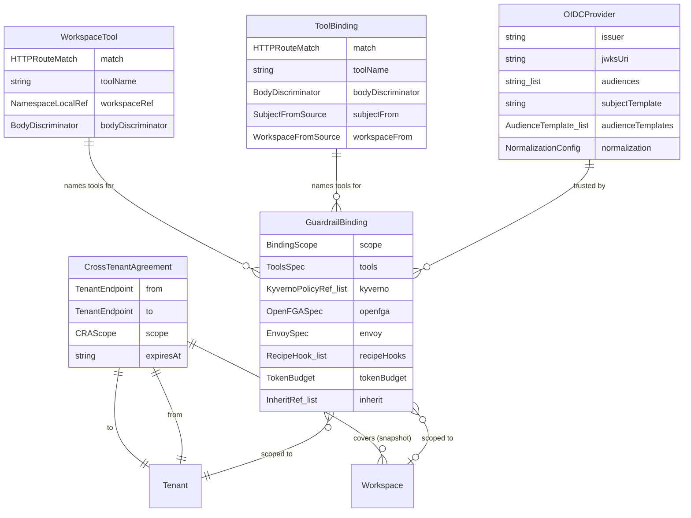
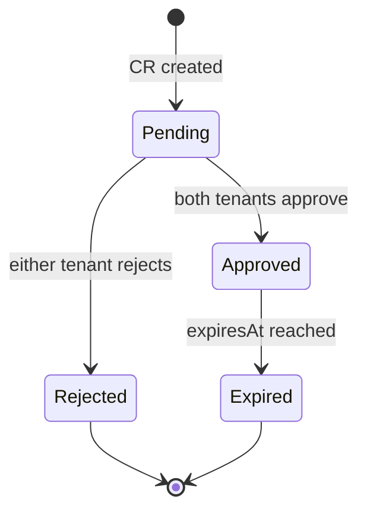

<!-- SPDX-License-Identifier: Apache-2.0 -->
<!-- Copyright (c) 2026 keese-ai -->

# API: authz.keese.ai group

The `authz.keese.ai/v1alpha1` group contains the access-control and identity primitives that guard every agent egress path: OIDC trust, tool authorization, guardrail policies, and cross-tenant collaboration contracts.

!!! info "Audience"
    Tenant administrators and platform operators who configure agent identity, tool allow/deny lists, and cross-tenant messaging. **Prerequisites:** [Identity & zero-trust](../../concepts/identity-zero-trust.md) · [Authorization (ReBAC)](../../concepts/authorization-rebac.md)

---

## Kind overview



### Scope and controller summary

| Kind | API scope | Short name | Controller | Status |
|---|---|---|---|---|
| `OIDCProvider` | Cluster | `oidcp` | `keese-oidcprovider-controller` | Implemented |
| `GuardrailBinding` | Namespaced | — | `keese-guardrailbinding-controller` | Implemented |
| `ToolBinding` | Cluster | `tb` | None — keese-authz trie reads CRs directly | Alpha (no reconciler) |
| `WorkspaceTool` | Namespaced | `wt` | None — keese-authz trie reads CRs directly | Alpha (no reconciler) |
| `CrossTenantAgreement` | Cluster | `cra` | `keese-crosstenanagreement-controller` | Implemented |

---

## OIDCProvider

Cluster-scoped. Configures OIDC issuer trust for the Envoy AI Gateway `ext_authz` pipeline. Bootstrap CRs (`kubernetes-default`, `google`, `github-actions`, `azure-entra`, `okta`, `keycloak`, `gitlab`) are created idempotently by the `keese-oidcprovider-bootstrap` Job at install time.

Source: [`api/authz/v1alpha1/oidcprovider_types.go`](https://github.com/keese-ai/keese/blob/main/api/authz/v1alpha1/oidcprovider_types.go)
Design: `docs/designs/04b-projected-sa-identity.md` + `04b-ii-oidc-trust.md`

### Printer columns

| Column | JSONPath | Notes |
|---|---|---|
| `Age` | `.metadata.creationTimestamp` | |
| `Ready` | `.status.conditions[?(@.type=='Ready')].status` | |
| `Phase` | `.status.phase` | `Active` or `Degraded` |
| `Issuer` | `.spec.issuer` | |
| `AudienceTemplates` | `.spec.audienceTemplates[*].name` | |

### Spec fields

| Field | Type | Required | Description |
|---|---|---|---|
| `issuer` | `string` (URL) | yes | OIDC issuer URL. JWKS auto-derived via `<issuer>/.well-known/openid-configuration` unless `jwksUri` is set. |
| `jwksUri` | `string` (URL) | no | Explicit JWKS endpoint override for air-gapped clusters, Dex, or Pinniped. |
| `audiences[]` | `[]string` (glob) | yes | Glob patterns accepted for the `aud` claim, e.g. `keese-egress-*`. Min 1 item. |
| `subjectTemplate` | `string` | yes | Go template over `{.Claims, .Issuer, .Audience}` using the restricted Sprig allow-list. Admission rejects on parse failure (`TemplateInvalid` event). |
| `audienceTemplates[]` | `[]AudienceTemplate` | yes | Named token-projection audiences. Must include at least one entry named `egress` (CRD `XValidation`-enforced). |
| `normalization` | `NormalizationConfig` | no | `{lowercase: bool, trim: bool}` applied to the rendered subject before the OpenFGA Check. |

**AudienceTemplate sub-fields:**

| Field | Type | Range | Description |
|---|---|---|---|
| `name` | `string` | — | Unique name; `egress` is required. |
| `template` | `string` | — | Go template; same Sprig allow-list as `subjectTemplate`. |
| `expirationSeconds` | `int32` | [60, 600] | Projected SA token lifetime. Kubelet rotates at 80%. |

**Sprig allow-list** (fixed, not user-configurable): `trimPrefix`, `trimSuffix`, `lower`, `upper`, `split`, `replace`. Admission CEL rejects any template referencing a function outside this set.

### Three-token projection

Agent pods receive three independent `serviceAccountToken` projections mounted at:

```
/var/run/keese/tokens/
  egress       # audience: keese-egress-<tenant>      → Envoy AI Gateway ext_authz
  supervisor   # audience: keese-supervisor-<ws-uid>  → ACP bridge
  workflowRun  # audience: keese-wf-<run-uid>         → NATS bridge (workflow pods only)
```

Only `egress` is federated to cloud IAM. `workflowRun` and `supervisor` are in-cluster only.

### Status fields

| Field | Type | Description |
|---|---|---|
| `phase` | `string` | `Active` when JWKS is reachable and templates are valid; `Degraded` otherwise. |
| `observedGeneration` | `int64` | Last generation successfully reconciled. |
| `lastTemplateValidationTime` | `metav1.Time` | UTC timestamp of most recent successful template parse. |
| `lastReconcileTime` | `metav1.Time` | Timestamp of most recent successful reconcile. |
| `resolvedJwksUri` | `string` | JWKS endpoint most recently used (copied from spec or derived via OIDC discovery). |
| `conditions[]` | `[]metav1.Condition` | `Ready`, `JWKSReachable`. |

### Finalizer

`finalizers.oidcprovider.keese.ai/cache-flush` — sends a cache-flush signal to all gateway pods via the `keese-authz` gRPC admin endpoint before deletion. Maximum 60 s drain window; emits `CacheFlushComplete` event on success.

!!! warning "Cache flush is a no-op in the current release"
    The cache-flush signal is currently a no-op: `cmd/main.go` injects `FakeCacheFlusher`, so `oidcprovider_controller.go` falls back to a stub with no actual gRPC call. Do not rely on this finalizer for zero-downtime OIDC key rotation until a real `CacheFlusher` implementation is injected.

### Minimal example

```yaml
apiVersion: authz.keese.ai/v1alpha1
kind: OIDCProvider
metadata:
  name: kubernetes-default
spec:
  issuer: https://kubernetes.default.svc.cluster.local
  audiences:
    - keese-egress-*
  subjectTemplate: "{{ .Claims.sub }}"
  audienceTemplates:
    - name: egress
      template: "keese-egress-{{ .Claims.namespace }}"
      expirationSeconds: 300
    - name: supervisor
      template: "keese-supervisor-{{ .Claims.sub }}"
      expirationSeconds: 120
```

---

## GuardrailBinding

Namespaced. Composes Kyverno policies, OpenFGA tuples, Envoy `SecurityPolicy` references, recipe hooks, and token budgets into a single CRD. A scope-chain merge lattice (Cluster → Tenant → Workspace) applies strictest-wins semantics: tool allow-lists intersect, deny-lists union, rate limits take the minimum.

Source: [`api/authz/v1alpha1/guardrailbinding_types.go`](https://github.com/keese-ai/keese/blob/main/api/authz/v1alpha1/guardrailbinding_types.go)

### Printer columns

| Column | JSONPath | Notes |
|---|---|---|
| `Age` | `.metadata.creationTimestamp` | |
| `Ready` | `.status.conditions[?(@.type=="Ready")].status` | |
| `Scope` | `.metadata.labels.keese\.ai/binding-scope` | `Cluster`, `Tenant`, or `Workspace` |
| `Phase` | `.status.phase` | `Ready`, `Degraded`, or `Pending` |
| `ObservedGen` | `.status.observedGeneration` | |

### Spec fields

#### `scope` (required)

| Field | Type | Description |
|---|---|---|
| `type` | `string` | `Cluster`, `Tenant`, or `Workspace`. **Immutable after creation** (CRD `XValidation`-enforced). |
| `tenantRef` | `{name, namespace}` | Required when `type == Tenant`. Carries ReBAC marker `guardrailbinding.tenant`. |
| `workspaceRef` | `{name, namespace}` | Required when `type == Workspace`. |

#### `tools` (optional)

| Field | Type | Merge rule | Description |
|---|---|---|---|
| `allow[]` | `[]string` | Intersection across scope chain | MCP tool names explicitly allowed. Empty = allow all. |
| `deny[]` | `[]string` | Union across scope chain | MCP tool names explicitly denied. |
| `rateLimit` | `RateLimit` | `min(requests)` per `(window, scope)` | Per-tool rate ceiling. |

**RateLimit sub-fields:** `requests` (int64, default 0 = no limit), `window` (duration string, default `"1m"`), `scope` (`tenant` | `workspace` | `sa`, default `sa`).

#### `kyverno[]` (optional)

List of `{policyRef: string}` referencing Kyverno `ClusterPolicy` names. Merge rule: union — all named policies apply.

#### `openfga` (optional)

`{configMapRef: {name, namespace}}` pointing to a ConfigMap holding OpenFGA tuple definitions.

#### `envoy` (optional)

`{securityPolicyRef: {name, namespace}}` — references an Envoy `SecurityPolicy` in the gateway namespace. The controller SSA-applies the referenced policy.

#### `recipeHooks[]` (optional)

Pre- and post-flight hooks. Merge rule: union — hooks from all bindings run.

| Field | Type | Description |
|---|---|---|
| `event` | `string` | `beforeToolCall`, `afterToolCall`, or `onError`. |
| `serviceRef` | `ServiceRef` | In-cluster Service reference. URL fields are rejected by CRD `XValidation` CEL rule (zero-trust rule 05.4; no separate VAP). |

**ServiceRef sub-fields:** `name`, `namespace`, `port` (int32), `path` (string, e.g. `"/before-tool-call"`).

#### `tokenBudget` (optional)

| Field | Type | Default | Description |
|---|---|---|---|
| `input` | `int64` | 0 (no limit) | Maximum input tokens per scope window. |
| `output` | `int64` | 0 (no limit) | Maximum output tokens per scope window. |
| `total` | `int64` | 0 (no limit) | Combined input+output ceiling. |

Merge rule: `min()` across all bindings in the scope chain. Carries ReBAC marker `workspace#has_budget`.

#### `inherit[]` (optional)

List of `{name, namespace}` references to parent `GuardrailBinding` CRs resolved at merge time. Supports policy inheritance hierarchies without copy-paste.

### Status fields

| Field | Type | Description |
|---|---|---|
| `phase` | `string` | `Ready`, `Degraded`, or `Pending`. |
| `observedGeneration` | `int64` | Generation last reconciled. |
| `effectivePolicy` | `EffectivePolicy` | Merged output consumed by Recipe + Workspace admission. The `keese-authz` ext_authz service reads **only** this field. |
| `lastMergeTime` | `metav1.Time` | Wall-clock time of last successful merge. |
| `rebacTupleCount` | `int32` | Number of OpenFGA tuples synced on last reconcile. |
| `conditions[]` | `[]metav1.Condition` | `Ready`, `ParentReadable`. |

**EffectivePolicy sub-fields:**

| Field | Description |
|---|---|
| `tools.allow[]` | Intersection of all binding allow-lists. |
| `tools.deny[]` | Union of all binding deny-lists. |
| `tools.rateLimit` | Strictest merged rate limit. |
| `tokenBudget.{input,output,total}` | Merged token budget (min across all bindings). |
| `observedGeneration` | Generation at compute time; used by the TOCTOU CRD `XValidation` rule to reject stale reads. |

### Workspace-scoped example

```yaml
apiVersion: authz.keese.ai/v1alpha1
kind: GuardrailBinding
metadata:
  name: ws-code-review-guardrail
  namespace: tenant-acme
spec:
  scope:
    type: Workspace
    workspaceRef:
      name: ws-code-review
      namespace: tenant-acme
  tools:
    allow:
      - anthropic.messages
      - github.pulls.read
    deny:
      - github.admin
    rateLimit:
      requests: 100
      window: "1m"
      scope: workspace
  tokenBudget:
    input: 500000
    output: 100000
    total: 550000
```

---

## ToolBinding

Cluster-scoped. Platform-admin-owned catalogue mapping HTTP requests to OpenFGA `tool:<name>` objects. The `keese-authz` ext_authz service compiles every accepted `ToolBinding` into an in-memory routing trie and uses it to derive the tool object name for an `OpenFGA.Check(user, can_call, tool:<name>)` call.

!!! warning "No dedicated reconciler"
    `ToolBinding` has a CRD type and status subresource, but there is no standalone controller reconciling it. The `keese-authz` trie process reads `ToolBinding` CRs directly via a watch/informer and recompiles the trie on change. `status.observedGeneration` and `status.matchedRequests` are defined on the status subresource but are not yet populated — this is an open item (see Roadmap: Stub 1). The trie recompiles on watch events but does not write status back to the API server today. Do not depend on these fields for monitoring.

Source: [`api/authz/v1alpha1/toolbinding_types.go`](https://github.com/keese-ai/keese/blob/main/api/authz/v1alpha1/toolbinding_types.go)

### Printer columns

| Column | JSONPath |
|---|---|
| `Path` | `.spec.match.paths[0].value` |
| `Tool` | `.spec.toolName` |
| `Ready` | `.status.conditions[?(@.type=="Ready")].status` |
| `Age` | `.metadata.creationTimestamp` |

### Spec fields

| Field | Type | Required | Description |
|---|---|---|---|
| `match` | `HTTPRouteMatch` | yes | Request matcher: paths (OR'd), methods (OR'd), headers (AND'd), queryParams (AND'd). At least one path required. |
| `toolName` | `string` | yes | OpenFGA `tool:<toolName>` object. Pattern: `^[a-z][a-z0-9.-]*$`. Carries ReBAC marker `tool:<n>#allowed_in@workspace:<w>`. |
| `bodyDiscriminator` | `BodyDiscriminator` | no | Derives a sub-tool suffix from a JSON field in the request body. |
| `subjectFrom` | `string` | no | `ServiceAccountSubject` (default) or `JWTClaim`. |
| `jwtClaimName` | `string` | no | JWT claim to read when `subjectFrom == JWTClaim`. |
| `workspaceFrom` | `string` | no | `ServiceAccountName` (default, parses `ksa-<ws-uid>`) or `JWTClaim`. |

**HTTPRouteMatch:** mirrors Gateway API shape. `paths[].{type: Exact|PathPrefix|RegularExpression, value}`. Methods: `GET`, `POST`, `PUT`, `PATCH`, `DELETE`, `HEAD`, `OPTIONS`. Headers and query params use `{name, type: Exact|RegularExpression, value}`.

**BodyDiscriminator:** `{jsonPath: string, map: {value: sub-tool}, default: string}`. JSONPath is restricted to `$.field` and `$.parent.child` to avoid arbitrary-eval risk on the hot path.

**Tool name resolution:** final OpenFGA object is `tool:<toolName>` when `bodyDiscriminator` is unset, or `tool:<toolName>.<sub>` when the discriminator yields a non-empty `sub`.

### Status fields

| Field | Type | Description |
|---|---|---|
| `conditions[]` | `[]metav1.Condition` | Standard conditions. |
| `observedGeneration` | `int64` | Defined in schema; not yet populated (open TD — Roadmap: Stub 1). |
| `matchedRequests` | `int64` | Defined in schema; not yet populated (open TD — Roadmap: Stub 1). |

### Example

```yaml
apiVersion: authz.keese.ai/v1alpha1
kind: ToolBinding
metadata:
  name: anthropic-messages
spec:
  match:
    paths:
      - type: Exact
        value: /anthropic/v1/messages
    methods:
      - POST
  toolName: anthropic.messages
  bodyDiscriminator:
    jsonPath: $.model
    map:
      claude-opus-4-7:   opus-4
      claude-sonnet-4-6: sonnet-4
      claude-haiku-4-5:  haiku-4
    default: ""
  subjectFrom: ServiceAccountSubject
  workspaceFrom: ServiceAccountName
```

---

## WorkspaceTool

Namespaced. Tenant-owned counterpart to `ToolBinding` for internal APIs or MCP tools not in the platform catalogue. Tool-name resolution: the final OpenFGA `tool:<n>` is `tool:<namespace>.<spec.toolName>` — the namespace prefix scopes the name into the tenant's tool slice and prevents collision with cluster-scoped `ToolBinding` names.

The `keese-authz` trie tries cluster-scoped `ToolBinding` first; namespaced `WorkspaceTool` entries are only consulted for requests whose subject resolves to a workspace inside the `WorkspaceTool`'s namespace.

!!! warning "No dedicated reconciler"
    Like `ToolBinding`, `WorkspaceTool` has no standalone controller. The `keese-authz` trie process watches `WorkspaceTool` CRs and recompiles the per-namespace trie segment on change. `status.observedGeneration` and `status.matchedRequests` are defined on the status subresource but are not yet populated — this is an open item (see Roadmap: Stub 1). The trie recompiles on watch events but does not write status back to the API server today. Do not depend on these fields for monitoring.

Source: [`api/authz/v1alpha1/workspacetool_types.go`](https://github.com/keese-ai/keese/blob/main/api/authz/v1alpha1/workspacetool_types.go)

### Printer columns

| Column | JSONPath |
|---|---|
| `Path` | `.spec.match.paths[0].value` |
| `Tool` | `.spec.toolName` |
| `Workspace` | `.spec.workspaceRef.name` |
| `Ready` | `.status.conditions[?(@.type=="Ready")].status` |
| `Age` | `.metadata.creationTimestamp` |

### Spec fields

| Field | Type | Required | Description |
|---|---|---|---|
| `match` | `HTTPRouteMatch` | yes | Same shape as `ToolBinding.spec.match`. |
| `toolName` | `string` | yes | Per-namespace name; final OpenFGA object is `tool:<namespace>.<toolName>`. Pattern: `^[a-z][a-z0-9.-]*$`. |
| `workspaceRef` | `{name: string}` | no | Restricts binding to one workspace in this namespace. When omitted, applies to every workspace in the namespace. |
| `bodyDiscriminator` | `BodyDiscriminator` | no | Same as `ToolBinding`. |
| `subjectFrom` | `string` | no | `ServiceAccountSubject` (default) or `JWTClaim`. |
| `jwtClaimName` | `string` | no | JWT claim to read when `subjectFrom == JWTClaim`. |
| `workspaceFrom` | `string` | no | `ServiceAccountName` (default) or `JWTClaim`. |

### Status fields

Same shape as `ToolBinding`: `conditions[]`, `observedGeneration`, `matchedRequests`.

---

## CrossTenantAgreement

Cluster-scoped. Governs cross-tenant NATS messaging and agent-to-agent (A2A) roles. Both tenant parties must independently approve the agreement before the NATS stream is created and the OpenFGA tuples are written. Workspace membership is frozen (snapshotted) at the `Approved` transition — new workspaces matching the selector do **not** inherit automatically.

Source: [`api/authz/v1alpha1/crosstenanagreement_types.go`](https://github.com/keese-ai/keese/blob/main/api/authz/v1alpha1/crosstenanagreement_types.go)
Designs: `docs/designs/25-cross-tenant-agreement.md` + `25-ii-spec-schema.md` + `25-iii-approval-flow.md`

### Printer columns

| Column | JSONPath |
|---|---|
| `Age` | `.metadata.creationTimestamp` |
| `Ready` | `.status.conditions[?(@.type=='Approved')].status` |
| `Phase` | `.status.phase` |
| `From` | `.spec.from.tenantRef.name` |
| `To` | `.spec.to.tenantRef.name` |

### Spec fields

| Field | Type | Required | Description |
|---|---|---|---|
| `from` | `TenantEndpoint` | yes | Originating tenant. `tenantRef.name` is immutable after creation (CEL XValidation). |
| `to` | `TenantEndpoint` | yes | Destination tenant. Must differ from `from.tenantRef.name` (CRD `XValidation`-enforced). |
| `scope` | `CRAScope` | yes | NATS subjects and A2A roles covered. |
| `expiresAt` | `string` (RFC3339) | no | Expiry timestamp. Must be in the future on create. **Immutable after creation.** |

**TenantEndpoint sub-fields:**

| Field | Description |
|---|---|
| `tenantRef.name` | Name of the `Tenant` CR. Immutable. Carries ReBAC marker `tenant.allows_messaging`. |
| `workspaceSelector` | `metav1.LabelSelector` — restricts which workspaces in this tenant are covered. |

**CRAScope sub-fields:**

| Field | Type | Constraints | Description |
|---|---|---|---|
| `natsSubjects[]` | `[]string` | Each must start with `keese.cta.`; max 50. | NATS subject patterns. Carries ReBAC marker `workspace.messageable_from`. |
| `a2aRoles[]` | `[]A2ARole` | Min 1; `reader`, `writer`, or `bidirectional`. | A2A communication roles enabled by this agreement. |

### Lifecycle phases



Approval is recorded in `status.approvals[]` — an append-only list capped at 2 (one per tenant). Each `CRAApproval` entry carries: `tenant`, `approvedBy` (OIDC email or SA), `approvedAt`, `signature`, and `signatureType` (`oidc-keyless` or `sa-token`). The signature format differs by type: `oidc-keyless` — cosign keyless OIDC signature over `cra-uid || tenant-uid || expiresAt`; `sa-token` — hex-encoded `HMAC-SHA256(secret, audience)` where `secret` is `keese-cra-hmac[secret]` in `keese-system` and `audience` is `keese-egress-<tenant>`.

### Status fields

| Field | Type | Description |
|---|---|---|
| `phase` | `string` | `Pending`, `Approved`, `Rejected`, or `Expired`. |
| `observedGeneration` | `int64` | Last generation successfully reconciled. |
| `conditions[]` | `[]metav1.Condition` | Readiness and approval state. |
| `lastReconcileTime` | `metav1.Time` | Timestamp of most recent successful reconcile. |
| `approvals[]` | `[]CRAApproval` | Append-only; max 2 entries. |
| `workspaceSnapshot[]` | `[]WorkspaceSnapshotEntry` | From/to workspace pairs frozen at `Approved` transition. |

### Finalizer

`finalizers.crosstenanagreement.keese.ai/nats` — triggers NATS stream deletion before the CR is removed.

### TOFU workspace snapshot

When the CRA transitions to `Approved`, the controller snapshots the current workspace pairs matching the `from` and `to` selectors into `status.workspaceSnapshot`. Workspaces created after approval emit a `WorkspaceSnapshotDrift` event and require a new CRA rather than inheriting the existing one.

!!! warning "Alpha limitation: synthetic workspace placeholders"
    The `status.workspaceSnapshot` field currently contains **synthetic placeholder names** derived from the tenant name (e.g. `ws-tenant-acme`) rather than real `Workspace` CR names. The `resolveWorkspaces` function (`crosstenanagreement_controller.go:478-483`) has a documented import-cycle barrier that prevents listing actual `Workspace` CRs. As a result, `messageable_from` OpenFGA tuples reference placeholder workspace names until this is resolved. **Do not rely on snapshot tuple accuracy for cross-tenant authorization in production.**

### Example

```yaml
apiVersion: authz.keese.ai/v1alpha1
kind: CrossTenantAgreement
metadata:
  name: acme-to-globex
spec:
  from:
    tenantRef:
      name: tenant-acme
    workspaceSelector:
      matchLabels:
        keese.ai/role: data-producer
  to:
    tenantRef:
      name: tenant-globex
    workspaceSelector:
      matchLabels:
        keese.ai/role: data-consumer
  scope:
    natsSubjects:
      - keese.cta.acme.events.v1
    a2aRoles:
      - reader
  expiresAt: "2027-01-01T00:00:00Z"
```

```bash
# Check agreement status
kubectl get cra acme-to-globex -o wide
# NAME             PHASE     FROM          TO             AGE
# acme-to-globex   Pending   tenant-acme   tenant-globex  2m
```

---

## Common conditions

All five kinds use standard `metav1.Condition` lists. The shared condition types are:

| Type | Meaning |
|---|---|
| `Ready` | The resource is fully reconciled and serving requests. |
| `ParentReadable` | (GuardrailBinding only) All inherited parent bindings are readable. |
| `JWKSReachable` | (OIDCProvider only) JWKS endpoint is reachable and returning valid keys. |

Printer columns always include a `Ready` column sourced from `conditions[type=Ready].status` (or `conditions[type=Approved].status` for `CrossTenantAgreement`).

## See also

- [Authorization (ReBAC / OpenFGA)](../../concepts/authorization-rebac.md) — how OpenFGA tuples written by these controllers are evaluated at request time
- [Guardrails concept](../../concepts/guardrails.md) — how `GuardrailBinding` composes into the agent policy pipeline
- [Define guardrails guide](../../guides/guardrails.md) — step-by-step `GuardrailBinding` authoring
- [Cross-tenant agreements guide](../../guides/cross-tenant-agreements.md) — `CrossTenantAgreement` approval workflow
