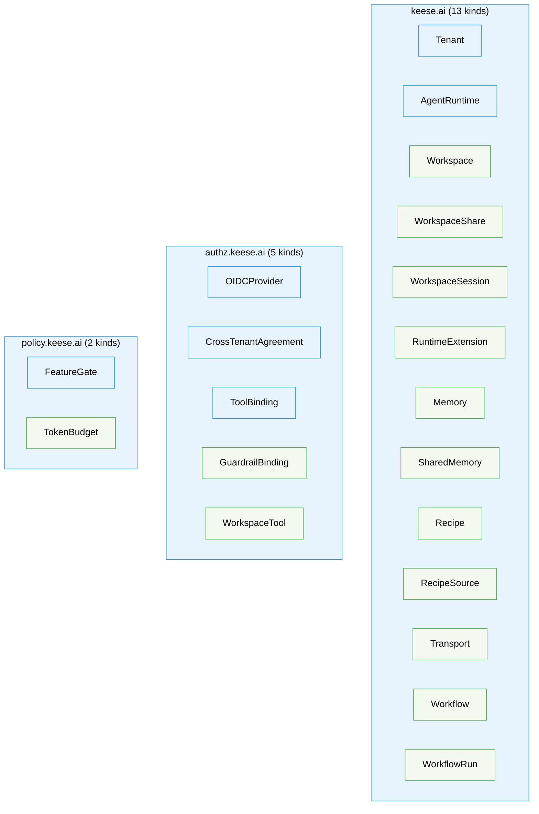
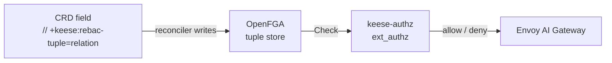

<!-- SPDX-License-Identifier: Apache-2.0 -->
<!-- Copyright (c) 2026 keese-ai -->

# API reference overview

keese exposes 20 custom resource kinds across three API groups, all at `v1alpha1`, managed by a single operator binary.

!!! info "Audience"
    Platform engineers and tenant admins who need to understand which CRDs exist, how they are
    grouped, and what conventions apply to every kind.
    **Prerequisites:** none — this page is a map; follow the per-group links for field-level
    reference.

---

## The three API groups

keese uses three top-level API groups that mirror the structure of upstream Kubernetes:

| Group | Analogue | Concern |
|---|---|---|
| `keese.ai` | `core/v1` + `apps/v1` | Core workload primitives: workspaces, runtimes, memory, recipes, transport, workflows, tenancy |
| `authz.keese.ai` | `rbac.authorization.k8s.io/v1` | Access control: OIDC trust, guardrails, tool routing, cross-tenant agreements |
| `policy.keese.ai` | `policy/v1` | Quantitative constraints: token budgets, feature gates |

A new top-level group requires an ADR rewriting
[`docs/designs/20a-api-group-layout.md`](https://github.com/keese-ai/keese/blob/main/docs/designs/20a-api-group-layout.md).



**Legend:** blue = cluster-scoped, green = namespace-scoped.

---

## All 20 kinds at a glance

The table below is the canonical index. Follow the group column links for field-level
reference.

| Kind | Group | Version | Scope | Short name | Status |
|---|---|---|---|---|---|
| `Tenant` | [keese.ai](keese.md) | v1alpha1 | Cluster | `tenant` | Implemented |
| `AgentRuntime` | [keese.ai](keese.md) | v1alpha1 | Cluster | — | Implemented |
| `Workspace` | [keese.ai](keese.md) | v1alpha1 | Namespaced | `ws` | Implemented |
| `WorkspaceShare` | [keese.ai](keese.md) | v1alpha1 | Namespaced | `wss` | Implemented |
| `WorkspaceSession` | [keese.ai](keese.md) | v1alpha1 | Namespaced | `wsess` | Implemented |
| `RuntimeExtension` | [keese.ai](keese.md) | v1alpha1 | Namespaced | — | Implemented |
| `Memory` | [keese.ai](keese.md) | v1alpha1 | Namespaced | `mem` | Implemented |
| `SharedMemory` | [keese.ai](keese.md) | v1alpha1 | Namespaced | `smem` | Implemented |
| `Recipe` | [keese.ai](keese.md) | v1alpha1 | Namespaced | — | Implemented |
| `RecipeSource` | [keese.ai](keese.md) | v1alpha1 | Namespaced | — | Implemented |
| `Transport` | [keese.ai](keese.md) | v1alpha1 | Namespaced | — | Implemented |
| `Workflow` | [keese.ai](keese.md) | v1alpha1 | Namespaced | `wf` | Implemented |
| `WorkflowRun` | [keese.ai](keese.md) | v1alpha1 | Namespaced | `wfr` | Implemented |
| `OIDCProvider` | [authz.keese.ai](authz.md) | v1alpha1 | Cluster | `oidcp` | Implemented |
| `CrossTenantAgreement` | [authz.keese.ai](authz.md) | v1alpha1 | Cluster | `cra` | Implemented |
| `ToolBinding` | [authz.keese.ai](authz.md) | v1alpha1 | Cluster | `tb` | Alpha (no reconciler — consumed by keese-authz trie) |
| `GuardrailBinding` | [authz.keese.ai](authz.md) | v1alpha1 | Namespaced | — | Implemented |
| `WorkspaceTool` | [authz.keese.ai](authz.md) | v1alpha1 | Namespaced | `wt` | Alpha (no reconciler — consumed by keese-authz trie) |
| `FeatureGate` | [policy.keese.ai](policy.md) | v1alpha1 | Cluster | `fg` | Implemented |
| `TokenBudget` | [policy.keese.ai](policy.md) | v1alpha1 | Namespaced | `tb` | Implemented |

!!! warning "Short-name collision"
    Both `ToolBinding` (authz.keese.ai) and `TokenBudget` (policy.keese.ai) register `tb` as
    their short name. `kubectl get tb` will return results from whichever group kubectl resolves
    first. Prefer the fully-qualified form: `kubectl get toolbindings` or `kubectl get tokenbudgets`.

!!! note "ToolBinding and WorkspaceTool have no standalone controller"
    `ToolBinding` and `WorkspaceTool` are CRD types with a status subresource, but no dedicated
    reconciler runs against them. The `keese-authz` ext_authz process watches both kinds directly
    via an informer and compiles them into an in-memory routing trie. `status.observedGeneration`
    and `status.matchedRequests` are defined fields but are not currently populated by the trie
    process — this is an open TD item. Prefer watching trie refresh logs for diagnostics rather
    than polling these status fields. See the
    [authz.keese.ai reference](authz.md#toolbinding) for details.

---

## CRD conventions

Every kind in keese follows a uniform set of conventions. Deviations require an ADR.

### Versioning policy

All kinds land at `v1alpha1`. Promotion to `v1beta1` is gated on four criteria (source:
[`docs/designs/20a-api-group-layout.md`](https://github.com/keese-ai/keese/blob/main/docs/designs/20a-api-group-layout.md)):

1. Owning spec scores ≥ 90/100 on its third rubric pass.
2. ≥ 90 calendar days of external production soak at `v1alpha1`.
3. An architect-signed migration plan (`docs/plans/migration-<group>.md`) scored ≥ 90.
4. A hub-spoke conversion webhook with envtest round-trip coverage.

No conversion webhooks exist at `v1alpha1` (rule 04.13). The only admission webhooks in
this release are mutating (defaulting) and validating (cross-resource checks where CEL is
insufficient).

### Status subresource

Every kind carries `// +kubebuilder:subresource:status`. Status is never read back into the
same controller's spec reconcile path — the spec/status coupling rule (04.4) is enforced by
code review.

### `observedGeneration`

Every `*Status` struct includes `ObservedGeneration int64`. The controller sets this to
`metadata.generation` on every successful reconcile. Consumers can compare
`metadata.generation` vs `status.observedGeneration` to determine whether a change has been
picked up.

### Printer columns

Every kind ships at minimum `Age`, `Ready` (from conditions), and `Phase`, plus at least one
domain-specific column. Example — `Workspace`:

```bash
kubectl get workspaces -n my-tenant
# NAME        PHASE     READY   RUNTIME        INTERACTIVE   AGE
# ws-alpha    Running   True    goose-runtime  false         5m
```

### Finalizers

Any kind whose controller allocates external resources (OpenFGA tuples, PVCs, NATS streams,
ServiceAccounts, NetworkPolicies) carries a finalizer. The naming format is:

```
finalizers.<kind-lowercase>.keese.ai/<purpose>
```

Examples observed in the codebase:

| Kind | Finalizer |
|---|---|
| `Tenant` | `finalizers.tenant.keese.ai/workspaces`, `.../namespaces`, `.../agreements` |
| `WorkspaceSession` | `finalizers.workspacesession.keese.ai/cleanup` |
| `OIDCProvider` | `finalizers.oidcprovider.keese.ai/cache-flush` |
| `CrossTenantAgreement` | `finalizers.crosstenanagreement.keese.ai/nats` |

### Server-Side Apply and field ownership

All controller writes use Server-Side Apply (`client.Apply`) with the field owner string
`keese-<kind-lowercase>-controller`. For example, the workspace controller owns fields under
`keese-workspace-controller`. This prevents controller conflicts and enables safe
multi-manager setups.

### ReBAC tuple markers

Every CRD field that affects authorization carries a `// +keese:rebac-tuple=<relation>`
marker naming the OpenFGA tuple the reconciler writes. Absence of this marker on an
authz-affecting field blocks merge. The full tuple shape catalog lives in
[`docs/specs/egress-authz-protocol.md`](https://github.com/keese-ai/keese/blob/main/docs/specs/egress-authz-protocol.md).



---

## Cluster-scoped vs namespace-scoped

The scope of a kind determines where its RBAC and multi-tenancy boundaries live.

**Cluster-scoped kinds** (`Tenant`, `AgentRuntime`, `OIDCProvider`, `CrossTenantAgreement`,
`ToolBinding`, `FeatureGate`) represent platform-wide configuration. Only platform admins
should hold write access. They do not belong to a Capsule tenant namespace.

**Namespace-scoped kinds** live inside a tenant namespace managed by Capsule. A tenant admin
with the appropriate ClusterRole aggregate can create and modify them within their own
namespaces. Controllers enforce cross-namespace references via OpenFGA rather than
Kubernetes namespace isolation alone.

---

## Discriminated one-of fields

Several specs use a discriminated one-of pattern rather than flat enums, enforced by CEL
`XValidation` rules. This keeps the schema extensible without breaking existing consumers:

| Kind | Field | Discriminant |
|---|---|---|
| `AgentRuntime` | `spec.implementation` | `goose`, `claudeCode`, `aider`, `adkPython`, `adkGo` |
| `Memory` / `SharedMemory` | `spec.provider` | `sqlite`, `redis`, `qdrant`, `pgvector`, `neo4j`, `mem0`, `zep` |
| `Transport` | `spec.type` + sub-struct | `nats`, `a2a`, `mcp`, `stdio` |
| `Workflow` | `spec.triggers[].type` | `Cron`, `KnativeTrigger`, `NATSSubscription`, `HTTPWebhook` |
| `RecipeSource` | `spec` | `oci`, `git`, `configMap` |
| `TokenBudget` | `spec.scope` | `tenant`, `workspace` |

The CEL rule pattern is:

```go
// +kubebuilder:validation:XValidation:rule="(has(self.a) ? 1 : 0) + (has(self.b) ? 1 : 0) == 1",
//   message="exactly one of a or b must be set"
```

---

## Common status phases

There is no shared phase package. Each kind declares its own `<Kind>Phase` string enum in
its `_types.go` (with a `+kubebuilder:validation:Enum` marker). These values recur across
most kinds:

| Phase | Meaning |
|---|---|
| `Pending` | CR received; reconciler has not yet acted |
| `Provisioning` | Reconciler is actively creating resources |
| `Ready` | All resources healthy; controller is idle |
| `Degraded` | At least one resource is unhealthy; controller is retrying |
| `Terminating` | Finalizer cleanup in progress |

The exact set varies per kind — e.g. `Workspace` (`WorkspacePhase`) uses `Running`/`Idle`/
`Evicted` instead of `Ready`; `WorkspaceSession` adds `Attaching`/`Active`/`Draining`/
`Completed`. Always check the kind's own `_types.go` enum.

---

## Validating Admission Policies

keese prefers `ValidatingAdmissionPolicy` (CEL, GA in Kubernetes 1.30) for static invariants.
Admission webhooks are used only where CEL is insufficient — cross-resource lookups and
dynamic OpenFGA checks.

Five VAPs ship in `config/vap/`: `break-glass-annotation`, `embedding-dim-immutable`,
`adk-runtime-image-digest-pinned`, `regional-sensitive`, `sqlite-single-consumer`.
See [Reference: Admission policies](../admission-policies.md) for the full list.

The following additional invariants are enforced by **CRD-level `XValidation` CEL rules**
(not standalone VAPs):

| Kind | CRD XValidation rule |
|---|---|
| `OIDCProvider` | `audienceTemplates` must contain an entry named `"egress"` |
| `WorkspaceSession` | `workspaceRef`, `attachSubject`, `sessionName`, `mode` are immutable |
| `TokenBudget` | `spec.limits` must not be empty |
| `CrossTenantAgreement` | `from.tenantRef.name != to.tenantRef.name`; `expiresAt` immutable |
| `FeatureGate` | `override` forbidden on `ga` and `deprecated` stage gates |

---

## See also

- [API: keese.ai group](keese.md) — field-level reference for the 13 core kinds
- [API: authz.keese.ai group](authz.md) — field-level reference for access control kinds
- [API: policy.keese.ai group](policy.md) — TokenBudget and FeatureGate reference
- [Concepts: Architecture overview](../../concepts/architecture.md) — how the groups fit into the overall system
