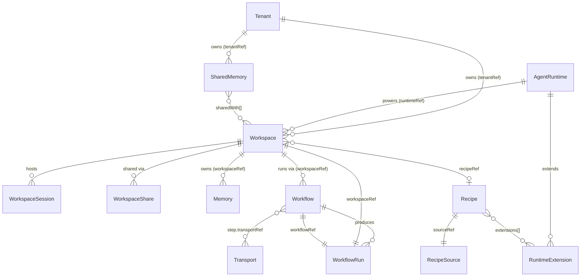
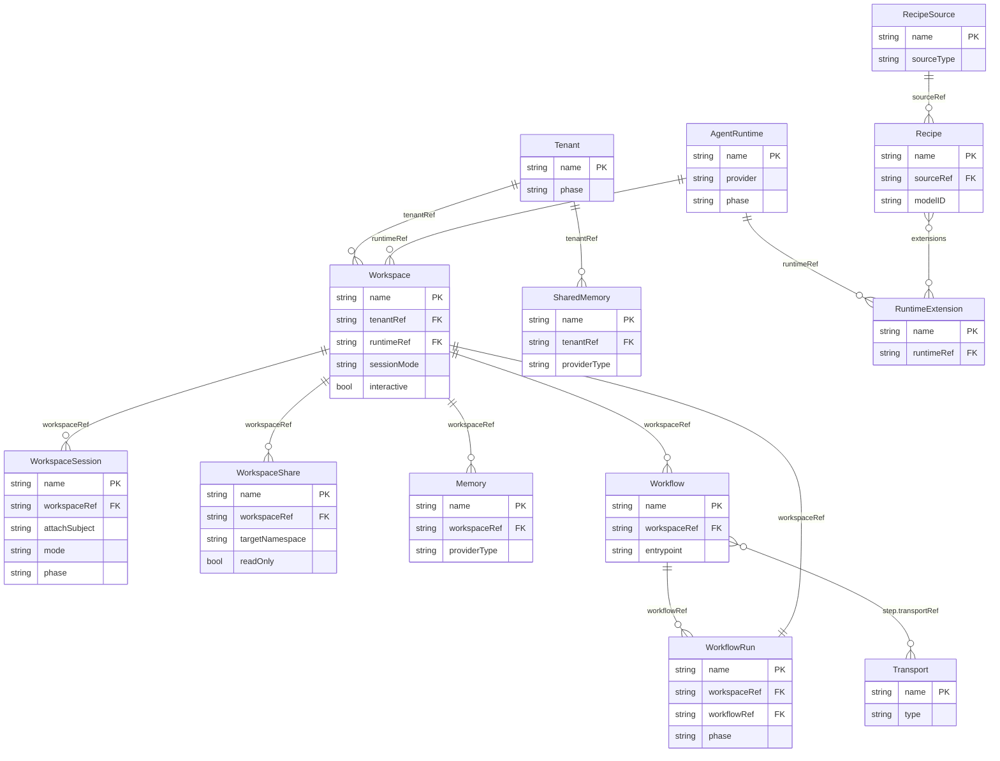

<!-- SPDX-License-Identifier: Apache-2.0 -->
<!-- Copyright (c) 2026 keese-ai -->

# API: keese.ai group

Field-level reference for every `keese.ai/v1alpha1` kind: Workspace, WorkspaceSession, WorkspaceShare, Tenant, AgentRuntime, RuntimeExtension, Memory, SharedMemory, Recipe, RecipeSource, Transport, Workflow, WorkflowRun.

!!! info "Audience"
    Agent developers and platform engineers who are writing or reviewing `keese.ai/v1alpha1` manifests. **Prerequisites:** [Concepts overview](../../concepts/index.md) · [Workspaces & sessions](../../concepts/workspaces.md) · [Agent runtimes](../../concepts/agent-runtimes.md)

---

## Overview

All kinds in this group live under `apiVersion: keese.ai/v1alpha1`. They span three scopes (cluster, namespaced) and are served by the keese operator. Every kind carries:

- `.status.observedGeneration` — mirrors `.metadata.generation` on each successful reconcile.
- `.status.conditions[]` — standard `metav1.Condition` list with `type`, `status`, `reason`, `message`.
- A `status` subresource (all writes go through `/status`).
- Server-Side Apply with `fieldOwner: keese-<kind>-controller`.

The diagram below shows how the kinds reference each other.



---

## Tenant

**Scope:** Cluster · **Short name:** `tenant` · **Category:** `keese`

Tenant is the root identity object. Its name is the OpenFGA identity key for all ReBAC checks in the tenant. It aggregates namespaces via Capsule (Mode B) or a label selector (Mode A) and carries defaults that cascade to all member Workspaces.

**Finalizers**

| Finalizer | Blocks deletion until |
|---|---|
| `finalizers.tenant.keese.ai/workspaces` | All Workspaces in tenant are gone |
| `finalizers.tenant.keese.ai/namespaces` | No namespace carries the tenant label |
| `finalizers.tenant.keese.ai/agreements` | All CrossTenantAgreements referencing this tenant are drained |

**Spec fields**

| Field | Type | Required | Default | Notes |
|---|---|---|---|---|
| `capsuleTenantRef.name` | `string` | — | — | Delegates namespace aggregation to Capsule (Mode B). Immutable while namespaces are live. |
| `namespaceSelector` | `LabelSelector` | — | — | Mode A namespace aggregation. Ignored when `capsuleTenantRef` is set. |
| `adminSubjects[]` | `[]TenantSubject` | Yes | — | At least 1 required. Each has `kind` (User/Group/ServiceAccount) and `name`. ReBAC: `tenant:T#admin@user:U`. |
| `defaultGuardrailBindings[]` | `[]string` | — | — | GuardrailBinding names inherited by all Workspaces in this tenant. |
| `tokenBudgetRef` | `CrossNamespaceObjectRef` | — | — | Aggregate TokenBudget governing tenant-wide spend. |
| `credentialPoolRef` | `CrossNamespaceObjectRef` | — | — | Credential pool for this tenant. |
| `defaultWorkspaceQuota` | `ResourceList` | — | — | Default quota applied to each workspace namespace. |
| `dedicatedGateway` | `bool` | — | `false` | Provision a per-tenant Envoy AI Gateway. Cannot be toggled while namespaces exist. |
| `oidc.allowedProviders[]` | `[]string` | — | — | OIDCProvider names accepted for this tenant. Empty = all providers allowed. ReBAC: `tenant.uses_oidc_provider`. |
| `security.allowUnsafeTransports` | `bool` | — | `false` | Break-glass; requires namespace label `keese.ai/break-glass=true`. |
| `defaultCallRetryBudget` | `CallRetryBudget` | — | — | Per-call retry limits cascaded to Workspaces. |
| `artifactStoreRef` | `CrossNamespaceObjectRef` | — | — | Artifact store for Workflows; WorkflowRun falls back here. |
| `jwksCacheFailOpenSeconds` | `int32` | — | 0 (controller default) | Range `[30,600]`. 0 lets the controller apply its default (300 shared / 60 dedicated). |
| `auditArgumentsRedacted` | `bool` | — | `false` | Redact agent call arguments in audit logs. |

**Status fields**

| Field | Type | Notes |
|---|---|---|
| `phase` | `string` | Pending / Provisioning / Active / Suspended / Terminating |
| `conditions[]` | `[]Condition` | Standard conditions including `Ready`. |
| `namespaces[]` | `[]string` | Observed namespace list (Mode A: label-derived; Mode B: Capsule-mirrored). |
| `capsuleTenantResolved` | `bool` | Mode B only: Capsule Tenant found and tracked. |
| `lastReconcileTime` | `Time` | Timestamp of last successful reconcile. |

**Printer columns:** `Age` · `Ready` · `Phase` · `Namespaces`

---

## Workspace

**Scope:** Namespaced · **Short name:** `ws`

A Workspace provisions an isolated agent environment: ServiceAccount, NetworkPolicy (default-deny), optional session PVC, and OpenFGA tuples. One agent runtime pod serves the workspace when `sessionMode=Always`; pods are started on-demand otherwise.

**Spec fields**

| Field | Type | Required | Default | Notes |
|---|---|---|---|---|
| `runtimeRef.name` | `string` | Yes | — | Name of a cluster-scoped `AgentRuntime`. |
| `recipeRef.name` | `string` | — | — | Optional Recipe to execute in this workspace. |
| `tenantRef` | `ObjectReference` | Yes | — | Owning Tenant. ReBAC: `workspace.owner`. |
| `guardrailBindingRefs[]` | `[]LocalObjectReference` | — | — | GuardrailBindings to enforce. ReBAC: `workspace.guardrail_bound`. |
| `memoryRefs[]` | `[]LocalObjectReference` | — | — | Memory objects accessible within this workspace. |
| `transportRefs[]` | `[]LocalObjectReference` | — | — | Transport objects accessible within this workspace. |
| `interactive` | `bool` | — | `false` | Whether this workspace supports human-in-the-loop sessions. **Immutable after creation.** |
| `sessionMode` | `string` | — | `OnDemand` | `Always` or `OnDemand`. Controls when the agent pod is active. |
| `attachPolicy` | `string` | — | `Reuse` | `New` or `Reuse`. Controls how sessions attach to running pods. |
| `attachGrace` | `Duration` | — | `30s` | Idle-before-eviction grace period. |
| `concurrencyPolicy` | `string` | — | `Allow` | `Allow`, `Forbid`, or `Replace` for concurrent WorkflowRuns. |
| `editors[]` | `[]string` | — | — | User identifiers granted editor access. ReBAC: `workspace.editor`. |
| `viewers[]` | `[]string` | — | — | User identifiers granted viewer access. ReBAC: `workspace.viewer`. |
| `sessionStorage` | `Quantity` | — | — | PVC size for SQLite session state. |
| `egress.allowedTools[]` | `[]string` | — | — | OpenFGA tool-name allowlist. Controller writes `tool.allowed_in` tuples. |

**Status fields**

| Field | Type | Notes |
|---|---|---|
| `phase` | `string` | Pending / Provisioning / Running / Idle / Evicted / Terminating |
| `conditions[]` | `[]Condition` | `Ready`, `Progressing`, `NetworkIsolated`, `SessionStorageReady` |
| `serviceAccountName` | `string` | Name of the created ServiceAccount. |
| `networkPolicyName` | `string` | Name of the default-deny NetworkPolicy. |
| `podRef.name` | `string` | Backing agent pod (when Running). |
| `rebacTupleCount` | `int32` | Count of OpenFGA tuples owned by this workspace. |

**Printer columns:** `Phase` · `Ready` · `Runtime` · `Interactive` · `Age`

**Minimal example (required fields only)**

```yaml
apiVersion: keese.ai/v1alpha1
kind: Workspace
metadata:
  name: my-workspace
  namespace: team-alpha
spec:
  runtimeRef:
    name: goose-default
  tenantRef:
    name: team-alpha
  sessionMode: OnDemand
  interactive: false
```

**Fully-populated example**

```yaml
apiVersion: keese.ai/v1alpha1
kind: Workspace
metadata:
  name: my-workspace
  namespace: team-alpha
spec:
  runtimeRef:
    name: goose-default
  tenantRef:
    name: team-alpha
  sessionMode: Always
  interactive: true
  attachPolicy: Reuse
  attachGrace: 60s
  concurrencyPolicy: Forbid
  sessionStorage: 5Gi
  recipeRef:
    name: my-recipe
  guardrailBindingRefs:
    - name: default-guardrails
  editors:
    - user:alice@example.com
  viewers:
    - user:bob@example.com
  egress:
    allowedTools:
      - bash
      - web_search
```

---

## WorkspaceSession

**Scope:** Namespaced · **Short name:** `wsess` · **Category:** `keese`

A WorkspaceSession represents one agent-to-client connection. Name pattern: `<workspace>-<subject-hash-16>-<session-name>`. The parent Workspace must have `spec.interactive: true` (controller-side guard; `SessionAttachRejectedNonInteractive` event on violation). Fields `workspaceRef`, `attachSubject`, `sessionName`, and `mode` are immutable after creation (CRD `XValidation`).

**Finalizer:** `finalizers.workspacesession.keese.ai/cleanup` — drains the agent (90 s timeout), deletes the Pod, removes OpenFGA tuples.

**Spec fields**

| Field | Type | Required | Default | Immutable | Notes |
|---|---|---|---|---|---|
| `workspaceRef` | `string` | Yes | — | Yes | Parent Workspace name in the same namespace. |
| `attachSubject` | `string` | Yes | — | Yes | OpenFGA subject (e.g. `user:alice@example.com`). ReBAC: `session.attached_by`. |
| `sessionName` | `string` | Yes | `default` | Yes | User-visible session identifier. |
| `mode` | `string` | Yes | — | Yes | `shared`, `per-user`, or `per-attach`. |
| `attachGraceSeconds` | `int32` | — | (from Workspace) | No | Range `[0, 86400]`. |
| `preserveOnPodFailure` | `bool` | — | `false` | No | Keep CR in Failed state on pod crash; requires manual delete. |

**Status fields**

| Field | Type | Notes |
|---|---|---|
| `phase` | `string` | Pending / Attaching / Active / Draining / Completed / Evicted / Terminating |
| `conditions[]` | `[]Condition` | `Ready` and attach state. |
| `podRef` | `PodRef` | Backing Pod name and UID. |
| `attachedAt` | `Time` | UTC timestamp of first ACP client connection. |
| `lastActivityAt` | `Time` | UTC timestamp of most recent ACP frame exchange. |
| `attachedClientCount` | `int32` | Active ACP client count (>1 valid in `shared`/`per-user` mode). |
| `tokenBudgetRef.name` | `string` | Per-session TokenBudget (populated in split sessionMode). |

**Printer columns:** `Age` · `Ready` · `Phase` · `Subject` · `Session`

!!! note "Completed vs Evicted"
    `Completed` means a non-interactive recipe-driven session whose pod exited with `PodSucceeded`. Treat it as success. `Evicted` means the idle timeout or a forced eviction terminated the session.

---

## WorkspaceShare

**Scope:** Namespaced · **Short name:** `wss`

A WorkspaceShare grants cross-namespace read (or write) access to a Workspace by projecting a Gateway API `ReferenceGrant` and writing `workspace.cross_ns_viewer` / `workspace.shared_with` OpenFGA tuples.

**Spec fields**

| Field | Type | Required | Default | Notes |
|---|---|---|---|---|
| `workspaceRef.name` | `string` | Yes | — | Workspace to share; must be in the same namespace. ReBAC: `workspace.shared_with`. |
| `targetNamespace` | `string` | Yes | — | Namespace that receives access. |
| `grantees[]` | `[]string` | — | — | User/SA identifiers granted access. Max 64. ReBAC: `workspace.cross_ns_viewer`. |
| `readOnly` | `bool` | — | `true` | `true` = viewer access; `false` = editor access. |

**Status fields**

| Field | Notes |
|---|---|
| `conditions[]` | `Ready`, `Progressing` |
| `referenceGrantName` | Name of the projected Gateway API `ReferenceGrant`. |
| `rebacTupleCount` | Count of OpenFGA tuples owned by this share. |

**Printer columns:** `Workspace` · `TargetNamespace` · `Ready` · `ReadOnly` · `Age`

---

## AgentRuntime

**Scope:** Cluster

AgentRuntime is a cluster-scoped registration of a runtime provider. It describes which container image and provider variant backs one or more Workspaces. Exactly one `implementation` variant must be set (CEL-enforced).

**Spec: `implementation` (discriminated one-of)**

| Variant | Notes |
|---|---|
| `goose` | Goose headless runtime. Fields: `image` (required), `imageTag`, `migrationPolicy`, `sidecars.acpBridge.image`. |
| `claudeCode` | Claude Code runtime. Stub at v1alpha1; no sub-fields. |
| `aider` | Aider runtime. Stub at v1alpha1; no sub-fields. |
| `adkPython` | Google ADK Python runtime. See note below. |
| `adkGo` | Google ADK Go runtime. See note below. |

!!! warning "Planned — adkPython and adkGo are not yet reconciled"
    The `ADKPythonSpec` and `ADKGoSpec` sub-specs are defined in the API (image, pythonVersion/goVersion, adkVersion, sessionStoreRef, compactionInterval) and provider packages exist as E0 stubs at `internal/runtime/providers/adkpython/` and `internal/runtime/providers/adkgo/` (all SPI methods return `ErrUnsupported`). However, the controller's `detectProvider` switch does not yet handle these variants — any AgentRuntime selecting `adkPython` or `adkGo` enters `Degraded` phase immediately (tracked bug). Reconciler support is deferred to E1/E3.

**Goose `migrationPolicy`**

| Field | Notes |
|---|---|
| `severity` | `critical`, `high`, `medium`, `low` |
| `maxDeferral` | Duration. `critical` is hard-capped at `1h` by the controller. |

**Status fields**

| Field | Notes |
|---|---|
| `phase` | Pending / Ready / Degraded / Incompatible |
| `provider` | Detected provider name (e.g. `goose`). |
| `conditions[]` | Standard conditions including `Ready`. |

**Printer columns:** `Phase` · `Provider` · `Ready` · `Age`

---

## RuntimeExtension

**Scope:** Namespaced

A RuntimeExtension bundles a named set of tools for a given AgentRuntime and manages `extension.enabled_in` OpenFGA tuples for every Workspace that admits the extension.

**Spec fields**

| Field | Type | Required | Notes |
|---|---|---|---|
| `runtimeRef.name` | `string` | Yes | Name of the target `AgentRuntime`. ReBAC: `extension.enabled_in`. |
| `tools[]` | `[]ExtensionToolRef` | — | Tool names exposed by this extension. Each must be permitted by the effective GuardrailBinding policy. |
| `description` | `string` | — | Human-readable summary. |

**Status fields**

| Field | Notes |
|---|---|
| `phase` | Pending / Ready / Degraded |
| `boundWorkspaces` | Count of active `enabled_in` tuples (one per admitted Workspace). |
| `conditions[]` | Standard conditions including `Ready`. |

**Printer columns:** `Phase` · `Runtime` · `Ready` · `Age`

---

## Memory

**Scope:** Namespaced · **Short name:** `mem`

Memory provisions a per-workspace memory backend. `spec.embeddingDim` is immutable after creation (VAP: `EmbeddingDimImmutable`). Credentials for external backends are mounted as projected files, never as environment variables (security rule 05.7).

**Spec fields**

| Field | Type | Required | Default | Notes |
|---|---|---|---|---|
| `workspaceRef` | `string` | Yes | — | Owning Workspace name. ReBAC: `memory.owner`. |
| `provider.type` | `string` | Yes | — | Discriminator: `sqlite`, `redis`, `qdrant`, `pgvector`, `neo4j`, `mem0`, `zep`. |
| `embeddingDim` | `int32` | — | — | Range `[1, 65536]`. Immutable after creation. |

**Provider sub-specs**

| Provider | Key fields |
|---|---|
| `sqlite` | `storageSize` (default `1Gi`), `storageClassName`, `reclaimPolicy` (`Retain`\|`Delete`, default `Retain`) |
| `redis` | `address` (required), `replicas` (default 1; ≥2 required outside dev — controller emits `HAViolation` + `Degraded`), `credentialSecretRef` |
| `qdrant` | `collectionName` (required), `endpoint` (required), `replicas` (default 1; ≥2 required outside dev), `credentialSecretRef` |
| `pgvector` | `dsnSecretRef` (required), `tableName` (default `keese_memory`) |
| `neo4j` | `uri` (required), `credentialSecretRef` |
| `mem0` | `credentialSecretRef` (required), `apiEndpoint` |
| `zep` | `credentialSecretRef` (required), `apiEndpoint` |

!!! warning "Required fields: address / endpoint / uri / dsnSecretRef"
    For Redis, Qdrant, Neo4j, and pgvector, the connection-coordinate field (`address`,
    `endpoint`, `uri`, `dsnSecretRef`) is **required** by the CRD schema (`minLength: 1`).
    Omitting it or setting it to an empty string is rejected at admission. Always supply an
    external managed endpoint. The controller contains in-cluster StatefulSet code paths but
    they are not reachable via the current `v1alpha1` API.

**Status fields**

| Field | Notes |
|---|---|
| `phase` | Pending / Provisioning / Ready / Degraded / Terminating |
| `conditions[]` | Standard conditions. |
| `backendProvisioned` | `true` when the backend resource is confirmed present. |
| `rebacTupleCount` | Count of OpenFGA tuples owned by this Memory. |

**Printer columns:** `Age` · `Ready` · `Phase` · `Provider`

**Minimal example (SQLite provider)**

```yaml
apiVersion: keese.ai/v1alpha1
kind: Memory
metadata:
  name: my-memory
  namespace: team-alpha
spec:
  workspaceRef: my-workspace
  provider:
    type: sqlite
    sqlite:
      storageSize: 1Gi
```

**Fully-populated example (Qdrant provider)**

```yaml
apiVersion: keese.ai/v1alpha1
kind: Memory
metadata:
  name: my-vector-memory
  namespace: team-alpha
spec:
  workspaceRef: my-workspace
  embeddingDim: 1536
  provider:
    type: qdrant
    qdrant:
      collectionName: agent-memory
      endpoint: https://qdrant.keese-system.svc.cluster.local:6334
      replicas: 2
      credentialSecretRef:
        name: qdrant-credentials
```

---

## SharedMemory

**Scope:** Namespaced · **Short name:** `smem`

SharedMemory is tenant-scoped memory shared across multiple Workspaces. The `sharedWith[]` list is mutable by tenant admins only (controller-side enforcement via OpenFGA ≤15 ms 1-hop `tenant#admin` check — no admission VAP). Uses the same `MemoryProvider` discriminator as `Memory`.

**Spec fields**

| Field | Type | Required | Notes |
|---|---|---|---|
| `tenantRef` | `string` | Yes | Owning Tenant name. ReBAC: `sharedmemory.tenant`. |
| `provider` | `MemoryProvider` | Yes | Same discriminated one-of as `Memory`. |
| `embeddingDim` | `int32` | — | Range `[1, 65536]`. Immutable after creation. |
| `sharedWith[]` | `[]WorkspaceRef` | — | Cross-namespace Workspace access grants. Each entry: `name`, `namespace`, `access` (`reader`\|`writer`, default `reader`). Controller writes `memory.reader` or `memory.writer` tuples. |

**Status fields:** identical to `Memory` (`phase`, `conditions`, `backendProvisioned`, `rebacTupleCount`).

**Printer columns:** `Age` · `Ready` · `Phase` · `Provider`

---

## Recipe

**Scope:** Namespaced

A Recipe declares the instructions, model, tools, and parameters for an agent task. The controller pulls and cosign-verifies the OCI/Git/ConfigMap artifact referenced by `sourceRef`, then caches it. `spec.tools[]` is checked at admission against the effective GuardrailBinding policy.

**Spec fields**

| Field | Type | Required | Notes |
|---|---|---|---|
| `instructions` | `string` | Yes | OCI layer path to the `instructions.md` within the artifact. |
| `model.provider` | `string` | Yes | Model provider name, e.g. `anthropic`. |
| `model.modelID` | `string` | Yes | Provider-specific model identifier. |
| `sourceRef.name` | `string` | Yes | RecipeSource name in the same namespace. |
| `sourceRef.namespace` | `string` | — | RecipeSource namespace; defaults to the Recipe's namespace. |
| `tools[]` | `[]RecipeTool` | — | Tool allowlist. ReBAC: `recipe:R#readable_by@workspace:W`. |
| `extensions[]` | `[]RecipeExtension` | — | RuntimeExtensions required by this recipe. Each is admitted via OpenFGA `extension:E#enabled_in@workspace:W`. ReBAC: `recipe:R#uses_extension@extension:E`. |
| `parameters[]` | `[]RecipeParameter` | — | Typed parameters (`string`, `int`, `bool`) injected as env vars. Each has `name`, `type`, `required`, `default`. |
| `preFlight` | `RecipeHook` | — | Pre-execution hook. Exactly one of `cel` or `shellRef` must be set. |
| `postFlight` | `RecipeHook` | — | Post-execution hook. Same constraint as `preFlight`. |

**Status fields**

| Field | Notes |
|---|---|
| `phase` | Pending / Pulling / Verified / Ready / Failed / Terminating |
| `conditions[]` | `Ready`, `Verified`, `Progressing` |
| `resolvedDigest` | OCI digest of the cached artifact, populated after cosign verification. |
| `rebacTupleCount` | OpenFGA tuples last synced. |

**Printer columns:** `Age` · `Ready` · `Phase` · `Model` · `Source`

---

## RecipeSource

**Scope:** Namespaced

RecipeSource supplies the artifact for one or more Recipes. Exactly one source variant must be set (CEL `XValidation`-enforced). OCI is preferred in production; `configMap` is rejected outside `keese.ai/env=dev` namespaces by a CRD CEL `XValidation` rule (not a separate VAP).

**Spec (discriminated one-of)**

| Variant | Key fields |
|---|---|
| `oci` | `registry`, `repository` (both required); `tag` (dev only); `digest` (required outside dev); `secretRef` (pull credentials) |
| `git` | `url` (required); `revision` (required, 40-char SHA pattern); `secretRef` |
| `configMap` | `name`, `namespace` (both required). Dev namespaces only. |

**Status fields**

| Field | Notes |
|---|---|
| `phase` | Pending / Synced / Failed |
| `sourceType` | Detected variant: `OCI`, `Git`, or `ConfigMap`. |
| `resolvedDigest` | Content-addressable digest after cosign verification. |
| `lastVerifiedTime` | Timestamp of most recent successful cosign verification. |
| `cached` | `true` when the artifact is written to the cluster-internal cache. |
| `conditions[]` | `Ready`, `Progressing` |

**Printer columns:** `Age` · `Ready` · `Type`

---

## Transport

**Scope:** Namespaced

A Transport configures one egress channel for agent-to-tool or agent-to-agent communication. `spec.type` is immutable after creation (CRD `XValidation` CEL rule). Exactly one sub-struct matching `spec.type` must be set.

**Spec (discriminated one-of)**

| `spec.type` | Config struct | Key fields |
|---|---|---|
| `nats` | `NATSConfig` | `clusterRef` (required), `streamName` (max 64), `consumerName` (max 64), `ackPolicy` (default `explicit`), `maxDeliver` (default 3, range 1–100), `ackWait`, `tls.certificateRef`, `streamConfig` (opt-in ownership mode via annotation `keese.ai/auto-create-stream=true`) |
| `a2a` | `A2AConfig` | `endpoint` (grpc:// or grpcs://), `peerAuth` (`workspace-sa`\|`mutual-tls`, default `workspace-sa`), `scope` (`intra-tenant`\|`cross-tenant`, default `intra-tenant`), `workspaceSA.audience`, `workspaceSA.authzTupleCheck`, `mutualTLS.certificateRef` |
| `mcp` | `MCPConfig` | `mcpRouteRef` (required), `protocolVersion` (default `2024-11-05`), `toolTimeout` (range 1s–300s, default `30s`) |
| `stdio` | `StdioConfig` | `bridgeImage` (required), `inboundQueueDepth` (10–10000, default 100), `outboundQueueDepth` (100–100000, default 1000), `reconnectBufferBytes` (1 MiB–64 MiB, default 4 MiB), `reconnectRetries` (1–10, default 3), `reconnectBackoff` |

**Status fields**

| Field | Notes |
|---|---|
| `phase` | Pending / Provisioning / Ready / Degraded / Terminating |
| `conditions[]` | Standard conditions. |
| `rebacTupleCount` | OpenFGA tuples last written. |

**Printer columns:** `Age` · `Ready` · `Phase` · `Type`

!!! warning "Transport reconciler — partial implementation"
    The Transport CRD is fully admitted and status is maintained. At alpha, the reconciler reconciles spec but does **not** automatically provision NATS streams (unless annotation `keese.ai/auto-create-stream=true` is set and a stream config is present) or A2A gRPC endpoints in Argo WorkflowRun contexts. Cross-tenant `a2a` scope requires an `Approved` `CrossTenantAgreement` in `authz.keese.ai`; absent one, the controller leaves the Transport in `Degraded`.

---

## Workflow

**Scope:** Namespaced · **Short name:** `wf`

A Workflow declares a multi-step agent pipeline: an entrypoint, step templates, triggers, and output sinks. The controller projects the spec into an Argo `WorkflowTemplate` and manages trigger resources (CronJob, Knative Trigger, NATS consumer, HTTPRoute). At least one `templates` entry is required (CEL-enforced).

**Spec fields**

| Field | Type | Required | Default | Notes |
|---|---|---|---|---|
| `workspaceRef.name` | `string` | Yes | — | Workspace whose session pod runs recipe steps when a trigger fires. |
| `entrypoint` | `string` | Yes | — | Name of the first template step to run. |
| `templates[]` | `[]WorkflowTemplateStep` | Yes | — | At least 1 entry. Each step: `name`, `image`, `command[]`, `args[]`, `transportRef`, `guardrailBindingRefs[]`, `retryLimit` (0–10, default 3). |
| `triggers[]` | `[]WorkflowTrigger` | — | — | Each trigger has `type` (`Cron`, `KnativeTrigger`, `NATSSubscription`, `HTTPWebhook`) plus one matching config struct. |
| `outputs[]` | `[]WorkflowOutput` | — | — | Each output has `name`, `type` (`KnativeSink`, `NATSPublish`, `S3`, `GitHubPR`) plus one matching config struct. |
| `defaultRetryBudget` | `RetryBudget` | — | — | `limit` (1–50, default 10), `backoffSeconds` (1–1000, default 10). |
| `artifactStoreRef.name` | `string` | — | — | Override for the tenant-level artifact store. |
| `concurrencyPolicy` | `string` | — | `Allow` | `Allow`, `Forbid`, or `Replace`. |

**Trigger config summary**

| Type | Key fields |
|---|---|
| `Cron` | `schedule` (cron expression), `timezone` (IANA), `suspend` |
| `KnativeTrigger` | `brokerRef`, `filter` (CloudEvent attribute map) |
| `NATSSubscription` | `streamName`, `subject`, `durable` |
| `HTTPWebhook` | `path` (must start with `/`), `secretRef` (HMAC key) |

**Status fields**

| Field | Notes |
|---|---|
| `phase` | Pending / Projecting / Ready / Degraded / Deleting |
| `conditions[]` | Standard conditions. |
| `workflowTemplateRef` | Name of the projected Argo `WorkflowTemplate`. |
| `runCount` | Total WorkflowRuns ever created against this Workflow. |
| `tupleCount` | OpenFGA tuples last written. |

**Printer columns:** `Age` · `Ready` · `Phase` · `RunCount`

!!! warning "Workflow reconciler — trigger projection at alpha"
    `Cron` trigger projection (CronJob) is implemented. `KnativeTrigger`, `NATSSubscription`, and `HTTPWebhook` trigger projections are defined in the API but the reconciler does not yet project those resource types. Outputs (`KnativeSink`, `NATSPublish`, `S3`, `GitHubPR`) are stored in the spec but output delivery is not yet implemented — the controller stores the output spec but no component executes it at this time (tracked open TD). Expect these gaps to close in the next alpha iteration.

---

## WorkflowRun

**Scope:** Namespaced · **Short name:** `wfr`

A WorkflowRun is a single execution of a Workflow. It projects an Argo `Workflow` object and mirrors Argo node statuses back into `.status.nodes[]`. `workspaceRef` and `workflowRef` are immutable once the run advances past `Pending` (admission webhook-enforced).

**Spec fields**

| Field | Type | Required | Default | Notes |
|---|---|---|---|---|
| `workspaceRef.name` | `string` | Yes | — | Owning Workspace. ReBAC: `workflowrun.workspace`. |
| `workflowRef.name` | `string` | Yes | — | Target Workflow. ReBAC: `workflowrun.workflow`. |
| `parameters[]` | `[]WorkflowRunParameter` | — | — | Name/value pairs forwarded to the Argo Workflow. |
| `artifacts[]` | `[]ArtifactInput` | — | — | Input artifacts: `name`, `path` (URL or object-store key). |
| `retryBudget` | `int32` | — | `10` | Range `[1, 50]`. |
| `timeout` | `Duration` | — | — | Maximum run duration (e.g. `1h30m`). Immutable past Pending. |
| `suspended` | `bool` | — | `false` | Pauses the run without cancelling it. |
| `supervisionContext` | `SupervisionContext` | — | — | Human-in-the-loop: `requireApproval`, `reviewerRef`, `maxWaitSeconds` (default 3600). |

**Status fields**

| Field | Notes |
|---|---|
| `phase` | Pending / Provisioning / Running / Succeeded / Failed / Error |
| `argoPhase` | Raw Argo Workflow phase string. |
| `argoWorkflowName` | Name of the projected Argo `Workflow` object. |
| `startedAt` / `finishedAt` | Run start and end times. |
| `nodes[]` | Argo node statuses: `id`, `phase`, `displayName`, `message`, `startedAt`, `finishedAt`. |
| `artifacts[]` | Output artifacts: `name`, `path`, `nodeID`. |
| `conditions[]` | Standard conditions. |
| `tupleCount` | OpenFGA tuples last written. |

**Printer columns:** `Age` · `Ready` · `Phase` · `ArgoPhase`

!!! warning "Known bug: NATS stream cleanup on deletion"
    NATS stream cleanup on WorkflowRun deletion is broken in this release (`workflowrun_controller.go:441-443`). The reconcileRunDelete path copies `wfr.UID` into `tenantUID`, causing the computed stream name at delete time to differ from the provisioned name. Streams provisioned for WorkflowRuns are never deleted on cleanup. Manual stream deletion may be required.

---

## ER diagram: reference relationships at a glance



---

## See also

- [Concepts: Workspaces & sessions](../../concepts/workspaces.md)
- [Concepts: Agent runtimes](../../concepts/agent-runtimes.md)
- [Concepts: Memory](../../concepts/memory.md)
- [API: authz.keese.ai group](authz.md)
- [API: policy.keese.ai group](policy.md)
- [Guide: Create a workspace & attach a session](../../guides/workspace-session.md)
- [Guide: Configure memory backends](../../guides/memory-backends.md)
