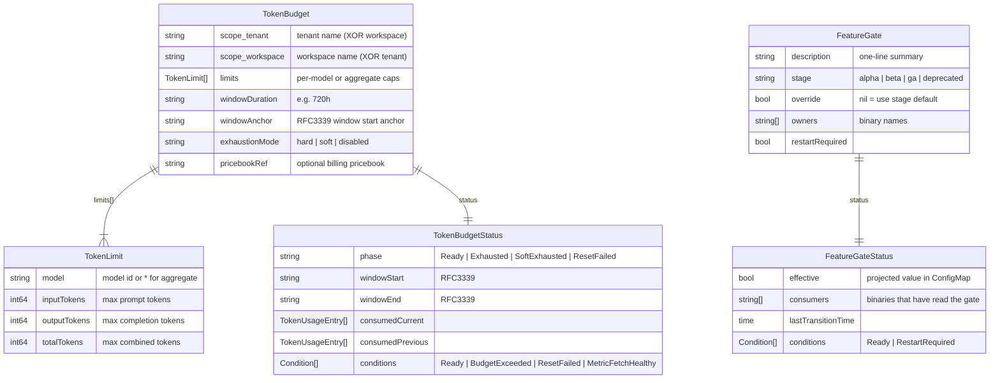
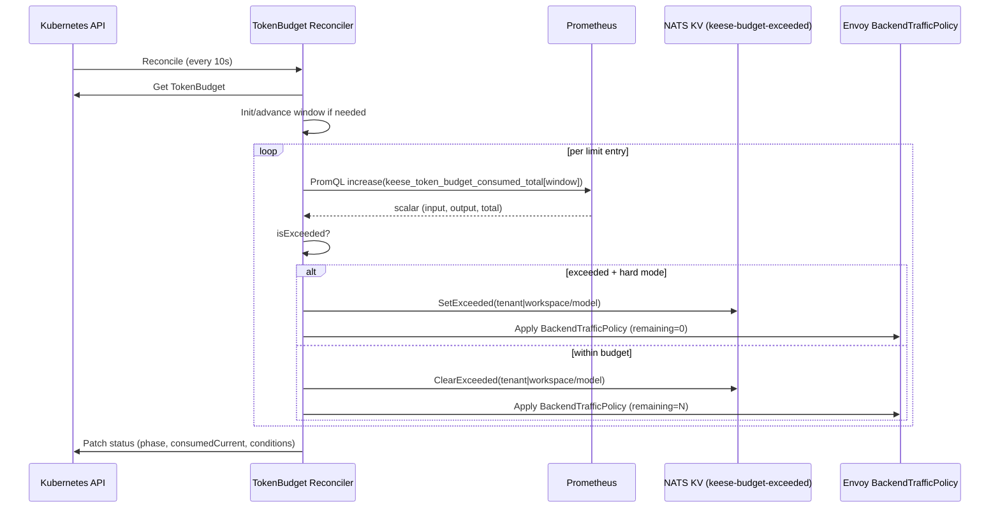

<!-- SPDX-License-Identifier: Apache-2.0 -->
<!-- Copyright (c) 2026 keese-ai -->

# API: policy.keese.ai group

The `policy.keese.ai/v1alpha1` group contains quantitative constraint kinds — token budgets and feature gates — that govern how keese workloads consume LLM capacity and which code paths are active at runtime.

!!! info "Audience"
    Platform operators configuring spending controls and feature rollout. · **Prerequisites:** [Tenancy & namespaces](../../concepts/tenancy.md), [Token budgets & observability](../../concepts/observability.md), [Feature gates](../../concepts/feature-gates.md)

---

## Kind overview



---

## TokenBudget

**Group/Version/Kind:** `policy.keese.ai/v1alpha1/TokenBudget`
**Scope:** Namespaced · **Short name:** `tb`

A `TokenBudget` caps LLM token consumption for a tenant or workspace over a sliding window. The controller polls Prometheus every 10 seconds, compares consumed tokens against each limit entry, and projects an Envoy `BackendTrafficPolicy` with the remaining allowance. On exhaustion it optionally writes a NATS JetStream KV signal and emits a Kubernetes event.

### Spec fields

#### `spec.scope`

Exactly one of `tenant` or `workspace` must be set. The `XValidation` rule on the type enforces this at admission.

| Field | Type | Required | Description |
|---|---|---|---|
| `scope.tenant.name` | string | XOR | Name of the `Tenant` CR (cluster-scoped). |
| `scope.workspace.name` | string | XOR | Name of the `Workspace` CR (namespace-scoped). |

#### `spec.limits[]`

At least one entry is required (`XValidation: limits.size() > 0`).

| Field | Type | Default | Description |
|---|---|---|---|
| `model` | string | — | Upstream model identifier, e.g. `claude-sonnet-4-6`. Use `"*"` for an aggregate cap across all models. |
| `inputTokens` | int64 | — | Maximum prompt tokens in the window. Optional; at least one of the three must be set. |
| `outputTokens` | int64 | — | Maximum completion tokens in the window. |
| `totalTokens` | int64 | — | Maximum combined tokens in the window. |

#### `spec.windowDuration`

Go duration string using only `h` (hours), `d` (days), or `m` (minutes). Default `720h` (30 days). Minimum `1h`.

#### `spec.windowAnchor`

RFC3339 timestamp anchoring the window start. The controller advances by `windowDuration` per elapsed period. When unset, the window starts at first reconcile time.

#### `spec.exhaustionMode`

| Value | Behaviour |
|---|---|
| `hard` | Projects a zero-token `BackendTrafficPolicy` (Envoy returns 429). Writes a NATS KV signal. Phase transitions to `Exhausted`. |
| `soft` | Emits a `BudgetExceeded` warning event only. Phase transitions to `SoftExhausted`. Gateway continues to pass traffic. |
| `disabled` | No enforcement; metrics continue to be tracked. `Ready` condition stays `True` regardless. |

Default: `hard`.

#### `spec.pricebookRef`

Optional reference to a pricebook CR for USD billing export (design 21). Field is accepted but the billing export is not yet implemented.

!!! warning "Planned — not yet implemented"
    `spec.pricebookRef` is wired into the type and validated, but the pricebook controller and USD export pipeline are not yet shipped. Setting this field has no effect today.

### Status fields

| Field | Type | Description |
|---|---|---|
| `observedGeneration` | int64 | Last processed spec generation. |
| `phase` | string | `Ready`, `Exhausted`, `SoftExhausted`, or `ResetFailed`. |
| `windowStart` | string | RFC3339 start of the current accounting window. |
| `windowEnd` | string | RFC3339 end of the current accounting window. |
| `consumedCurrent[]` | array | Per-model consumption in the current window (updated every 10 s). |
| `consumedPrevious[]` | array | Per-model consumption from the previous window; retained until the next reset. |
| `lastReconcileTime` | time | Most recent successful reconcile timestamp. |
| `conditions[]` | array | See [Conditions](#tokenbudget-conditions). |

#### TokenBudget conditions

| Type | True means | False means |
|---|---|---|
| `Ready` | Budget is within limits (or `exhaustionMode=disabled`). | Budget exceeded in `hard` or `soft` mode. |
| `BudgetExceeded` | At least one limit entry is over budget. | All entries are within limits. |
| `ResetFailed` | Window reset failed (parse error). | Window resets normally. |
| `MetricFetchHealthy` | All Prometheus queries succeeded this cycle. | One or more queries failed; last-known values are used (fail-safe, not fail-open). |

### Printer columns

```
kubectl get tokenbudgets
NAME        AGE    READY  PHASE          WINDOWEND                  EXHAUSTION
daily-cap   3d     True   Ready          2026-06-28T00:00:00Z       hard
```

| Column | Source |
|---|---|
| `Age` | `.metadata.creationTimestamp` |
| `Ready` | `.status.conditions[?(@.type=='Ready')].status` |
| `Phase` | `.status.phase` |
| `WindowEnd` | `.status.windowEnd` |
| `Exhaustion` | `.spec.exhaustionMode` |

### Finalizer

The controller manages `finalizers.tokenbudget.keese.ai/envoy-ratelimit-cleanup`. On deletion it removes the projected `BackendTrafficPolicy` objects and clears NATS KV signals before releasing the object.

### Prometheus surface

The controller queries the metric `keese_token_budget_consumed_total` with labels `tenant` or `workspace`, `model`, and `direction` (`input` / `output`). The query template is:

```promql
sum(increase(keese_token_budget_consumed_total{
  tenant="<name>",
  model="<model>",
  direction="input"
}[720h]))
```

For an aggregate cap (`model="*"`) the `model` label filter is omitted. Three queries run per limit entry (total, input, output); results are compared independently against whichever of `totalTokens`, `inputTokens`, and `outputTokens` are set.

!!! note
    If the Prometheus endpoint is unreachable, the controller keeps the last-known consumed values and sets `MetricFetchHealthy=False`. It does **not** clear active NATS KV signals on a failed poll (fail-safe).

### NATS JetStream KV surface

Bucket name: `keese-budget-exceeded`

Key scheme:

| Scope | Key |
|---|---|
| Tenant | `tenant/<tenantName>/<model>` |
| Workspace | `workspace/<workspaceName>/<model>` |

Value `true` means the budget is exhausted; key absence (or deleted key) means the budget is within limits.

!!! warning "NATS KV enforcement is deferred"
    The controller writes to NATS KV but no consumer-side enforcer reads it yet. The gateway path (Envoy ext_proc + keese-authz) does not consult this bucket in the current release. End-to-end enforcement relies solely on the projected `BackendTrafficPolicy` today. The KV-backed enforcer, the `nats-io/nats.go` dependency, and the gateway reader will ship together as a single atomic change.

### Cardinality ceiling

A warning event with reason `TooManyBudgets` is emitted when the cluster has more than **900** `TokenBudget` CRs. The controller hard-rejects creation above 1,200 CRs (controller-side enforcement — no separate `ValidatingAdmissionPolicy` enforces this ceiling).

### Example

```yaml
apiVersion: policy.keese.ai/v1alpha1
kind: TokenBudget
metadata:
  name: eng-team-monthly
  namespace: eng
spec:
  scope:
    tenant:
      name: eng-tenant
  windowDuration: "720h"
  exhaustionMode: hard
  limits:
    - model: "*"
      totalTokens: 5000000
    - model: "claude-opus-4"
      inputTokens: 500000
      outputTokens: 200000
```

---

## FeatureGate

**Group/Version/Kind:** `policy.keese.ai/v1alpha1/FeatureGate`
**Scope:** Cluster · **Short name:** `fg`

A `FeatureGate` controls a named boolean switch that aligns with a code path in one or more keese binaries. The controller maintains a single projection ConfigMap (`keese-system/keese-features`, key `gates.json`) that all binaries mount at `/etc/keese/features/gates.json`. Whenever any `FeatureGate` CR changes, the controller rewrites the full map atomically.

### Lifecycle stages

| Stage | Default effective value | Notes |
|---|---|---|
| `alpha` | `false` | Off by default; opt-in via `spec.override: true`. |
| `beta` | `true` | On by default; opt-out via `spec.override: false`. |
| `ga` | `true` | Unconditional in code; `override` is forbidden (CEL enforces). |
| `deprecated` | `false` | Reads emit a `Warning` event. Gate removed in the next minor release. `override` is forbidden. |

### Spec fields

| Field | Type | Default | Description |
|---|---|---|---|
| `description` | string | — | One-line summary; shown in `kubectl describe` and `make featuregate-list`. Min 1, max 512 chars. |
| `stage` | string | — | Lifecycle stage: `alpha`, `beta`, `ga`, or `deprecated`. |
| `override` | *bool | nil | `nil` uses the stage default. `true`/`false` forces the value. Forbidden on `ga` and `deprecated` stages. |
| `owners[]` | []string | — | Binary names that consume this gate (e.g. `keese-controller-manager`). Up to 32 entries. Used for drift alerts. |
| `restartRequired` | bool | `false` | When `true`, flipping the gate cannot take effect mid-process. The controller emits a `RestartRequired` event; no automatic restart is performed. |

### Status fields

| Field | Type | Description |
|---|---|---|
| `observedGeneration` | int64 | Last spec generation reconciled. |
| `effective` | bool | The value written into the `keese-features` ConfigMap: `spec.override ?? DefaultEffective(stage)`. |
| `consumers[]` | []string | Rolling-window list of binaries that have read the gate at least once recently (via OpenFeature hook telemetry). Bounded to 32 entries. **Note:** This field is not yet populated. The OpenFeature hook telemetry that feeds it is not implemented; the field always returns an empty list. |
| `lastTransitionTime` | time | When `effective` last changed. |
| `conditions[]` | array | See [Conditions](#featuregate-conditions). |

#### FeatureGate conditions

| Type | True means |
|---|---|
| `Ready` | Effective value is projected into `keese-system/keese-features`. |
| `RestartRequired` | Gate was recently flipped and `spec.restartRequired=true`. |

### Printer columns

```
kubectl get featuregates
NAME                  AGE   STAGE   EFFECTIVE   OVERRIDE   RESTART
multi-agent-staging   12d   alpha   false       <none>     false
streaming-tools       5d    beta    true        <none>     false
```

| Column | Source |
|---|---|
| `Age` | `.metadata.creationTimestamp` |
| `Stage` | `.spec.stage` |
| `Effective` | `.status.effective` |
| `Override` | `.spec.override` |
| `Restart` | `.spec.restartRequired` |

### ConfigMap projection

The controller SSA-writes the ConfigMap `keese-system/keese-features` with field owner `keese-feature-gate-controller`. The single key is `gates.json`:

```json
{
  "multi-agent-staging": false,
  "streaming-tools": true
}
```

All keese binaries mount this ConfigMap at `/etc/keese/features/gates.json` and consult it via the `internal/featuregate` package (see [`internal/featuregate/featuregate.go`](https://github.com/keese-ai/keese/blob/main/internal/featuregate/featuregate.go)). The reconciler rewrites the whole map each cycle (O(N) over number of gates, which is small), avoiding stale entries when a `FeatureGate` CR is deleted.

### CEL admission rules

Two `XValidation` rules guard the spec at admission:

- `stage=ga` → `override` must be absent (the code path is unconditional; an override would be silently ignored).
- `stage=deprecated` → `override` must be absent (deprecated gates are being removed, not toggled).

### Examples

Create an alpha gate (off by default):

```yaml
apiVersion: policy.keese.ai/v1alpha1
kind: FeatureGate
metadata:
  name: parallel-tool-calls
spec:
  description: "Enable parallel tool call dispatch in WorkspaceSession reconciler"
  stage: alpha
  owners:
    - keese-controller-manager
  restartRequired: false
```

Force an alpha gate on for testing:

```yaml
apiVersion: policy.keese.ai/v1alpha1
kind: FeatureGate
metadata:
  name: parallel-tool-calls
spec:
  description: "Enable parallel tool call dispatch in WorkspaceSession reconciler"
  stage: alpha
  override: true
  owners:
    - keese-controller-manager
```

Read the effective value for all gates at once:

```bash
kubectl get configmap keese-features -n keese-system -o jsonpath='{.data.gates\.json}' | jq .
```

Expected output:

```json
{
  "parallel-tool-calls": true
}
```

---

## TokenBudget reconcile flow



---

## See also

- [Token budgets & observability](../../concepts/observability.md) — conceptual overview of the token budget model
- [Set token budgets](../../guides/token-budgets.md) — step-by-step operator guide
- [Feature gates](../../concepts/feature-gates.md) — how binaries consume feature gates at runtime
- [Toggle feature gates](../../guides/feature-gates.md) — operator guide for enabling/disabling gates
