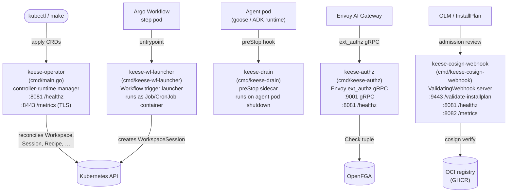

<!-- SPDX-License-Identifier: Apache-2.0 -->
<!-- Copyright (c) 2026 keese-ai -->

# CLI & binaries

Keese ships four specialized binaries alongside the operator manager; today the primary user-facing interface is `kubectl` against CRDs plus `make` targets — the dedicated `keese` CLI (Cobra + TUI) is a planned milestone, not yet implemented.

!!! info "Audience"
    Platform operators and developers integrating keese into a cluster.
    **Prerequisites:** [Install locally on kind](../getting-started/install-kind.md) or
    [Install via OLM](../guides/install-olm.md).

---

## Overview

Five Go binaries live under `cmd/` in the repository.
Each is a separate `main` package, built to a minimal distroless image, and deployed as a distinct Kubernetes workload or sidecar.



!!! warning "Planned — not yet implemented"
    The `keese` end-user CLI (E9 milestone — Cobra, TUI, `keese workspace attach`, etc.)
    is not shipped. Use `kubectl` and `make` to drive keese today.
    See [`reference/make-targets.md`](make-targets.md) for the full Make surface.

---

## keese-operator (cmd/main.go)

The cluster operator: a single controller-runtime manager that runs all 18 reconcilers and the `Recipe` admission webhook.

### Flags

| Flag | Default | Description |
|---|---|---|
| `--metrics-bind-address` | `0` (disabled) | Metrics endpoint. Use `:8443` (HTTPS) or `:8080` (HTTP). |
| `--health-probe-bind-address` | `:8081` | Liveness + readiness probes. |
| `--leader-elect` | `false` | Enable leader election (HA deployments). |
| `--metrics-secure` | `true` | Serve metrics over HTTPS; set `false` for plain HTTP. |
| `--webhook-cert-path` | `""` | Directory containing `tls.crt` / `tls.key` for admission. |
| `--webhook-cert-name` | `tls.crt` | Webhook certificate filename. |
| `--webhook-cert-key` | `tls.key` | Webhook key filename. |
| `--metrics-cert-path` | `""` | Directory containing the metrics server TLS cert. |
| `--metrics-cert-name` | `tls.crt` | Metrics certificate filename. |
| `--metrics-cert-key` | `tls.key` | Metrics key filename. |
| `--enable-http2` | `false` | Enable HTTP/2 (disabled by default to avoid Rapid Reset CVE). |
| zap flags | — | Standard `--zap-log-level`, `--zap-encoder`, etc. from controller-runtime. |

### Environment variables

| Variable | Required | Description |
|---|---|---|
| `OPENFGA_API_URL` | No¹ | OpenFGA HTTP(S) endpoint, e.g. `http://openfga:8080`. |
| `OPENFGA_STORE_ID` | No¹ | OpenFGA store UUID. |
| `OPENFGA_AUTHORIZATION_MODEL_ID` | No¹ | OpenFGA authorization model UUID. |
| `KEESE_GATEWAY_NS` | No | Namespace of the Envoy AI Gateway service (used by Workspace + CrossTenantAgreement reconcilers). |
| `PROMETHEUS_URL` | No | Prometheus HTTP endpoint for the TokenBudget controller; defaults to a fake querier that always returns zero consumed tokens. |

¹ When `OPENFGA_API_URL` is unset, all reconcilers fall back to in-memory `FakeRebacWriter` — safe for local development but **not** for production: no authorization tuples are written to OpenFGA.

!!! danger "Production gap — ReBAC fallback"
    Running without `OPENFGA_API_URL` means every reconciler's `rebac-tuple` writes are
    silently discarded. Gate admission + egress authz will fail open until OpenFGA is
    wired. Always set all three `OPENFGA_*` variables before promoting to any
    multi-tenant environment.

### Reconcilers registered

The operator registers 18 reconcilers at startup. The `cmd/main.go` source at
[`cmd/main.go`](https://github.com/keese-ai/keese/blob/main/cmd/main.go) is the
canonical wiring list. Key groups:

- **keese.ai**: `Workspace`, `WorkspaceShare`, `WorkspaceSession`, `Workflow`,
  `WorkflowRun`, `AgentRuntime`, `RuntimeExtension`, `Memory`, `SharedMemory`,
  `Recipe`, `RecipeSource`, `Transport`, `Tenant`
- **authz.keese.ai**: `GuardrailBinding`, `CrossTenantAgreement`, `OIDCProvider`
- **policy.keese.ai**: `TokenBudget`, `FeatureGate`

### Signal handling

The manager calls `ctrl.SetupSignalHandler()` (SIGTERM + SIGINT), which cancels the
root context and drains the reconcile queue. Leader lease is released, metrics
flushed, and OTEL exporters closed before exit. Target drain budget: **60 seconds**
(`terminationGracePeriodSeconds`).

---

## keese-authz (cmd/keese-authz)

The Envoy [External Authorization](https://www.envoyproxy.io/docs/envoy/latest/api-v3/service/auth/v3/attribute_context.proto) gRPC server. Every agent egress request passes through this binary before it reaches an upstream AI provider.

### What it does

1. Maintains an in-memory trie built from `ToolBinding` + `WorkspaceTool` CRs,
   refreshed every 10 seconds by polling the Kubernetes API.
2. For each `Check` RPC: matches the request path against the trie to resolve a tool
   name, extracts the `sub` from the projected ServiceAccount token in the
   `Authorization` header, then calls `OpenFGA.Check(user, can_call, tool:<name>)`.
3. Returns `ALLOW` with injected headers (`x-keese-tool`, `x-keese-workspace`) or
   `DENY` with HTTP 403 and a structured audit log line (no tokens, no bodies).

### Ports

| Port | Protocol | Purpose |
|---|---|---|
| `:9001` | gRPC (plaintext) | `envoy.service.auth.v3.Authorization` |
| `:8081` | HTTP | `/healthz` kubelet probe |

!!! warning "Planned — not yet implemented"
    The trie refresher currently polls via `List` every 10 seconds.
    A future revision replaces this with informer-driven event handlers for
    lower latency and reduced API server load (tracked in the source comments
    at [`cmd/keese-authz/main.go`](https://github.com/keese-ai/keese/blob/main/cmd/keese-authz/main.go)).

### Flags

`keese-authz` exposes no command-line flags; all runtime config comes from environment variables.

### Environment variables

| Variable | Required | Description |
|---|---|---|
| `OPENFGA_API_URL` | Yes | OpenFGA HTTP(S) endpoint. |
| `OPENFGA_STORE_ID` | Yes | OpenFGA store UUID. |
| `OPENFGA_AUTHORIZATION_MODEL_ID` | Yes | OpenFGA authorization model UUID. |

All three are required: `rebacCfg.Validate()` calls `os.Exit(1)` if any is missing.

### Signal handling

Installs `signal.NotifyContext` for SIGTERM + SIGINT. On signal: `gs.GracefulStop()`
(drains in-flight RPCs), then HTTP health server shuts down within a 10-second
context. Emits a structured `shutdown complete` log line.

---

## keese-drain (cmd/keese-drain)

A small preStop sidecar that checkpoints agent session state before the kubelet terminates an agent pod.

### Deployment

Injected by the `AgentRuntime` reconciler into every goose / ADK runtime pod as a `lifecycle.preStop.exec` command:

```yaml
lifecycle:
  preStop:
    exec:
      command:
        - /usr/local/bin/keese-drain
        - --pvc-root=/var/run/keese/session
        - --timeout=25s
```

### What it does

1. Writes a `draining-active` sentinel file to the PVC root (flips readiness to
   `NotReady` per rule 06.9).
2. Atomically writes a JSON checkpoint marker to
   `<pvc-root>/sessions/<KEESE_SESSION_ID>/draining`.
3. The actual SQLite WAL checkpoint is handled by the goose process itself when it
   receives SIGTERM from the kubelet after the preStop hook completes.

The binary exits 0 even on drain error — kubelet treats non-zero preStop exit codes
as advisory and proceeds with termination regardless.

### Flags

| Flag | Default | Description |
|---|---|---|
| `--pvc-root` | `/var/run/keese/session` | Root directory of the session PVC mount. |
| `--timeout` | `25s` | Maximum drain duration; must be less than `terminationGracePeriodSeconds`. |

### Environment variables

| Variable | Required | Description |
|---|---|---|
| `KEESE_SESSION_ID` | No | WorkspaceSession UID. Falls back to `"unknown"` if unset (e.g., during tests). |

### Structured shutdown event

On exit, `keese-drain` always emits a JSON line to stdout:

```json
{"event":"shutdown","reason":"preStop","drain_duration_ms":12,"checkpoint_location":"/var/run/keese/session/sessions/abc123/draining"}
```

---

## keese-wf-launcher (cmd/keese-wf-launcher)

A short-lived pod that creates a `WorkspaceSession` CR and polls it to completion. Used as the container entrypoint inside Argo Workflow step pods, CronJobs, and Knative Trigger backends generated by the `Workflow` reconciler.

### What it does

1. Creates a `WorkspaceSession` CR in the target namespace with `spec.mode: PerAttach`
   and labels `keese.ai/trigger-src: wf-launcher`.
2. Polls `status.phase` on a 5-second ticker until it reaches `Completed`, `Evicted`,
   or `Terminating`.
3. Exits 0 on `Completed`; exits non-zero on any other terminal phase or timeout.
4. Optionally deletes the session CR on exit (`--cleanup`).

### Flags

| Flag | Default | Description |
|---|---|---|
| `--workspace` | — | **Required.** Workspace CR name. |
| `--namespace` | — | **Required.** Namespace of the Workspace + WorkspaceSession. |
| `--attach-subject` | `service_account:keese-wf-launcher` | OpenFGA subject recorded on the session. |
| `--session-name` | `wf-launcher` | `spec.sessionName` written to the WorkspaceSession. |
| `--timeout` | `10m` | Wall-clock wait limit before giving up. |
| `--cleanup` | `false` | Delete the WorkspaceSession CR on exit (off by default for debugging). |

### Structured shutdown event

Every exit path emits a JSON shutdown event:

```json
{"event":"shutdown","reason":"launch-succeeded","drain_duration_ms":4823,"checkpoint_location":"n/a"}
```

Possible `reason` values: `launch-succeeded`, `launch-non-success`, `poll-failed`,
`create-failed`, `client-failed`, `config-failed`.

### Signal handling

`signal.NotifyContext` for SIGTERM + SIGINT installed before any I/O. Cancels in-flight API calls cleanly.

---

## keese-cosign-webhook (cmd/keese-cosign-webhook)

A `ValidatingWebhookConfiguration` server that fail-closes OLM `InstallPlan` approvals when the target CSV's bundle image cannot be verified by Sigstore cosign.

### Endpoints

| Path | Protocol/Port | Purpose |
|---|---|---|
| `POST /validate-installplan` | HTTPS `:9443` | Admission webhook handler |
| `GET /healthz` | HTTP `:8081` | Kubelet liveness probe |
| `GET /readyz` | HTTP `:8081` | Kubelet readiness probe |
| `GET /metrics` | HTTP `:8082` | Prometheus metrics |

### Flags and environment variables

Flags and their environment variable overrides (env wins when set):

| Flag | Env | Default | Description |
|---|---|---|---|
| `--webhook-port` | `WEBHOOK_PORT` | `9443` | TLS port for the admission server. |
| `--health-port` | `HEALTH_PORT` | `8081` | HTTP port for `/healthz` + `/readyz`. |
| `--metrics-port` | `METRICS_PORT` | `8082` | HTTP port for `/metrics`. |
| `--webhook-cert-dir` | `WEBHOOK_CERT_DIR` | `/etc/webhook/certs` | Directory containing `tls.crt` and `tls.key`. |
| `--cosign-binary` | `COSIGN_BINARY` | `cosign` | Path to the cosign executable (must be on PATH or absolute). |
| `--cosign-identity-regex` | `COSIGN_IDENTITY_REGEX` | `""` | Override the `--certificate-identity-regexp` passed to cosign. Default enforces `https://github.com/keese-ai/keese/.github/workflows/.*`. |
| `--cosign-oidc-issuer` | `COSIGN_OIDC_ISSUER` | `""` | Override OIDC issuer. Default: `https://token.actions.githubusercontent.com`. |
| `--cosign-registry-allow` | `COSIGN_REGISTRY_ALLOW` | `""` | Comma-separated registry prefixes to gate. Default: `ghcr.io/keese-ai/`. |
| `--feature-gates-path` | `KEESE_FEATURE_GATES_PATH` | `/etc/keese/features/gates.json` | Path to the `keese-features` ConfigMap projection (design D27). |

### Feature gates

Two feature gates control behavior at alpha (both default **off**):

| Gate | Default | Description |
|---|---|---|
| `CosignInstallPlanVerify` | `false` | Enable signature verification on admission. |
| `CosignInstallPlanFailClosed` | `false` | Reject the InstallPlan (vs. warn) when verification fails. |

!!! warning "Planned — not yet implemented"
    Both `CosignInstallPlanVerify` and `CosignInstallPlanFailClosed` default to `false`
    in alpha. The production OLM bundle ships a seed `FeatureGate` CR that enables both.
    Until you apply that CR, the webhook will allow all InstallPlans through.

### Signal handling

Installs `signal.NotifyContext` for SIGTERM + SIGINT. Grace period: **30 seconds**
(matches the Deployment's `terminationGracePeriodSeconds`). Emits a `shutdown complete`
structured log line.

---

## How to drive keese today

!!! tip "kubectl is the primary interface"
    Until the `keese` CLI lands, all user-facing operations go through `kubectl` and
    `make`. The binaries above are in-cluster components — you do not run them locally.

```bash
# Apply a workspace
kubectl apply -f config/samples/keese_v1alpha1_workspace.yaml

# Watch reconciler events
kubectl get events -n my-tenant --field-selector reason=ReconcileSucceeded

# Check operator logs
kubectl logs -n keese-system deploy/keese-controller-manager -f

# Run the local Tilt dev loop (starts the operator + all dependencies)
make tilt-up
```

For the full list of available Make targets see [`reference/make-targets.md`](make-targets.md).

---

## See also

- [Make targets](make-targets.md) — full `make` surface for building, testing, and releasing
- [Configuration & environment](configuration.md) — cluster-level config maps and secrets
- [Egress & the AI Gateway](../concepts/egress-ai-gateway.md) — how `keese-authz` fits into the egress flow
- [Process lifecycle & supervision](../concepts/lifecycle-supervision.md) — SIGTERM drain budget and probe tuning
