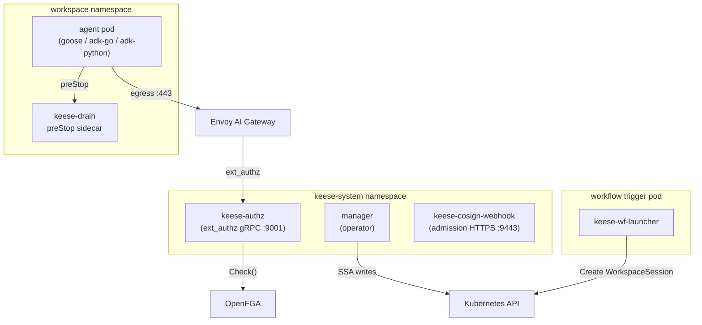
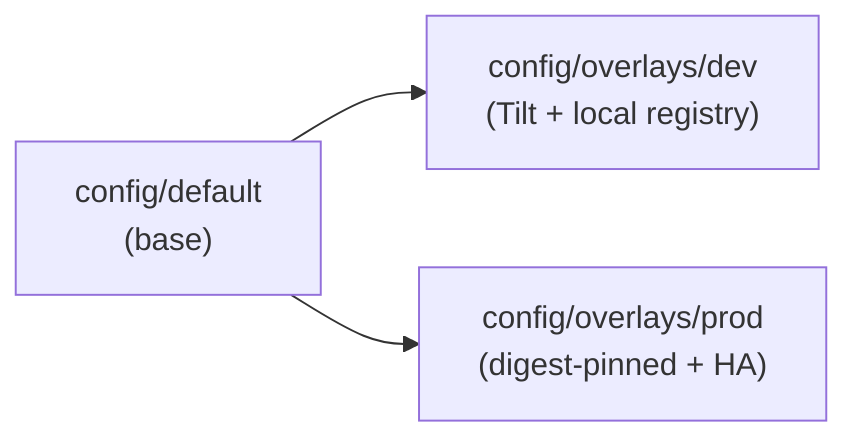
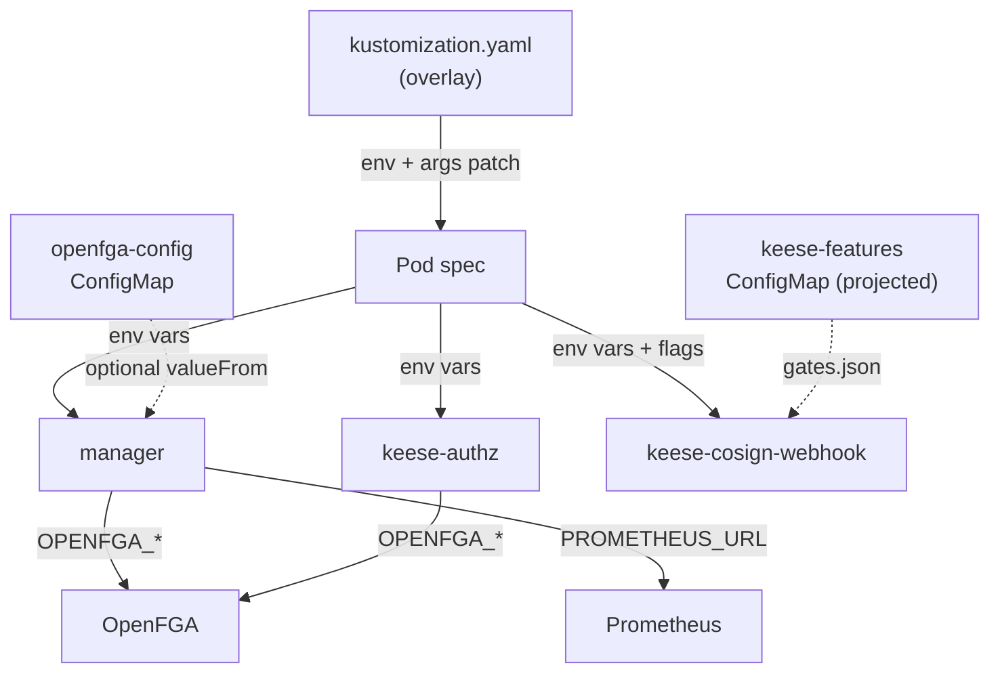

<!-- SPDX-License-Identifier: Apache-2.0 -->
<!-- Copyright (c) 2026 keese-ai -->

# Configuration & environment

Each keese binary is configured through a combination of CLI flags and environment variables; environment variables win when both are set.

!!! info "Audience"
    Operators installing or tuning keese on Kubernetes. **Prerequisites:** familiarity with Kustomize overlays and `kubectl`. See [Install via OLM](../guides/install-olm.md) for the install path and [Bootstrap a local cluster](../guides/bootstrap-local.md) for the dev setup.

---

## Binaries overview

Five binaries are built from this repository and deployed independently:

| Binary | Source | Role |
|---|---|---|
| `manager` (operator) | `cmd/main.go` | Runs all 18 reconcilers across three API groups |
| `keese-authz` | `cmd/keese-authz/main.go` | Envoy `ext_authz` gRPC server; evaluates OpenFGA for every egress call |
| `keese-cosign-webhook` | `cmd/keese-cosign-webhook/main.go` | Admission webhook; rejects OLM `InstallPlan` objects that reference unsigned images |
| `keese-drain` | `cmd/keese-drain/main.go` | `preStop` sidecar; checkpoints goose session state to PVC before pod termination |
| `keese-wf-launcher` | `cmd/keese-wf-launcher/main.go` | Pod entrypoint for non-interactive `Workflow` trigger projections |



---

## operator (`manager`)

### Flags

| Flag | Default | Description |
|---|---|---|
| `--leader-elect` | `false` | Enable leader election (required in HA; uses lease ID `ae90101e.keese.ai`) |
| `--health-probe-bind-address` | `:8081` | HTTP address for `/healthz` and `/readyz` probes |
| `--metrics-bind-address` | `0` (disabled) | Set to `:8443` (HTTPS) or `:8080` (HTTP) to expose Prometheus metrics |
| `--metrics-secure` | `true` | Serve metrics over HTTPS with authentication and authorization |
| `--webhook-cert-path` | `""` | Directory containing the webhook TLS certificate files |
| `--webhook-cert-name` | `tls.crt` | Webhook certificate filename |
| `--webhook-cert-key` | `tls.key` | Webhook key filename |
| `--metrics-cert-path` | `""` | Directory containing the metrics server TLS certificate |
| `--enable-http2` | `false` | Enable HTTP/2 on metrics and webhook servers (disabled by default; see CVE-2023-44487) |

Zap logger flags (`--zap-log-level`, `--zap-encoder`, etc.) are bound via `zap.Options.BindFlags`.

### Environment variables

| Variable | Required | Example | Description |
|---|---|---|---|
| `OPENFGA_API_URL` | No | `http://openfga.openfga.svc.cluster.local:8080` | OpenFGA endpoint. When unset the operator uses `FakeRebacWriter` (no tuple writes). |
| `OPENFGA_STORE_ID` | No | `01J...` | OpenFGA store UUID. Read from the `openfga-config` ConfigMap (`optional: true`). |
| `OPENFGA_AUTHORIZATION_MODEL_ID` | No | `01J...` | OpenFGA authorization model UUID. Same ConfigMap source. |
| `KEESE_GATEWAY_NS` | No | `keese-system` | Namespace used as the NATS pod namespace selector in the NP-2 egress `NetworkPolicy` (the NATS egress rule targets `kubernetes.io/metadata.name: <KEESE_GATEWAY_NS>`). Also used for `BackendSecurityPolicy` selectors. **Dev bootstrap gotcha:** the helmfile deploys NATS to the `nats` namespace, so you must set `KEESE_GATEWAY_NS=nats` on a dev cluster or the NATS egress rule will not match. The Envoy AI Gateway proxy namespace (`envoy-gateway-system`) is hardcoded and not affected by this variable. |
| `PROMETHEUS_URL` | No | `http://prometheus.monitoring:9090` | When set, `TokenBudgetReconciler` uses a real Prometheus querier. When unset, a `FakePrometheusQuerier` (consumed=0) is used instead. |

!!! warning "OpenFGA is optional in development"
    When `OPENFGA_API_URL` is empty, all reconcilers fall back to `FakeRebacWriter` / `NoopRebacWriter`. The operator starts cleanly in CI smoke environments without an OpenFGA sidecar. In production you must set all three `OPENFGA_*` variables.

### Probe and shutdown timing

The operator deployment uses a 90-second `terminationGracePeriodSeconds`. The liveness probe window (`initialDelaySeconds=30` + `periodSeconds=10` × `failureThreshold=3` = 60s) is deliberately kept below the grace period, satisfying rule 06.8. Actual drain budget: lease release (5s) + queue drain (30s) + OTEL flush (15s) + buffer (10s) = 60s, leaving a 30-second safety margin before the kubelet issues SIGKILL.

---

## `keese-authz`

### Environment variables

| Variable | Required | Description |
|---|---|---|
| `OPENFGA_API_URL` | Yes | OpenFGA endpoint (hard required; process exits on missing) |
| `OPENFGA_STORE_ID` | Yes | Store UUID |
| `OPENFGA_AUTHORIZATION_MODEL_ID` | Yes | Model UUID |

### Ports

| Port | Protocol | Purpose |
|---|---|---|
| `:9001` | gRPC (TCP) | `envoy.service.auth.v3.Authorization` — the ext_authz hot path |
| `:8081` | HTTP | `/healthz` for kubelet liveness and readiness probes |

The trie that maps request paths to tool names is rebuilt every 10 seconds by polling `ToolBinding` and `WorkspaceTool` resources. A future revision will replace the polling loop with controller-runtime informer-driven event handlers.

---

## `keese-cosign-webhook`

All configuration is read from environment variables first; CLI flags serve as fallbacks (env wins when both are set).

### Environment variables and flags

| Env var | Flag | Default | Description |
|---|---|---|---|
| `WEBHOOK_PORT` | `--webhook-port` | `9443` | TLS port for the admission webhook server |
| `HEALTH_PORT` | `--health-port` | `8081` | HTTP port for `/healthz` and `/readyz` |
| `METRICS_PORT` | `--metrics-port` | `8082` | HTTP port for `/metrics` |
| `WEBHOOK_CERT_DIR` | `--webhook-cert-dir` | `/etc/webhook/certs` | Directory containing `tls.crt` and `tls.key` |
| `COSIGN_BINARY` | `--cosign-binary` | `cosign` | Path or name of the `cosign` executable |
| `COSIGN_IDENTITY_REGEX` | `--cosign-identity-regex` | `""` (uses keese default) | Override `--certificate-identity-regexp` passed to `cosign verify` |
| `COSIGN_OIDC_ISSUER` | `--cosign-oidc-issuer` | `""` (uses GitHub Actions default) | Override `--certificate-oidc-issuer` |
| `COSIGN_REGISTRY_ALLOW` | `--cosign-registry-allow` | `ghcr.io/keese-ai/` | Comma-separated registry prefixes to gate |
| `KEESE_FEATURE_GATES_PATH` | `--feature-gates-path` | `/etc/keese/features/gates.json` | Path to the feature-gates ConfigMap projection |

### Feature gates consumed

Two gates control the webhook's behavior. Both default to `false` (alpha, off). The production OLM bundle ships a seed `FeatureGate` CR that sets `cosign-installplan-verify: true`:

| Gate ID | Default | Effect |
|---|---|---|
| `cosign-installplan-verify` | `false` | Enable signature verification on `InstallPlan` approval |
| `cosign-installplan-failclosed` | `false` | Reject the `InstallPlan` when verification fails (instead of logging and allowing) |

!!! warning "Production gate configuration"
    In production both gates must be `true`. With `cosign-installplan-verify=false` the webhook is a no-op; images are not checked. The feature gate catalog reference is at [reference/feature-gate-catalog.md](feature-gate-catalog.md).

---

## `keese-drain`

`keese-drain` is invoked as a `preStop` exec hook inside agent pods, not deployed as a long-running container. It is not configured via environment variables exposed to operators; only the flags listed below matter.

### Flags

| Flag | Default | Description |
|---|---|---|
| `--pvc-root` | `/var/run/keese/session` | Root directory of the session PVC mount |
| `--timeout` | `25s` | Maximum drain budget before exit (accepts any `time.Duration` string) |

The binary also reads `KEESE_SESSION_ID` from the environment (injected by the WorkspaceSession controller) to name the checkpoint directory. When the variable is absent it falls back to the literal string `unknown`.

!!! example "Typical preStop stanza"
    ```yaml
    lifecycle:
      preStop:
        exec:
          command:
            - /usr/local/bin/keese-drain
            - --pvc-root=/var/run/keese/session
            - --timeout=25s
    ```

---

## `keese-wf-launcher`

### Flags

| Flag | Default | Description |
|---|---|---|
| `--workspace` | (required) | `Workspace` CR name to launch a session against |
| `--namespace` | (required) | Namespace of the `Workspace` and resulting `WorkspaceSession` |
| `--attach-subject` | `service_account:keese-wf-launcher` | OpenFGA subject recorded on the `WorkspaceSession` |
| `--session-name` | `wf-launcher` | `WorkspaceSession.spec.sessionName` |
| `--timeout` | `10m` | Maximum wall-clock time to poll for terminal phase |
| `--cleanup` | `false` | Delete the `WorkspaceSession` CR on exit (keep for debugging by default) |

The binary uses in-cluster config (`rest.InClusterConfig()`). No additional environment variables are required.

---

## Kustomize overlays



### `config/overlays/dev`

Applied by Tilt after `bootstrap-infra` completes. Differences from base:

- Image swapped to `keese-ai/keese-operator:dev` from `localhost:5005` (ctlptl local registry).
- Labels `keese.ai/env=dev` and `app.kubernetes.io/managed-by=tilt` added.
- Debug port `2345` (Delve) added to the manager container.
- CPU and memory limits reduced for local node capacity.

```yaml
# config/overlays/dev/kustomization.yaml (excerpt)
images:
  - name: controller
    newName: keese-ai/keese-operator
    newTag: dev
patches:
  - target: {kind: Deployment, name: keese-controller-manager}
    patch: |-
      - op: add
        path: /spec/template/spec/containers/0/ports/-
        value: {name: dlv, containerPort: 2345, protocol: TCP}
```

### `config/overlays/prod`

Differences from base:

- Manager image pinned by SHA-256 digest (rule 05.12). The digest placeholder `sha256:0000...` must be replaced after the first CI image publish.
- CPU/memory requests and limits raised (`200m`/`256Mi` → `1000m`/`1Gi`).
- `terminationGracePeriodSeconds` hardened to `90` (matching the base).
- `topologySpreadConstraints` added for zone-spread scheduling.
- `ResourceQuota` applied to `keese-system`: pods=20, cpu requests=2/limits=4, memory requests=2Gi/limits=4Gi.
- `PodDisruptionBudget` applied (see `config/overlays/prod/pdb.yaml`).

!!! danger "Digest placeholder in prod overlay"
    `ghcr.io/keese-ai/keese-operator@sha256:0000...` is a placeholder. The first CI image publish via GitHub Actions will produce the real digest. Update the overlay and run `cosign verify` before deploying to any real cluster. See [Build & release](../development/build-release.md) for the release workflow.

To apply the production overlay:

```bash
kubectl apply -k config/overlays/prod
```

To apply the dev overlay (Tilt manages this automatically, but you can apply manually):

```bash
kubectl apply -k config/overlays/dev
```

---

## Feature gates projection

Every binary that consumes feature gates reads a JSON file projected from the `keese-features` ConfigMap. The default path is `/etc/keese/features/gates.json` and can be overridden per binary.

The file format is a flat JSON object:

```json
{
  "cosign-installplan-verify": true,
  "cosign-installplan-failclosed": true
}
```

Gates missing from the file fall back to per-binary defaults (all are `false` at alpha stage). The `Gates` evaluator uses `fsnotify` to reload on file change without process restart, and exposes two Prometheus metrics:

| Metric | Labels | Description |
|---|---|---|
| `keese_featuregate_eval_total` | `gate`, `value`, `binary` | Counter of gate evaluations |
| `keese_featuregate_state` | `gate` | Current effective value (0=off, 1=on) |

See [Feature gate catalog](feature-gate-catalog.md) for a full list of gates and their stages.

---

## Configuration flow summary



---

## See also

- [Feature gate catalog](feature-gate-catalog.md) — all gate IDs, stages, and default values
- [Make targets](make-targets.md) — `make manifests`, `make generate`, `make deploy`
- [Bootstrap a local cluster](../guides/bootstrap-local.md) — Tilt dev loop setup
- [Build & release](../development/build-release.md) — CI image signing and digest update workflow
