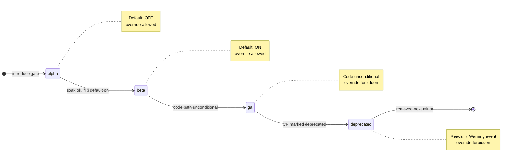
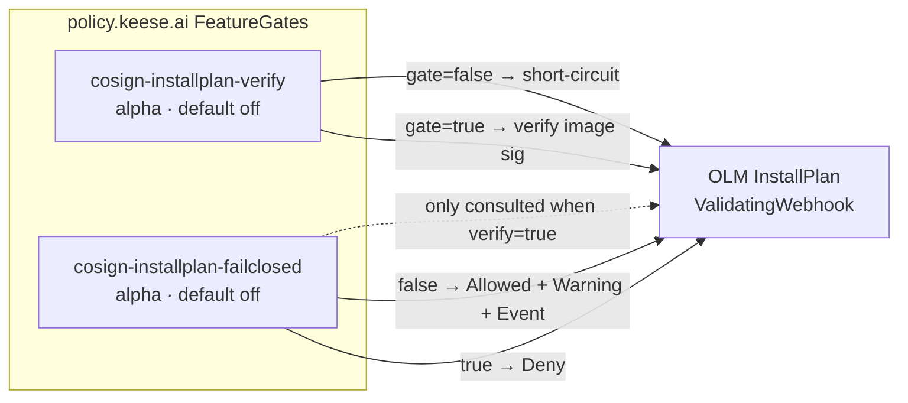

<!-- SPDX-License-Identifier: Apache-2.0 -->
<!-- Copyright (c) 2026 keese-ai -->

# Feature gate catalog

Every registered `policy.keese.ai/v1alpha1.FeatureGate` in one place — name, stage, default, override behaviour, restart requirement, owning binary, and what the gate actually controls.

!!! info "Audience"
    Platform operators and cluster administrators who need to understand which keese capabilities are guarded, what the defaults are, and how to safely flip a gate. **Prerequisites:** [Concepts: Feature gates](../concepts/feature-gates.md) · a running keese installation with CRDs installed.

---

## How feature gates work

keese ships every optional or operationally-risky capability behind a named, staged `FeatureGate` cluster resource. The `FeatureGateController` reconciles each CR into the `keese-system/keese-features` ConfigMap (`gates.json`), which every keese binary mounts as a projected volume at `/etc/keese/features/gates.json`. Changes propagate in ≤ 2 seconds via `fsnotify`; no pod restart is required for gates with `restartRequired: false`.

The evaluation precedence is:

```
effective = spec.override  ??  defaultFor(spec.stage)
```

Stage defaults follow the Kubernetes convention:

| Stage | Default | Lifecycle note |
|---|---|---|
| `alpha` | **off** | May change without notice; no upgrade compat guarantee |
| `beta` | **on** | Stable shape; backwards-compatible flips allowed |
| `ga` | n/a | Code path is unconditional; CR set to `deprecated` for one minor release |
| `deprecated` | off | Reads emit `Warning` event; removed next minor release |



---

## Gate catalog

Two gates are registered today. Both are in stage `alpha` (default **off**) and owned by `keese-cosign-webhook`.



### `cosign-installplan-verify`

| Field | Value |
|---|---|
| **API name** | `cosign-installplan-verify` |
| **Go const** | `featuregate.CosignInstallPlanVerify` |
| **Stage** | `alpha` |
| **Default** | `false` (off) |
| **Restart required** | No |
| **Owners** | `keese-cosign-webhook` |
| **Seed manifest** | `config/featuregates/cosign-installplan-verify.yaml` |

Controls whether the pre-install `ValidatingAdmissionWebhook` on OLM `InstallPlan` objects performs cosign keyless OIDC signature verification on every keese-published image referenced in the plan.

- **Gate off (default):** the webhook handler short-circuits immediately with `admission.Allowed("cosign-installplan-verify=false")`. No signature check is performed. Suitable for air-gapped clusters without a Sigstore mirror, or during initial installation before signatures are available.
- **Gate on:** the handler resolves each image digest and calls `cosign verify` with the keese OIDC identity constraint (`https://github.com/keese-ai/keese/.github/workflows/.*` + issuer `https://token.actions.githubusercontent.com`). The outcome is determined by the companion gate `cosign-installplan-failclosed`.

!!! warning "Alpha — off by default"
    Both cosign gates are `alpha`. Production overlays that want enforcement should patch `spec.override: true` on this gate **and** on `cosign-installplan-failclosed`. See the staged rollout guide below.

---

### `cosign-installplan-failclosed`

| Field | Value |
|---|---|
| **API name** | `cosign-installplan-failclosed` |
| **Go const** | `featuregate.CosignInstallPlanFailClosed` |
| **Stage** | `alpha` |
| **Default** | `false` (off) |
| **Restart required** | No |
| **Owners** | `keese-cosign-webhook` |
| **Seed manifest** | `config/featuregates/cosign-installplan-failclosed.yaml` |

Only consulted when `cosign-installplan-verify` is **on**. Controls what happens when cosign verification fails.

- **Gate off (default):** a verification failure results in `admission.Allowed` with a `Warning` header and a `BundleUnsignedAdmittedDryRun` event on the `InstallPlan`. The install proceeds but the failure is visible. Use this to land the verification path in production without blocking cluster upgrades — a "log-only" mode.
- **Gate on:** a verification failure results in `admission.Denied`. The `InstallPlan` is rejected; the install does not proceed.

!!! tip "Staged rollout pattern"
    Enable `cosign-installplan-verify=true` + `cosign-installplan-failclosed=false` first. Monitor `BundleUnsignedAdmittedDryRun` events for at least one upgrade cycle. When you are satisfied no unsigned images are reaching the cluster, flip `cosign-installplan-failclosed=true` to enforce.

---

## Reading `make featuregate-list`

The `scripts/featuregate-list.sh` script (invoked as `make featuregate-list`) queries the live cluster and prints a formatted table. It requires `kubectl` and `jq` on `$PATH`, and the `featuregates.policy.keese.ai` CRD must be installed.

```bash
make featuregate-list
```

Expected output (column widths are fixed at 36/12/9/9/9/9):

```
NAME                                 STAGE        DEFAULT   OVERRIDE  EFFECTIVE RESTART  OWNERS
cosign-installplan-verify            alpha        false     —         —         false    keese-cosign-webhook
cosign-installplan-failclosed        alpha        false     —         —         false    keese-cosign-webhook
```

Column meanings:

| Column | Source | Notes |
|---|---|---|
| `NAME` | `metadata.name` | DNS-1035; matches the Go `Gate` const value |
| `STAGE` | `spec.stage` | `alpha` / `beta` / `ga` / `deprecated` |
| `DEFAULT` | derived from `spec.stage` | `false` for alpha/deprecated, `true` for beta/ga |
| `OVERRIDE` | `spec.override` | `—` when null (use default); `true` / `false` when set |
| `EFFECTIVE` | `status.effective` | What was actually projected into `gates.json`; `—` if not yet reconciled |
| `RESTART` | `spec.restartRequired` | `true` means a pod rollout is needed after flipping |
| `OWNERS` | `spec.owners` | Comma-separated binary names |

For machine-readable output, use:

```bash
scripts/featuregate-list.sh --json | jq '.items[] | {name: .metadata.name, effective: .status.effective}'
```

---

## Overriding a gate

To enable `cosign-installplan-verify` on a running cluster:

```bash
kubectl patch featuregate cosign-installplan-verify \
  --type=merge \
  -p '{"spec":{"override":true}}'
```

Verify propagation within ~2 seconds:

```bash
kubectl get featuregate cosign-installplan-verify -o jsonpath='{.status.effective}'
# true
```

To enable fail-closed enforcement after a dry-run soak:

```bash
kubectl patch featuregate cosign-installplan-failclosed \
  --type=merge \
  -p '{"spec":{"override":true}}'
```

To revert to the stage default (remove the override):

```bash
kubectl patch featuregate cosign-installplan-verify \
  --type=json \
  -p '[{"op":"remove","path":"/spec/override"}]'
```

!!! danger "Override forbidden on `ga` and `deprecated` gates"
    The CRD enforces via CEL `XValidation` that `spec.override` may not be set when `spec.stage` is `ga` or `deprecated`. Those code paths are either unconditional (ga) or about to be removed (deprecated). Attempts to set an override on such gates are rejected at admission.

---

## Observability

The `keese_featuregate_eval_total{gate, value, binary}` Prometheus counter increments on every call to `gates.Enabled()`. The `keese_featuregate_state{gate}` gauge holds the current effective value (0 = off, 1 = on).

!!! warning "Drift metric — planned, not yet emitted"
    A `keese_featuregate_drift_seconds{gate}` histogram to track the lag between a CR change and the binary observing it is planned (design 27) but is **not yet emitted** by the codebase. Do not create alerts against this metric; use `kubectl get featuregate -o jsonpath='{.status.effective}'` and compare against `.metadata.generation` as an interim check. See [Metrics reference](metrics-events.md) for authoritative metric status.

Structured log events are emitted on every transition:

```json
{
  "event": "featuregate_transition",
  "gate": "cosign-installplan-verify",
  "from": false,
  "to": true,
  "reason": "override_set"
}
```

---

## Adding a new gate

1. Choose a name: DNS-1035 (`lowercase-hyphens`), prefixed by the owning subsystem (e.g. `authz-…`, `otel-…`, `recipe-…`).
2. Add a `Gate` const in [`internal/featuregate/featuregate.go`](https://github.com/keese-ai/keese/blob/main/internal/featuregate/featuregate.go).
3. Author a seed CR in `config/featuregates/` and add it to the kustomization.
4. Append a row to the [design catalog](https://github.com/keese-ai/keese/blob/main/docs/designs/27b-feature-gate-catalog.md). Start at stage `alpha`, default `off`.
5. Wrap the entry point in `if !gates.Enabled(ctx, X) { return passThrough() }`.
6. If the gate touches security, supply chain, or tenancy, open a tech-debt item tracking promotion to `beta`.

---

## See also

- [Concepts: Feature gates](../concepts/feature-gates.md) — how the system works end to end
- [Guides: Toggle feature gates](../guides/feature-gates.md) — step-by-step operator walkthrough
- [API: policy.keese.ai group](api/policy.md) — `FeatureGate` CRD schema reference
- [Reference: Metrics, events & conditions](metrics-events.md) — `keese_featuregate_*` metrics
