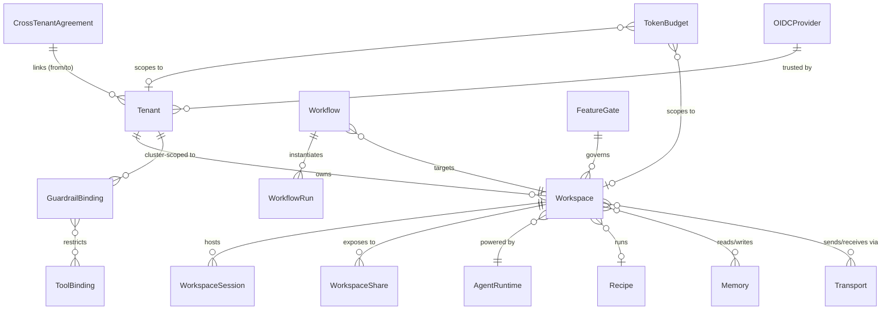
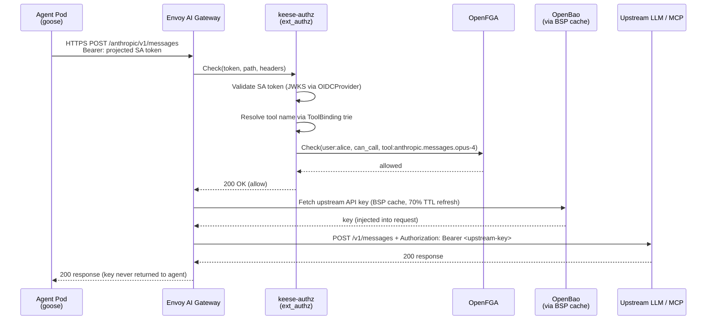

<!-- SPDX-License-Identifier: Apache-2.0 -->
<!-- Copyright (c) 2026 keese-ai -->

# Glossary

Definitions for every keese-specific term and each ecosystem component that keese depends on.

!!! info "Audience"
    All users, operators, and contributors. **Prerequisites:** none — this page is intentionally self-contained.

---

## How to read this page

Terms are grouped by theme. Each entry gives the Go kind (where one exists), the API group,
and a cross-reference to the deeper concept or reference page. Ecosystem terms (Capsule,
OpenFGA, NACK, …) are defined at the level of detail needed to operate keese; consult upstream
docs for exhaustive coverage.

The relationship map below shows how the primary keese kinds relate to each other:

---

## Tenancy

### Tenant

**Kind:** `Tenant` · **Group:** `keese.ai` · **Scope:** Cluster

The top-level isolation boundary. A Tenant maps to one or more Kubernetes namespaces
managed by Capsule. Every Workspace, Memory, Transport, Workflow, and WorkspaceSession
lives inside a Tenant's namespace. Tenants own their GuardrailBindings and TokenBudgets
and declare which OIDCProviders they trust.

See [`concepts/tenancy.md`](../concepts/tenancy.md) and [`guides/provision-tenant.md`](../guides/provision-tenant.md).

### Capsule

An upstream Kubernetes multi-tenancy operator (<https://projectcapsule.dev/>). keese uses
Capsule to enforce namespace quotas, resource limits, and ingress/egress policies at the
tenant boundary. Tenants in keese are Capsule `Tenant` CRs under the hood. Capsule is
installed as a dependency during `make bootstrap-infra`.

### Namespace

Kubernetes namespaces are keese's tenant sub-divisions. Each Tenant gets one or more
namespaces. Network policies, RBAC, and resource quotas are all scoped to namespaces.
Agent pods run inside tenant namespaces and are never allowed to reach across namespace
boundaries without a CrossTenantAgreement.

---

## Workspaces and sessions

### Workspace

**Kind:** `Workspace` (`ws`) · **Group:** `keese.ai` · **Scope:** Namespaced

A Workspace declares the intent to run an agent: it names an AgentRuntime, an optional
Recipe, a set of Memory and Transport refs, and GuardrailBindings. The Workspace
controller provisions a ServiceAccount, a fail-closed NetworkPolicy, and an optional PVC for
session storage. Lifecycle phases: `Pending → Provisioning → Running → Idle → Evicted →
Terminating`.

`spec.sessionMode` controls when the pod is live (`Always` or `OnDemand`).
`spec.interactive` is immutable after creation and determines whether human-attach
sessions are allowed.

See [`concepts/workspaces.md`](../concepts/workspaces.md).

### WorkspaceSession

**Kind:** `WorkspaceSession` (`wsess`) · **Group:** `keese.ai` · **Scope:** Namespaced

A single attach event — a user or launcher claiming a running agent pod. Session lifecycle:
`Pending → Attaching → Active → Draining → Completed | Evicted → Terminating`.
`spec.mode` controls pod sharing: `shared`, `per-user`, or `per-attach`.
`spec.attachSubject` (OpenFGA form, e.g. `user:alice@example.com`) is immutable.

The session controller writes a `session:<uid>#attached_by@<attachSubject>` OpenFGA tuple
on `Active` transition and removes it on `Terminating`. ACP is the transport used to
attach a terminal or API client to the session pod.

See [`concepts/workspaces.md`](../concepts/workspaces.md) and [`guides/workspace-session.md`](../guides/workspace-session.md).

### WorkspaceShare

**Kind:** `WorkspaceShare` · **Group:** `keese.ai` · **Scope:** Namespaced

Grants a named subject read or write access to a Workspace's session output without
granting full tenant membership. Used for cross-team observation or review flows within
the same tenant.

### AttachPolicy

Enum on `Workspace.spec.attachPolicy`: `New` (each session spawns a fresh pod) or
`Reuse` (sessions share the running pod until `attachGrace` expires). Default: `Reuse`.

### ACP (Agent Communication Protocol)

The stdio-over-Kubernetes transport that connects a terminal or API client to a running
agent pod. ACP frames travel over a multiplexed stream managed by the ACP bridge sidecar
(a container injected by the Workspace controller alongside the agent runtime pod). The
bridge authenticates the connecting client using the projected SA token.

See [`concepts/transports.md`](../concepts/transports.md).

---

## Agent runtimes

### AgentRuntime

**Kind:** `AgentRuntime` · **Group:** `keese.ai` · **Scope:** Cluster

Declares which agent runtime provider to use (goose, Claude Code, Aider, ADK Python, ADK
Go), its OCI image, and provider-specific configuration. The Workspace controller calls
the runtime's `Bootstrap` method to generate the pod spec for new sessions. Each provider
implements the `AgentRuntime` **SPI**.

See [`concepts/agent-runtimes.md`](../concepts/agent-runtimes.md) and [`guides/configure-runtime.md`](../guides/configure-runtime.md).

### SPI (Service Provider Interface)

The Go interface defined in `internal/runtime/` that every agent runtime provider must
satisfy. The SPI decouples the Workspace controller from provider-specific pod-construction
logic. Methods include `Bootstrap` (provision PVC dirs and SQLite schema), `Drain` (graceful shutdown), and
`Health`. Adding a new provider means implementing this interface and registering it
— no changes to the Workspace controller.

See [`concepts/agent-runtimes.md`](../concepts/agent-runtimes.md).

### CapabilityMatrix

A structured table (embedded in `AgentRuntime.status`) that records which optional SPI
capabilities a provider supports: session checkpointing, multi-attach, streaming output,
tool hot-reload, etc. The Workspace controller reads the matrix before enabling
`spec.interactive` or `spec.sessionMode=Always`.

### Goose

The primary agent runtime provider for keese at alpha. Goose is a headless AI agent from
Block (<https://github.com/block/goose>) that runs recipes and attaches via ACP. Its session
state is checkpointed to SQLite on the workspace PVC so SIGKILL is survivable.

---

## Recipes

### Recipe

**Kind:** `Recipe` · **Group:** `keese.ai` · **Scope:** Namespaced

Declares what an agent should do: the instructions OCI path, allowed tools, model/provider,
typed parameters (injected as env vars), pre/post-flight hooks, and required runtime
extensions. Recipes are resolved from a RecipeSource, cosign-verified, and cached before
a Workspace can use them. Lifecycle: `Pending → Pulling → Verified → Ready | Failed`.

See [`concepts/recipes.md`](../concepts/recipes.md) and [`guides/recipes.md`](../guides/recipes.md).

### RecipeSource

**Kind:** `RecipeSource` · **Group:** `keese.ai` · **Scope:** Namespaced

Declares the OCI registry from which Recipe artifacts are pulled and the cosign verification
policy (keyless OIDC or key-based). A Recipe references exactly one RecipeSource. The
RecipeSource controller periodically re-syncs and updates `Recipe.status.resolvedDigest`.

---

## Memory

### Memory

**Kind:** `Memory` · **Group:** `keese.ai` · **Scope:** Namespaced

A workspace-private persistent store for an agent's working memory. The `spec.provider`
discriminated field selects a backend: `sqlite` (default, PVC-backed), `redis`, `qdrant`,
`pgvector`, `neo4j`, `mem0`, or `zep`. Lifecycle: `Pending → Provisioning → Ready |
Degraded → Terminating`.

See [`concepts/memory.md`](../concepts/memory.md) and [`guides/memory-backends.md`](../guides/memory-backends.md).

### SharedMemory

**Kind:** `SharedMemory` · **Group:** `keese.ai` · **Scope:** Namespaced

Like Memory but accessible by multiple Workspaces within the same Tenant. Useful for
shared vector indexes, knowledge caches, or cross-workflow state. Access is mediated by
OpenFGA tuples written by the SharedMemory controller.

---

## Transports and messaging

### Transport

**Kind:** `Transport` · **Group:** `keese.ai` · **Scope:** Namespaced

A configured messaging channel. A Transport CR declares the channel type and channel-specific
configuration. Workspaces and Workflows reference Transports to send or receive messages.
Uses a discriminated `spec.type` field with four supported values: `nats`, `a2a`, `mcp`,
or `stdio`.

See [`concepts/transports.md`](../concepts/transports.md).

### NATS / NACK

**NATS** is the messaging broker. **NACK** (NATS JetStream Controller for Kubernetes,
<https://github.com/nats-io/nack>) is the Kubernetes operator that manages NATS
`Stream` and `Consumer` CRs. keese's Transport controller delegates stream lifecycle to
NACK. NATS subjects used for cross-tenant messaging must start with `keese.cta.` (enforced
by CEL on CrossTenantAgreement).

---

## Workflows

### Workflow

**Kind:** `Workflow` (`wf`) · **Group:** `keese.ai` · **Scope:** Namespaced

A template for recurring or event-driven agent execution. A Workflow names a Workspace,
an Argo `WorkflowTemplate` entrypoint, one or more triggers (Cron, KnativeTrigger,
NATSSubscription, HTTPWebhook), and zero or more outputs (KnativeSink, NATSPublish, S3,
GitHubPR). The Workflow controller projects each trigger into the appropriate Kubernetes
primitive (CronJob, HTTPRoute, Knative Trigger) and the `keese-wf-launcher` binary creates
non-interactive WorkspaceSessions on firing.

See [`concepts/workflows.md`](../concepts/workflows.md).

### WorkflowRun

**Kind:** `WorkflowRun` · **Group:** `keese.ai` · **Scope:** Namespaced

A single execution instance of a Workflow — the Argo `Workflow` CR that
`keese-wf-launcher` submits when a trigger fires. WorkflowRun tracks the backing Argo
object, start/end times, and final status.

---

## Authorization and identity

### ReBAC (Relationship-Based Access Control)

The authorization model keese uses. Permissions are derived from a graph of named
relationships between typed objects (`user`, `workspace`, `tool`, `tenant`, etc.) rather
than flat role lists. keese's ReBAC store is OpenFGA.

See [`concepts/authorization-rebac.md`](../concepts/authorization-rebac.md).

### OpenFGA

The open-source Zanzibar-inspired authorization service (<https://openfga.dev/>) that keese
uses as its ReBAC store. Controllers write relationship tuples (e.g.
`workspace:W#editor@user:alice`) when reconciling CRDs. The `keese-authz` binary exposes
an ext_authz gRPC server that calls `OpenFGA.Check` for every egress request.

### ext_authz

The Envoy external-authorization gRPC protocol. When an agent pod sends an HTTP request
through Envoy AI Gateway, Envoy calls the `keese-authz` standalone Deployment
(`keese-system`, gRPC `:9001`) via the ext_authz filter. `keese-authz`
validates the agent's projected SA token, determines the `tool:` name via ToolBinding,
and calls `OpenFGA.Check(subject, can_call, tool:<name>)`. Denied requests are dropped
before reaching the upstream LLM/MCP endpoint.

See [`concepts/authorization-rebac.md`](../concepts/authorization-rebac.md) and [`concepts/egress-ai-gateway.md`](../concepts/egress-ai-gateway.md).

### Projected SA token (Projected ServiceAccount Token)

The only credential an agent pod carries. Kubernetes projects a short-lived (≤ 10 min,
range 60–600 s per OIDCProvider config) bound token into the pod at
`/var/run/keese/tokens/egress`. Its `aud` claim is `keese-egress-<tenant>`, scoping
upstream IAM trust policies to that tenant. The token is rotated by kubelet at 80% TTL.
There are no long-lived credentials in agent pods.

See [`concepts/identity-zero-trust.md`](../concepts/identity-zero-trust.md).

### OIDCProvider

**Kind:** `OIDCProvider` (`oidcp`) · **Group:** `authz.keese.ai` · **Scope:** Cluster

Configures an OIDC issuer that the Envoy AI Gateway ext_authz pipeline trusts. Declares
the issuer URL (JWKS auto-discovered or explicit), audience globs, a subject template
(restricted Sprig subset), and audience templates that govern projected token TTLs. At
least one audience template named `"egress"` is required (VAP-enforced). Bootstrap CRs for
`kubernetes-default`, Google, and GitHub Actions are created at install time.

See [`concepts/identity-zero-trust.md`](../concepts/identity-zero-trust.md).

### GuardrailBinding

**Kind:** `GuardrailBinding` · **Group:** `authz.keese.ai` · **Scope:** Namespaced

Attaches a guardrail policy to a scope (`Cluster`, `Tenant`, or `Workspace`). A policy
defines tool allow/deny lists, rate limits per scope, and hook events (`beforeToolCall`,
`afterToolCall`, `onError`). Workspace specs reference GuardrailBindings; the
`keese-authz` ext_authz pipeline enforces them at request time.

See [`concepts/guardrails.md`](../concepts/guardrails.md) and [`guides/guardrails.md`](../guides/guardrails.md).

### ToolBinding

**Kind:** `ToolBinding` (`tb`) · **Group:** `authz.keese.ai` · **Scope:** Cluster

The platform-owned mapping from HTTP request patterns (path, method, headers, optional
body discriminator) to an OpenFGA `tool:<name>` object. The `keese-authz` ext_authz
service compiles all accepted ToolBindings into an in-memory trie to derive `tool:` names
on every incoming request. Cluster-scoped because these are canonical LLM/MCP endpoint
identifiers shared across tenants (e.g. `anthropic.messages.opus-4`). For per-tenant
ad-hoc tools see `WorkspaceTool`.

### CrossTenantAgreement (CTA)

**Kind:** `CrossTenantAgreement` (`cra`) · **Group:** `authz.keese.ai` · **Scope:** Cluster

A bilateral contract that permits cross-tenant NATS messaging and agent-to-agent (A2A)
roles between two named Tenants. Both tenants must sign (OIDC-keyless or SA-token) before
the CTA moves from `Pending` to `Approved`. The scope is a set of NATS subjects
(constrained to `keese.cta.*`) and A2A roles (`reader`, `writer`, `bidirectional`). An
optional `expiresAt` timestamp (immutable) bounds the agreement lifetime.

See [`concepts/cross-tenant.md`](../concepts/cross-tenant.md) and [`guides/cross-tenant-agreements.md`](../guides/cross-tenant-agreements.md).

### BackendSecurityPolicy (BSP)

An Envoy AI Gateway CRD (`gateway.envoyproxy.io/v1alpha1`) that instructs the gateway to
inject an upstream-specific credential (static API key, OIDC-STS-exchanged token, or
dynamic vault secret) after verifying the agent's SA token via ext_authz. The agent never
sees the upstream credential — it is injected by the gateway and cached per
`(tenant-audience, upstream role)`, refreshed at 70% TTL, fail-closed past 95%.

See [`concepts/credential-broker.md`](../concepts/credential-broker.md) and [`guides/egress-credentials.md`](../guides/egress-credentials.md).

### VAP (ValidatingAdmissionPolicy)

Kubernetes-native admission validation using CEL expressions (GA in 1.30). keese prefers
VAP for static invariants (immutable fields, cardinality limits, cross-field consistency)
over admission webhooks. Webhooks are used only where CEL is insufficient (cross-resource
lookups, dynamic external checks).

---

## Observability and policy

### TokenBudget

**Kind:** `TokenBudget` · **Group:** `policy.keese.ai` · **Scope:** Namespaced

A quantitative cap on LLM token usage. Scoped to either a `tenant` or a `workspace`
(discriminated `spec.scope`). Defines per-model token limits (`spec.limits[]`), a rolling
window (`spec.windowDuration`, default `720h`), and an `exhaustionMode`: `hard` (return 429
on breach), `soft` (warn via event), or `disabled`. The TokenBudget controller projects an
Envoy `BackendTrafficPolicy` that enforces the cap at session provisioning time; direct
per-request checking in `keese-authz` is not yet implemented (the gateway-side NATS KV
consumer path is deferred).

!!! warning "Planned — not yet implemented"
    Gateway-side per-request budget enforcement via NATS KV is designed but not wired. Token
    cap enforcement today occurs at WorkspaceSession provisioning via `BackendTrafficPolicy`.

See [`concepts/observability.md`](../concepts/observability.md) and [`guides/token-budgets.md`](../guides/token-budgets.md).

### OTEL (OpenTelemetry)

The observability SDK and protocol keese uses for traces, metrics, and logs. All
controllers, agent runtime pods, and the `keese-authz` ext_authz service emit OTEL signals
to a collector deployed in the cluster. Traces flow to Elastic APM; logs and metrics to
ECK. See [`guides/observability-setup.md`](../guides/observability-setup.md).

---

## Feature flags

### FeatureGate

**Kind:** `FeatureGate` · **Group:** `policy.keese.ai` · **Scope:** Cluster

A named runtime feature flag backed by OpenFeature. Each gate has a `stage`
(`alpha` | `beta` | `ga` | `deprecated`) that determines its default value (`alpha` → off,
`beta` → on, `ga` → unconditional). An optional `override` field flips the default;
forbidden on `ga` and `deprecated` stages (XValidation-enforced). Binaries read gate
values at startup via `internal/featuregate/`.

See [`concepts/feature-gates.md`](../concepts/feature-gates.md), [`guides/feature-gates.md`](../guides/feature-gates.md), and [`reference/feature-gate-catalog.md`](feature-gate-catalog.md).

### OpenFeature

The CNCF SDK standard for feature flags (<https://openfeature.dev/>). keese's FeatureGate
controller acts as an OpenFeature provider, exposing gate values to binaries without tying
them to a specific flag-service vendor.

---

## Networking and security

### Fail-closed

A network or authorization design where **missing configuration is a deny**. keese
workspaces get a default-deny NetworkPolicy on creation; if a tool has no
GuardrailBinding or ToolBinding matching its request, ext_authz denies it; if the
BackendSecurityPolicy credential cache misses past 95% TTL, the gateway returns 502
rather than forwarding without credentials.

### Break-glass

An emergency override mechanism. Adding `keese.ai/unsafe-*` annotations to a resource is
rejected by admission unless the namespace carries label `keese.ai/break-glass=true`.
Break-glass events are recorded via `EventRecorder` with reason `UnsafeAnnotationAllowed`
and auto-logged to `MEMORY.md`. Intended for critical incident response only.

See [`concepts/identity-zero-trust.md`](../concepts/identity-zero-trust.md).

### NetworkPolicy

Kubernetes `networking.k8s.io/v1` resource enforcing pod-level traffic rules. Every
keese Workspace namespace receives a **fail-closed default-deny** policy at creation time:
no ingress and no egress except to the Envoy AI Gateway Service on port 443. Wildcard
policies are forbidden.

See [`concepts/network-isolation.md`](../concepts/network-isolation.md).

---

## Egress and credentials

### Envoy AI Gateway

The in-cluster egress proxy. All agent pod traffic must exit through this gateway; direct
internet egress is blocked by NetworkPolicy. The gateway terminates the agent's projected
SA token, calls ext_authz (OpenFGA check), and — when authorized — selects a Backend and
injects the upstream credential via BackendSecurityPolicy before forwarding.

See [`concepts/egress-ai-gateway.md`](../concepts/egress-ai-gateway.md).

### Credential Broker

The credential swap performed by the gateway: the agent presents its projected SA token;
the gateway calls `keese-authz`, resolves a BackendSecurityPolicy, fetches the upstream
secret from OpenBao (or cloud KMS), and injects it into the forwarded request. The agent
never learns the upstream key.

See [`concepts/credential-broker.md`](../concepts/credential-broker.md).

### OpenBao

The open-source fork of HashiCorp Vault used as keese's secrets store (<https://openbao.org/>).
Upstream API keys and database credentials live in OpenBao (or AWS/GCP/Azure KMS).
ExternalSecrets Operator bridges secrets from OpenBao into Kubernetes Secrets consumed by
BackendSecurityPolicy. No secret material lives in agent pods or in environment variables.

---

## Request lifecycle (summary diagram)

The diagram below traces a single LLM call from an agent pod to an upstream provider:

---

## See also

- [`concepts/identity-zero-trust.md`](../concepts/identity-zero-trust.md) — projected tokens and zero-trust invariants
- [`concepts/authorization-rebac.md`](../concepts/authorization-rebac.md) — OpenFGA model and tuple shapes
- [`reference/api/keese.md`](api/keese.md) — `keese.ai` API group reference
- [`reference/api/authz.md`](api/authz.md) — `authz.keese.ai` API group reference
- [`reference/api/policy.md`](api/policy.md) — `policy.keese.ai` API group reference
