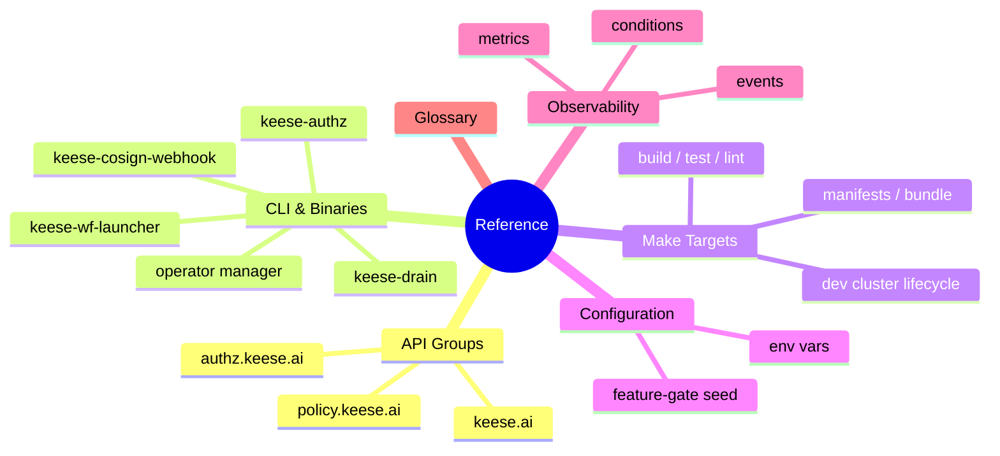

<!-- SPDX-License-Identifier: Apache-2.0 -->
<!-- Copyright (c) 2026 keese-ai -->

# Reference

Authoritative technical specifications for keese: CRD schemas, CLI binaries, Make targets, runtime configuration, feature-gate catalog, observability signals, and the project glossary.

!!! info "Audience"
    All keese users — platform operators, tenant admins, and agent developers — who need
    precise field-level or command-level detail. · **Prerequisites:**
    [Concepts in 5 minutes](../getting-started/concepts-in-5-minutes.md) ·
    [Architecture overview](../concepts/architecture.md)

---

## What is in this section

The Reference section covers the stable, lookup-oriented material. Use it when you know
_what_ you want to do and need exact field names, allowed values, flag syntax, or metric
labels. For narrative explanations see [Concepts](../concepts/index.md); for
step-by-step tasks see [Guides](../guides/index.md).

---

## API reference

keese exposes 20 CRD kinds across three API groups, all currently at `v1alpha1`.
Every type ships with a status subresource, `observedGeneration`, printer columns,
and `// +keese:rebac-tuple=...` markers on authorization-affecting fields.

```mermaid
erDiagram
    KEESE_AI ||--o{ Workspace : owns
    KEESE_AI ||--o{ WorkspaceSession : owns
    KEESE_AI ||--o{ WorkspaceShare : owns
    KEESE_AI ||--o{ AgentRuntime : owns
    KEESE_AI ||--o{ RuntimeExtension : owns
    KEESE_AI ||--o{ Memory : owns
    KEESE_AI ||--o{ SharedMemory : owns
    KEESE_AI ||--o{ Recipe : owns
    KEESE_AI ||--o{ RecipeSource : owns
    KEESE_AI ||--o{ Transport : owns
    KEESE_AI ||--o{ Workflow : owns
    KEESE_AI ||--o{ WorkflowRun : owns
    KEESE_AI ||--o{ Tenant : owns
    AUTHZ_KEESE_AI ||--o{ OIDCProvider : owns
    AUTHZ_KEESE_AI ||--o{ GuardrailBinding : owns
    AUTHZ_KEESE_AI ||--o{ CrossTenantAgreement : owns
    AUTHZ_KEESE_AI ||--o{ ToolBinding : owns
    AUTHZ_KEESE_AI ||--o{ WorkspaceTool : owns
    POLICY_KEESE_AI ||--o{ TokenBudget : owns
    POLICY_KEESE_AI ||--o{ FeatureGate : owns
```

| Page | API group | Kinds |
|---|---|---|
| [keese.ai group](api/keese.md) | `keese.ai/v1alpha1` | `Workspace`, `WorkspaceSession`, `WorkspaceShare`, `AgentRuntime`, `RuntimeExtension`, `Memory`, `SharedMemory`, `Recipe`, `RecipeSource`, `Transport`, `Workflow`, `WorkflowRun`, `Tenant` |
| [authz.keese.ai group](api/authz.md) | `authz.keese.ai/v1alpha1` | `OIDCProvider`, `GuardrailBinding`, `CrossTenantAgreement`, `ToolBinding`, `WorkspaceTool` |
| [policy.keese.ai group](api/policy.md) | `policy.keese.ai/v1alpha1` | `TokenBudget`, `FeatureGate` |

!!! note
    All kinds are `v1alpha1`. Promotion to `v1beta1` requires a conversion webhook and
    a scored migration plan (see
    [SDLC & the design gate](../development/sdlc.md)).

---

## CLI & binaries

Four binaries are shipped alongside the operator manager. None exposes a user-facing
`keese` CLI at this time — that is planned.

!!! warning "Planned — not yet implemented"
    A `keese` end-user CLI (for creating workspaces, attaching sessions, inspecting
    token budgets, etc.) is on the roadmap but not yet implemented. All current user
    interaction goes through `kubectl` against the CRD API.

| Binary | Purpose |
|---|---|
| `manager` (`cmd/main.go`) | Operator manager — runs all 18 reconcilers and admission webhooks |
| `keese-authz` (`cmd/keese-authz/`) | In-cluster authorization service — ext_authz gRPC endpoint for Envoy; evaluates OpenFGA tuples |
| `keese-drain` (`cmd/keese-drain/`) | Agent session drain helper — checkpoints goose session state to the workspace PVC on SIGTERM |
| `keese-wf-launcher` (`cmd/keese-wf-launcher/`) | Workflow launcher sidecar — translates `WorkflowRun` events into Argo `Workflow` submissions |
| `keese-cosign-webhook` (`cmd/keese-cosign-webhook/`) | Admission webhook — verifies the Sigstore cosign keyless-OIDC signature of OLM bundle images at InstallPlan/CSV admission (gated by FeatureGates); does not gate arbitrary pod images |

Full flag reference: [CLI & binaries](cli.md)

---

## Make targets

`make help` prints the full catalog with one-line descriptions. Key groups:

| Group | Representative targets |
|---|---|
| Code quality | `fmt`, `vet`, `lint`, `vuln`, `tidy` |
| Testing | `test-unit`, `test-integration`, `test`, `smoke` |
| Code generation | `manifests`, `generate` |
| OLM bundle | `bundle`, `bundle-validate`, `bundle-build`, `bundle-sign-verify` |
| Images | `docker-build`, `goose-runtime-build`, `cosign-webhook-build` |
| Dev cluster | `kind-up`, `kind-down`, `bootstrap-infra`, `tilt-up`, `tilt-down` |
| Deploy | `deploy`, `undeploy`, `install`, `uninstall` |
| Feature gates | `featuregate-list`, `featuregate-diff` |
| Docs & diagrams | `doc-check`, `diagram-render`, `plan-score` |
| Gate & verification | `design-gate`, `verify`, `verify-placeholders` |

Full target reference with flags: [Make targets](make-targets.md)

---

## Configuration & environment

The operator, agent runtimes, and development tooling are configured through environment
variables and a small set of ConfigMap-backed settings. Secrets are never passed as env
vars on agent pods — they are projected files or credential-brokered at the gateway.

| Reference | Covers |
|---|---|
| [Configuration & environment](configuration.md) | Env vars for the operator manager, gateway integration, OTEL exporter, OpenFGA endpoint, and OpenBao address |

---

## Feature-gate catalog

Feature gates let you enable alpha capabilities or disable deprecated behavior at cluster
or namespace scope via the `FeatureGate` CRD (`policy.keese.ai/v1alpha1`).

| Reference | Covers |
|---|---|
| [Feature gate catalog](feature-gate-catalog.md) | Every named gate: stage (`Alpha`/`Beta`/`GA`), default value, and the functionality it guards |

For how-to usage see [Toggle feature gates](../guides/feature-gates.md) and the concept
page [Feature gates](../concepts/feature-gates.md).

---

## Metrics, events & conditions

keese exposes Prometheus metrics via the operator manager's `/metrics` endpoint,
Kubernetes Events with structured `reason` values from per-kind `events.go` tables,
and a standardised set of `metav1.Condition` types on every CRD status.

| Reference | Covers |
|---|---|
| [Metrics, events & conditions](metrics-events.md) | Metric names and labels, event reason constants, and condition type/reason vocabulary |

---

## Glossary

| Reference | Covers |
|---|---|
| [Glossary](glossary.md) | Definitions for keese-specific and Kubernetes/AI-agent terms used throughout the documentation |

---

## Next steps

- [API reference overview](api/index.md) — start here for CRD schema detail.
- [Concepts](../concepts/index.md) — understand the architecture before diving into field-level specs.
- [Guides](../guides/index.md) — task-oriented how-to pages that reference these specs.
- [Development](../development/index.md) — contributor reference: repo map, SDLC, testing, and CI/CD.
