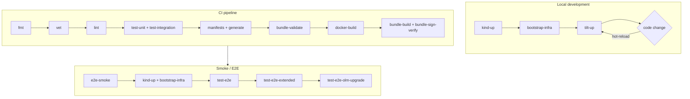
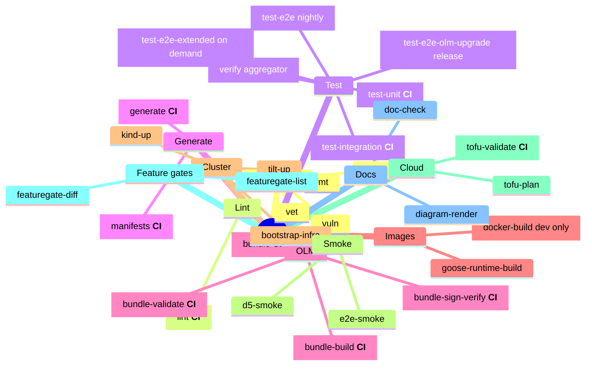

<!-- SPDX-License-Identifier: Apache-2.0 -->
<!-- Copyright (c) 2026 keese-ai -->

# Make targets

Every `make` target in the keese repo, grouped by area, with guidance on when to reach for each one.

!!! info "Audience"
    Contributors building, testing, or releasing keese. · **Prerequisites:** [Development environment (Nix)](../development/dev-environment.md) · [Repository map](../development/repo-map.md)

The repo root contains two Makefiles:

- **`Makefile`** — the wrapper; owns all keese-specific targets and the grouping/help system. This is the file you interact with.
- **`Makefile.operator-sdk-generated`** — scaffolded by `operator-sdk init`; owns `controller-gen`, `kustomize`, `setup-envtest`, and the low-level OLM bundle steps. The wrapper delegates to it via `$(MAKE) -f Makefile.operator-sdk-generated <target>`.

Run `make` (no target) to print the grouped help output. Run `make version` to verify your tool versions before starting.

```bash
make          # grouped help
make version  # check go, kubectl, kustomize, operator-sdk, helm, kind, tilt, tofu
```

---

## Target flow overview



---

## Go hygiene

These targets run against `api/`, `internal/`, and `cmd/`.

| Target | What it does | When to use |
|---|---|---|
| `fmt` | `gofumpt` + `goimports -local github.com/keese-ai/keese` on all three source trees | Before committing; no-op if tools are absent |
| `vet` | `go vet ./...` | Before committing; fast static check |
| `tidy` | `go mod tidy -diff` — fails on drift | After adding or removing imports |
| `vuln` | `govulncheck ./...` — fails on known CVEs | Before opening a PR; weekly in CI |

!!! tip
    `fmt`, `vet`, and `tidy` are safe to run repeatedly. They are idempotent.

---

## Lint

| Target | What it does | When to use | CI? |
|---|---|---|---|
| `lint` | `pre-commit run --all-files` — runs golangci-lint, yamllint, markdownlint, shellcheck, detect-secrets, gitleaks, and addlicense | Pre-PR; also blocks merge in CI | yes |

`lint` delegates to pre-commit so the exact linter set tracks `.pre-commit-config.yaml`. Run `pre-commit run <hook-id>` to target a single linter.

---

## Test

| Target | What it does | When to use | CI? |
|---|---|---|---|
| `envtest-setup` | `setup-envtest use 1.30.x --bin-dir bin/` | Once per checkout, or after a Go version bump | dependency |
| `test-unit` | `go test -short -race ./...` | On every save cycle | yes |
| `test-integration` | envtest-backed tests with `//go:build integration` tag, 20 min timeout | Before pushing a controller change | yes |
| `test` | Composed: `test-unit` + `test-integration` | Standard pre-PR gate | yes |
| `test-e2e` | kuttl against `kind-keese-dev` — requires a live cluster | After `e2e-smoke` confirms the cluster is up | yes (nightly) |
| `test-e2e-extended` | Six kuttl suites: workspace-progression, agentruntime-drain, multi-tenant, chaos-network, cross-workspace, non-interactive-launcher | Full regression gate; requires seeded OpenFGA + OpenBao | on demand |
| `test-e2e-olm-upgrade` | kuttl OLM upgrade suite: install v1, upgrade to v2, assert cross-version stability | Before cutting an OLM release | on release |
| `verify` | Composed: `fmt` + `vet` + `lint` + `test` + `bundle-validate` | Full local pre-merge check | — |

!!! warning "Extended and OLM upgrade suites"
    `test-e2e-extended` and `test-e2e-olm-upgrade` require a running kind cluster, seeded OpenFGA and OpenBao, and pre-loaded bundle images. They do not run in the standard CI pipeline — they gate release candidates only.

```bash
# Standard pre-PR flow
make test
make lint

# Full local gate (takes ~25 min)
make verify
```

---

## Manifest and code generation

These targets delegate to `Makefile.operator-sdk-generated` via `controller-gen`.

| Target | What it does | When to use | CI? |
|---|---|---|---|
| `manifests` | controller-gen: regenerates CRDs, RBAC, and webhook manifests from `api/` and `internal/` markers | After changing any `// +kubebuilder:` marker | yes |
| `generate` | controller-gen: regenerates `zz_generated.deepcopy.go` across all API groups | After adding or changing a struct field | yes |

!!! note
    Both `manifests` and `generate` must be re-run and their output committed whenever you change API types. CI fails if generated files are out of sync — run these locally before pushing.

```bash
make manifests generate
git diff  # should show only generated file changes
```

---

## OLM bundle

| Target | What it does | When to use | CI? |
|---|---|---|---|
| `bundle` | `operator-sdk generate bundle CHANNELS=alpha DEFAULT_CHANNEL=alpha` — regenerates `bundle/` | After any change to CRDs, RBAC, or CSV metadata | yes |
| `bundle-validate` | `operator-sdk bundle validate ./bundle --select-optional suite=operatorframework` | After `bundle`; also run by `verify` | yes |
| `bundle-build` | Builds the bundle OCI image `$(BUNDLE_IMG)` | Prepare for a release candidate | yes |
| `bundle-sign-verify` | `cosign verify` keyless OIDC on `$(BUNDLE_IMG)` — required CI status check before catalog-push | Release gate | yes |

```bash
# Regenerate and validate locally
make bundle bundle-validate

# Variables
make bundle-build BUNDLE_IMG=ghcr.io/keese-ai/keese-bundle:v0.1.0
```

!!! warning "Signing is CI-only"
    `bundle-sign-verify` verifies signatures produced by the GitHub Actions `image.yaml` workflow. Locally-built images are unsigned and cannot pass this check without a break-glass override (see [security rule 05.13](https://github.com/keese-ai/keese/blob/main/.claude/rules/05-security-zero-trust.md)).

---

## Container images

| Target | What it does | When to use |
|---|---|---|
| `docker-build` | `docker buildx build --platform linux/amd64,linux/arm64 -t $(IMG)` | Local dev only; production uses `image.yaml` on tag push |
| `docker-push` | Push operator image | Local/dev; prints a warning — production uses CI tag flow |
| `cosign-webhook-build` | Multi-arch build of `keese-cosign-webhook` image | CI; or rebuild after webhook code changes |
| `cosign-webhook-push` | Push cosign-webhook image | CI only |
| `goose-runtime-build` | Build the `goose-runtime` image (block/goose + keese-drain) | Rebuild after goose runtime changes |
| `goose-runtime-load` | `goose-runtime-build` then `kind load docker-image` into the dev cluster | After rebuilding the runtime; faster than a full re-bootstrap |

Override the default image tag:

```bash
make docker-build IMG=ghcr.io/keese-ai/keese:my-branch
```

---

## Cluster lifecycle (kind + Tilt)

All targets that modify the cluster first call `scripts/guard-kube-context.sh` to block accidental writes to production contexts.

| Target | What it does | When to use |
|---|---|---|
| `kind-up` | `ctlptl apply -f dev/kind/ctlptl.yaml` (falls back to `kind create cluster`) | Once per dev session or after a clean teardown |
| `kind-down` | Delete the `keese-dev` kind cluster | Cleanup |
| `bootstrap-infra` | `helmfile sync dev/bootstrap/` + apply NATS streams + apply AI Gateway stack | After `kind-up`; re-run after infra chart upgrades |
| `tilt-up` | `tilt up` — hot-reload of the operator binary | Main inner dev loop after the cluster is up |
| `tilt-down` | `tilt down` | Stop the hot-reload loop |
| `install` | `kustomize build config/crd | kubectl apply` — install CRDs only | Apply CRD changes without a full deploy |
| `uninstall` | Remove CRDs from the cluster | Teardown |
| `deploy` | `kustomize build config/default | kubectl apply` — deploy the operator | Non-Tilt deployments; staging |
| `undeploy` | Remove the operator deployment | Teardown |

```bash
# Full local cluster bootstrap
make kind-up
make bootstrap-infra
make tilt-up
```

---

## Smoke and end-to-end tests

| Target | What it does | When to use |
|---|---|---|
| `e2e-smoke` | Full end-to-end smoke: kind up + bootstrap + operator + samples via `scripts/dev/e2e-smoke.sh` | Pre-PR; pass `--no-keep` to tear down automatically |
| `d5-smoke` | D5 T1+T2 Anthropic round-trip + memory persistence smoke | After `e2e-smoke --keep`; validates live AI Gateway path |
| `smoke` | Post-gate smoke via `scripts/dev/smoke.sh` | Gate-passing validation |

```bash
# Smoke with cleanup
make e2e-smoke -- --no-keep

# Smoke keeping the cluster, then run D5
make e2e-smoke
make d5-smoke
```

---

## OpenTofu (cloud deploy)

| Target | What it does | When to use |
|---|---|---|
| `tofu-validate` | `tofu fmt -check` + `tofu validate` + `conftest` policy checks across `deploy/opentofu/{aws,gcp,azure}` | Before a cloud deploy; runs in CI |
| `tofu-plan` | `tofu plan -lock=false` across all cloud modules (read-only) | Review planned changes before apply |

!!! warning "Planned — not yet implemented"
    `tofu-apply` targets are not present in the Makefile; applies run manually from the relevant `deploy/opentofu/<cloud>` directory after reviewing the plan output. Automated apply via CI is a planned feature.

---

## Feature gates

| Target | What it does | When to use |
|---|---|---|
| `featuregate-list` | Print every keese FeatureGate with stage, override, and effective value via `scripts/featuregate-list.sh` | Quick status check; debug unexpected behavior |
| `featuregate-diff` | `kubectl diff -f $(NEW)` a candidate FeatureGate seed file against current cluster state | Before applying a new FeatureGate configuration |

```bash
make featuregate-list
make featuregate-diff NEW=config/featuregates/candidate.yaml
```

See [Feature gate catalog](feature-gate-catalog.md) for the full list of gate IDs and stages.

---

## Documentation and diagrams

| Target | What it does | When to use |
|---|---|---|
| `doc-check` | `markdownlint --all-files` + `lychee --offline` link check | Before opening a docs PR |
| `diagram-render` | `scripts/check-diagram-freshness.sh` — verifies diagram sources match rendered output | After editing a Mermaid or D2 source |
| `plan-score` | Prints a reminder to dispatch the `plan-scorer` agent | Not a real runner; see `docs/plans/rubric.md` |

---

## IDE and design gate

| Target | What it does | When to use |
|---|---|---|
| `ide-config` | `rsync` GoLand and VSCode debug configs from `dev/ide/` into `.idea/` and `.vscode/` | Fresh clone setup; after IDE config updates |
| `design-gate` | `scripts/check-design-gate.sh` — verify all designs + specs are scored ≥ 90 | Before merging implementation work |
| `verify-placeholders` | `scripts/verify-placeholders.sh` — fail if any `{{TOKEN}}` placeholder remains | Before landing a scaffolded doc or manifest |

---

## Key variables

| Variable | Default | Override example |
|---|---|---|
| `IMG` | `ghcr.io/keese-ai/keese:dev` | `IMG=ghcr.io/keese-ai/keese:v0.1.0` |
| `GOOSE_RUNTIME_IMG` | `ghcr.io/keese-ai/goose-runtime:dev` | `GOOSE_RUNTIME_IMG=my-reg/goose:v0.1.0` |
| `BUNDLE_IMG` | `ghcr.io/keese-ai/keese-bundle:dev` | `BUNDLE_IMG=ghcr.io/keese-ai/keese-bundle:v0.1.0` |
| `COSIGN_WEBHOOK_IMG` | `ghcr.io/keese-ai/keese-cosign-webhook:dev` | — |
| `K8S_VERSION` | `1.30.x` | `K8S_VERSION=1.31.x` |
| `KIND_CLUSTER` | `keese-dev` | `KIND_CLUSTER=my-cluster` |
| `NEW` | _(unset)_ | `NEW=path/to/featuregate.yaml` (for `featuregate-diff`) |

Place overrides in `.env.local` (gitignored) and source it before running make, or pass them on the command line.

---

## CI-tagged targets at a glance



---

## See also

- [CI/CD pipeline](../development/cicd.md) — how targets map to GitHub Actions workflows
- [Build & release (OLM + cosign)](../development/build-release.md) — the release flow end-to-end
- [Bootstrap a local cluster (kind + Tilt)](../guides/bootstrap-local.md) — step-by-step local setup
- [Feature gate catalog](feature-gate-catalog.md) — all gate IDs and stages
