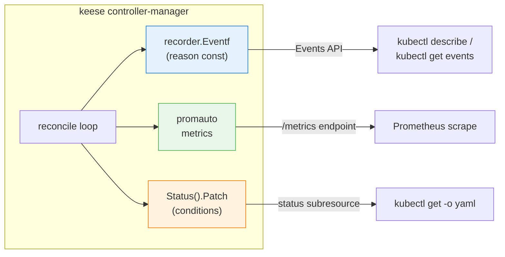
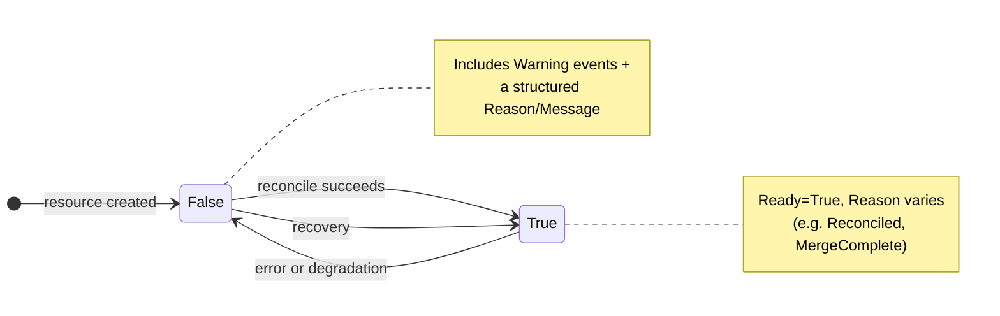

<!-- SPDX-License-Identifier: Apache-2.0 -->
<!-- Copyright (c) 2026 keese-ai -->

# Metrics, events & conditions

Reference tables for every Prometheus metric, Kubernetes event reason, and status condition type emitted by keese controllers — sourced directly from the event-reason constants files and controller source.

!!! info "Audience"
    Cluster operators and SREs who need to wire alerts, interpret `kubectl describe`, or build dashboards. **Prerequisites:** a running keese installation; familiarity with [Concepts: Token budgets & observability](../concepts/observability.md) and [Guides: Observability setup](../guides/observability-setup.md).

---

## How signals are structured

keese controllers emit three complementary signal types:

- **Prometheus metrics** — counters, histograms, and gauges scraped from the operator pod and the in-process feature-gate library. Only two controllers expose metrics today (`authz/OIDCProvider` and `internal/featuregate`). The `authz.*` controllers (GuardrailBinding, CrossTenantAgreement, OIDCProvider) write no metrics for authorization decisions; those go to the ext_authz **audit log** instead (see [below](#authzkeeseai-no-metrics-audit-log-only)).
- **Kubernetes events** — structured `recorder.Eventf` calls keyed on finite reason constants. Every reason const lives in a per-package `*_events.go` file; free-text reasons are forbidden by [`.claude/rules/04-kubernetes.md §11`](https://github.com/keese-ai/keese/blob/main/.claude/rules/04-kubernetes.md).
- **Status conditions** — `metav1.Condition` slices on every CRD status, always including `Ready`. Conditions use `observedGeneration` so stale reads are detectable.



---

## Prometheus metrics

### `authz.keese.ai` — OIDCProvider controller

Five metrics are registered at package init time in
[`internal/controller/authz/oidcprovider_controller.go`](https://github.com/keese-ai/keese/blob/main/internal/controller/authz/oidcprovider_controller.go).

| Metric name | Type | Labels | Description |
|---|---|---|---|
| `keese_oidc_template_eval_errors_total` | Counter | `provider`, `template`, `reason` | Total OIDCProvider template evaluation errors. |
| `keese_oidc_audience_template_eval_total` | Counter | `provider`, `template`, `result` | Total audience template evaluations (`result=success` or error string). |
| `keese_oidc_token_rotation_seconds` | Histogram | `provider`, `template` | Observed SA token rotation durations (default Prometheus buckets). |
| `keese_gateway_jwks_fetch_failures_total` | Counter | `provider` | JWKS endpoint fetch failures per provider. Increments on both discovery failure and HTTP fetch failure. |
| `keese_oidc_cache_invalidations_total` | Counter | `provider`, `trigger` | Cache-flush signals sent to gateway pods (`trigger=deletion` on CRD removal). |

!!! tip "Useful alert — JWKS degradation"
    ```yaml
    - alert: OIDCProviderJWKSDegraded
      expr: increase(keese_gateway_jwks_fetch_failures_total[5m]) > 3
      for: 2m
      annotations:
        summary: "OIDCProvider {{ $labels.provider }} JWKS endpoint repeatedly failing"
    ```

### `policy.keese.ai` — FeatureGate library

Two metrics are registered by `internal/featuregate/featuregate.go` in every keese binary that imports the package.

| Metric name | Type | Labels | Description |
|---|---|---|---|
| `keese_featuregate_eval_total` | Counter | `gate`, `value`, `binary` | Increments on every call to `gates.Enabled()`. Use to detect which processes are reading which gates. |
| `keese_featuregate_state` | Gauge | `gate` | Current effective value of each gate (`0`=off, `1`=on). Alert on unexpected flips. |

!!! warning "Planned — not yet implemented"
    A `keese_featuregate_drift_seconds` histogram (lag between CR change and binary observing it) is described in [`docs/designs/27-feature-gates-openfeature.md`](https://github.com/keese-ai/keese/blob/main/docs/designs/27-feature-gates-openfeature.md) but is not yet emitted by the codebase.

### `keese-cosign-webhook` — standard controller-runtime metrics

The cosign webhook binary starts a `ctrl.Manager` with `metricsserver.Options` bound on
port **8082** (default; override via `METRICS_PORT` env or `--metrics-port` flag). No
webhook-specific custom counters are registered in `internal/admission/cosign/handler.go`
— all metrics come from the controller-runtime framework itself.

| Metric name | Type | Description |
|---|---|---|
| `controller_runtime_webhook_requests_total` | Counter | Admission webhook requests by path and status code. |
| `controller_runtime_webhook_request_duration_seconds` | Histogram | Latency per webhook request. |
| `go_goroutines`, `go_gc_*`, `process_*` | Gauge / Counter | Standard Go runtime and process metrics. |

!!! tip "Scrape endpoint"
    ```
    GET http://<pod>:8082/metrics
    ```
    The metrics port is not exposed via a Kubernetes `Service` by default in the dev
    overlay; add a `ServiceMonitor` or a dedicated metrics `Service` when integrating
    with Prometheus Operator in production.

### `authz.keese.ai` — no metrics, audit log only

!!! warning "keese-authz emits no Prometheus metrics"
    The GuardrailBinding, CrossTenantAgreement, and OIDCProvider (for authorization decisions) controllers do **not** expose per-decision counters. Authorization check results — `(tuple, subject, host, decision, upstream_status)` — flow through the `keese-authz` ext_authz service's structured access log (OpenTelemetry trace spans + OTEL-formatted log lines), not through the Prometheus scrape endpoint. See rule [`05-security-zero-trust.md §10`](https://github.com/keese-ai/keese/blob/main/.claude/rules/05-security-zero-trust.md) for the audit-log field contract.

    If you need dashboards for authz decisions, query the OTEL-backed Elastic/ECK index, not Prometheus.

---

## Kubernetes event reasons

Event reasons are scoped to the controller package that emits them. The type column shows `N` (Normal) or `W` (Warning).

### `keese.ai` — Workspace & WorkspaceSession controllers

Source: [`internal/controller/keese/workspace_events.go`](https://github.com/keese-ai/keese/blob/main/internal/controller/keese/workspace_events.go)

| Reason | Type | Description |
|---|---|---|
| `WorkspaceProvisioned` | N | Workspace transitioned to Provisioning. |
| `WorkspaceReady` | N | Workspace reached Running phase. |
| `WorkspaceIdle` | N | Workspace transitioned to Idle (no active sessions). |
| `WorkspaceEvicted` | W | Workspace evicted (idle timeout or admin action). |
| `WorkspaceTerminating` | N | Workspace deletion started. |
| `NetworkPolicyEnsured` | N | Default-deny NetworkPolicy applied. |
| `ServiceAccountEnsured` | N | ServiceAccount created or confirmed. |
| `PVCEnsured` | N | Session-state PVC bound. |
| `RebacTupleWritten` | N | OpenFGA tuple write confirmed. |
| `RebacTupleDeleteFailed` | W | OpenFGA tuple deletion failed during cleanup. |
| `RuntimeBootstrapFailed` | W | AgentRuntime bootstrap returned an error. |
| `ShareReferenceGrantProjected` | N | Cross-namespace ReferenceGrant created (WorkspaceShare). |
| `ShareReferenceGrantPruned` | N | Stale ReferenceGrant removed. |
| `ShareReferenceGrantEnsured` | N | ReferenceGrant confirmed present. |
| `ShareRebacTupleWritten` | N | OpenFGA tuple written for WorkspaceShare. |
| `ShareRebacTupleDeleteFailed` | W | OpenFGA tuple deletion failed (WorkspaceShare cleanup). |
| `SessionAttaching` | N | WorkspaceSession entering Attaching phase. |
| `SessionActive` | N | Session pod is running and attached. |
| `SessionDraining` | N | Session draining in-flight work (SIGTERM path). |
| `SessionEvicted` | W | Session evicted (token budget, idle timeout, or admin). |
| `SessionAttachRejectedNonInteractive` | W | Attach attempt rejected — workspace is non-interactive. |
| `SessionDuplicate` | W | A session with the same `(attachSubject, sessionName)` already exists. |
| `SessionPodProvisioned` | N | Agent runtime pod created for this session. |
| `SessionPodTornDown` | N | Agent runtime pod deleted. |
| `SessionAttachedByTupleWritten` | N | OpenFGA `attached_by` tuple written on Active transition. |
| `SessionDrained` | N | In-flight work drained before pod deletion. |
| `SessionResumed` | N | Session resumed after a drain/eviction cycle. |
| `SessionCompleted` | N | Non-interactive recipe-driven session pod exited with `PodSucceeded`. |
| `SessionRecipeMounted` | N | Controller selected the non-interactive recipe path for this session. |
| `TokenBudgetExceeded` | W | Workspace token budget gate fired; session is blocked or rate-limited. |

### `keese.ai` — Memory & SharedMemory controllers

Source: [`internal/controller/keese/memory_events.go`](https://github.com/keese-ai/keese/blob/main/internal/controller/keese/memory_events.go)

| Reason | Type | Description |
|---|---|---|
| `ProvisioningStarted` | N | Controller began backend provisioning. |
| `ProvisioningFailed` | W | Backend provisioning returned an error. |
| `ProvisioningSucceeded` | N | Backend confirmed healthy after provisioning. |
| `DeprovisioningStarted` | N | Finalizer began backend cleanup. |
| `DeprovisioningFailed` | W | Backend cleanup returned an error. |
| `DeprovisioningSucceeded` | N | Backend cleanup completed before finalizer removal. |
| `RebacSyncFailed` | W | OpenFGA tuple writes failed. |
| `RebacSyncSucceeded` | N | OpenFGA tuples confirmed written. |
| `RebacPurgeFailed` | W | OpenFGA tuple deletion failed during cleanup. |
| `HAViolation` | W | Redis or Qdrant provider lacks HA replicas outside a dev namespace. |
| `AuthzDenied` | W | SharedMemory `sharedWith[]` mutation rejected by authz check. |
| `Degraded` | W | Backend reported an unhealthy state. |
| `Ready` | N | Resource transitioned to Ready phase. |

### `keese.ai` — Transport controller

Source: [`internal/controller/keese/transport_events.go`](https://github.com/keese-ai/keese/blob/main/internal/controller/keese/transport_events.go)

| Reason | Type | Description |
|---|---|---|
| `TransportProvisioned` | N | Transport transitioned to Ready. |
| `TransportUnreachable` | W | Dependency (NATS, MCP endpoint, A2A peer) is unreachable. |
| `TransportTypeImmutable` | W | Attempt to mutate `spec.type` was rejected. |
| `NATSStreamOwned` | N | Controller took ownership of a JetStream stream via annotation. |
| `NATSStreamNotFound` | W | Non-opt-in mode: referenced JetStream stream does not exist. |
| `NATSStreamDeleteFailed` | W | Controller-owned JetStream stream deletion failed during finalizer cleanup. |
| `NATSStreamConfigIgnored` | W | `spec.nats.streamConfig` set without the auto-create-stream annotation. |
| `NATSStreamMigrationRequired` | W | Live stream config change requires a dual-consumer backfill migration. |
| `NATSStreamProjected` | N | NACK `Stream` CRD successfully SSA-projected for owned NATS transport. |
| `MCPRouteNotFound` | W | `spec.mcp.mcpRouteRef` cannot be resolved. |
| `ReferenceGrantMissing` | W | Cross-namespace reference requires a ReferenceGrant that is absent. |
| `CertificateNotFound` | W | TLS certificate secret ref cannot be resolved. |
| `CertificateProjected` | N | cert-manager Certificate SSA-projected for this transport. |
| `CertificateProjectionFailed` | W | cert-manager Certificate SSA-projection failed. |
| `A2APeerAuthzDenied` | W | OpenFGA cross-tenant authz check denied the messaging attempt. |
| `CrossTenantAgreementMissing` | W | `spec.a2a.scope=cross-tenant` but no Approved CRA covers the workspace pair. |
| `StreamLagged` | W | stdio `outboundQueueDepth` ceiling reached; oldest frame dropped. |

### `keese.ai` — Workflow & WorkflowRun controllers

Source: [`internal/controller/keese/workflow_events.go`](https://github.com/keese-ai/keese/blob/main/internal/controller/keese/workflow_events.go)

| Reason | Type | Description |
|---|---|---|
| `WorkflowProjected` | N | Argo `WorkflowTemplate` created or updated via SSA. |
| `TriggerProjected` | N | Trigger resource (CronJob / KEDA ScaledObject / Knative Trigger / HTTPRoute) reconciled. |
| `TriggerProjectionFailed` | W | Trigger SSA failed. |
| `TriggerAuthSecretMissing` | W | Auth Secret referenced by a trigger was not found. |
| `OutputProjected` | N | Output resource (Knative Sink / NATS stream / S3 config) reconciled. |
| `WorkflowCascadeBlocked` | W | Deletion deferred — in-flight WorkflowRuns not yet terminal. |
| `WorkflowRunProjected` | N | Argo `Workflow` created or updated via SSA. |
| `WorkflowRunFailed` | W | Terminal failure; WorkflowRun moved to Failed/Error phase. |
| `ArtifactBackendMissing` | W | No artifact backend resolved (neither `spec.artifactStoreRef` nor Tenant fallback). |
| `ArtifactSecretFailed` | W | Artifact credential Secret could not be created or updated. |
| `RetryBudgetExhausted` | W | Run's retry budget dropped to zero after step failures. |
| `ArgoStatusSynced` | N | Argo Workflow phase mirrored to `WorkflowRun.status`. |
| `ArgoWatchDisconnected` | W | Argo Workflow watcher connection lost; re-list triggered. |
| `ConcurrentRunForbidden` | W | `ConcurrencyPolicy=Forbid` blocked a new WorkflowRun. |
| `ConcurrentRunForced` | N | `ConcurrencyPolicy=Replace` terminated an existing run. |
| `MissingWorkflowAudience` | W | Audience injection into Argo projected SA tokens failed. |
| `WorkflowAudienceInjected` | N | `keese-wf-<uid>` audience injected into Argo projected SA tokens. |
| `NATSStreamCreateFailed` | W | JetStream stream provisioning failed during WorkflowRun create. |
| `WorkflowNATSStreamProvisioned` | N | JetStream stream successfully provisioned for a WorkflowRun. |
| `WorkflowNATSStreamCleaned` | N | JetStream stream deleted on WorkflowRun cleanup. |
| `CronJobReady` | N | `batch/v1.CronJob` successfully SSA-applied (used as `TriggerProjected` condition reason). |
| `TriggerReady` | N | Knative `eventing/v1.Trigger` successfully SSA-applied. |
| `HTTPRouteReady` | N | `gateway.networking.k8s.io/v1.HTTPRoute` successfully SSA-applied. |
| `KEDAUnavailable` | W | KEDA ScaledObject CRD dependency unresolvable; NATSSubscription trigger not projected. |

### `keese.ai` — Recipe & RecipeSource controllers

Source: [`internal/controller/keese/recipe_events.go`](https://github.com/keese-ai/keese/blob/main/internal/controller/keese/recipe_events.go)

| Reason | Type | Description |
|---|---|---|
| `RecipePulled` | N | OCI artifact pulled from the RecipeSource. |
| `RecipeVerified` | N | cosign verification succeeded. |
| `RecipeImageUnverified` | W | Image pulled but cosign verification was skipped or unavailable. |
| `RecipePullFailed` | W | OCI pull returned an error. |
| `OCIPullFailed` | W | Lower-level OCI registry pull failure. |
| `CosignVerifyFailed` | W | cosign keyless verification failed; recipe will not advance to Verified. |
| `RecipeToolNotAllowed` | W | Admission rejected — a tool in `spec.tools` is not in the GuardrailBinding allowlist. |
| `RecipeModelNotAllowed` | W | Admission rejected — `spec.model` is not in the GuardrailBinding model allowlist. |
| `RecipeExtensionNotEnabled` | W | Admission rejected — a required RuntimeExtension is not enabled for the workspace. |
| `RecipeSourceNotFound` | W | `spec.sourceRef` cannot be resolved. |
| `RecipeAdmitExtAuthzTimeout` | W | ext_authz check timed out during admission. |
| `RecipeAdmissionDenied` | W | Admission hook denied the recipe. |
| `StaleParentStatus` | W | Parent RecipeSource status is stale (generation mismatch). |
| `DevSourceInProdNamespace` | W | A dev-only RecipeSource is referenced in a production namespace. |
| `ConfigMapSourceInNonDev` | W | ConfigMap-backed source used outside a dev namespace. |
| `GitCloneFailed` | W | Git clone failed for the RecipeSource. |
| `GitRefNotFound` | W | Git ref (branch/tag/SHA) not found. |
| `GitCloneSucceeded` | N | Git clone completed successfully. |
| `RecipeFinalizerAdded` | N | Finalizer added on first reconcile. |
| `RecipeCacheCleanup` | N | Cached OCI artifact cleaned up on deletion. |
| `RecipeReady` | N | Recipe reached Ready phase. |
| `RecipeFailed` | W | Recipe reached Failed phase. |

### `keese.ai` — AgentRuntime & RuntimeExtension controllers

Source: [`internal/controller/keese/runtime_events.go`](https://github.com/keese-ai/keese/blob/main/internal/controller/keese/runtime_events.go)

| Reason | Type | Description |
|---|---|---|
| `RuntimeStarted` | N | AgentRuntime reached Ready phase. |
| `RuntimeStopped` | N | AgentRuntime cleanly stopped. |
| `ProviderUnknown` | W | `spec.implementation` names an unregistered provider. |
| `ImageVersionUnsupported` | W | goose imageTag is outside `SupportedImageVersions`. |
| `SubAgentCleanupTimeout` | W | Sub-agent cleanup exceeded the drain budget. |
| `CredentialExpired` | W | SA token or upstream credential expired. |
| `ExtensionTupleWritten` | N | OpenFGA tuple written for RuntimeExtension. |
| `ExtensionTupleDeleted` | N | OpenFGA tuple deleted for RuntimeExtension. |
| `ExtensionRuntimeRefInvalid` | W | `spec.runtimeRef` names a missing AgentRuntime. |
| `ExtensionOpenFGAUnavailable` | W | OpenFGA unreachable during a tuple operation. |

### `keese.ai` — Tenant controller

Source: [`internal/controller/keese/tenancy_events.go`](https://github.com/keese-ai/keese/blob/main/internal/controller/keese/tenancy_events.go)

| Reason | Type | Description |
|---|---|---|
| `TenantProvisioned` | N | Tenant transitioned to Active. |
| `NamespaceAdded` | N | Namespace added to `status.namespaces[]`. |
| `NamespaceRemoved` | N | Namespace removed from `status.namespaces[]`. |
| `TenantLabelLocked` | W | Namespace label mutation denied — Tenant finalizer still active. |
| `CapsuleTenantNotFound` | W | `spec.capsuleTenantRef` cannot be resolved (Mode B). |
| `RefNotResolved` | W | A cross-namespace ref (`tokenBudgetRef`, `credentialPoolRef`, `artifactStoreRef`) cannot be resolved. |
| `TenantDeletionBlocked` | W | Deletion prevented by outstanding workspaces, namespaces, or agreements. |
| `SelectorOverlapDenied` | W | Namespace selector would overlap another Tenant's selector. |
| `NamespaceSelectorIgnoredInModeB` | W | Both `capsuleTenantRef` and `namespaceSelector` set; selector ignored. |
| `JWKSCacheExhausted` | W | JWKS fail-open window expired; gateway begins rejecting tokens. |
| `AuditRedactionUnavailable` | W | `auditArgumentsRedacted=true` but redaction sidecar unreachable. |

### `authz.keese.ai` — OIDCProvider controller

Source: [`internal/controller/authz/events.go`](https://github.com/keese-ai/keese/blob/main/internal/controller/authz/events.go)

| Reason | Type | Description |
|---|---|---|
| `TemplateInvalid` | W | Template parse failed during validation. |
| `AudienceTemplateEvalError` | W | Audience template evaluation returned an error. |
| `MissingWorkflowAudience` | W | Audience injection into projected SA tokens failed. |
| `TemplateValidationSucceeded` | N | All templates parsed successfully. |
| `OIDCProviderMissing` | W | A Tenant cross-reference cannot resolve its OIDCProvider. |
| `OIDCProviderDegraded` | W | Referenced OIDCProvider is in Degraded phase. |
| `JWKSUnreachable` | W | JWKS endpoint fetch failed or OIDC discovery failed. |
| `JWKSReachable` | N | JWKS endpoint responded successfully. |
| `CacheFlushComplete` | N | Cache-flush signal sent to all gateway pods before deletion. |
| `CacheFlushTimeout` | W | Cache flush timed out (60 s max); deletion proceeded anyway. |
| `BootstrapCRPreserved` | N | Bootstrap CR preserved (field owner differs from controller). |
| `BootstrapPlaceholderIssuer` | W | Bootstrap CR issuer contains an unresolved placeholder (`{...}` or `<...>`). |

### `authz.keese.ai` — GuardrailBinding controller

Source: [`internal/controller/authz/guardrail_events.go`](https://github.com/keese-ai/keese/blob/main/internal/controller/authz/guardrail_events.go)

| Reason | Type | Description |
|---|---|---|
| `BindingMerged` | N | Full merge across the scope chain completed. |
| `EffectivePolicyComputed` | N | `status.effectivePolicy` written. |
| `DefaultBindingMissing` | W | No cluster-default binding exists for the Tenant. |
| `MergeConflict` | W | Strictest-wins lattice detected a conflict (e.g. allowlist expansion attempt). |
| `CELCompileError` | W | Envoy SecurityPolicy CEL expression failed to parse. |
| `KyvernoProjectFailed` | W | Kyverno ClusterPolicy SSA patch failed. |
| `TupleWriteFailed` | W | OpenFGA tuple sync failed. |
| `DefaultBindingReadForbidden` | W | Controller cannot read the default binding (RBAC/namespace issue). |

### `authz.keese.ai` — CrossTenantAgreement controller

Source: [`internal/controller/authz/crosstenanagreement_events.go`](https://github.com/keese-ai/keese/blob/main/internal/controller/authz/crosstenanagreement_events.go)

| Reason | Type | Description |
|---|---|---|
| `CRAApproved` | N | CrossTenantAgreement transitioned to Approved. |
| `CRAExpired` | W | CrossTenantAgreement transitioned to Expired. |
| `CRARejected` | W | CrossTenantAgreement transitioned to Rejected. |
| `OutOfBandTupleObserved` | W | Pre-existing OpenFGA tuple detected for a workspace pair; sync is a no-op, audited. |
| `TupleSyncFailed` | W | OpenFGA Sync call failed for this CRA. |
| `WorkspaceSnapshotDrift` | W | Selector-resolved workspaces diverge from frozen `workspaceSnapshot` (new CRA required). |
| `CRAApprovalInvalid` | W | Approval annotation present but signature verification failed or approver lacks `can_approve_cra`. |
| `SignatureVerificationFailed` | W | cosign or SA-token HMAC verification returned an error. |
| `CRAConflict` | W | Existing Approved CRA already covers the same (from-tenant, to-tenant, workspace-pair) triplet. |
| `NATSStreamDeleted` | N | NATS JetStream stream for this CRA deleted on finalizer cleanup. |
| `NATSStreamDeleteFailed` | W | NATS JetStream stream deletion failed during finalizer cleanup. |

### `policy.keese.ai` — TokenBudget controller

Source: [`internal/controller/policy/events.go`](https://github.com/keese-ai/keese/blob/main/internal/controller/policy/events.go)

| Reason | Type | Description |
|---|---|---|
| `BudgetActive` | N | TokenBudget phase transitioned to Ready. |
| `BudgetExceeded` | W | Consumed tokens crossed a limit threshold. |
| `BudgetReset` | N | Window boundary passed; counters reset. |
| `MetricFetchFailed` | W | Prometheus query returned an error. |
| `BudgetSignalWriteFailed` | W | Write to NATS KV budget signal failed. |
| `BudgetEnforcementUnavailable` | W | Both controller and NATS are down; enforcement unavailable. |
| `TooManyBudgets` | W | Cluster-wide TokenBudget CR ceiling reached. |

### `policy.keese.ai` — FeatureGate controller

The FeatureGate controller emits one event reason:

| Reason | Type | Description |
|---|---|---|
| `RestartRequired` | N | A gate with `spec.restartRequired=true` transitioned within the last 30 s. Consumers listed in `spec.owners` need a pod rollout to observe the new value. |

!!! warning "Rule 04.11 deviation"
    `RestartRequired` is emitted as an inline string literal at
    [`internal/controller/policy/featuregate_controller.go:98`](https://github.com/keese-ai/keese/blob/main/internal/controller/policy/featuregate_controller.go#L98)
    rather than via a named constant in an `*_events.go` file. This is a known deviation
    from rule 04.11. A follow-up task will promote it to a constant in
    `internal/controller/policy/events.go`.

---

## Status conditions

All conditions use `metav1.Condition` with `observedGeneration` populated. The controller never reads its own status conditions as inputs to the next reconcile loop (spec/status coupling is forbidden by rule `04.4`).



### `keese.ai` conditions by kind

| Kind | Condition type | True means |
|---|---|---|
| **Workspace** | `Ready` | Workspace fully provisioned and in Running phase. |
| **Workspace** | `Progressing` | Provisioning or sub-resource creation in progress. |
| **Workspace** | `NetworkIsolated` | Default-deny NetworkPolicy is in place. |
| **Workspace** | `SessionStorageReady` | Session-state PVC is Bound. |
| **WorkspaceSession** | `Ready` | Session pod is active and attached. |
| **WorkspaceSession** | `Progressing` | Phase transition in progress. |
| **WorkspaceSession** | `Attached` | ACP client connected and `attached_by` tuple written to OpenFGA. |
| **WorkspaceSession** | `TokenBudgetWithinLimit` | Tenant/workspace token budget is not exhausted (or no budget exists). |
| **WorkspaceSession** | `TokenBudgetExceeded` | Budget ceiling crossed; session provisioning blocked. |
| **WorkspaceShare** | `Ready` | ReferenceGrant projected and active. |
| **WorkspaceShare** | `Progressing` | ReferenceGrant creation in progress. |
| **Memory / SharedMemory** | `Ready` | Backend provisioned and healthy. |
| **Transport** | `Ready` | Transport fully provisioned; dependencies reachable. |
| **Transport** | `Progressing` | Sub-resource creation in progress. |
| **Transport** | `CertificateProjected` | cert-manager Certificate SSA-applied for TLS. |
| **AgentRuntime** | `Ready` | Runtime pod started and serving. |
| **Recipe** | `Ready` | Recipe is verified, cached, and safe to mount. |
| **Recipe** | `Verified` | cosign keyless verification succeeded. |
| **Recipe** | `Progressing` | Pull or verification in progress. |
| **RecipeSource** | `Ready` | Source is synced and healthy. |
| **RecipeSource** | `Progressing` | Sync in progress. |
| **Workflow** | `Ready` | Argo WorkflowTemplate projected; all triggers active. |
| **Workflow** | `Progressing` | Projection or trigger reconciliation in progress. |
| **Workflow** | `TriggerProjected` | Trigger sub-resource (CronJob / HTTPRoute / Knative Trigger) applied. |

### `authz.keese.ai` conditions by kind

| Kind | Condition type | True means |
|---|---|---|
| **OIDCProvider** | `Ready` | Templates valid; JWKS reachable. |
| **OIDCProvider** | `JWKSReachable` | JWKS endpoint responded in the last probe cycle. |
| **GuardrailBinding** | `Ready` | Effective policy computed and written to `status.effectivePolicy`. |
| **GuardrailBinding** | `ParentReadable` | All inherited parent bindings are readable. |
| **CrossTenantAgreement** | `Approved` | Both tenants have approved; tuples written. _(used in the printer column)_ |

### `policy.keese.ai` conditions by kind

| Kind | Condition type | True means |
|---|---|---|
| **TokenBudget** | `Ready` | Budget in window; counters tracking normally. |
| **TokenBudget** | `BudgetExceeded` | Consumed tokens are above a limit threshold in the current window. |
| **TokenBudget** | `ResetFailed` | Window boundary detected but counter reset to Prometheus failed. |
| **TokenBudget** | `MetricFetchHealthy` | Most recent Prometheus query for consumed token counts succeeded. |
| **FeatureGate** | `Ready` | Gate effective value projected to `keese-system/keese-features`. |

---

## Quick-reference `kubectl` commands

```bash
# All Warning events cluster-wide for the last 30 minutes
kubectl get events -A --field-selector type=Warning \
  --sort-by='.lastTimestamp' | tail -40

# Events for a specific Workspace
kubectl describe workspace my-ws -n my-tenant

# Watch TokenBudget status
kubectl get tokenbudget my-budget -n my-tenant -w \
  -o jsonpath='{.status.phase} {.status.conditions[?(@.type=="BudgetExceeded")].status}{"\n"}'

# Check OIDCProvider health
kubectl get oidcprovider kubernetes-default \
  -o jsonpath='{.status.phase} JWKS={.status.conditions[?(@.type=="JWKSReachable")].status}{"\n"}'
```

---

## See also

- [Concepts: Token budgets & observability](../concepts/observability.md) — how the TokenBudget + OTEL pipeline fits together
- [Guides: Observability setup](../guides/observability-setup.md) — wiring Prometheus, OTEL, and alerts
- [Reference: API — policy.keese.ai](api/policy.md) — full `TokenBudget` and `FeatureGate` CRD schema
- [Reference: Feature gate catalog](feature-gate-catalog.md) — `keese_featuregate_*` metrics and gate details
