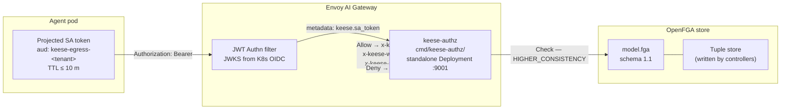

<!-- SPDX-License-Identifier: Apache-2.0 -->
<!-- Copyright (c) 2026 keese-ai -->

# OpenFGA authorization model

Complete reference for keese's Relationship-Based Access Control (ReBAC) model: every OpenFGA type, its relations, and the tuple shapes each controller writes — sourced from [`dev/bootstrap/openfga/model.fga`](https://github.com/keese-ai/keese/blob/main/dev/bootstrap/openfga/model.fga) and design [04a](https://github.com/keese-ai/keese/blob/main/docs/designs/04a-openfga-authz-model.md).

!!! info "Audience"
    Platform operators and security engineers who need to understand or audit keese's ReBAC model: what tuples exist, who writes them, and how a single OpenFGA `Check` authorizes an agent tool call. **Prerequisites:** [Authorization & ReBAC concepts](../concepts/authorization-rebac.md) · [Identity & zero-trust](../concepts/identity-zero-trust.md) · [Egress AI Gateway](../concepts/egress-ai-gateway.md).

---

## Overview

Every agent tool call in keese is authorized at the Envoy AI Gateway via an OpenFGA `ext_authz` filter. A compromised agent pod carries only a projected ServiceAccount token (TTL ≤ 10 m, audience `keese-egress-<tenant>`). The gateway terminates that token, derives the OpenFGA subject, and issues a **single `Check` call** — no dual-check, no in-process ACL — against the model defined in `model.fga` (schema `1.1`).

The model is loaded by a seed Job after store creation. It is versioned: migrations use a 6-step drain-and-rollout protocol (see [Model migration](#model-migration)).



!!! warning "Fail-closed"
    `failure_mode_allow: false` — Envoy denies on any gRPC error or timeout from `keese-authz`.
    OpenFGA unreachable → `503`. Check timeout → `403 authz-timeout`. There is no allow-by-default fallback.

---

## Types

The model defines ten top-level types. The table below maps each to its keese entity, controlling CRD, and identity key.

| OpenFGA type | keese entity | CRD | Identity key |
|---|---|---|---|
| `user` | Human operator or CI identity | OIDC identity (no CRD) | `user:<email>` or `user:ksa-<workspace-uid>` |
| `service_account` | Per-workspace projected SA | K8s `ServiceAccount` | `service_account:<sub>` |
| `witness` | Supervision agent (design 23) | Agent-supervision controller — **PLANNED, not implemented** | `witness:<id>` |
| `tenant` | Keese Tenant | `keese.ai/v1alpha1/Tenant` (cluster-scoped) | `tenant:<name>` (name, not uid — stable across delete+recreate) |
| `workspace` | Workspace CR | `keese.ai/v1alpha1/Workspace` (namespaced) | `workspace:<name>` |
| `tool` | Callable function/extension | `Workspace.spec.egress.allowedTools[]` (written by Workspace controller) | `tool:<name>` |
| `extension` | RuntimeExtension provider | `keese.ai/v1alpha1/RuntimeExtension` (namespaced) | `extension:<name>` |
| `credential` | BackendSecurityPolicy-referenced secret | OpenBao/KMS via ExternalSecrets | `credential:<name>` |
| `memory` | Memory or SharedMemory backend | `keese.ai/v1alpha1/{Memory,SharedMemory}` (namespaced) | `memory:<name>` |
| `oidc_provider` | OIDCProvider CR | `authz.keese.ai/v1alpha1/OIDCProvider` (cluster-scoped) | `oidc_provider:<name>` (leaf type — no relations defined on it) |

---

## Relations by type

### `tenant`

```
define admin:            [user]
define member:           [user, service_account] or admin
define allows_messaging: [tenant]
define uses_oidc_provider: [oidc_provider]
```

- **`admin`** — human tenant owners; written by the Tenant controller from `spec.adminSubjects[]`.
- **`member`** — users and workspace ServiceAccounts belonging to this tenant; computed via `or admin`. Written by the Workspace controller on workspace creation.
- **`allows_messaging`** — directional cross-tenant messaging grant written by the CrossTenantAgreement controller (design 25) after bilateral approval. Shape: `tenant:T_to#allows_messaging@tenant:T_from`. Intra-tenant a2a does NOT use this relation — it is implicit via Workflow NATS topic naming (`keese.tenant.<tenant-uid>.wf.<workflow-run-uid>.*`).
- **`uses_oidc_provider`** — per-tenant OIDC allow-list (design 28, iter-6). Written by the Tenant controller per `Tenant.spec.oidc.allowedProviders[]`. The `keese-authz` ext_authz service checks `Check(tenant:T#uses_oidc_provider@oidc_provider:P)` before accepting tokens from issuer P for tenant T; issuers not in the allow-list are denied.

---

### `workspace`

```
define owner:           [tenant]
define admin:           [user] or admin from owner
define editor:          [user] or admin
define viewer:          [user] or editor
define supervised_by:   [witness]
define can_run:         editor
define can_read_memory: viewer
define can_write_memory: editor
define tenant_member:   member from owner
define can_revoke:      [witness, service_account]
define messageable_from: [workspace]
```

Key design points:

- **`tenant_member`** is a computed relation: `member from owner`. It propagates `tenant.member` down to the workspace via the owning tenant, avoiding per-workspace tuple explosion. The `tool.can_call` path uses this to walk `tool → allowed_in → workspace → owner → tenant → member` in a single RTT.
- **`can_revoke`** is automation-only (subjects: `witness` and `service_account`). `user:*` never receives `can_revoke` — humans use `Workspace.spec.suspended` for graceful suspension. The operator install Job writes `workspace:*#can_revoke@service_account:keese-supervisor`; the supervision controller writes per-witness tuples. The admission webhook on `PATCH Workspace.spec.forceRevoke` calls `Check(workspace:<name>#can_revoke@<subject>)` (1-hop, p99 ≤ 15 ms) and emits `ForbiddenToRevoke` on deny.
- **`supervised_by`** references the `witness` type. The supervision ladder (design 23) is **PLANNED** — no supervisor reconciler is implemented. Witness tuples are not written today.
- **`messageable_from`** — workspace-pair grant for cross-tenant a2a (design 29, iter-5). Written by the CrossTenantAgreement controller as the cartesian product of `from.workspaceSelector × to.workspaceSelector` on Approved status. `keese-authz` enforces at NATS/a2a transport before subscribe and first publish.

---

### `tool`

```
define owner:     [extension]
define allowed_in: [workspace]
define can_call:  tenant_member from allowed_in
```

`can_call` is the primary authz relation for LLM/MCP egress. The computed path is:

```
tool:X → allowed_in → workspace:W → tenant_member → owner(tenant:T) → member → user/SA
```

One `Check` call covers the full 4–5 hop chain (p99 ≤ 50 ms). Fallback `--openfga-check-mode=dual` is an incident-mitigation flag only — not normal operation.

`tool.owner: [extension]` (not `[tenant]`) preserves the RuntimeExtension SPI boundary (design 7). The RuntimeExtension controller is the sole writer of tool ownership tuples; one ConfigMap update enables or disables an entire extension.

---

### `extension`

```
define owner:      [tenant]
define enabled_in: [workspace]
```

Written by the RuntimeExtension controller on extension creation and workspace binding.

---

### `credential`

```
define owner:   [tenant]
define bound_to: [workspace]
define can_use: [service_account] and bound_to
```

`Check(credential:C#can_use@SA)` gives the credential broker (design 17) a single authz call per request (p99 ≤ 25 ms, 2-hop). Every `can_use` decision emits a token-accounting event consumed by `TokenBudget` (design 10b).

---

### `memory`

```
define owner:  [workspace]
define reader: [user, service_account] or owner from owner
define writer: [user, service_account] or owner from owner
define can_read: reader
define can_write: writer
```

Written by the Memory controller on `SharedMemory` read/write grants.

---

### `service_account`

```
define member_of: [tenant]
```

Leaf relation linking a per-workspace projected SA back to its tenant.

---

### `user`, `witness`, `oidc_provider`

`user` and `witness` are bare types (no relations defined on them — they appear only as subjects). `oidc_provider` is a leaf type used only as an object of `tenant.uses_oidc_provider`; no relations are defined on it.

---

## Tuple shapes

The table below is the authoritative list of tuples written to the OpenFGA store, the controller responsible, and the trigger condition. Fields annotated with `// +keese:rebac-tuple=<relation>` in CRD type files cross-reference this table; the `scripts/check-rebac-markers.sh` pre-commit hook enforces marker presence.

| Tuple | Written by | Trigger |
|---|---|---|
| `tenant:T#admin@user:U` | Tenant controller | spec.adminSubjects[] reconciled |
| `tenant:T#member@service_account:SA` | Workspace controller | Workspace created |
| `workspace:W#owner@tenant:T` | Workspace controller | Workspace created |
| `workspace:W#editor@user:U` | Workspace controller | Editor role granted |
| `workspace:W#viewer@user:U` | Workspace controller | Viewer role granted |
| `workspace:W#supervised_by@witness:WIT` | Supervision controller (design 23) — **PLANNED** | Witness dispatched |
| `workspace:W#can_revoke@service_account:keese-supervisor` | Operator install Job | Per workspace |
| `workspace:W#can_revoke@witness:WIT` | Supervision controller (design 23) — **PLANNED** | Witness assigned |
| `tool:X#allowed_in@workspace:W` | Workspace controller | `spec.egress.allowedTools[]` reconciled |
| `extension:E#owner@tenant:T` | RuntimeExtension controller (design 7) | RuntimeExtension created |
| `extension:E#enabled_in@workspace:W` | RuntimeExtension controller (design 7) | Extension enabled in workspace |
| `credential:C#bound_to@workspace:W` | Credential broker reconciler (design 17) | BackendSecurityPolicy bound |
| `memory:M#reader@service_account:SA` | Memory controller | SharedMemory read grant |
| `memory:M#writer@service_account:SA` | Memory controller | SharedMemory write grant |
| `tenant:T_to#allows_messaging@tenant:T_from` | CrossTenantAgreement controller (design 25) | CRA reaches phase `Approved` |
| `workspace:W_to#messageable_from@workspace:W_from` | CrossTenantAgreement controller (design 25) | Per (from × to) workspace pair on `Approved` |
| `tenant:T#uses_oidc_provider@oidc_provider:P` | Tenant controller (design 24) | Per entry in `Tenant.spec.oidc.allowedProviders[]` |

---

## Check semantics and latency budgets

All checks use `HIGHER_CONSISTENCY`. There is no eventual-consistency shortcut in the critical path.

| Check type | Example | Hops | p99 budget |
|---|---|---|---|
| Direct 1-hop | `workspace:W#can_revoke@service_account:SA` | 1 | ≤ 15 ms |
| 2-hop computed | `workspace:W#admin@user:U` | 2 | ≤ 25 ms |
| 2-hop (credential) | `credential:C#can_use@service_account:SA` | 2 | ≤ 25 ms |
| 2-hop (cross-tenant NATS) | `workspace:W_to#messageable_from@workspace:W_from` | 2 | ≤ 25 ms |
| 4–5 hop (tool egress) | `tool:X#can_call@service_account:SA` | 4–5 | ≤ 50 ms |

The 4–5 hop `can_call` check is the critical-path case for every LLM/MCP egress request. The p99 budget of 50 ms is tracked by metric `keese_rebac_check_duration_seconds{check_type="tool_can_call"}`.

---

## Subject derivation

The `keese-authz` ext_authz service derives the OpenFGA subject from the validated JWT using `OIDCProvider.spec.subjectTemplate`:

| Identity type | Template | OpenFGA subject |
|---|---|---|
| Workspace SA | `user:ksa-{{.WorkspaceUid}}` | `user:ksa-<workspace-uid>` |
| Human OIDC | `user:{{.Email}}` | `user:<email>` |
| CI SA | `service_account:{{.Subject}}` | `service_account:<sub>` |

Missing required template variables produce a `AudienceTemplateEvalError` event and a `403` deny.

---

## Audience gating

Only the `egress` audience reaches `keese-authz` for LLM/MCP calls. Other audiences are valid for other subsystems only:

| Template | Pattern | Valid at |
|---|---|---|
| `egress` | `keese-egress-<tenant>` | `keese-authz` + cloud IAM |
| `workflowRun` | `keese-wf-<run-uid>` | NATS bridge (design 09) only |
| `supervisor` | `keese-supervisor-<ws-uid>` | ACP bridge only |

Presenting a `workflowRun` token at an LLM endpoint returns `401`.

---

## Failure modes

All failure modes are fail-closed. No stale-cache bypass exists in the critical path.

| Failure | Behavior | Event emitted | Recovery |
|---|---|---|---|
| OpenFGA unreachable | `503`; Envoy denies all | — | Pod restart; no stale cache |
| Check error | `403` deny | `AuthzCheckFailed` | Alert at rate > 1% |
| Check timeout > 50% / 2 min | Circuit open; deny all | `AuthzCircuitOpen` | Break-glass: `keese.ai/break-glass=true` on namespace |
| NATS KV watch lost | Direct Check every request | `AuthzKVWatchDegraded` | Recovers on NATS reconnect; `AuthzKVWatchRecovered` |
| OpenFGA + NATS both down | Deny all | `AuthzFullyDegraded` | Immediate page; HA (PDB + 3 replicas) |
| Stale tuple | `HIGHER_CONSISTENCY` mitigates | — | ≤ 3 reconciles to converge |
| Partial model rollout | Operator blocks migration exit | — | MODEL_MIGRATION drain (see below) |
| `tenant_member` computed bug | `--openfga-check-mode=dual` flag | — | Revert model; file OpenFGA issue |
| Force-revoke bypass | Impossible — fail-closed webhook + no kubeconfig in agents | — | Periodic audit |

---

## Model migration

Rolling controller restarts during a model update create a mixed-model-ID window. keese uses a 6-step drain-and-rollout to avoid this:

```mermaid
sequenceDiagram
    autonote off
    participant Op as Operator
    participant Seed as Seed Job
    participant CFG as ConfigMap<br/>keese-rebac-config
    participant Ctrl as Controllers +<br/>ext_authz pods

    Op->>Seed: apply new model.fga
    Seed-->>Op: new model ID (does NOT update ConfigMap yet)
    Op->>CFG: set MODEL_MIGRATION annotation<br/>(blocks new WorkflowRun creation)
    Op->>Op: poll until in-flight WorkflowRuns = 0<br/>(drain timeout: 10 min)
    Op->>CFG: PATCH model ID (atomic swap)
    CFG-->>Ctrl: informer update ≤ 1 s
    Op->>Op: poll until all pods report<br/>status.observedModelID = new ID
    Op->>CFG: clear MODEL_MIGRATION annotation
```

Rollback reverses the flow (enter → drain new-model runs → swap to prior ID → gate → exit). Schedule off-peak; typical window is 0–10 min (drain-dominated). Ops runbook: `docs/plans/runbook-model-migration.md`.

---

## CI automation

| Check | Script | Runs in | Fail condition |
|---|---|---|---|
| Model DSL syntax | `scripts/check-openfga-model.sh` (`fga model validate`) | pre-commit + `lint.yaml` | Model DSL invalid |
| Tuple assertions | `scripts/check-openfga-assertions.sh` (`fga model test`) | pre-commit + `test.yaml` | Any YAML assertion in `tests/openfga/*.yaml` fails |
| ReBAC marker presence | `scripts/check-rebac-markers.sh` | pre-commit | `// +keese:rebac-tuple` absent on an authz-affecting CRD field |
| MODEL_MIGRATION e2e | `make test-model-migration` | `test.yaml` (e2e matrix) | Drain does not reach in-flight=0 within 10 min |

---

## Observability

The `keese-authz` binary emits **no Prometheus metrics** — authorization decisions go to the audit log only (rule 05.10: never log tokens or request/response bodies).

**Audit log** — ES index `keese-openfga-audit-*` (30-day ILM) + Loki `{job="keese-authz", tenant="<T>"}` (≥ 1 year). Fan-out via OTEL collector (design 10a); no keese-side dual-write.

Fields per decision: `tuple`, `sa`, `host`, `decision` (`allow|deny`), `upstream_status`, `latency_ms`, `model_id`. No tokens, no request bodies.

**ReBAC metrics** (from the operator manager, not `keese-authz`):

| Metric | Type | Labels | Description |
|---|---|---|---|
| `keese_rebac_check_duration_seconds` | Histogram | `check_type`, `consistency`, `result` | OpenFGA Check latency |
| `keese_rebac_check_errors_total` | Counter | `check_type` | Check errors by type |
| `keese_rebac_tuple_writes_total` | Counter | `type`, `relation` | Tuple writes by type and relation |
| `keese_extauthz_budget_429_total` | Counter | `tenant`, `workspace`, `budget_key` | Budget-exceeded denies |
| `keese_extauthz_degraded_seconds_total` | Counter | — | Seconds spent in degraded mode |
| `keese_extauthz_timeout_total` | Counter | `workspace`, `tenant` | Check timeouts |

OTEL span: `keese.rebac.check`.

---

## Related pages

- [Authorization & ReBAC concepts](../concepts/authorization-rebac.md) — narrative explanation of why ReBAC, how tuples flow through controllers.
- [Cross-tenant agreements](../concepts/cross-tenant.md) — the `allows_messaging` / `messageable_from` tuple lifecycle.
- [Credential broker](../concepts/credential-broker.md) — how `credential.can_use` gates gateway-side credential injection.
- [Metrics, events & conditions](metrics-events.md) — full event reason table including `AuthzCheckFailed`, `AuthzCircuitOpen`, `AuthzFullyDegraded`.
- [authz.keese.ai API reference](api/authz.md) — CRD schemas for `OIDCProvider`, `GuardrailBinding`, `CrossTenantAgreement`, `ToolBinding`, `WorkspaceTool`.
