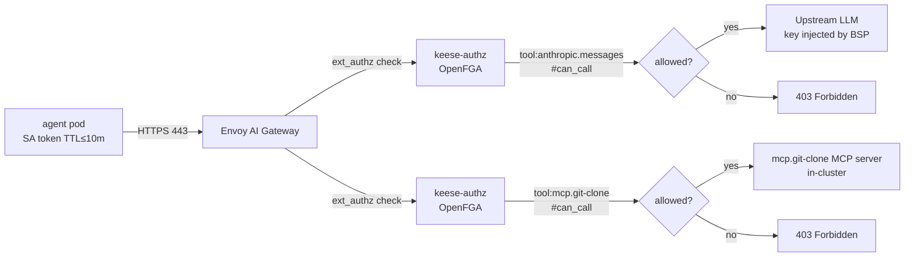

<!-- SPDX-License-Identifier: Apache-2.0 -->
<!-- Copyright (c) 2026 keese-ai -->

# Autonomous code-review workflow

Package a code-review task as a `Recipe`, schedule it as a `Workflow`, gate egress so the agent can only reach the LLM and the Git tool, and observe token-budget accounting end to end.

!!! info "Audience"
    Agent developers building automated review pipelines on keese. **Prerequisites:** a working keese installation ([install-kind.md](../getting-started/install-kind.md)), a provisioned tenant ([provision-tenant.md](../guides/provision-tenant.md)), and familiarity with keese `Workspace` and `WorkspaceSession` concepts ([workspace-session.md](../guides/workspace-session.md)).

---

## How it all fits together

The review pipeline uses four keese objects:

| Object | Role |
|---|---|
| `Recipe` | Declares the agent's instructions, allowed tools, and model; carries a cosign-verified OCI artifact reference. |
| `Workspace` | Non-interactive runtime sandbox; binds the `Recipe`, constrains egress to two tool names, and attaches a `GuardrailBinding`. |
| `Workflow` | Projects a `CronJob` trigger (one of the four supported trigger types); fires a non-interactive `WorkspaceSession` on schedule. |
| `TokenBudget` *(policy.keese.ai)* | Caps daily LLM spend; causes a `429` at the AI Gateway when the budget is exhausted. |

```mermaid
sequenceDiagram
    autonumber
    participant CJ as CronJob<br/>(projected by Workflow controller)
    participant WFL as keese-wf-launcher
    participant WS as Workspace + Session
    participant GW as Envoy AI Gateway<br/>(ext_authz → OpenFGA)
    participant LLM as Upstream LLM<br/>(Anthropic / Bedrock)
    participant Git as mcp.git-clone tool<br/>(MCP server, in-cluster)

    CJ->>WFL: CronJob spawns keese-wf-launcher pod
    WFL->>K8s: create WorkspaceSession<br/>(non-interactive, recipe mode)
    WS->>WS: goose run --recipe /recipe/instructions.md
    WS->>GW: POST /v1/messages (SA token, audience=keese-egress-acme)
    GW->>GW: ext_authz: check tool#can_call@workspace<br/>(OpenFGA ReBAC)
    alt allowed (anthropic.messages in egress.allowedTools)
        GW->>LLM: forward with injected API key<br/>(BackendSecurityPolicy)
        LLM-->>GW: completion
        GW-->>WS: response
    else denied or budget exhausted
        GW-->>WS: 403 / 429
        WS->>WS: recipe exits non-zero;<br/>WorkspaceSession phase → Failed
    end
    WS->>Git: call mcp.git-clone tool (MCP, in-cluster)
    Git-->>WS: repo contents
    WS->>WS: recipe produces review-report.md
    WS->>WC: pod exits 0; WorkspaceSession → Completed
    WFL->>WFL: output delivery (spec.outputs[]) is a no-op in alpha
```

!!! warning "NATSSubscription trigger is a no-op"
    The `NATSSubscription` `TriggerType` is declared in the API ([`api/keese/v1alpha1/workflow_types.go`](https://github.com/keese-ai/keese/blob/main/api/keese/v1alpha1/workflow_types.go)) but the controller does not yet project it into a live NATS consumer. Use `Cron` or `HTTPWebhook` for triggers that must fire today.

---

## Step 1 — Package the recipe

A `Recipe` references an OCI artifact that must contain an `instructions.md` file. The controller verifies the artifact with `cosign` before the phase transitions to `Ready`.

```yaml
# config/samples/code-review-recipe.yaml
apiVersion: keese.ai/v1alpha1
kind: Recipe
metadata:
  name: pr-code-review
  namespace: keese-acme
spec:
  instructions: instructions.md        # path inside the OCI layer
  model:
    provider: anthropic
    modelID: claude-sonnet-4-6
  tools:
    - name: anthropic.messages         # LLM egress — must appear in Workspace.egress.allowedTools
    - name: mcp.git-clone              # in-cluster MCP tool for repo access
  parameters:
    - name: REPO
      type: string
      required: true
    - name: PR_NUMBER
      type: string
      required: true
    - name: MAX_FILES
      type: int
      default: "50"
  sourceRef:
    name: keese-recipes-oci            # RecipeSource CR in the same namespace
```

Check the phase after applying:

```bash
kubectl -n keese-acme get recipe pr-code-review
# NAME              READY   PHASE   MODEL               SOURCE
# pr-code-review    True    Ready   claude-sonnet-4-6   keese-recipes-oci
```

!!! note "Tool names are the egress gate"
    Each entry in `spec.tools` is an OpenFGA tool name. The `Workspace` controller writes a `tool:<name>#allowed_in@workspace:<uid>` tuple for every tool listed in `spec.egress.allowedTools`. Requests to any tool *not* in that list are denied at the AI Gateway without reaching the upstream LLM.

---

## Step 2 — Create a non-interactive workspace

Workflow-targeted workspaces **must** set `interactive: false`. The field is immutable after creation; admission rejects `WorkflowRun` against interactive workspaces with `WorkflowRunNotAllowedOnInteractiveWorkspace`.

```yaml
# config/samples/code-review-workspace.yaml
apiVersion: keese.ai/v1alpha1
kind: Workspace
metadata:
  name: pr-reviewer
  namespace: keese-acme
spec:
  interactive: false                   # immutable; required for Workflow use
  sessionMode: OnDemand                # pod spins up only when a run fires
  attachPolicy: New                    # each WorkflowRun gets a fresh pod
  concurrencyPolicy: Forbid            # one active run at a time
  runtimeRef:
    name: goose-runtime                # AgentRuntime using the goose provider
  recipeRef:
    name: pr-code-review
  tenantRef:
    apiVersion: keese.ai/v1alpha1
    kind: Tenant
    name: acme
  guardrailBindingRefs:
    - name: no-secret-exfil            # GuardrailBinding that blocks PII/secret output
  egress:
    allowedTools:
      - anthropic.messages             # LLM calls
      - mcp.git-clone                  # repo access
  sessionStorage: 5Gi
```

```bash
kubectl -n keese-acme apply -f config/samples/code-review-workspace.yaml
kubectl -n keese-acme wait workspace/pr-reviewer --for=condition=Ready --timeout=60s
```

---

## Step 3 — Define a token budget

A `TokenBudget` in the `policy.keese.ai` group caps daily LLM spend. The AI Gateway counts tokens per workspace and returns `429` when the budget is crossed. The Workflow controller then sets `WorkspaceSession.status.phase = Failed` and fires the `TokenBudgetExceeded` event.

```yaml
# config/samples/pr-reviewer-budget.yaml
apiVersion: policy.keese.ai/v1alpha1
kind: TokenBudget
metadata:
  name: pr-reviewer-daily
  namespace: keese-acme
spec:
  scope:
    workspace:
      name: pr-reviewer
  windowDuration: 24h
  limits:
    - model: "*"
      inputTokens: 500000
      outputTokens: 50000
  exhaustionMode: hard                 # returns 429 on individual sessions when budget is crossed
```

!!! warning "TokenBudget enforcement is alpha"
    Budget exhaustion today causes a `429` on the individual session via Envoy `BackendTrafficPolicy`; the gateway-side NATS KV enforcement path is not yet wired end-to-end. An `onExhaustion: Suspend`-style action that auto-patches the `Workflow` trigger is planned but not yet implemented — use `exhaustionMode: hard` to enforce the cap per session.

---

## Step 4 — Schedule the workflow

The `Workflow` CR ties the `Workspace` to a trigger and an output. The controller projects the `Cron` trigger into a Kubernetes `CronJob` in the workspace namespace. When the CronJob fires, it runs `keese-wf-launcher --workspace pr-reviewer`, which creates a non-interactive `WorkspaceSession`.

```yaml
# config/samples/pr-reviewer-workflow.yaml
apiVersion: keese.ai/v1alpha1
kind: Workflow
metadata:
  name: pr-reviewer-nightly
  namespace: keese-acme
spec:
  workspaceRef:
    name: pr-reviewer
  entrypoint: review                   # must match one of the template names below
  templates:
    - name: review
      image: ghcr.io/keese-ai/keese-wf-launcher:latest
      args:
        - --workspace
        - pr-reviewer
        - --param
        - REPO=keese-ai/keese
        - --param
        - PR_NUMBER=$(PR_NUMBER)        # injected by the launcher from trigger payload
      retryLimit: 2
  triggers:
    - type: Cron
      cron:
        schedule: "0 8 * * 1-5"        # 08:00 UTC, Mon–Fri
        timezone: UTC
        suspend: false
  outputs:
    - name: pr-comment
      type: GitHubPR
      githubPR:
        repo: keese-ai/keese
        tokenSecretRef:
          name: github-pat-secret      # K8s Secret; value comes from OpenBao via ESO
  defaultRetryBudget:
    limit: 5
    backoffSeconds: 30
```

!!! warning "Output sinks are a no-op in alpha"
    The `spec.outputs[]` block is declared in the API but the Workflow controller does not yet deliver outputs — the entire `outputs:` section is a no-op in the current alpha build. Output delivery is planned for a later phase. Remove the `outputs:` block or leave it as documentation of intent; it will not cause an error but it will not create a GitHub PR comment either.

Apply and verify the Workflow reaches `Ready`:

```bash
kubectl -n keese-acme apply -f config/samples/pr-reviewer-workflow.yaml

kubectl -n keese-acme get workflow pr-reviewer-nightly
# NAME                   READY   PHASE   RUNCOUNT
# pr-reviewer-nightly    True    Ready   0
```

Inspect the projected CronJob:

```bash
kubectl -n keese-acme get cronjob
# NAME                           SCHEDULE          SUSPEND   ACTIVE
# keese-wf-pr-reviewer-nightly   0 8 * * 1-5       False     0
```

---

## Step 5 — Trigger a manual run

To test the pipeline without waiting for the cron schedule, create an ad-hoc `WorkspaceSession` directly:

!!! note "Session mode and parameters"
    `spec.mode` on a `WorkspaceSession` controls pod-sharing (`shared`, `per-user`, or `per-attach`). For a non-interactive workflow session you typically use `per-attach` so each run gets its own pod. Non-interactive execution is controlled by the parent `Workspace.spec.interactive: false` field, not by a session mode value. Recipe parameters (`REPO`, `PR_NUMBER`) are declared in the `Recipe` spec and injected by the launcher via env vars on the pod — they are not fields on `WorkspaceSession`.

```bash
kubectl -n keese-acme apply -f - <<'EOF'
apiVersion: keese.ai/v1alpha1
kind: WorkspaceSession
metadata:
  name: pr-reviewer-manual-001
  namespace: keese-acme
spec:
  workspaceRef: pr-reviewer
  attachSubject: "user:ci-bot@keese-acme"
  sessionName: manual-001
  mode: per-attach
EOF

# Follow the session pod logs
kubectl -n keese-acme logs -f \
  $(kubectl -n keese-acme get workspacesession pr-reviewer-manual-001 \
    -o jsonpath='{.status.podRef.name}') \
  -c agent
```

Watch the session phase progress through `Pending → Attaching → Active → Completed`:

```bash
kubectl -n keese-acme get workspacesession pr-reviewer-manual-001 -w
# NAME                      READY   PHASE       AGE
# pr-reviewer-manual-001    False   Pending     1s
# pr-reviewer-manual-001    True    Active      4s
# pr-reviewer-manual-001    False   Completed   47s
```

---

## Observability

### Token accounting

!!! note "Requires ECK observability stack"
    The queries below require Elasticsearch + APM Server running in-cluster. See [guides/observability-setup.md](../guides/observability-setup.md) for how to deploy the ECK observability stack as part of the local bootstrap.

The AI Gateway emits per-request token counts as OTEL spans under `keese.workflow.run`. Query the Elastic APM index:

```bash
# Count tokens consumed by this workspace in the last hour (requires ECK / kibana-dev-tools)
GET keese-apm-*/_search
{
  "query": {
    "bool": {
      "filter": [
        { "term": { "labels.keese.workspace": "pr-reviewer" } },
        { "range": { "@timestamp": { "gte": "now-1h" } } }
      ]
    }
  },
  "aggs": {
    "input_tokens":  { "sum": { "field": "numeric_labels.llm.input_tokens" } },
    "output_tokens": { "sum": { "field": "numeric_labels.llm.output_tokens" } }
  }
}
```

### Workflow run count

```bash
kubectl -n keese-acme get workflow pr-reviewer-nightly \
  -o jsonpath='{.status.runCount}'
```

### Events

```bash
kubectl -n keese-acme get events \
  --field-selector reason=TokenBudgetExceeded
```

---

## Egress security model

The workspace is locked down to two tools. Any request from the agent pod that targets a tool not in `egress.allowedTools` is denied at the AI Gateway by the `ext_authz` filter before it reaches the upstream.



Key security invariants enforced by this setup:

- The agent pod carries **no API keys**. The AI Gateway's `BackendSecurityPolicy` injects the upstream credential after the ReBAC check passes. See [concepts/credential-broker.md](../concepts/credential-broker.md).
- `NetworkPolicy` in the workspace namespace blocks all egress except to the AI Gateway service on port 443. See [concepts/network-isolation.md](../concepts/network-isolation.md).
- The GitHub PAT referenced by `tokenSecretRef` is mounted as a projected file at `/var/run/keese/secrets/github-pat-secret`; it is never exposed as an environment variable.

---

## Failure modes and recovery

| Failure | Symptom | Recovery |
|---|---|---|
| Recipe cosign verification fails | `Recipe.status.phase = Failed`, condition `Verified=False` | Push a correctly signed artifact; controller retries on next sync. |
| Cron run misses a window (controller restart) | Window skipped; `RunCount` does not increment | The CronJob uses `ConcurrencyPolicy: Forbid` at the Kubernetes level; missed runs are not backfilled. Increase `startingDeadlineSeconds` on the CronJob if needed. |
| Token budget exhausted | `429` at gateway; session phase → `Failed`; event `RetryBudgetExhausted` | Increment `TokenBudget.spec.limits`; re-trigger manually. |
| GitHub PAT expired | `WorkflowOutput` delivery is a no-op in alpha (output sinks not yet implemented); the `WorkflowRun.status.phase` moves to `Failed` if the session itself fails. | Rotate secret in OpenBao; ESO syncs the K8s Secret; inspect `WorkflowRun` events and re-create the `WorkflowRun` after rotating the secret. |
| Agent exceeds `retryLimit` on a step | `WorkflowRun.status.phase = Failed` | Inspect session pod logs; fix recipe instructions; re-run. |

---

## Next steps

- [concepts/workflows.md](../concepts/workflows.md) — trigger types, concurrency policy, and `WorkflowRun` phases in detail.
- [concepts/recipes.md](../concepts/recipes.md) — recipe lifecycle, OCI packaging, and cosign verification.
- [guides/token-budgets.md](../guides/token-budgets.md) — configure and monitor `TokenBudget` objects.
- [concepts/egress-ai-gateway.md](../concepts/egress-ai-gateway.md) — how the AI Gateway enforces tool-level ReBAC and injects credentials.
