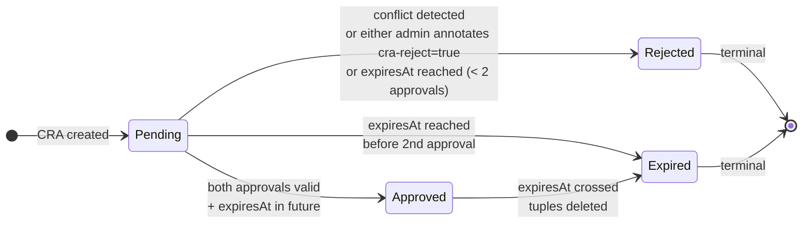

<!-- SPDX-License-Identifier: Apache-2.0 -->
<!-- Copyright (c) 2026 keese-ai -->

# Cross-tenant collaboration

Two independent tenants negotiate and sign a `CrossTenantAgreement`, exchange messages
through a scoped NATS subject, and have all access revoked automatically when the
agreement expires.

!!! info "Audience"
    Tenant administrators who need agents in separate tenants to communicate.
    **Prerequisites:** [Tenancy & namespaces](../concepts/tenancy.md) ·
    [Authorization (ReBAC / OpenFGA)](../concepts/authorization-rebac.md) ·
    [Transports & messaging](../concepts/transports.md) ·
    both tenants already provisioned (see [Provision a tenant](../guides/provision-tenant.md))

---

## Overview

keese is a multi-tenant platform: each tenant is a Capsule-isolated namespace boundary
whose agents cannot reach other tenants by default.
Cross-tenant messaging is opt-in and requires **both** tenant admins to sign a
`CrossTenantAgreement` (CRA) — a cluster-scoped CRD in `authz.keese.ai/v1alpha1`.

Once approved, the controller:

1. Writes OpenFGA tuples that authorise the exact workspace pairs named in the CRA.
2. Exposes shared NATS subjects under the `keese.cta.*` prefix.
3. Polls for expiry and tears the agreement down — deleting tuples — without any manual
   intervention.

The scenario below walks through the full lifecycle with two fictional tenants,
**alpha** and **beta**.

---

## Lifecycle at a glance

```mermaid
sequenceDiagram
    autonumber
    actor AdminA as admin-alpha
    actor AdminB as admin-beta
    participant K8s as API Server
    participant Ctrl as CRA Controller
    participant FGA as OpenFGA
    participant NATS as NATS JetStream

    AdminA->>K8s: kubectl create -f cra-alpha-beta.yaml
    K8s-->>Ctrl: reconcile (phase → Pending)

    AdminA->>K8s: kubectl annotate cra/alpha-beta keese.ai/cra-approve=true<br/>(+ cra-approving-tenant + cra-signature + cra-signature-type)
    K8s-->>Ctrl: annotation removed; approval appended to status.approvals[]

    AdminB->>K8s: kubectl annotate cra/alpha-beta keese.ai/cra-approve=true<br/>(+ cra-approving-tenant + cra-signature + cra-signature-type)
    K8s-->>Ctrl: annotation removed; approval appended to status.approvals[]

    Ctrl->>Ctrl: bothTenantsApproved() == true
    Ctrl->>FGA: Sync tuples<br/>(tenant.allows_messaging, workspace.messageable_from)
    FGA-->>Ctrl: OK
    Ctrl->>K8s: status.phase = Approved<br/>status.workspaceSnapshot frozen (TOFU)
    K8s-->>AdminA: CRAApproved event

    Note over NATS,K8s: Messages flow on keese.cta.alpha-beta.*

    loop every 1 min
        Ctrl->>Ctrl: isExpired(expiresAt)?
    end

    Ctrl->>FGA: Delete tuples
    FGA-->>Ctrl: OK
    Ctrl->>NATS: DeleteStream (finalizer cleanup)
    Ctrl->>K8s: status.phase = Expired
    K8s-->>AdminA: CRAExpired event
```

---

## Step 1 — Create the agreement

The **from-tenant** admin authors the CRA object. All NATS subjects must start with
`keese.cta.`; a maximum of 50 subjects is allowed per CRA. The `expiresAt` field is
immutable after creation — choose the window carefully.

```yaml
# config/samples/tenancy/cra-alpha-beta.yaml
apiVersion: authz.keese.ai/v1alpha1
kind: CrossTenantAgreement
metadata:
  name: alpha-beta-data-share
spec:
  from:
    tenantRef:
      name: alpha
    workspaceSelector:
      matchLabels:
        keese.ai/role: producer
  to:
    tenantRef:
      name: beta
    workspaceSelector:
      matchLabels:
        keese.ai/role: consumer
  scope:
    natsSubjects:
      - keese.cta.alpha-beta.events
      - keese.cta.alpha-beta.results
    a2aRoles:
      - writer   # alpha writes; beta reads
      - reader
  expiresAt: "2026-12-31T23:59:59Z"
```

```bash
kubectl create -f cra-alpha-beta.yaml
kubectl get cra alpha-beta-data-share
# NAME                    AGE   READY   PHASE     FROM    TO
# alpha-beta-data-share   5s    False   Pending   alpha   beta
```

The controller immediately adds the `finalizers.crosstenanagreement.keese.ai/nats`
finalizer and moves the CRA to `Pending`.

!!! warning "Conflict detection"
    If an `Approved` CRA already exists for the same `(from, to)` tenant pair, the
    new CRA is immediately moved to `Rejected` and a `CRAConflict` event is emitted
    on the new (conflicting) CRA. Delete or expire the earlier CRA first.

---

## Step 2 — Both tenants approve

Each tenant admin annotates the CRA with a signed approval. The `keese.ai/cra-approve`
annotation is the trigger; four companion annotations carry the identity and signature.

### alpha approves (ServiceAccount / CI path)

The `cra-signature` value is `hex(HMAC-SHA256(shared_secret, audience))` — **not** the
SA token itself. The shared secret is a cluster-managed HMAC key; the audience is the
per-tenant string `keese-egress-<tenant>`.

```bash
# Compute the HMAC tag against the tenant audience string
SIG=$(echo -n "keese-egress-alpha" | \
  openssl dgst -sha256 \
    -hmac "$(kubectl -n keese-system get secret keese-cra-hmac \
               -o jsonpath='{.data.secret}' | base64 -d)" \
    -hex | awk '{print $2}')

kubectl annotate cra/alpha-beta-data-share \
  keese.ai/cra-approve=true \
  keese.ai/cra-approving-tenant=alpha \
  keese.ai/cra-approver=system:serviceaccount:alpha:tenant-admin \
  keese.ai/cra-signature="$SIG" \
  keese.ai/cra-signature-type=sa-token
```

### beta approves (human OIDC path)

```bash
kubectl annotate cra/alpha-beta-data-share \
  keese.ai/cra-approve=true \
  keese.ai/cra-approving-tenant=beta \
  keese.ai/cra-approver=admin@beta.example.com \
  keese.ai/cra-signature="<cosign-oidc-keyless-signature>" \
  keese.ai/cra-signature-type=oidc-keyless
```

The controller validates each annotation independently:

- Verifies the approving tenant is a named participant (`from` or `to`).
- Checks the tenant has not already approved (idempotent; duplicate annotations are
  silently ignored).
- Verifies the signature: `sa-token` path uses `HMAC-SHA256(secret, audience)` where
  the key is the raw bytes of `keese-cra-hmac[secret]` in `keese-system` and the
  message is the audience string `keese-egress-<tenant>` — the SA's projected token is
  the approver identity, not the HMAC key; `oidc-keyless` path uses cosign keyless
  verification over `(cra-uid || tenant-uid || expiresAt)`.
- Strips the approval annotations from metadata and appends a `CRAApproval` entry to
  `status.approvals[]`.

!!! note "Webhook stub"
    The admissions webhook that enforces `can_approve_cra` at annotation-write time is
    currently stubbed. The controller performs signature verification on every reconcile,
    but the OpenFGA `can_approve_cra` check at the API-server admission layer is not yet
    wired in. Do not rely on it for enforcement in the current alpha build.

---

## Step 3 — Agreement transitions to Approved

When `bothTenantsApproved()` returns true the controller runs `transitionToApproved`:

1. **Expiry guard** — aborts and transitions directly to `Expired` if `expiresAt ≤ now`.
2. **Workspace snapshot (TOFU)** — enumerates workspaces matching each side's selector
   and freezes the cartesian product in `status.workspaceSnapshot[]`.
3. **OpenFGA tuple sync** — writes:
   - `tenant:beta#allows_messaging@tenant:alpha`
   - `workspace:<to>#messageable_from@workspace:<from>` for every pair in the snapshot.
4. Sets `status.phase = Approved` and emits `CRAApproved`.

```bash
kubectl get cra alpha-beta-data-share -o yaml | grep -A4 'status:'
# status:
#   phase: Approved
#   workspaceSnapshot:
#   - fromWorkspace: ws-alpha
#     toWorkspace: ws-beta
#     snapshotAt: "2026-06-01T10:00:00Z"
```

!!! warning "Workspace snapshot limitation (alpha)"
    `resolveWorkspaces` currently returns a single synthetic workspace name
    (`ws-<tenantName>`) per tenant rather than performing a real Workspace CR lookup.
    The full selector-based enumeration against `keese.ai/v1alpha1 Workspace` objects
    is tracked for the post-gate implementation pass. The snapshot field, tuple logic, and
    drift detection all work correctly against this stub; only the selector semantics are
    incomplete.

---

## Step 4 — Exchange messages

With the CRA `Approved`, agents in the respective workspaces can publish and subscribe on
the scoped NATS subjects. The `workspace.messageable_from` tuple gates tool calls routed
through the AI Gateway.

!!! warning "NATS subject-level enforcement not yet implemented"
    The CRA controller writes the `workspace.messageable_from` OpenFGA tuples, but there
    is no ext_proc or ext_authz reader on the NATS JetStream path. keese-authz is an
    HTTP-level gRPC ext_authz filter; it intercepts HTTP requests to the Envoy AI
    Gateway — it does not inspect NATS messages. NATS subject-level per-message
    enforcement is a tracked open TD item. Do not rely on it for enforcement in the
    current alpha build.

!!! note "Dev bootstrap: NATS URL and KEESE_GATEWAY_NS"
    The examples below use `nats://nats.nats.svc:4222` — the DNS address matching the
    dev bootstrap helmfile, which deploys NATS to the `nats` namespace. The NP-2
    egress `NetworkPolicy` targets NATS using `KEESE_GATEWAY_NS` (default `keese-system`).
    On a dev cluster you must set `KEESE_GATEWAY_NS=nats`; otherwise the workspace
    egress rule will not allow traffic to reach NATS and these `nats pub`/`nats sub`
    commands will fail with a connection timeout.

```bash
# From the producer session pod in tenant alpha:
nats pub -s nats://nats.nats.svc:4222 \
  keese.cta.alpha-beta.events \
  '{"event":"agent-result","value":42}'

# From the consumer session pod in tenant beta:
nats sub -s nats://nats.nats.svc:4222 \
  --count=1 "keese.cta.alpha-beta.>"
```

The kuttl e2e test at
[`tests/e2e/cross-workspace/01-pubsub-test.yaml`](https://github.com/keese-ai/keese/blob/main/tests/e2e/cross-workspace/01-pubsub-test.yaml)
runs this round-trip on the `keese.transport.team-bus.*` subject against workspaces in
the same tenant (`alpha`). The cross-tenant variant uses identical pub/sub mechanics
but on `keese.cta.*` subjects backed by the CRA.

---

## Step 5 — Expiry and teardown

The controller requeues every minute when the CRA is `Approved` and has an `expiresAt`.
Once the deadline passes:

1. All tuples recorded in `status.workspaceSnapshot[]` are deleted from OpenFGA.
2. On delete failure the phase stays `Approved` (fail-closed: tuples outlive the CRA
   briefly rather than being silently dropped). `TupleSyncFailed` is emitted and the
   controller retries with backoff.
3. On success: `status.phase = Expired`, `CRAExpired` event emitted, NATS stream deleted
   via finalizer cleanup.

```bash
# Watch for expiry transition:
kubectl get events --field-selector reason=CRAExpired
# LAST SEEN   TYPE     REASON      OBJECT                                  MESSAGE
# 0s          Normal   CRAExpired  crosstenanagreement/alpha-beta-data-share  CrossTenantAgreement expired; ReBAC tuples deleted

# The CRA object is retained for audit:
kubectl get cra alpha-beta-data-share -o jsonpath='{.status.phase}'
# Expired
```

!!! note "Re-enabling access"
    Expired and Rejected CRAs are terminal and immutable. To re-establish access, create
    a new `CrossTenantAgreement` object. The old object can be deleted at any time:
    `kubectl delete cra alpha-beta-data-share`.

---

## Phase state machine



---

## Snapshot drift

After the CRA is `Approved`, the controller continuously compares the current
selector-resolved workspace set against `status.workspaceSnapshot[]`. If they diverge
— for example because a new workspace is created that matches the selector — a
`WorkspaceSnapshotDrift` warning event is emitted.

**The controller does not auto-extend the snapshot (TOFU policy).** New workspace pairs
are never added to an existing CRA. Create a new CRA to cover them.

```bash
# Watch for drift events:
kubectl get events --field-selector reason=WorkspaceSnapshotDrift
```

---

## Failure quick-reference

| Event reason | Meaning | Action |
|---|---|---|
| `CRAApprovalInvalid` | Signature verification failed or approver not a participant | Re-annotate with a valid signature; re-authenticate OIDC session |
| `SignatureVerificationFailed` | Cosign or SA-token HMAC check returned an error | Check SA token audience (`keese-egress-<tenant>`) or cosign identity binding |
| `TupleSyncFailed` | OpenFGA write or delete failed | Controller retries; check OpenFGA availability; manual `fga delete` if stuck at expiry |
| `CRAConflict` | An existing Approved CRA covers the same tenant pair | Expire or delete the earlier CRA; then re-create |
| `WorkspaceSnapshotDrift` | Selector now resolves different workspaces than the snapshot | Create a new CRA to cover added/changed workspace pairs |
| `NATSStreamDeleteFailed` | NATS stream deletion failed during finalizer cleanup | Check NATS connectivity; stream can be deleted manually |

---

## Running the e2e suite

The kuttl cross-workspace suite (`tests/e2e/cross-workspace/`) covers intra-tenant
pub/sub between a `producer` and `consumer` workspace. It validates Transport readiness,
SharedMemory activation, WorkspaceShare reference-grant projection, and a NATS
round-trip. Run it with:

```bash
make e2e-cross-workspace
# or directly:
kubectl kuttl test --test-dir tests/e2e/cross-workspace
```

A cross-tenant bilateral handshake test (`test/e2e/cra_bilateral_test.go`) covering the
full CRA approval flow is planned for the post-gate test phase.

!!! warning "Planned — not yet implemented"
    `test/e2e/cra_bilateral_test.go` (cross-tenant bilateral CRA e2e) and the admission
    webhook `can_approve_cra` enforcement are planned but not yet implemented. The
    multi-tenant kuttl suite (`tests/e2e/multi-tenant/02-cross-tenant-deny.yaml`)
    exercises cross-tenant denial but not the full approval handshake.

---

## See also

- [Cross-tenant collaboration concept](../concepts/cross-tenant.md)
- [Cross-tenant agreements guide](../guides/cross-tenant-agreements.md)
- [Authorization (ReBAC / OpenFGA)](../concepts/authorization-rebac.md)
- [Transports & messaging](../concepts/transports.md)
