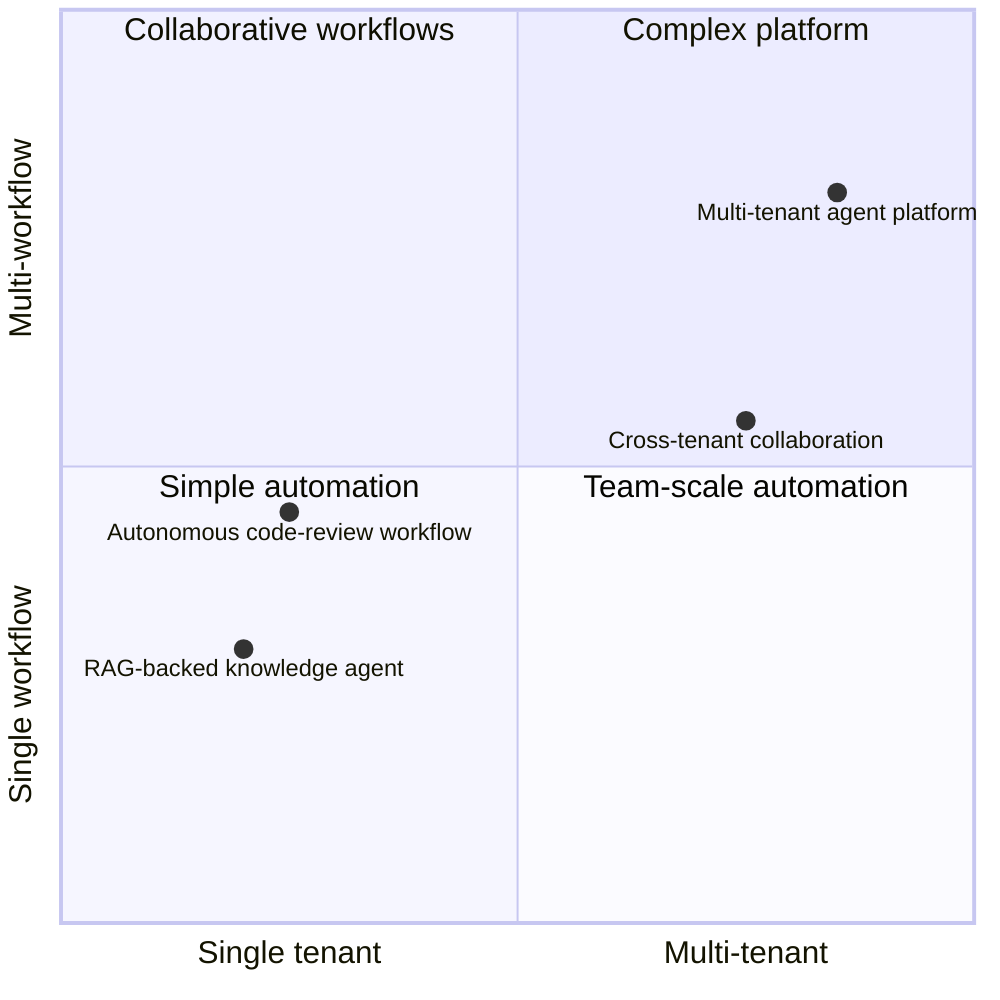
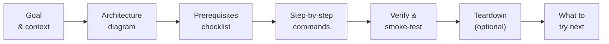

<!-- SPDX-License-Identifier: Apache-2.0 -->
<!-- Copyright (c) 2026 keese-ai -->

# Scenarios

End-to-end walkthroughs that string multiple guides together into a complete, realistic keese use case — from cluster bootstrap through running agents in production.

!!! info "Audience"
    All roles: platform engineers provisioning shared infrastructure, tenant admins governing
    what agents may do, and agent developers building workflows. · **Prerequisites:**
    [Concepts in 5 minutes](../getting-started/concepts-in-5-minutes.md) ·
    [Getting Started](../getting-started/index.md)

---

## What scenarios are for

The [Guides](../guides/index.md) section covers individual tasks in isolation — how to
install the operator, how to configure a memory backend, how to define a guardrail. A
scenario is different: it starts with a concrete goal (e.g. *"run a code-review agent for
three engineering teams"*) and walks through every decision and command needed to reach
that goal, end-to-end, in the right order.

If you are new to keese, work through [Getting Started](../getting-started/index.md)
first. Come here when you need to understand how the pieces fit together for a realistic
workload.

---

## Scenario map

The four scenarios cover the main use-case families. They differ in which keese features
they exercise and which persona primarily drives the walkthrough.

| Scenario | Primary persona | Key features exercised |
|---|---|---|
| [Multi-tenant agent platform from zero](multi-tenant-platform.md) | Platform engineer | Tenant provisioning, OIDC, egress credentials, token budgets, guardrails, OLM install |
| [Autonomous code-review workflow](code-review-workflow.md) | Agent developer | Workspace + session, Recipe, Argo Workflow, ReBAC, OTEL tracing |
| [RAG-backed knowledge agent](rag-knowledge-agent.md) | Agent developer | KnowledgeBase / DocumentSource / IngestionRun (planned), recipe + runtime wiring |
| [Cross-tenant collaboration](cross-tenant-collab.md) | Tenant admin | CrossTenantAgreement, shared recipe, OIDCProvider federation, scoped egress |

---

## Scenario summaries

### Multi-tenant agent platform from zero

Starting from an empty Kubernetes cluster, this scenario provisions the full keese control
plane for a fictional company with three independent engineering tenants. It covers OLM
install, Capsule tenant namespaces, per-tenant OIDC providers, Envoy AI Gateway backends,
`BackendSecurityPolicy` credential injection, `TokenBudget` objects, and `GuardrailBinding`
defaults.

**Outcome:** Three tenants, each with their own namespace boundary, credential scope, spend
cap, and content policy — none able to reach another tenant's agents or credentials.

[Read the scenario →](multi-tenant-platform.md)

---

### Autonomous code-review workflow

A single-tenant walkthrough for a team that wants an agent to automatically review pull
requests: clone the repo, run static analysis, propose inline comments, and open a
follow-up issue when it finds high-severity findings. This scenario exercises `Recipe`,
`Workflow`, `WorkspaceSession`, and the ReBAC rules that limit the agent's GitHub tool
permissions.

**Outcome:** A triggered Argo Workflow that invokes the agent on every new PR, with full
OTEL trace coverage and a budget guard so a runaway agent cannot exhaust the team's token
allocation.

[Read the scenario →](code-review-workflow.md)

---

### RAG-backed knowledge agent

A developer-focused walkthrough building an internal knowledge agent over a private
document corpus. The scenario covers the planned `KnowledgeBase`, `DocumentSource`, and
`IngestionRun` CRD family, wiring the knowledge base to an agent runtime via a `Recipe`,
and querying it from a `WorkspaceSession`.

**Outcome:** An agent that can answer questions grounded in the team's private docs, with
retrieval-source citations logged to the OTEL trace.

[Read the scenario →](rag-knowledge-agent.md)

---

### Cross-tenant collaboration

Two tenants — a data-engineering team and an ML-platform team — need to share a
diagnostic recipe without sharing credentials or namespace boundaries. This scenario
authors a `CrossTenantAgreement`, federates the ML-platform's `OIDCProvider` into the
data-engineering workspace, and scopes the agreement to a single named recipe.

**Outcome:** The data-engineering workspace can invoke the shared recipe under controlled
conditions; the ML-platform tenant retains full control and can revoke the agreement
instantly.

[Read the scenario →](cross-tenant-collab.md)

---

## How a scenario is structured

Every scenario follows the same pattern so you can skim to the section you need:

1. **Goal & context** — what you will build and why, in plain language.
2. **Architecture diagram** — the keese objects in play and how they relate.
3. **Prerequisites checklist** — which guides to complete first; minimum cluster resources.
4. **Step-by-step commands** — `kubectl apply` and `make` commands you can paste directly,
   with expected output where it matters.
5. **Verify & smoke-test** — how to confirm the scenario is working correctly.
6. **Teardown** — clean-up commands (always optional; skip if you want to leave the state
   for further experimentation).
7. **What to try next** — links to related scenarios and advanced guides.

!!! warning "Alpha — some steps are ahead of the implementation"
    keese is alpha software. The core control plane (18 reconcilers, 20 CRD kinds) is
    implemented on `main`. Some scenario steps reference features that are partially
    implemented or planned — each such step is marked with a warning admonition inline.
    When in doubt, check [`development/roadmap.md`](../development/roadmap.md) for the
    current build status.

---

## Recommended reading order

!!! tip "Start simple, go broad"
    If this is your first time through the scenarios, read them in this order:

    1. [Getting Started](../getting-started/index.md) — validate your local environment
       first; the scenarios assume a working cluster.
    2. [Multi-tenant agent platform from zero](multi-tenant-platform.md) — provisions the
       full control plane; introduces Tenant, OIDC, egress credentials, and TokenBudget.
    3. [Autonomous code-review workflow](code-review-workflow.md) — adds Workflow
       orchestration and ReBAC tuning.
    4. [Cross-tenant collaboration](cross-tenant-collab.md) — add when you have two
       tenants running and want to understand federation boundaries.
    5. [RAG-backed knowledge agent](rag-knowledge-agent.md) — read for design orientation
       only (planned subsystem — no controller code is implemented yet).

---

## Next steps

- [Concepts](../concepts/index.md) — understand the architecture before diving into a
  scenario walkthrough.
- [Guides](../guides/index.md) — individual task reference for any step in a scenario.
- [API reference](../reference/api/index.md) — CRD schemas for every object the scenarios
  create.
- [Roadmap](../development/roadmap.md) — built vs. planned feature status.
