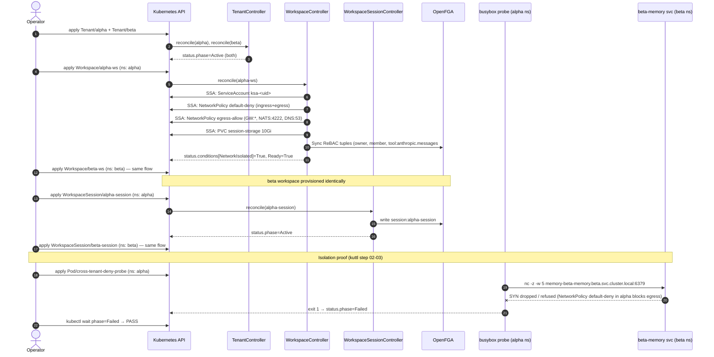

<!-- SPDX-License-Identifier: Apache-2.0 -->
<!-- Copyright (c) 2026 keese-ai -->

# Multi-tenant agent platform from zero

Stand up a keese cluster, onboard two isolated tenants, and prove that a pod in one tenant cannot reach resources in the other — all in under ten minutes on a local kind cluster.

!!! info "Audience"
    Platform operators and SREs building a shared agent infrastructure.
    **Prerequisites:** [Bootstrap a local cluster](../guides/bootstrap-local.md) · [Provision a tenant](../guides/provision-tenant.md) · [Create a workspace & attach a session](../guides/workspace-session.md)

---

## What this scenario covers

| Phase | Objects created | Verification |
|---|---|---|
| 1. Bootstrap cluster | kind cluster, CRDs, infra stack | `make kind-up && make bootstrap-infra` |
| 2. Define two tenants | `Tenant/alpha`, `Tenant/beta` | `status.phase=Active` |
| 3. Provision workspaces | `Workspace/alpha-ws`, `Workspace/beta-ws` | `condition Ready=True` |
| 4. Start sessions | `WorkspaceSession/alpha-session`, `WorkspaceSession/beta-session` | `status.phase=Active` |
| 5. Prove isolation | probe pod in `alpha` namespace → `beta` Memory service | pod exits `Failed` |

The kuttl suite `tests/e2e/multi-tenant/` automates every step and runs in under 90 seconds on a warm cluster (test ID: TD-P3-07).

---

## Object graph evolution

The diagram below shows the object graph at each phase. Dashed lines are cross-namespace relationships blocked by NetworkPolicy.

```mermaid
flowchart TB
    subgraph cluster["Kubernetes cluster"]
        direction TB

        AR["AgentRuntime/goose-default<br/>(cluster-scoped)"]

        subgraph alpha_ns["Namespace: alpha  ·  keese.ai/tenant=alpha"]
            T_alpha["Tenant/alpha<br/>(cluster-scoped, listed here for clarity)"]
            WS_alpha["Workspace/alpha-ws"]
            SESS_alpha["WorkspaceSession/alpha-session<br/>(alice@example.com)"]
            NP_deny_alpha["NetworkPolicy: default-deny<br/>(ingress+egress)"]
            NP_egw_alpha["NetworkPolicy: egress-allow<br/>(gateway:443, NATS:4222, DNS:53)"]
            SA_alpha["ServiceAccount: ksa-&lt;uid&gt;"]
            PVC_alpha["PVC: session-storage 10Gi"]
        end

        subgraph beta_ns["Namespace: beta  ·  keese.ai/tenant=beta"]
            T_beta["Tenant/beta<br/>(cluster-scoped)"]
            WS_beta["Workspace/beta-ws"]
            SESS_beta["WorkspaceSession/beta-session<br/>(bob@example.com)"]
            NP_deny_beta["NetworkPolicy: default-deny"]
            NP_egw_beta["NetworkPolicy: egress-allow"]
            SA_beta["ServiceAccount: ksa-&lt;uid&gt;"]
            PVC_beta["PVC: session-storage 10Gi"]
            MEM_beta["Memory/beta-memory<br/>(sqlite 1Gi)"]
        end

        subgraph egs_ns["Namespace: envoy-gateway-system"]
            AIGW["Envoy AI Gateway proxy<br/>(app.kubernetes.io/managed-by: envoy-gateway)"]
        end

        subgraph system_ns["Namespace: keese-system (KEESE_GATEWAY_NS)"]
            AIGW_SVC["envoy-ai-gateway Service<br/>(ExternalName alias to proxy)"]
            NATS["NATS JetStream<br/>:4222<br/>(dev: set KEESE_GATEWAY_NS=nats)"]
        end

        subgraph openfga["OpenFGA (in-cluster)"]
            FGA["ReBAC store"]
        end
    end

    WS_alpha -->|"spec.runtimeRef"| AR
    WS_beta -->|"spec.runtimeRef"| AR
    WS_alpha --> SA_alpha
    WS_alpha --> PVC_alpha
    WS_alpha --> NP_deny_alpha
    WS_alpha --> NP_egw_alpha
    WS_beta --> SA_beta
    WS_beta --> PVC_beta
    WS_beta --> NP_deny_beta
    WS_beta --> NP_egw_beta
    WS_beta --> MEM_beta
    SESS_alpha --> WS_alpha
    SESS_beta --> WS_beta
    NP_egw_alpha -->|"allowed (pod selector)"| AIGW
    NP_egw_alpha -->|"allowed :4222"| NATS
    NP_egw_beta -->|"allowed (pod selector)"| AIGW
    NP_egw_beta -->|"allowed :4222"| NATS
    AIGW_SVC -.->|"ExternalName"| AIGW
    WS_alpha -->|"ReBAC tuples"| FGA
    WS_beta -->|"ReBAC tuples"| FGA

    SESS_alpha x--x|"BLOCKED by NP"| MEM_beta
```



---

## Step 1 — Bootstrap the cluster

```bash
# Spin up a local kind cluster (ctlptl-managed, registry on :5000).
make kind-up

# Install CRDs, Envoy AI Gateway, NATS, OpenFGA, OpenBao, ECK stack.
make bootstrap-infra

# Deploy the keese operator.
make install && make run
```

After `make run` you should see the operator log `controller-runtime: starting manager`.

!!! warning "Dev bootstrap: set KEESE_GATEWAY_NS=nats"
    The dev bootstrap helmfile deploys NATS to the `nats` namespace. The NP-2 egress
    `NetworkPolicy` targets NATS pods using the `KEESE_GATEWAY_NS` variable (default:
    `keese-system`). On a dev cluster you must set `KEESE_GATEWAY_NS=nats` in the
    operator deployment or manager `make run` invocation, otherwise the NATS egress
    rule selects the wrong namespace and agent pods cannot reach NATS JetStream.
    The Envoy AI Gateway proxy runs in `envoy-gateway-system` (hardcoded, not affected
    by this variable).

!!! warning "Planned — not yet implemented"
    `make deploy` (the OLM-based in-cluster deploy path) is gated on the OLM bundle
    reaching its first release candidate. Use `make install && make run` for local development.

---

## Step 2 — Create two tenants

`Tenant` is cluster-scoped. The controller transitions `Pending → Provisioning → Active`
and, in Mode A (no `capsuleTenantRef`), expects you to create the namespace and label
it `keese.ai/tenant=<name>` yourself (the test suite does this; Capsule Mode B automates
it in production).

```yaml
# tenants.yaml
apiVersion: keese.ai/v1alpha1
kind: Tenant
metadata:
  name: alpha
spec:
  adminSubjects:
    - kind: User
      name: alice@example.com
---
apiVersion: keese.ai/v1alpha1
kind: Tenant
metadata:
  name: beta
spec:
  adminSubjects:
    - kind: User
      name: bob@example.com
```

```bash
kubectl apply -f tenants.yaml

# Create matching namespaces (Mode A — no Capsule).
kubectl create namespace alpha
kubectl label namespace alpha keese.ai/tenant=alpha
kubectl create namespace beta
kubectl label namespace beta keese.ai/tenant=beta
```

Wait for both tenants to become Active:

```bash
kubectl wait --for=jsonpath='{.status.phase}'=Active tenant.keese.ai/alpha --timeout=120s
kubectl wait --for=jsonpath='{.status.phase}'=Active tenant.keese.ai/beta  --timeout=120s
```

Inspect the status columns:

```bash
kubectl get tenants
# NAME    READY   PHASE    NAMESPACES   AGE
# alpha   True    Active   1            12s
# beta    True    Active   1            12s
```

---

## Step 3 — Register a shared AgentRuntime

`AgentRuntime` is cluster-scoped. One runtime can serve workspaces in any tenant.

```yaml
# runtime.yaml
apiVersion: keese.ai/v1alpha1
kind: AgentRuntime
metadata:
  name: goose-default
spec:
  implementation:
    goose:
      image: ghcr.io/block/goose:latest
```

```bash
kubectl apply -f runtime.yaml
kubectl wait --for=condition=Ready agentruntime/goose-default --timeout=60s
```

!!! note
    In production, pin `spec.implementation.goose.image` to a digest
    (`ghcr.io/block/goose@sha256:…`) per zero-trust rule 05.12.
    Tags are acceptable for local development only.

Five runtime providers are defined at `v1alpha1`: `goose`, `claudeCode`, `aider`,
`adkPython`, and `adkGo`. Exactly one must be set (CEL-enforced).

---

## Step 4 — Provision workspaces

Each `Workspace` is namespace-scoped and references its owning tenant via `spec.tenantRef`.
The workspace controller applies Server-Side Apply to create four sub-resources for each
workspace:

1. A `ServiceAccount` named `ksa-<workspace-uid>` — carries the projected SA token with
   audience `keese-egress-<tenant>` and TTL ≤ 600 s.
2. A default-deny `NetworkPolicy` — blocks all ingress and egress (fail-closed).
3. An egress-allow `NetworkPolicy` — permits egress to the Envoy AI Gateway pods
   (namespace+pod selector), NATS on port 4222, and kube-dns on port 53.
4. A `PersistentVolumeClaim` of 10 Gi (default, or `spec.sessionStorage`) for SQLite
   session checkpoints.

```yaml
# workspaces.yaml
apiVersion: keese.ai/v1alpha1
kind: Workspace
metadata:
  name: alpha-ws
  namespace: alpha
spec:
  runtimeRef:
    name: goose-default
  tenantRef:
    name: alpha
  interactive: true
  sessionMode: OnDemand
  concurrencyPolicy: Allow
  egress:
    allowedTools:
      - anthropic.messages
---
apiVersion: keese.ai/v1alpha1
kind: Workspace
metadata:
  name: beta-ws
  namespace: beta
spec:
  runtimeRef:
    name: goose-default
  tenantRef:
    name: beta
  interactive: true
  sessionMode: OnDemand
  concurrencyPolicy: Allow
  egress:
    allowedTools:
      - anthropic.messages
```

```bash
kubectl apply -f workspaces.yaml

kubectl wait --for=condition=Ready workspace/alpha-ws -n alpha --timeout=120s
kubectl wait --for=condition=Ready workspace/beta-ws  -n beta  --timeout=120s
```

Check all four conditions on one workspace:

```bash
kubectl get workspace alpha-ws -n alpha -o jsonpath='{.status.conditions}' | jq .
# [
#   {"type":"NetworkIsolated",     "status":"True",  "reason":"NetworkPoliciesApplied"},
#   {"type":"SessionStorageReady", "status":"True",  "reason":"PVCBound"},
#   {"type":"Progressing",         "status":"False", "reason":"ReconcileComplete"},
#   {"type":"Ready",               "status":"True",  "reason":"Ready"}
# ]
```

The `NetworkIsolated=True` condition confirms the two NetworkPolicies are in place. The
controller also writes ReBAC tuples to OpenFGA; the count is visible at
`status.rebacTupleCount`.

---

## Step 5 — Attach sessions

`WorkspaceSession` is namespace-scoped and ties an identity (the `attachSubject` field,
in OpenFGA subject form) to a workspace pod. The `mode` field controls pod sharing:
`shared`, `per-user`, or `per-attach`. Both sessions below use `per-user`.

```yaml
# sessions.yaml
apiVersion: keese.ai/v1alpha1
kind: WorkspaceSession
metadata:
  name: alpha-session
  namespace: alpha
spec:
  workspaceRef: alpha-ws
  attachSubject: "user:alice@example.com"
  sessionName: default
  mode: per-user
---
apiVersion: keese.ai/v1alpha1
kind: WorkspaceSession
metadata:
  name: beta-session
  namespace: beta
spec:
  workspaceRef: beta-ws
  attachSubject: "user:bob@example.com"
  sessionName: default
  mode: per-user
```

```bash
kubectl apply -f sessions.yaml

kubectl wait --for=jsonpath='{.status.phase}'=Active \
  workspacesession/alpha-session -n alpha --timeout=120s
kubectl wait --for=jsonpath='{.status.phase}'=Active \
  workspacesession/beta-session  -n beta  --timeout=120s
```

Both tenants now have a live agent session. The sessions transition through
`Pending → Attaching → Active`.

---

## Step 6 — Prove cross-tenant isolation

The critical invariant: a pod running in `alpha` must not be able to reach any
in-cluster service in `beta`. The workspace controller enforces this with its
default-deny NetworkPolicy, which selects all pods carrying the `keese.ai/workspace`
label and denies both ingress and egress — with the egress-allow policy then
re-opening only the three allowed egress targets.

The kuttl suite runs a one-shot `busybox` probe pod in the `alpha` namespace and
attempts a TCP connection to the `Memory/beta-memory` backing service in `beta`:

```bash
# Manual reproduction of the isolation proof.
kubectl run cross-tenant-deny-probe \
  --image=busybox:1.36 \
  --restart=Never \
  --namespace=alpha \
  --command -- /bin/sh -c \
    'nc -z -w 5 memory-beta-memory.beta.svc.cluster.local 6379; echo exit=$?'

# Wait for the pod to finish.
kubectl wait --for=jsonpath='{.status.phase}'=Failed \
  pod/cross-tenant-deny-probe -n alpha --timeout=30s

# Confirm the NetworkPolicy blocked the connection.
kubectl logs cross-tenant-deny-probe -n alpha
# OK: connection refused/timed out — NetworkPolicy blocked cross-tenant egress
```

`phase=Failed` is the *success* signal here: it means `nc` could not connect, so
the NetworkPolicy blocked the egress as required. `phase=Succeeded` would mean the
probe connected — a test failure.

!!! danger "Production gap — CNI port matching"
    The egress-allow policy selects the Envoy AI Gateway pods by namespace+pod selector
    but does NOT pin the destination port. Standard Kubernetes NetworkPolicy port matching
    applies to the destination pod's container port (post-DNAT), not the Service port.
    The Envoy Gateway chart uses port 10443 on the pod, not 443. CNIs that support
    service-port matching (Cilium `EnableServiceTopology`, Calico named ports) can
    re-pin the port. Tracked as TD-P2-X. The security boundary is the namespace+pod
    selector, not the port.

---

## End-to-end sequence diagram



---

## Run the automated kuttl suite

All five steps are codified in `tests/e2e/multi-tenant/` and run as part of the extended
kuttl suite:

```bash
# Prerequisite: cluster bootstrapped and operator running.
make kind-up && make bootstrap-infra
make install && make run &   # or make deploy if the bundle is available

# Run only the multi-tenant suite.
kubectl kuttl test tests/e2e/multi-tenant \
  --config tests/e2e/kuttl-config.yaml

# Run all extended suites including multi-tenant, chaos-network, agentruntime-drain.
make test-e2e-extended
```

Expected output on a warm cluster (images pre-pulled):

```
=== RUN   kuttl/tests/e2e/multi-tenant
--- PASS: kuttl/tests/e2e/multi-tenant (67.42s)
```

!!! note "Cross-tenant agreement happy path — deferred"
    The `CrossTenantAgreement` flow (two tenants negotiating shared access to a
    `SharedMemory`) is **not** covered by this kuttl suite. It requires a live
    OpenFGA instance for tuple negotiation, which adds cluster complexity beyond
    what `tests/e2e/` can gate. See the suite README for tracking details.

---

## Object states at the end of the scenario

| Object | Kind | Namespace | status.phase / condition |
|---|---|---|---|
| `alpha` | Tenant | cluster | `phase=Active` |
| `beta` | Tenant | cluster | `phase=Active` |
| `goose-default` | AgentRuntime | cluster | `phase=Ready` |
| `alpha-ws` | Workspace | alpha | `Ready=True`, `NetworkIsolated=True` |
| `beta-ws` | Workspace | beta | `Ready=True`, `NetworkIsolated=True` |
| `alpha-session` | WorkspaceSession | alpha | `phase=Active` |
| `beta-session` | WorkspaceSession | beta | `phase=Active` |
| `cross-tenant-deny-probe` | Pod | alpha | `phase=Failed` (isolation verified) |

---

## See also

- [Tenancy & namespaces](../concepts/tenancy.md) — Tenant CRD internals, Mode A vs. Mode B
- [Network isolation](../concepts/network-isolation.md) — NetworkPolicy topology and production CNI notes
- [Authorization (ReBAC / OpenFGA)](../concepts/authorization-rebac.md) — how workspace tuples gate tool calls
- [Provision a tenant](../guides/provision-tenant.md) — step-by-step guide for Capsule Mode B
