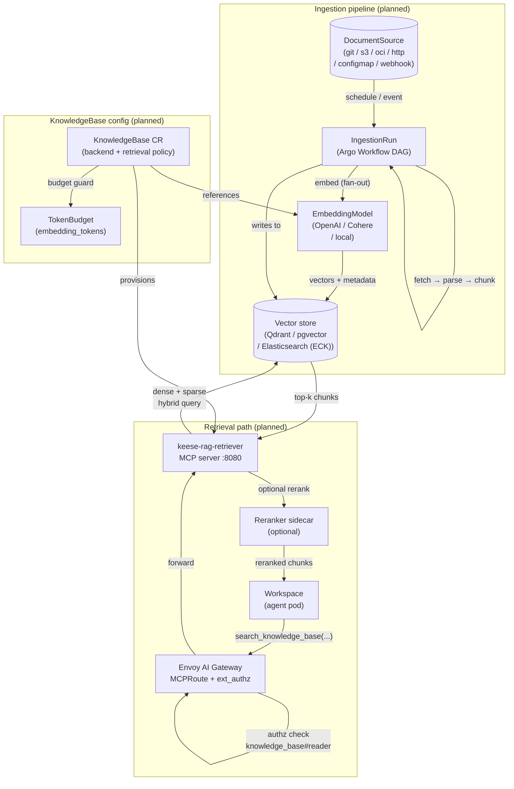
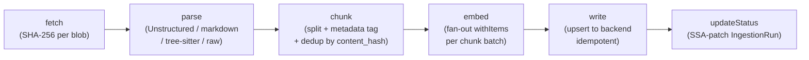

<!-- SPDX-License-Identifier: Apache-2.0 -->
<!-- Copyright (c) 2026 keese-ai -->

# RAG-backed knowledge agent

Build an agent that grounds answers in a curated document corpus — ingesting sources, embedding chunks, and serving retrieval over MCP.

!!! info "Audience"
    Agent developers and platform engineers who want to attach a knowledge base to a keese workspace. **Prerequisites:** [Concepts in 5 minutes](../getting-started/concepts-in-5-minutes.md) · [Workspaces & sessions](../concepts/workspaces.md) · [Memory](../concepts/memory.md)

!!! warning "Planned — not yet implemented"
    The RAG subsystem (KnowledgeBase, DocumentSource, IngestionRun, EmbeddingModel, SharedKnowledgeBase CRDs and their controllers) is **fully designed but has no controller code on `main` yet.** The designs are scored at 95/100 and are `status: current`. This page describes the intended end-state in future tense. When a capability ships, that warning will be removed from the relevant section.

---

## Why RAG on keese?

Large-language-model agents hallucinate when asked about private or rapidly-changing
information. Retrieval-augmented generation (RAG) sidesteps this by giving the agent a
structured index it can query on demand, receiving back cited, grounded chunks — not
the model's statistical recollection.

keese's RAG subsystem is deliberately **different from `Memory`**:

| | `Memory` | `KnowledgeBase` |
|---|---|---|
| Scope | Per-workspace session scratch-pad | Multi-workspace shared document index |
| Write path | Inline agent writes | Batch or streaming ingestion pipeline |
| Read path | Direct KV/vector lookup | MCP tool `search_knowledge_base` |
| Use case | Conversation state, working notes | Product docs, runbooks, code references |

The read path intentionally reuses the existing Envoy AI Gateway MCPRoute — no new
egress infrastructure, and `ext_authz` enforces `knowledge_base:KB#reader@workspace:W`
before any retrieval call is executed.

---

## Planned architecture

The diagram below shows the full future-state flow for a batch ingestion followed by an
agent retrieval query. All boxes marked with a dashed border are planned but not yet built.



---

## The five CRDs

Once the controllers ship, a complete RAG setup will involve five `keese.ai/v1alpha1`
resources:

| Kind | Scope | Short name | Purpose |
|---|---|---|---|
| `KnowledgeBase` | Namespaced | `kb` | Index config, backend binding, retrieval policy |
| `DocumentSource` | Namespaced | `ds` | Source connector definition and ingestion schedule |
| `IngestionRun` | Namespaced | `ir` | Individual ingestion execution (Argo-backed; TTL 7 d) |
| `EmbeddingModel` | Namespaced | `em` | Embedding provider + dimensions (immutable post-creation) |
| `SharedKnowledgeBase` | Cluster | `skb` | Cross-tenant read grants |

`EmbeddingModel.spec.dimensions` will be immutable once set — a CEL `XValidation`
rule on the `EmbeddingModel` CRD will reject changes to `spec.dimensions` (analogous
to the `embedding-dim-immutable` VAP that already protects `Memory.spec.embeddingDim`,
but implemented as a CRD-level rule rather than a separate VAP). Migration will always
mean: create a new `KnowledgeBase` + new `EmbeddingModel`, re-ingest, then cut
workspaces over.

---

## Step-by-step walkthrough

The following YAML will be apply-able once the controllers are in place. It is forward-looking.

### 1. Declare an embedding model

```yaml
# config/samples/keese/v1alpha1/embeddingmodel_openai.yaml
apiVersion: keese.ai/v1alpha1
kind: EmbeddingModel
metadata:
  name: text-embedding-3-small
  namespace: my-tenant
spec:
  provider: openai
  model: text-embedding-3-small
  dimensions: 1536
  credentialSecretRef:
    name: openai-embedding-creds   # projected file; never an env var
```

!!! tip
    The `credentialSecretRef` secret will be mounted at
    `/var/run/keese/secrets/openai-embedding-creds` on the ingestion pods — never
    injected as an environment variable. This follows zero-trust rule 05.7.

### 2. Create a token budget for embedding

The KnowledgeBase controller will set phase `Degraded` (event `EmbeddingBudgetMissing`)
for any `KnowledgeBase` whose tenant lacks a `TokenBudget` covering the
`embedding_tokens` resource type. This is controller-side enforcement — there is no
separate `ValidatingAdmissionPolicy` for this check.

```yaml
apiVersion: policy.keese.ai/v1alpha1
kind: TokenBudget
metadata:
  name: my-tenant-rag-budget
  namespace: my-tenant
spec:
  scope:
    tenant: my-tenant
  limits:
    - totalTokens: 10000000   # 10 M tokens per window (covers embedding calls)
  windowDuration: 24h
```

### 3. Create a knowledge base

```yaml
apiVersion: keese.ai/v1alpha1
kind: KnowledgeBase
metadata:
  name: product-docs
  namespace: my-tenant
spec:
  embeddingModelRef:
    name: text-embedding-3-small
  tokenBudgetRef:
    name: my-tenant-rag-budget
  backend:
    qdrant:
      collectionName: product-docs
      serviceRef:
        name: qdrant
        port: 6334
  retrieval:
    hybridSearch:
      denseWeight: 0.7
      sparseWeight: 0.3
    rerankerRef:
      name: cohere-reranker   # optional; falls back to RRF if unreachable
    topK: 10
```

### 4. Define a document source

```yaml
apiVersion: keese.ai/v1alpha1
kind: DocumentSource
metadata:
  name: product-docs-git
  namespace: my-tenant
spec:
  knowledgeBaseRef:
    name: product-docs
  source:
    git:
      url: https://github.com/my-org/product-docs.git
      branch: main
      path: docs/
  schedule: "0 * * * *"   # hourly incremental
  parser:
    type: markdown          # header-hierarchy-aware chunking
  mode: batch               # default; use 'streaming' for CDC / webhook push
```

### 5. Attach the knowledge base to a workspace

```yaml
apiVersion: keese.ai/v1alpha1
kind: Workspace
metadata:
  name: docs-assistant
  namespace: my-tenant
spec:
  tenantRef:
    name: my-tenant
  knowledgeBaseRefs:          # field planned; not in current API
    - name: product-docs
  runtimeRef:
    name: goose-standard
```

!!! warning "Planned — not yet implemented"
    The `knowledgeBaseRefs` field on `Workspace` does not exist yet. When it lands,
    the KnowledgeBase controller will write the OpenFGA tuple
    `knowledge_base:product-docs#reader@workspace:docs-assistant` that gates
    retrieval through `ext_authz`.

### 6. Ask a grounded question

Once a `WorkspaceSession` is open, the agent runtime will have access to the MCP tool
`search_knowledge_base` (routed through the AI Gateway). A goose recipe step will
look roughly like:

```yaml
# In a Recipe step (illustrative)
- name: answer-with-rag
  tools:
    - search_knowledge_base
  prompt: |
    Use search_knowledge_base to find relevant documentation, then answer:
    {{ .Input }}
```

The retrieval flow will:

1. Embed the query using the same `EmbeddingModel` bound to the `KnowledgeBase`.
2. Run a hybrid dense + sparse query against the vector store.
3. Optionally rerank results via the `rerankerRef` sidecar.
4. Return the top-k chunks (with `source_uri`, `chunk_index`, and `ingested_at`) to the agent.

---

## Ingestion pipeline internals

The `IngestionRun` will project to an Argo Workflow DAG with five stages:



Each stage is independently retried within Argo's step budget. The `embed` stage
checks `TokenBudget.status.remaining` before calling the embedding API; if the budget
is exhausted, the run halts with event `EmbeddingBudgetExhausted` and
`IngestionRun.status.phase = Failed`.

**Deduplication** is SHA-256 content-hash based. A `full` run fetches existing hashes
from the backend before the embed fan-out; matching chunks are skipped and counted in
`status.skippedDedup`. An `incremental` run fetches only new source objects (Git
SHA-based, S3 ETag-based).

**Streaming mode** (for CDC / webhook sources) will replace the Argo DAG with a
long-lived `Deployment` (`keese-embedder-<ds-uid>`) that subscribes to a NATS
JetStream subject `keese.tenant.<t>.rag.<ds-uid>.>` and processes chunks continuously.

---

## Authorization and cross-tenant sharing

Access to a `KnowledgeBase` is governed by OpenFGA tuples written by the controller.
Retrieval through the AI Gateway is gated by `ext_authz` checking
`knowledge_base:KB#reader@workspace:W` — if that tuple does not exist, the call is
denied.

To share a knowledge base across tenants, the owning tenant will create a
`SharedKnowledgeBase` (cluster-scoped). This will require an Approved
`CrossTenantAgreement` between the two tenants (see
[Cross-tenant collaboration](../concepts/cross-tenant.md)).

```yaml
apiVersion: keese.ai/v1alpha1
kind: SharedKnowledgeBase
metadata:
  name: product-docs-shared
spec:
  knowledgeBaseRef:
    namespace: my-tenant
    name: product-docs
  readerTenants:
    - name: partner-tenant
  crossTenantAgreementRef:
    name: my-tenant-partner-tenant-cta
```

!!! warning "Planned — not yet implemented"
    `SharedKnowledgeBase` is planned and has no controller yet. The `CrossTenantAgreement`
    controller is implemented (see the [Cross-tenant collaboration](cross-tenant-collab.md)
    scenario); `SharedKnowledgeBase` will leverage it once its own controller ships.

---

## Observability

Once the controllers ship, the following signals will be available:

**Metrics** (emitted per ingestion run and per retrieval call):

- `keese_rag_ingestion_duration_seconds{knowledge_base,backend,run_type}`
- `keese_rag_embedding_tokens_total{knowledge_base,model,tenant}`
- `keese_rag_chunks_written_total{knowledge_base,backend}`
- `keese_rag_chunks_skipped_dedup_total{knowledge_base}`
- `keese_rag_retrieval_duration_seconds{knowledge_base,backend,mode}`

**OTEL spans:** `keese.rag.fetch`, `keese.rag.parse`, `keese.rag.chunk`,
`keese.rag.embed`, `keese.rag.write`, `keese.rag.retrieve`.

**Events** to watch with `kubectl get events -n my-tenant`:

| Event | Meaning |
|---|---|
| `IngestionRunStarted` | Run provisioned and Argo Workflow submitted |
| `IngestionRunCompleted` | All chunks written; `status.phase = Succeeded` |
| `EmbeddingBudgetExhausted` | `TokenBudget.embedding_tokens` exhausted; run halted |
| `DocumentParseFailed` | One document skipped; recorded in `status.failedDocuments` |
| `RerankerUnavailable` | Reranker sidecar unreachable; fell back to RRF-only |
| `SharedKnowledgeBaseGrantRevoked` | `CrossTenantAgreement` revoked; tuples purged |

---

## Common failure modes and remedies

| Symptom | Cause | Remedy |
|---|---|---|
| `IngestionRun.status.phase = Failed` with `EmbeddingBudgetExhausted` event | `TokenBudget.embedding_tokens` limit too low | Raise the `limits.embedding_tokens` value and re-trigger a run |
| Retrieval returns no results despite ingested chunks | Workspace not bound to KnowledgeBase (missing OpenFGA tuple) | Ensure `knowledgeBaseRefs` is set on the `Workspace` |
| `EmbeddingDimMismatch` event on run start | KB was created with a model of different `dimensions` | `EmbeddingModel.spec.dimensions` is immutable; create a new KB + new model and reingest |
| Reranker always falls back to RRF-only | Reranker sidecar pod not ready | Check `kubectl get pods -n my-tenant -l keese.ai/component=reranker` |
| `DocumentParseFailed` for `.ipynb` files | Default `by-element` parser may not handle notebooks | Switch `DocumentSource.spec.parser.type` to `raw` as a workaround |

---

## See also

- [RAG & knowledge bases](../concepts/rag.md) — concept-level explanation of the design
- [Configure memory backends](../guides/memory-backends.md) — session-scoped `Memory` (different from `KnowledgeBase`)
- [Set token budgets](../guides/token-budgets.md) — configure the `embedding_tokens` budget required before a KB can be admitted
- [Cross-tenant agreements](../guides/cross-tenant-agreements.md) — prerequisite for `SharedKnowledgeBase`
