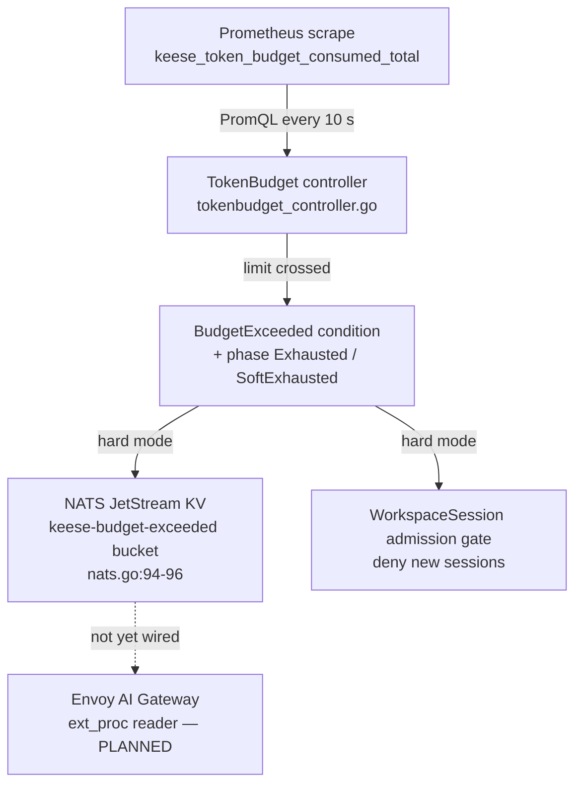

<!-- SPDX-License-Identifier: Apache-2.0 -->
<!-- Copyright (c) 2026 keese-ai -->

---
scope: feature
category: feature
depends: [docs/designs/10b-token-accounting.md, docs/designs/10a-otel-topology.md]
implements_specs: []
implements_plans: [docs/plans/demo/tech-debt.md]
source_refs:
  - api/policy/v1alpha1/tokenbudget_types.go:1-209
  - internal/controller/policy/tokenbudget_controller.go:1-577
  - internal/controller/policy/events.go:1-30
  - internal/controller/policy/prom.go:1-61
  - internal/controller/policy/nats.go:1-97
related_skills: [controller-authoring]
status: implemented
implemented_in_phase: demo-TD-P2-14
last_verified: 2026-05-29
---

# TokenBudget

## Summary

TokenBudget (`policy.keese.ai/v1alpha1`) sets per-tenant or per-workspace LLM spend
ceilings with per-model input, output, and total token limits over a configurable rolling
window. Every 10 seconds the controller reads consumption from Prometheus, evaluates
configured limits, updates status conditions and phase, writes a NATS JetStream KV
signal on exhaustion, and gates WorkspaceSession provisioning at admission time. Hard
mode returns a `BudgetExceeded` condition and blocks new sessions; soft mode logs and
warns without blocking; disabled mode tracks only.

## Behavior

- One `TokenBudget` CR scopes to exactly one tenant or workspace (CEL XValidation
  enforces the discriminated one-of at api/policy/v1alpha1/tokenbudget_types.go:49).
- On creation the controller initialises `status.windowStart` / `status.windowEnd` from
  `spec.windowAnchor` (if set) or `now`. Window is advanced in-place when `now` crosses
  `windowEnd` and `status.consumedCurrent` is archived to `status.consumedPrevious`.
- Every reconcile cycle (10 s) queries
  `sum(increase(keese_token_budget_consumed_total{...}[<window>]))` three times per limit
  entry (total, input, output directions) via `PrometheusQuerier.Query`
  (tokenbudget_controller.go:363-421).
- On Prometheus failure the controller retains last-known values (fail-closed: no
  false-clear) and sets `MetricFetchHealthy=False`.
- When any limit is crossed:
  - Phase transitions to `Exhausted` (hard) or `SoftExhausted` (soft).
  - Condition `BudgetExceeded=True` is set.
  - Event reason `BudgetExceeded` is emitted (events.go:13).
  - In hard mode `NatsSignaler.SetExceeded` writes a key to the `keese-budget-exceeded`
    NATS KV bucket (nats.go:94-96). Key scheme:
    `tenant/<name>/aggregate` or `workspace/<uid>/<model>`.
- When consumption clears (and Prometheus is healthy) `NatsSignaler.ClearExceeded` is
  called and phase returns to `Ready`.
- On window reset `BudgetReset` event is emitted and all NATS KV keys for the budget are
  cleared (tokenbudget_controller.go:346-356).
- WorkspaceSession provisioning reads `TokenBudget.status.consumedCurrent` before
  creating session pods; sessions are denied with condition `TokenBudgetExceeded` when
  hard mode is active (tech-debt.md TD-P2-14).
- A cluster-wide warning event `TooManyBudgets` is emitted when the CR count exceeds
  900 (tokenbudget_controller.go:36-37); the controller hard-rejects creation above 1 200
  (controller-side enforcement — no separate `ValidatingAdmissionPolicy` exists for this ceiling).
- On deletion the finalizer (`finalizers.tokenbudget.keese.ai/envoy-ratelimit-cleanup`)
  removes projected `RateLimitPolicy` CRs and clears all NATS KV signals before release.

## Configuration surface

Key fields are defined in `api/policy/v1alpha1/tokenbudget_types.go`:

- `spec.scope` — discriminated one-of: `tenant.name` or `workspace.name`
  (tokenbudget_types.go:50-58).
- `spec.limits[]` — one entry per model (or `"*"` for aggregate). Each entry may set
  any combination of `inputTokens`, `outputTokens`, `totalTokens`
  (tokenbudget_types.go:62-80).
- `spec.windowDuration` — custom duration string matching `^[0-9]+(h|d|m)$`; `h` = hours,
  `d` = days (mapped to 24 h each), `m` = minutes. Parsed by `parseWindowDuration` in
  `tokenbudget_controller.go:554-576` — **not** Go's standard `time.ParseDuration` (which
  does not support `d`). Default `720h` (tokenbudget_types.go:104-109).
- `spec.windowAnchor` — RFC3339 timestamp anchoring the window; controller advances by
  one duration period until the most recent start before `now`
  (tokenbudget_types.go:113-115).
- `spec.exhaustionMode` — `hard` (default), `soft`, or `disabled`
  (tokenbudget_types.go:120).
- `spec.pricebookRef` — optional reference to a pricebook CR for USD billing export
  (design 21; not yet implemented) (tokenbudget_types.go:124).

## Observability

**Conditions** (`status.conditions[]`):

| Type | Meaning |
|---|---|
| `Ready` | True when no limit is exceeded or mode is disabled |
| `BudgetExceeded` | True when any limit is crossed in the current window |
| `MetricFetchHealthy` | False when any Prometheus query failed; last-known values retained |
| `ResetFailed` | True when window-reset patch fails |

**Phase** (`status.phase`): `Ready`, `Exhausted`, `SoftExhausted`, `ResetFailed`.

**Printer columns** (shortname `tb`): `Age`, `Ready`, `Phase`, `WindowEnd`, `Exhaustion`.

**Event reasons** (events.go):

| Reason | Type | Trigger |
|---|---|---|
| `BudgetActive` | Normal | Phase transitions to Ready |
| `BudgetExceeded` | Warning | A limit threshold is crossed |
| `BudgetReset` | Normal | Window boundary advanced |
| `MetricFetchFailed` | Warning | Prometheus query error |
| `BudgetSignalWriteFailed` | Warning | NATS KV write failure |
| `TooManyBudgets` | Warning | Cluster CR count > 900 |

**Status fields**: `status.consumedCurrent[]` and `status.consumedPrevious[]` expose
per-model `inputTokens`, `outputTokens`, `totalTokens` for the current and previous
windows respectively.

## Signal chain

## Known limitations

- **Gateway-side NATS-KV enforcement does not exist yet.** The controller writes a
  `true` signal to the `keese-budget-exceeded` NATS KV bucket, but no gateway consumer
  (Envoy ext_proc reader) reads it. Enforcement today is limited to WorkspaceSession
  provisioning time — in-flight sessions are not interrupted when a budget is crossed
  mid-session (nats.go:17-35 documents this explicitly).
- `spec.pricebookRef` is parsed but USD billing export is not implemented. The billing
  controller that converts token consumption to USD is tracked in
  `docs/designs/10b-token-accounting.md` (section on `pricebookRef` and delegated billing).
- Prometheus metric `keese_token_budget_consumed_total` must be produced by a separate
  telemetry pipeline; the controller does not write it.
- `RateLimitProjector` applies `RateLimitPolicy` CRs per limit entry, but the Envoy
  RateLimit integration that reads them is not yet wired end-to-end.

## Change history

- `docs/plans/demo/tech-debt.md` TD-P2-14 (closed 2026-05-07): initial TokenBudget
  controller, Prometheus polling, NATS KV signals, WorkspaceSession gate, and envtest
  coverage.

## References

- Design: `docs/designs/10b-token-accounting.md`
- Design: `docs/designs/10a-otel-topology.md`
- Plan: `docs/plans/demo/tech-debt.md` (TD-P2-14)
- Source: `api/policy/v1alpha1/tokenbudget_types.go`
- Source: `internal/controller/policy/tokenbudget_controller.go`
- Source: `internal/controller/policy/events.go`
- Source: `internal/controller/policy/prom.go`
- Source: `internal/controller/policy/nats.go`
