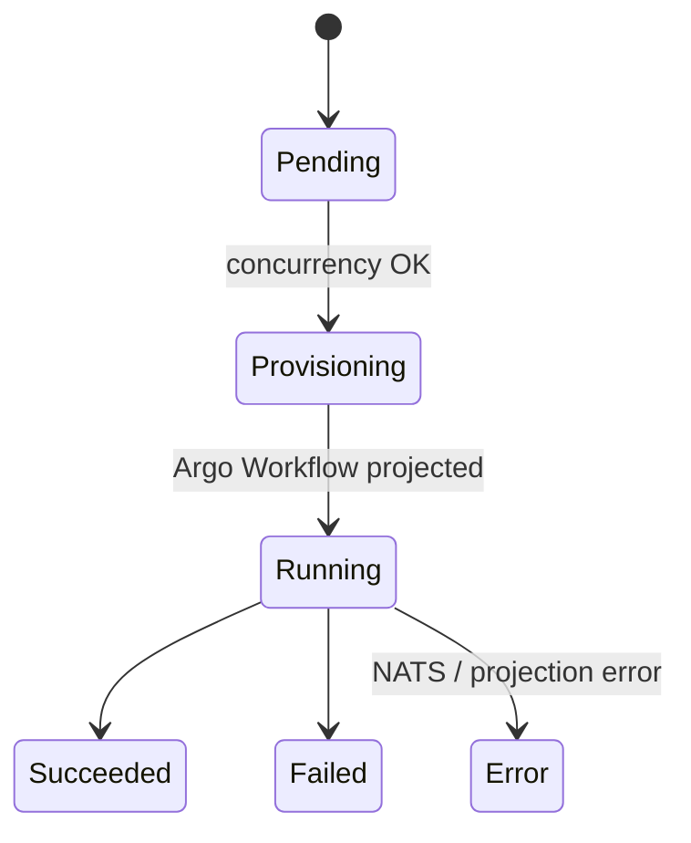

<!-- SPDX-License-Identifier: Apache-2.0 -->
<!-- Copyright (c) 2026 keese-ai -->

---
scope: feature
category: feature
depends:
  - docs/designs/03-workflow-argo-delegation.md
  - docs/designs/03b-workflow-trigger-projections.md
implements_specs:
  - docs/specs/keese.ai-v1alpha1-workflow.md
  - docs/specs/keese.ai-v1alpha1-workflow-b.md
implements_plans:
  - docs/plans/demo/tech-debt.md
source_refs:
  - api/keese/v1alpha1/workflow_types.go:1-348
  - api/keese/v1alpha1/workflowrun_types.go:1-221
  - internal/controller/keese/workflow_controller.go:1-534
  - internal/controller/keese/workflow_argo.go:1-184
  - internal/controller/keese/workflowrun_controller.go:1-502
  - internal/controller/keese/workflow_events.go:1-111
  - cmd/keese-wf-launcher/main.go:1-188
related_skills: [controller-authoring]
status: implemented
implemented_in_phase: demo-TD-P2-02
last_verified: 2026-05-29
---

# Workflows and WorkflowRuns

## Summary

`Workflow` wraps an Argo `WorkflowTemplate` and projects one or more activation triggers
(CronJob, Knative Trigger, or HTTPRoute) into the namespace. When a trigger fires, the
`keese-wf-launcher` binary creates a non-interactive `WorkspaceSession` against the
workspace named in `spec.workspaceRef` and polls until the session reaches a terminal
phase. `WorkflowRun` models a single execution: the controller provisions a per-run NATS
JetStream stream, injects a scoped SA audience (`keese-wf-<run-uid>`), projects an Argo
`Workflow` object referencing the template, and back-projects Argo node/artifact status
onto `WorkflowRun.status`. Together the two kinds provide a declarative, event-driven
workflow layer that delegates execution to Argo while keeping keese-level access control,
concurrency policy, and cross-tenant admission in place.

## Behavior

**Workflow controller** (field owner `keese-workflow-controller`):

- Projects an Argo `WorkflowTemplate` via SSA; name reflected in
  `status.workflowTemplateRef`. Event: `WorkflowProjected`.
- For each `spec.triggers[]` entry, SSA-projects the backing resource:
  - `Cron` → `batch/v1.CronJob` named `keese-wf-<wf>-cron`; CronJob runs
    `keese-wf-launcher --workspace <name> --cleanup`. Condition reason `CronJobReady`.
  - `KnativeTrigger` → `eventing.knative.dev/v1.Trigger` named
    `keese-wf-<wf>-trigger` forwarding CloudEvents to the launcher Service.
    Condition reason `TriggerReady`.
  - `HTTPWebhook` → `gateway.networking.k8s.io/v1.HTTPRoute` named
    `keese-wf-<wf>-webhook` routing POSTs at `spec.triggers[].httpWebhook.path`
    to the launcher Service on port 8080. Condition reason `HTTPRouteReady`.
  - `NATSSubscription` → no CRD projected (KEDA dep-conflict); sets
    `TriggerProjected=False/KEDAUnavailable`. See Known limitations.
- Deletion is blocked while any non-terminal `WorkflowRun` exists
  (`WorkflowCascadeBlocked` event); releases finalizer
  `finalizers.workflow.keese.ai/cascade` once all runs are terminal.
- `status.runCount` is incremented by the trigger path; `status.tupleCount` reflects
  OpenFGA tuple count after each reconcile.

**WorkflowRun controller** (field owner `keese-workflowrun-controller`):

- Enforces `spec.concurrencyPolicy` (`Allow` / `Forbid` / `Replace`) before
  proceeding. Events: `ConcurrentRunForbidden`, `ConcurrentRunForced`.
- Evaluates `CrossTenantAgreement` admission; blocks with
  `CrossTenantAgreementMissing` event if a required agreement is absent.
- Provisions a NATS JetStream stream named
  `keese-tenant-<tenantUID>-wf-<runUID>` with replicas=3 and
  `MaxAge = spec.timeout` (default 24 h). Event: `WorkflowNATSStreamProvisioned`.
- Projects an Argo `Workflow` named `keese-wfr-<wfr>` referencing the template,
  injects SA audience `keese-wf-<wfr-uid>`. Event: `WorkflowAudienceInjected`.
- Requeues every 15 s while `phase` is `Provisioning` or `Running` to poll Argo
  status; mirrors `argoPhase`, nodes, artifacts, `startedAt`, `finishedAt`.
  Event: `ArgoStatusSynced`.
- On deletion: removes the NATS stream and Argo Workflow, then releases finalizer
  `finalizers.workflowrun.keese.ai/cleanup`.

**keese-wf-launcher** (`cmd/keese-wf-launcher/main.go`):

- Invoked inside trigger pods (CronJob job, Knative Trigger subscriber, HTTPRoute
  backend).
- Creates a `WorkspaceSession` with `mode=per-attach`, polls on a 5 s ticker until
  phase is terminal, emits a structured `shutdown` JSON event, exits 0 on `Completed`.
- SIGTERM handler installed at startup per rule 06-signal-handling §1.

## Configuration surface

Key `Workflow.spec` fields — see api/keese/v1alpha1/workflow_types.go:245-287:

| Field | Default | Effect |
|---|---|---|
| `workspaceRef` | required | Workspace whose session runs the recipe |
| `entrypoint` | required | First template to execute |
| `templates[]` | required (≥1) | Step definitions with image, command, retryLimit |
| `triggers[]` | `[]` | Cron / KnativeTrigger / NATSSubscription / HTTPWebhook |
| `outputs[]` | `[]` | KnativeSink / NATSPublish / S3 / GitHubPR (no-op; see limitations) |
| `concurrencyPolicy` | `Allow` | Allow / Forbid / Replace |
| `defaultRetryBudget` | nil | Step-level retry cap applied across all templates |

Key `WorkflowRun.spec` fields — see api/keese/v1alpha1/workflowrun_types.go:62-106:

| Field | Default | Effect |
|---|---|---|
| `workspaceRef` | required | Owning workspace (immutable after `Provisioning`) |
| `workflowRef` | required | Target Workflow (immutable after `Provisioning`) |
| `parameters[]` | `[]` | Name/value pairs forwarded to Argo |
| `retryBudget` | `10` | Max step retries for this run |
| `timeout` | nil | Wall-clock cap; also sets NATS stream MaxAge |
| `suspended` | `false` | Pause without cancelling |
| `supervisionContext` | nil | Human-in-the-loop approval gates per step |

## Observability

Events (all via `recorder.Eventf`; reasons from workflow_events.go:9-111):

- `WorkflowProjected` — Argo WorkflowTemplate SSA succeeded.
- `TriggerProjected`, `TriggerProjectionFailed`, `TriggerAuthSecretMissing` — trigger projection lifecycle.
- `OutputProjected` — output projection called (currently no-op).
- `WorkflowCascadeBlocked` — deletion deferred pending active runs.
- `WorkflowRunProjected`, `WorkflowRunFailed` — run projection lifecycle.
- `WorkflowAudienceInjected`, `MissingWorkflowAudience` — SA audience injection.
- `WorkflowNATSStreamProvisioned`, `NATSStreamCreateFailed`, `WorkflowNATSStreamCleaned`, `NATSStreamDeleteFailed` — NATS stream lifecycle.
- `ArgoStatusSynced`, `ArgoWatchDisconnected` — Argo status mirror.
- `ConcurrentRunForbidden`, `ConcurrentRunForced` — concurrency policy enforcement.
- `CrossTenantAgreementMissing` — CTA admission gate.
- `RetryBudgetExhausted`, `ArtifactBackendMissing`, `ArtifactSecretFailed` — run errors.

**Workflow** conditions: `Ready`, `Progressing`, `TriggerProjected`. Phases: `Pending → Projecting → Ready | Degraded | Deleting` (workflow_types.go:10-20, 289-316).

**WorkflowRun** conditions: `Ready`, `Progressing`. Phase FSM in diagram below. Fields `argoPhase`, `argoWorkflowName`, `nodes[]`, `artifacts[]`, `startedAt`, `finishedAt` mirror Argo (workflowrun_types.go:10-21, 146-188).

## Diagrams

Trigger-dispatch sequence (cmd/keese-wf-launcher/main.go) and WorkflowRun FSM (workflowrun_types.go:15-20):

```mermaid
sequenceDiagram
    participant T as Trigger<br/>(CronJob/HTTPRoute/<br/>KnativeTrigger)
    participant L as keese-wf-launcher
    participant K as Kubernetes API
    participant W as WorkflowRun controller
    T->>L: fires
    L->>K: create WorkspaceSession (mode=per-attach)
    loop poll 5s
        L->>K: get phase
    end
    K-->>L: terminal
    W->>K: mirror Argo → WorkflowRun.status
    L->>L: emit shutdown JSON; exit 0
```


## Known limitations

- **Output sinks are no-op.** All `spec.outputs[]` variants (KnativeSink, NATSPublish,
  S3, GitHubPR) are accepted and validated at admission but `reconcileOutput` returns
  nil without projecting any resource. Tracked as TD-P2-10.
  See internal/controller/keese/workflow_controller.go:465-470.
- **NATSSubscription trigger is not projected.** A KEDA `ScaledObject` dependency
  conflict (documented in go.mod) prevents SSA of the KEDA resource. The controller
  sets `TriggerProjected=False` with reason `KEDAUnavailable` so the gap is
  observable; no stream consumer is created.
  See internal/controller/keese/workflow_controller.go:229-235.
- **KNOWN BUG: WorkflowRun NATS stream is not deleted on cleanup.** In
  `reconcileRunDelete`, both `tenantUID` and `runUID` are set to `string(wfr.UID)`
  (internal/controller/keese/workflowrun_controller.go:442-443), so the computed
  stream name `keese-tenant-<runUID>-wf-<runUID>` does not match the provisioned name
  `keese-tenant-<tenantUID>-wf-<runUID>`. The delete call targets a non-existent stream;
  the actual stream leaks until manual cleanup or NATS MaxAge expiry.
- **wf-launcher Service is not projected by the controller.** CronJob, Knative Trigger,
  and HTTPRoute all reference a Service named `keese-wf-<wf>-launcher` that must be
  provisioned separately (e.g. via Helm or an infra chart).
  See internal/controller/keese/workflow_controller.go:490-493.

## Change history

- post-gate (2026-04-22): initial Workflow + WorkflowRun reconcilers scaffolded after
  design-gate open; Argo WorkflowTemplate SSA, NATS stream provisioning, SA audience
  injection, and concurrency/CTA admission wired.
- demo-TD-P2-02 (2026-05-07): trigger projections completed (CronJob, KnativeTrigger,
  HTTPRoute) and `keese-wf-launcher` sub-binary added; NATSSubscription documented as
  KEDAUnavailable. Output projections remain a no-op (separate follow-on).
  See docs/plans/demo/tech-debt.md TD-P2-02.

## References
See frontmatter `source_refs` for source file list. Designs: `docs/designs/03-workflow-argo-delegation.md`, `03b-workflow-trigger-projections.md`. Spec: `docs/specs/keese.ai-v1alpha1-workflow.md` + `workflow-b.md`. Plan: `docs/plans/demo/tech-debt.md`.
