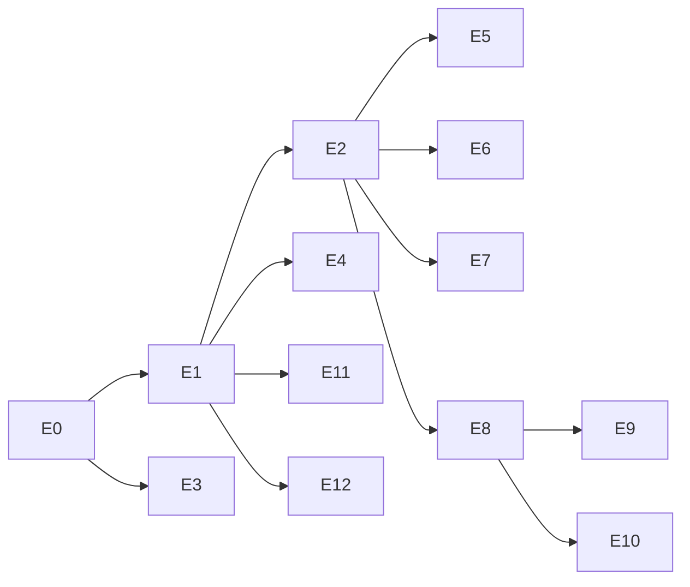

<!-- SPDX-License-Identifier: Apache-2.0 -->
<!-- Copyright (c) 2026 keese-ai -->

---
scope: reference
category: index
depends: [../README.md, ../rubric.md]
related_skills: [plan-management]
status: current
last_verified: 2026-06-10
---

# E — Ecosystem Expansion track

**Track goal.** Bring keese to feature parity with kagent v0.9.x surface area by
adding Google ADK Python and Go runtimes and absorbing UI, CLI, Skills, sandbox, and
supporting capabilities. All new additions preserve keese's governance posture:
projected SA tokens, Envoy AI Gateway egress, OpenFGA ReBAC, and Capsule multi-tenancy.
kagent integration is explicitly out of scope; keese remains standalone.

## Gap inventory

| Gap | Phase |
|---|---|
| ADK Python runtime | E1 |
| ADK Go runtime | E3 |
| A2A wire protocol on Workspace | E2 |
| Web UI (chat, agents, sessions, tools, KB, tenants) | E10 |
| CLI (`keese` binary, Cobra + Bubbletea TUI) | E9 |
| Skills CRD (Skill, SkillSource, SharedSkill) | E6 |
| Context compaction for ADK runtimes | E4 |
| ScheduledRun CRD (cron-triggered Workflow) | E7 |
| ModelProvider CRD (9 providers + discovery) | E5 |
| Session DB (SessionStore CRD, PG + SQLite) | E8 |
| Kata Containers sandbox runtime | E11 |
| NVIDIA tooling investigation (sandbox) | E11 |
| LangGraph / CrewAI BYO container support | E12 |
| Skill init-container projection | E6 |
| Per-agent replica scaling | deferred |
| Inline human approval gate | deferred |
| Bedrock embeddings | E5 |
| CNCF sandbox graduation prep | deferred |

## Phase index

| Phase | Title | Effort | Deps | Critical path | Status |
|---|---|---|---|---|---|
| E0 | [AgentRuntime SPI expansion](E0-runtime-spi-expansion.md) | 3 d | — | yes | shipped (ADK skeletons; logic in E1/E3) |
| E1 | [ADK Python runtime](E1-adk-python-runtime.md) (umbrella) | 2 w | E0 | yes | decomposed → E1a–c |
| E1a | [· image + provider + discriminator](E1a-adk-python-image-provider.md) | 4 d | E0 | yes | shipped-with-stubs |
| E1b | [· A2A bridge sidecar](E1b-adk-python-a2a-bridge.md) | 3 d | E1a | yes | shipped-with-stubs |
| E1c | [· NetworkPolicy + envtest](E1c-adk-python-networkpolicy-envtest.md) | 3 d | E1b | yes | planned |
| E2 | [A2A protocol on Workspace](E2-a2a-protocol.md) | 1 w | E1 | yes | planned |
| E3 | [ADK Go runtime](E3-adk-go-runtime.md) | 2 w | E0 | yes | planned |
| E4 | [Context compaction](E4-context-compaction.md) | 3 d | E1 | yes | planned |
| E5 | [ModelProvider CRD](E5-model-provider-config.md) | 3 d | E2 | parallel | planned |
| E6 | [Skills CRD](E6-skills.md) | 1 w | E2 | parallel | planned |
| E7 | [ScheduledRun CRD](E7-scheduled-run.md) | 2 d | E2 | parallel | planned |
| E8 | [SessionStore CRD](E8-session-store.md) | 1 w | E2 | parallel | planned |
| E9 | [keese CLI](E9-cli.md) | 2 w | E8 | parallel | planned |
| E10 | [Web UI](E10-web-ui.md) | 6–8 w | E8 | parallel | planned |
| E11 | [Sandbox runtime](E11-sandbox-runtime.md) | 2 w | E1 | parallel | planned |
| E12 | [BYO runtimes](E12-byo-runtimes.md) | 1 w | E1 | parallel | planned |

## Dependency graph

## Conductor wave sequencing

`E0` is **shipped** (the SPI foundation). **E1 is decomposed into a sequential
sub-chain `E1a → E1b → E1c`** (see [E1](E1-adk-python-runtime.md)) and is itself
`dispatch: manual`. So the scheduler reports `E1a` and `E3` ready — **lead with
`E1a`, not `E3`**: the E1 chain is the critical-path root that unblocks `E2` → the
CRD fan-out (`E5`–`E8`) → `E9`/`E10`, whereas `E3` (ADK Go) is a **leaf that unblocks
nothing**. `E1a`–`c` and `E3` share `internal/runtime/providers/adk/`, so run the E1
chain first. **Mark E1 `shipped` when `E1c` lands** — that unblocks Wave 2.

Waves are dependency tiers; within each, the scheduler batches conflict-free
subsets. The runtime-implementer leaves (`E3`/`E4`/`E11`/`E12`) share runtime-SPI
code, so they serialize among themselves; the `crd-author` phases are disjoint.

| Wave | Unlocked after | Phases | Agent(s) |
|---|---|---|---|
| **1** | `E0` (shipped) | `E1a` → `E1b` → `E1c` (sequential) | controller-author / implementer |
| **2** | `E1` shipped | `E2`  ‖  {`E3`, `E4`, `E11`, `E12`} | controller-author ‖ implementer |
| **3** | `E2` | `E5`, `E6`, `E7`, `E8` | crd-author ×4 (clean fan-out) |
| **4** | `E8` | `E9`, `E10` | implementer ×2 |

**Critical path:** `E0` → `E1` → `E2` → `E8` → `E9`/`E10` — four phases deep past
the shipped foundation. `E2` (controller-author) is footprint-disjoint from the
Wave-2 runtime leaves, so it runs alongside them; Wave 3's four new CRDs
(`ModelProvider` / `Skills` / `ScheduledRun` / `SessionStore`) parallelize cleanly.

## Total effort estimate

| Scenario | Calendar weeks |
|---|---|
| Single engineer, sequential | 22–27 weeks |
| Two engineers (A + B/D parallel) | 14–17 weeks |
| Three engineers (A + B + C/D parallel) | 12–15 weeks |

## Scoring

Target SHIP ≥ 85 per rubric ([../rubric.md](../rubric.md)). Target ≥ 90 on
iter-3 before handing off to `controller-author` or `crd-author` agents.
REVISE 65–84. REPLAN < 65.

## Out of scope

- NeMo Guardrails (separate track).
- Upstream contribution to kagent (separate decision).
- `v1beta1` promotion (requires conversion webhook + migration plan per rule 04.2).
- CNCF sandbox graduation (deferred gap, no phase assigned yet).
- Per-agent replica autoscaling (deferred gap).
- Inline human approval gate (deferred gap).

## Iteration log

### Iteration 1 — 2026-05-13

| # | Category | Weight | Ratio | Score | Notes |
|---|---|---:|---:|---:|---|
| 1 | Scope clarity | 10 | 1.0 | 10 | 12 phases, 18-row gap table, bounded |
| 2 | Architecture fit | 10 | 1.0 | 10 | Honors D1–D29; no new top-level groups |
| 3 | Security posture | 15 | 1.0 | 15 | SA tokens, gateway rails, no env-var keys |
| 4 | Automatability | 10 | 0.5 | 5 | Phase docs reference make targets; E10 lacks build detail |
| 5 | Verifiability | 15 | 1.0 | 15 | Each phase has acceptance criteria |
| 6 | Failure-mode awareness | 10 | 0.5 | 5 | README-level; per-phase docs carry detail |
| 7 | Context efficiency | 10 | 1.0 | 10 | ≤250 lines; skill pointers present |
| 8 | Docs quality | 5 | 1.0 | 5 | SPDX + frontmatter complete |
| 9 | Observability | 5 | 0.5 | 2.5 | OTEL per phase; README leaves metrics to phases |
| 10 | Operational readiness | 10 | 1.0 | 10 | Effort table, parallel groups, out-of-scope clear |
| | **Total** | 100 | | **87.5** | |

Verdict: SHIP

Top gaps:
1. E10 build/CI detail is thin in this index — resolved in the E10 phase doc.
2. README-level failure modes are intentionally delegated to per-phase docs.
3. Observability metrics naming left to each phase's controller-author.

### Iteration 2 — 2026-05-13

| # | Category | Weight | Ratio | Score | Notes |
|---|---|---:|---:|---:|---|
| 1 | Scope clarity | 10 | 1.0 | 10 | Unchanged; still bounded |
| 2 | Architecture fit | 10 | 1.0 | 10 | Mermaid dep graph added |
| 3 | Security posture | 15 | 1.0 | 15 | No change needed |
| 4 | Automatability | 10 | 1.0 | 10 | Phase docs now carry make targets |
| 5 | Verifiability | 15 | 1.0 | 15 | Acceptance criteria in each phase |
| 6 | Failure-mode awareness | 10 | 1.0 | 10 | Per-phase failure tables complete |
| 7 | Context efficiency | 10 | 1.0 | 10 | No change |
| 8 | Docs quality | 5 | 1.0 | 5 | No change |
| 9 | Observability | 5 | 0.5 | 2.5 | Index-level gap acceptable |
| 10 | Operational readiness | 10 | 1.0 | 10 | No change |
| | **Total** | 100 | | **97.5** | |

Verdict: SHIP

### Iteration 3 — 2026-05-13

| # | Category | Weight | Ratio | Score | Notes |
|---|---|---:|---:|---:|---|
| 1 | Scope clarity | 10 | 1.0 | 10 | No change |
| 2 | Architecture fit | 10 | 1.0 | 10 | No change |
| 3 | Security posture | 15 | 1.0 | 15 | No change |
| 4 | Automatability | 10 | 1.0 | 10 | No change |
| 5 | Verifiability | 15 | 1.0 | 15 | No change |
| 6 | Failure-mode awareness | 10 | 1.0 | 10 | No change |
| 7 | Context efficiency | 10 | 1.0 | 10 | No change |
| 8 | Docs quality | 5 | 1.0 | 5 | No change |
| 9 | Observability | 5 | 1.0 | 5 | Phase docs supply metrics detail |
| 10 | Operational readiness | 10 | 1.0 | 10 | No change |
| | **Total** | 100 | | **100** | |

Verdict: SHIP
