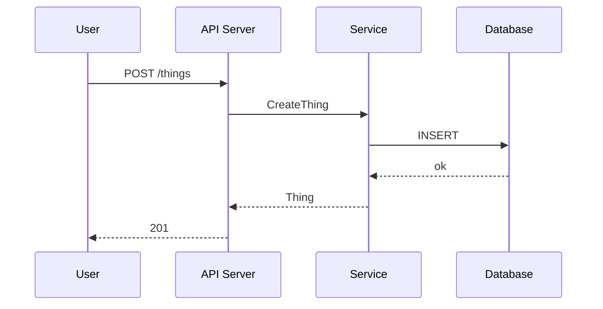

<!-- SPDX-License-Identifier: Apache-2.0 -->
<!-- Copyright (c) {{YEAR}} {{ORG_NAME}} -->

---
scope: reference
category: reference
depends: []
related_skills: [diagram-authoring, doc-authoring]
status: current
last_verified: {{LAST_VERIFIED}}
---

# Diagram Authoring — Cookbook

This is the human-facing cookbook; the agent-facing trigger lives at
[`../../.claude/skills/diagram-authoring.md`](../../.claude/skills/diagram-authoring.md).

## Principles

1. **Text-first.** Every committed diagram is generated from a source-text file.
   Binaries (`.drawio`, `.vsd`, screenshots) are never committed.
2. **Best tool per type.** Don't force Mermaid to do topology, or D2 to do a
   sequence diagram.
3. **Source of truth.** Users treat diagrams as authoritative. Drift is a bug.
4. **Ship with the code.** A diagram that depicts a flow must update in the
   same commit as the code that changes that flow.
5. **Trace to source.** Every diagram cites `source_refs:` in its header — the
   files it describes. Unreferenced diagrams are suspicious.

## Tool matrix

| Diagram type | Tool | Why |
|---|---|---|
| Hierarchical / container layout | **D2** | `container` groupings nest cleanly; multi-level layout; good defaults |
| Packet walks, RPC flows | **Mermaid** sequence | GitHub-native; no external render for small diagrams |
| Lifecycle / reconciler state | **Mermaid** state | reads as code |
| Entity / owner-ref relationships | **Mermaid** ER *or* **D2** | D2 when nested under a parent resource |
| Generic flowchart | **Mermaid** flowchart | universal |
| Dense dependency graph | **Graphviz / DOT** | rank-based layout, edge discipline |
| Small inline sketch | ASCII in a fenced block | no tooling overhead |

## Toolchain

All three primary tools are pinned in [flake.nix](../../flake.nix):

- `d2` — Terrastruct, [d2lang.com](https://d2lang.com)
- `mermaid-cli` (`mmdc`) — [mermaid.js.org](https://mermaid.js.org)
- `graphviz` — standard `dot`, `neato`, `sfdp`

Render commands:

```bash
d2 docs/designs/diagrams/my-topology.d2 docs/designs/diagrams/my-topology.svg
mmdc -i docs/plans/diagrams/my-flow.mmd -o docs/plans/diagrams/my-flow.svg
dot -Tsvg internal/dep-graph.dot -o docs/designs/diagrams/dep-graph.svg
```

## Example: D2

```d2
# SPDX-License-Identifier: Apache-2.0
# Copyright (c) {{YEAR}} {{ORG_NAME}}
# source_refs: src/server.go, src/client.go
# depicts: Phase-05 client/server topology

direction: right

server: API Server {
  shape: rectangle
  style.fill: "#f6f8fa"

  handler: Request Handler
  db: Database
}

client: Client {
  shape: hexagon
}

client -> server.handler : "HTTP"
server.handler -> server.db : "SQL"
```

## Example: Mermaid sequence



## Freshness enforcement

The pre-commit hook `check-diagram-freshness` re-renders every committed
diagram source and diffs against the committed render. Drift fails the commit
until you re-render and stage the new SVG.

Script:
[`../../scripts/check-diagram-freshness.sh`](../../scripts/check-diagram-freshness.sh).

To bypass in an emergency (rare, justified): mark the source `status: stale`
in its header. Tolerated for **one phase** before becoming a blocker.

## Related

- Skill: [../../.claude/skills/diagram-authoring.md](../../.claude/skills/diagram-authoring.md)
- Rule: [../../.claude/rules/01-conventions.md](../../.claude/rules/01-conventions.md)
- Freshness script: [../../scripts/check-diagram-freshness.sh](../../scripts/check-diagram-freshness.sh)
